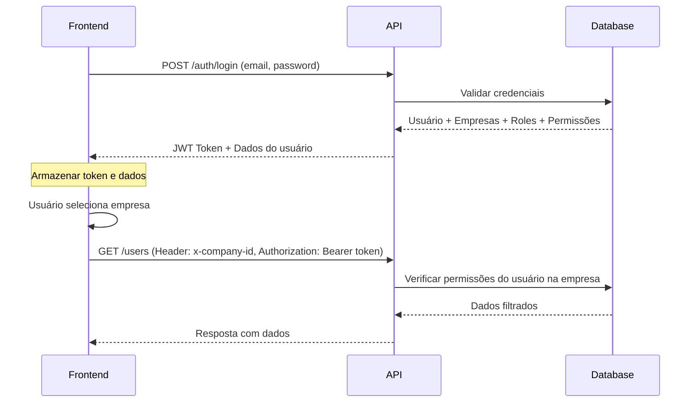

# 🔐 Documentação de Autenticação - Frontend

## Visão Geral

Sistema de autenticação multi-empresa com roles e permissões dinâmicas. Cada usuário pode ter acesso a múltiplas empresas com diferentes níveis de permissão em cada uma.

---

## 📋 Índice

1. [Fluxo de Autenticação](#fluxo-de-autenticação)
2. [Endpoints da API](#endpoints-da-api)
3. [Modelos de Dados](#modelos-de-dados)
4. [Headers Obrigatórios](#headers-obrigatórios)
5. [Exemplos de Implementação](#exemplos-de-implementação)
6. [Sistema de Permissões](#sistema-de-permissões)
7. [Tratamento de Erros](#tratamento-de-erros)

---

## 🔄 Fluxo de Autenticação



---

## 🌐 Endpoints da API

### 1. Login

**POST** `/auth/login`

Autentica o usuário e retorna o token JWT com todas as empresas e permissões.

#### Request Body:
```json
{
  "email": "admin@example.com",
  "password": "senha123"
}
```

#### Response (200 OK):
```json
{
  "access_token": "eyJhbGciOiJIUzI1NiIsInR5cCI6IkpXVCJ9...",
  "user": {
    "userId": "uuid-do-usuario",
    "email": "admin@example.com",
    "name": "Admin Geral",
    "companies": [
      {
        "companyId": "uuid-da-empresa-1",
        "companyName": "Empresa Alpha",
        "companyCnpj": "11222333000144",
        "role": {
          "id": "uuid-da-role",
          "name": "admin",
          "description": "Administrador do sistema"
        },
        "permissions": [
          {
            "id": "uuid-da-permissao",
            "name": "users.create",
            "resource": "users",
            "action": "create"
          },
          {
            "id": "uuid-da-permissao-2",
            "name": "users.read",
            "resource": "users",
            "action": "read"
          }
          // ... todas as outras permissões
        ]
      },
      {
        "companyId": "uuid-da-empresa-2",
        "companyName": "Empresa Beta",
        "companyCnpj": "55666777000188",
        "role": {
          "id": "uuid-da-role-2",
          "name": "manager",
          "description": "Gerente"
        },
        "permissions": [
          // permissões específicas do gerente
        ]
      }
    ]
  }
}
```

#### Erros Possíveis:
```json
// 401 Unauthorized - Credenciais inválidas
{
  "statusCode": 401,
  "message": "Credenciais inválidas"
}

// 401 Unauthorized - Usuário inativo
{
  "statusCode": 401,
  "message": "Usuário inativo"
}
```

---

### 2. Buscar Perfil

**GET** `/auth/profile`

Retorna os dados atualizados do usuário autenticado.

#### Headers:
```
Authorization: Bearer {token}
```

#### Response (200 OK):
```json
{
  "userId": "uuid-do-usuario",
  "email": "admin@example.com",
  "name": "Admin Geral",
  "companies": [
    // array de empresas com roles e permissões
  ]
}
```

#### Erros Possíveis:
```json
// 401 Unauthorized - Token inválido ou expirado
{
  "statusCode": 401,
  "message": "Unauthorized"
}
```

---

### 3. Endpoints Protegidos (Exemplo: Listar Usuários)

**GET** `/users`

Lista usuários da empresa selecionada.

#### Headers Obrigatórios:
```
Authorization: Bearer {token}
x-company-id: {uuid-da-empresa}
```

#### Response (200 OK):
```json
[
  {
    "id": "uuid-do-usuario",
    "email": "vendedor@example.com",
    "name": "Vendedor João",
    "active": true,
    "createdAt": "2025-10-24T10:00:00.000Z",
    "companies": [
      {
        "id": "uuid-user-company",
        "userId": "uuid-do-usuario",
        "companyId": "uuid-da-empresa",
        "roleId": "uuid-da-role",
        "active": true,
        "role": {
          "id": "uuid-da-role",
          "name": "sales",
          "description": "Vendedor"
        }
      }
    ]
  }
]
```

#### Erros Possíveis:
```json
// 403 Forbidden - Header x-company-id não fornecido
{
  "statusCode": 403,
  "message": "Empresa não especificada no cabeçalho x-company-id"
}

// 403 Forbidden - Usuário sem acesso à empresa
{
  "statusCode": 403,
  "message": "Usuário não tem acesso a esta empresa"
}

// 403 Forbidden - Usuário sem permissão
{
  "statusCode": 403,
  "message": "Usuário não tem permissão para executar esta ação"
}
```

---

## 📊 Modelos de Dados

### User (Usuário)
```typescript
interface User {
  id: string;
  email: string;
  name: string;
  active: boolean;
  createdAt: Date;
  updatedAt: Date;
  companies: UserCompany[];
}
```

### Company (Empresa)
```typescript
interface Company {
  id: string;
  name: string;
  cnpj: string;
  active: boolean;
  createdAt: Date;
  updatedAt: Date;
}
```

### UserCompany (Relacionamento Usuário-Empresa)
```typescript
interface UserCompany {
  id: string;
  userId: string;
  companyId: string;
  roleId: string;
  active: boolean;
  createdAt: Date;
  updatedAt: Date;
  user: User;
  company: Company;
  role: Role;
}
```

### Role (Papel/Função)
```typescript
interface Role {
  id: string;
  name: string;
  description: string | null;
  createdAt: Date;
  updatedAt: Date;
}
```

### Permission (Permissão)
```typescript
interface Permission {
  id: string;
  name: string;          // Ex: "users.create"
  description: string | null;
  resource: string;      // Ex: "users"
  action: string;        // Ex: "create", "read", "update", "delete"
  createdAt: Date;
  updatedAt: Date;
}
```

### Resposta de Login
```typescript
interface LoginResponse {
  access_token: string;
  user: {
    userId: string;
    email: string;
    name: string;
    companies: CompanyAccess[];
  };
}

interface CompanyAccess {
  companyId: string;
  companyName: string;
  companyCnpj: string;
  role: {
    id: string;
    name: string;
    description: string;
  };
  permissions: Permission[];
}
```

---

## 🔑 Headers Obrigatórios

### Para todas as requisições autenticadas:
```
Authorization: Bearer {access_token}
```

### Para requisições que dependem de empresa específica:
```
Authorization: Bearer {access_token}
x-company-id: {uuid-da-empresa}
```

⚠️ **IMPORTANTE**: O header `x-company-id` é obrigatório para todas as operações que requerem contexto de empresa. Sem ele, você receberá um erro 403.

---

## 💻 Exemplos de Implementação

### React + Axios

#### 1. Configuração do Axios

```typescript
// src/services/api.ts
import axios from 'axios';

const api = axios.create({
  baseURL: 'http://localhost:3000',
});

// Interceptor para adicionar o token
api.interceptors.request.use((config) => {
  const token = localStorage.getItem('access_token');
  if (token) {
    config.headers.Authorization = `Bearer ${token}`;
  }
  
  // Adicionar company-id se estiver definido
  const companyId = localStorage.getItem('current_company_id');
  if (companyId) {
    config.headers['x-company-id'] = companyId;
  }
  
  return config;
});

// Interceptor para tratamento de erros
api.interceptors.response.use(
  (response) => response,
  (error) => {
    if (error.response?.status === 401) {
      // Token expirado ou inválido - redirecionar para login
      localStorage.removeItem('access_token');
      localStorage.removeItem('user_data');
      localStorage.removeItem('current_company_id');
      window.location.href = '/login';
    }
    return Promise.reject(error);
  }
);

export default api;
```

#### 2. Serviço de Autenticação

```typescript
// src/services/auth.service.ts
import api from './api';

export interface LoginCredentials {
  email: string;
  password: string;
}

export interface LoginResponse {
  access_token: string;
  user: {
    userId: string;
    email: string;
    name: string;
    companies: CompanyAccess[];
  };
}

export interface CompanyAccess {
  companyId: string;
  companyName: string;
  companyCnpj: string;
  role: {
    id: string;
    name: string;
    description: string;
  };
  permissions: Permission[];
}

export interface Permission {
  id: string;
  name: string;
  resource: string;
  action: string;
}

class AuthService {
  async login(credentials: LoginCredentials): Promise<LoginResponse> {
    const { data } = await api.post<LoginResponse>('/auth/login', credentials);
    
    // Salvar token e dados do usuário
    localStorage.setItem('access_token', data.access_token);
    localStorage.setItem('user_data', JSON.stringify(data.user));
    
    // Se o usuário tem apenas uma empresa, selecioná-la automaticamente
    if (data.user.companies.length === 1) {
      this.setCurrentCompany(data.user.companies[0].companyId);
    }
    
    return data;
  }

  async getProfile() {
    const { data } = await api.get('/auth/profile');
    localStorage.setItem('user_data', JSON.stringify(data));
    return data;
  }

  logout() {
    localStorage.removeItem('access_token');
    localStorage.removeItem('user_data');
    localStorage.removeItem('current_company_id');
    window.location.href = '/login';
  }

  setCurrentCompany(companyId: string) {
    localStorage.setItem('current_company_id', companyId);
  }

  getCurrentCompany(): string | null {
    return localStorage.getItem('current_company_id');
  }

  getUserData() {
    const userData = localStorage.getItem('user_data');
    return userData ? JSON.parse(userData) : null;
  }

  getToken(): string | null {
    return localStorage.getItem('access_token');
  }

  isAuthenticated(): boolean {
    return !!this.getToken();
  }

  hasCompanySelected(): boolean {
    return !!this.getCurrentCompany();
  }

  getCompanyPermissions(companyId: string): Permission[] {
    const userData = this.getUserData();
    const company = userData?.companies.find(
      (c: CompanyAccess) => c.companyId === companyId
    );
    return company?.permissions || [];
  }

  hasPermission(permission: string): boolean {
    const companyId = this.getCurrentCompany();
    if (!companyId) return false;
    
    const permissions = this.getCompanyPermissions(companyId);
    return permissions.some((p) => p.name === permission);
  }

  hasAnyPermission(permissions: string[]): boolean {
    return permissions.some((p) => this.hasPermission(p));
  }

  hasAllPermissions(permissions: string[]): boolean {
    return permissions.every((p) => this.hasPermission(p));
  }
}

export default new AuthService();
```

#### 3. Context de Autenticação

```typescript
// src/contexts/AuthContext.tsx
import React, { createContext, useContext, useState, useEffect } from 'react';
import authService, { LoginCredentials, CompanyAccess } from '../services/auth.service';

interface AuthContextData {
  user: any;
  currentCompany: string | null;
  companies: CompanyAccess[];
  loading: boolean;
  login: (credentials: LoginCredentials) => Promise<void>;
  logout: () => void;
  selectCompany: (companyId: string) => void;
  hasPermission: (permission: string) => boolean;
  hasAnyPermission: (permissions: string[]) => boolean;
}

const AuthContext = createContext<AuthContextData>({} as AuthContextData);

export const AuthProvider: React.FC<{ children: React.ReactNode }> = ({ children }) => {
  const [user, setUser] = useState<any>(null);
  const [currentCompany, setCurrentCompany] = useState<string | null>(null);
  const [companies, setCompanies] = useState<CompanyAccess[]>([]);
  const [loading, setLoading] = useState(true);

  useEffect(() => {
    loadStoredData();
  }, []);

  const loadStoredData = () => {
    const userData = authService.getUserData();
    const companyId = authService.getCurrentCompany();
    
    if (userData) {
      setUser(userData);
      setCompanies(userData.companies);
      setCurrentCompany(companyId);
    }
    
    setLoading(false);
  };

  const login = async (credentials: LoginCredentials) => {
    const response = await authService.login(credentials);
    setUser(response.user);
    setCompanies(response.user.companies);
    
    // Se só tem uma empresa, seleciona automaticamente
    if (response.user.companies.length === 1) {
      setCurrentCompany(response.user.companies[0].companyId);
    }
  };

  const logout = () => {
    authService.logout();
    setUser(null);
    setCurrentCompany(null);
    setCompanies([]);
  };

  const selectCompany = (companyId: string) => {
    authService.setCurrentCompany(companyId);
    setCurrentCompany(companyId);
  };

  const hasPermission = (permission: string): boolean => {
    return authService.hasPermission(permission);
  };

  const hasAnyPermission = (permissions: string[]): boolean => {
    return authService.hasAnyPermission(permissions);
  };

  return (
    <AuthContext.Provider
      value={{
        user,
        currentCompany,
        companies,
        loading,
        login,
        logout,
        selectCompany,
        hasPermission,
        hasAnyPermission,
      }}
    >
      {children}
    </AuthContext.Provider>
  );
};

export const useAuth = () => {
  const context = useContext(AuthContext);
  if (!context) {
    throw new Error('useAuth deve ser usado dentro de um AuthProvider');
  }
  return context;
};
```

#### 4. Componente de Login

```typescript
// src/pages/Login.tsx
import React, { useState } from 'react';
import { useNavigate } from 'react-router-dom';
import { useAuth } from '../contexts/AuthContext';

export const Login: React.FC = () => {
  const [email, setEmail] = useState('');
  const [password, setPassword] = useState('');
  const [error, setError] = useState('');
  const [loading, setLoading] = useState(false);
  
  const { login } = useAuth();
  const navigate = useNavigate();

  const handleSubmit = async (e: React.FormEvent) => {
    e.preventDefault();
    setError('');
    setLoading(true);

    try {
      await login({ email, password });
      navigate('/select-company');
    } catch (err: any) {
      setError(err.response?.data?.message || 'Erro ao fazer login');
    } finally {
      setLoading(false);
    }
  };

  return (
    <div className="login-container">
      <h1>Login</h1>
      <form onSubmit={handleSubmit}>
        <input
          type="email"
          placeholder="Email"
          value={email}
          onChange={(e) => setEmail(e.target.value)}
          required
        />
        <input
          type="password"
          placeholder="Senha"
          value={password}
          onChange={(e) => setPassword(e.target.value)}
          required
        />
        {error && <p className="error">{error}</p>}
        <button type="submit" disabled={loading}>
          {loading ? 'Entrando...' : 'Entrar'}
        </button>
      </form>
    </div>
  );
};
```

#### 5. Componente de Seleção de Empresa

```typescript
// src/pages/SelectCompany.tsx
import React from 'react';
import { useNavigate } from 'react-router-dom';
import { useAuth } from '../contexts/AuthContext';

export const SelectCompany: React.FC = () => {
  const { companies, selectCompany, currentCompany } = useAuth();
  const navigate = useNavigate();

  const handleSelectCompany = (companyId: string) => {
    selectCompany(companyId);
    navigate('/dashboard');
  };

  return (
    <div className="select-company-container">
      <h1>Selecione uma Empresa</h1>
      <div className="companies-grid">
        {companies.map((company) => (
          <div
            key={company.companyId}
            className={`company-card ${currentCompany === company.companyId ? 'selected' : ''}`}
            onClick={() => handleSelectCompany(company.companyId)}
          >
            <h3>{company.companyName}</h3>
            <p>CNPJ: {company.companyCnpj}</p>
            <p>Função: {company.role.description}</p>
            <span className="badge">{company.role.name}</span>
          </div>
        ))}
      </div>
    </div>
  );
};
```

#### 6. Componente de Proteção de Rotas

```typescript
// src/components/ProtectedRoute.tsx
import React from 'react';
import { Navigate } from 'react-router-dom';
import { useAuth } from '../contexts/AuthContext';

interface ProtectedRouteProps {
  children: React.ReactNode;
  requireCompany?: boolean;
  requiredPermissions?: string[];
}

export const ProtectedRoute: React.FC<ProtectedRouteProps> = ({
  children,
  requireCompany = false,
  requiredPermissions = [],
}) => {
  const { user, currentCompany, hasAnyPermission, loading } = useAuth();

  if (loading) {
    return <div>Carregando...</div>;
  }

  if (!user) {
    return <Navigate to="/login" />;
  }

  if (requireCompany && !currentCompany) {
    return <Navigate to="/select-company" />;
  }

  if (requiredPermissions.length > 0 && !hasAnyPermission(requiredPermissions)) {
    return <Navigate to="/unauthorized" />;
  }

  return <>{children}</>;
};
```

#### 7. Componente com Controle de Permissão

```typescript
// src/components/PermissionGate.tsx
import React from 'react';
import { useAuth } from '../contexts/AuthContext';

interface PermissionGateProps {
  children: React.ReactNode;
  permissions: string[];
  fallback?: React.ReactNode;
}

export const PermissionGate: React.FC<PermissionGateProps> = ({
  children,
  permissions,
  fallback = null,
}) => {
  const { hasAnyPermission } = useAuth();

  if (!hasAnyPermission(permissions)) {
    return <>{fallback}</>;
  }

  return <>{children}</>;
};

// Uso:
// <PermissionGate permissions={['users.create', 'users.update']}>
//   <button>Criar Usuário</button>
// </PermissionGate>
```

#### 8. Exemplo de Uso em Componente

```typescript
// src/pages/Users.tsx
import React, { useEffect, useState } from 'react';
import api from '../services/api';
import { useAuth } from '../contexts/AuthContext';
import { PermissionGate } from '../components/PermissionGate';

export const Users: React.FC = () => {
  const [users, setUsers] = useState([]);
  const [loading, setLoading] = useState(true);
  const { hasPermission } = useAuth();

  useEffect(() => {
    loadUsers();
  }, []);

  const loadUsers = async () => {
    try {
      const { data } = await api.get('/users');
      setUsers(data);
    } catch (error) {
      console.error('Erro ao carregar usuários:', error);
    } finally {
      setLoading(false);
    }
  };

  if (loading) return <div>Carregando...</div>;

  return (
    <div>
      <h1>Usuários</h1>
      
      <PermissionGate permissions={['users.create']}>
        <button onClick={() => {/* abrir modal de criar */}}>
          Novo Usuário
        </button>
      </PermissionGate>

      <table>
        <thead>
          <tr>
            <th>Nome</th>
            <th>Email</th>
            <th>Função</th>
            <th>Ações</th>
          </tr>
        </thead>
        <tbody>
          {users.map((user: any) => (
            <tr key={user.id}>
              <td>{user.name}</td>
              <td>{user.email}</td>
              <td>{user.companies[0]?.role.name}</td>
              <td>
                <PermissionGate permissions={['users.update']}>
                  <button>Editar</button>
                </PermissionGate>
                
                <PermissionGate permissions={['users.delete']}>
                  <button>Excluir</button>
                </PermissionGate>
              </td>
            </tr>
          ))}
        </tbody>
      </table>
    </div>
  );
};
```

---

## 🔒 Sistema de Permissões

### Estrutura de Permissões

As permissões seguem o padrão: `{resource}.{action}`

#### Resources Disponíveis:
- `users` - Usuários
- `products` - Produtos
- `sales` - Vendas
- `reports` - Relatórios

#### Actions Disponíveis:
- `create` - Criar
- `read` - Visualizar
- `update` - Atualizar
- `delete` - Deletar

### Roles Padrão

#### 1. **Admin** (`admin`)
Todas as permissões do sistema.

```json
[
  "users.create", "users.read", "users.update", "users.delete",
  "products.create", "products.read", "products.update", "products.delete",
  "sales.create", "sales.read", "sales.update", "sales.delete",
  "reports.read"
]
```

#### 2. **Manager** (`manager`)
Permissões de gerenciamento, exceto deletar usuários.

```json
[
  "users.create", "users.read", "users.update",
  "products.create", "products.read", "products.update", "products.delete",
  "sales.create", "sales.read", "sales.update",
  "reports.read"
]
```

#### 3. **Sales** (`sales`)
Permissões de vendas e visualização de produtos.

```json
[
  "products.read",
  "sales.create", "sales.read", "sales.update", "sales.delete"
]
```

#### 4. **Viewer** (`viewer`)
Apenas visualização.

```json
[
  "users.read",
  "products.read",
  "sales.read",
  "reports.read"
]
```

### Verificação de Permissões no Frontend

```typescript
// Verificar uma permissão
if (hasPermission('users.create')) {
  // Mostrar botão de criar usuário
}

// Verificar múltiplas permissões (OR)
if (hasAnyPermission(['users.create', 'users.update'])) {
  // Usuário tem pelo menos uma das permissões
}

// Verificar múltiplas permissões (AND)
if (hasAllPermissions(['users.read', 'users.update'])) {
  // Usuário tem todas as permissões
}
```

---

## ⚠️ Tratamento de Erros

### Códigos de Status HTTP

| Código | Descrição | Ação no Frontend |
|--------|-----------|------------------|
| 200 | Sucesso | Processar resposta normalmente |
| 401 | Não autenticado | Redirecionar para login |
| 403 | Sem permissão | Mostrar mensagem de erro ou tela de acesso negado |
| 404 | Recurso não encontrado | Mostrar mensagem apropriada |
| 500 | Erro interno | Mostrar mensagem genérica de erro |

### Exemplos de Erros Comuns

```typescript
// 401 - Token expirado ou inválido
{
  "statusCode": 401,
  "message": "Unauthorized"
}

// 401 - Credenciais inválidas
{
  "statusCode": 401,
  "message": "Credenciais inválidas"
}

// 403 - Empresa não especificada
{
  "statusCode": 403,
  "message": "Empresa não especificada no cabeçalho x-company-id"
}

// 403 - Sem acesso à empresa
{
  "statusCode": 403,
  "message": "Usuário não tem acesso a esta empresa"
}

// 403 - Sem permissão
{
  "statusCode": 403,
  "message": "Usuário não tem permissão para executar esta ação"
}

// 400 - Validação
{
  "statusCode": 400,
  "message": [
    "Email é obrigatório",
    "Senha deve ter no mínimo 6 caracteres"
  ],
  "error": "Bad Request"
}
```

### Tratamento Global de Erros

```typescript
// src/services/api.ts - Interceptor de resposta
api.interceptors.response.use(
  (response) => response,
  (error) => {
    const status = error.response?.status;
    const message = error.response?.data?.message;

    switch (status) {
      case 401:
        // Token expirado - fazer logout
        authService.logout();
        break;
      
      case 403:
        // Sem permissão - mostrar toast/notificação
        toast.error(message || 'Você não tem permissão para esta ação');
        break;
      
      case 404:
        toast.error('Recurso não encontrado');
        break;
      
      case 500:
        toast.error('Erro interno do servidor. Tente novamente mais tarde.');
        break;
      
      default:
        toast.error(message || 'Erro desconhecido');
    }

    return Promise.reject(error);
  }
);
```

---

## 🧪 Dados de Teste

### Usuários Criados pelo Seed

| Email | Senha | Empresas | Role |
|-------|-------|----------|------|
| admin@example.com | senha123 | Alpha, Beta, Gamma | admin |
| gerente@example.com | senha123 | Alpha, Beta | manager |
| vendedor@example.com | senha123 | Alpha | sales |
| viewer@example.com | senha123 | Gamma | viewer |

### Empresas

| Nome | CNPJ |
|------|------|
| Empresa Alpha | 11222333000144 |
| Empresa Beta | 55666777000188 |
| Empresa Gamma | 99888777000199 |

---

## 📝 Checklist de Implementação

- [ ] Configurar axios com interceptors
- [ ] Criar serviço de autenticação
- [ ] Criar context de autenticação
- [ ] Implementar tela de login
- [ ] Implementar seleção de empresa
- [ ] Criar componente de rota protegida
- [ ] Criar componente de controle de permissão
- [ ] Implementar tratamento de erros global
- [ ] Salvar token e dados no localStorage
- [ ] Implementar logout
- [ ] Testar fluxo de autenticação completo
- [ ] Testar sistema de permissões
- [ ] Testar múltiplas empresas por usuário

---

## 🚀 Próximos Passos

1. **Refresh Token**: Implementar renovação automática do token
2. **Remember Me**: Opção de manter sessão ativa
3. **Two-Factor Authentication**: Autenticação em dois fatores
4. **Logs de Acesso**: Registrar tentativas de login
5. **Senha Forte**: Validação de complexidade de senha
6. **Reset de Senha**: Fluxo de recuperação de senha
7. **Convites**: Sistema de convite de novos usuários

---

## 📞 Suporte

Para dúvidas ou problemas, consulte:
- Documentação técnica do backend
- Swagger/OpenAPI (se disponível)
- Equipe de desenvolvimento

---

**Última atualização**: 24 de outubro de 2025
**Versão da API**: 1.0.0
