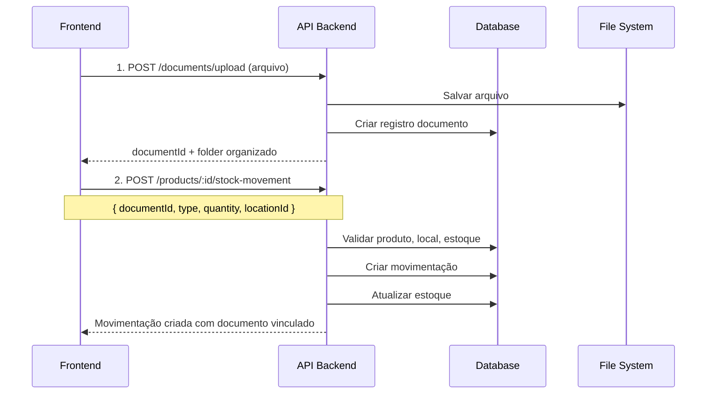

# 📦 API - Movimentações de Estoque com Documentos

**Data**: 5 de novembro de 2025  
**Versão**: 1.0  
**Documentação Completa dos Endpoints**

---

## 📋 Índice

1. [Visão Geral](#visão-geral)
2. [Autenticação e Headers](#autenticação-e-headers)
3. [Upload de Documento](#upload-de-documento)
4. [Criar Movimentação](#criar-movimentação)
5. [Listar Histórico de Movimentações](#listar-histórico)
6. [Download de Documento](#download-de-documento)
7. [Fluxo Completo](#fluxo-completo)
8. [Exemplos Práticos](#exemplos-práticos)
9. [Tratamento de Erros](#tratamento-de-erros)

---

## 🎯 Visão Geral

Este documento descreve os endpoints para gerenciar movimentações de estoque com anexos de documentos (notas fiscais, recibos, laudos, etc.).

### Fluxo Básico



---

## 🔐 Autenticação e Headers

### Headers Obrigatórios em Todas as Requisições

```http
Authorization: Bearer {token}
x-company-id: {company-uuid}
```

> ⚠️ **IMPORTANTE**: 
> - O header `x-company-id` é **obrigatório** em todas as requisições
> - Sem ele, você receberá erro `403 Forbidden`
> - O token JWT deve ser obtido através do endpoint de login

### Como Obter o Token

```http
POST /auth/login
Content-Type: application/json

{
  "email": "usuario@empresa.com",
  "password": "senha123"
}
```

**Response:**
```json
{
  "access_token": "eyJhbGciOiJIUzI1NiIsInR5cCI6IkpXVCJ9...",
  "user": {
    "userId": "user-uuid",
    "email": "usuario@empresa.com",
    "name": "João Silva",
    "companies": [
      {
        "companyId": "company-uuid-123",
        "companyName": "Minha Empresa Ltda"
      }
    ]
  }
}
```

Use o `access_token` no header `Authorization` e o `companyId` no header `x-company-id`.

---

## 📤 Upload de Documento

### Endpoint

```http
POST /documents/upload
```

### Headers

```http
Authorization: Bearer {token}
x-company-id: {company-uuid}
Content-Type: multipart/form-data
```

### Permissão

`documents.upload`

### Form Data

| Campo | Tipo | Obrigatório | Descrição |
|-------|------|-------------|-----------|
| `file` | File | ✅ Sim | Arquivo a ser enviado (max 50MB) |
| `title` | string | ❌ Não | Título do documento |
| `description` | string | ❌ Não | Descrição detalhada |
| `type` | string | ❌ Não | Tipo do documento |
| `tags` | string | ❌ Não | JSON array de tags |
| `context` | string | ❌ Não | Contexto para organização automática |
| `expiresAt` | string | ❌ Não | Data de expiração (ISO 8601) |

### Tipos de Documentos Sugeridos

| Tipo | Uso Comum | Context |
|------|-----------|---------|
| `nota_fiscal_entrada` | Compra de produtos | `stock_movement` |
| `nota_fiscal_saida` | Venda de produtos | `stock_movement` |
| `recibo` | Recebimento de mercadoria | `stock_movement` |
| `laudo_perda` | Perda/avaria de produtos | `stock_movement` |
| `termo_ajuste` | Ajuste de inventário | `stock_movement` |
| `nota_devolucao` | Devolução de produtos | `stock_movement` |
| `guia_transferencia` | Transferência entre locais | `stock_transfer` |

### Context (Organização Automática)

| Valor | Estrutura de Pasta Criada |
|-------|---------------------------|
| `stock_movement` | `Estoque/Movimentações/YYYY/MêsNome/` |
| `stock_transfer` | `Estoque/Transferências/YYYY/MêsNome/` |
| (vazio) | Documento fica na raiz sem pasta |

### Exemplo JavaScript

```javascript
async function uploadDocument(file, metadata, companyId, token) {
  const formData = new FormData();
  formData.append('file', file);
  formData.append('title', metadata.title);
  formData.append('type', metadata.type);
  formData.append('context', 'stock_movement'); // Organização automática
  
  if (metadata.tags) {
    formData.append('tags', JSON.stringify(metadata.tags));
  }

  const response = await fetch('http://localhost:4000/documents/upload', {
    method: 'POST',
    headers: {
      'Authorization': `Bearer ${token}`,
      'x-company-id': companyId
      // NÃO incluir Content-Type, o browser define automaticamente
    },
    body: formData
  });

  if (!response.ok) {
    const error = await response.json();
    throw new Error(error.message || 'Erro ao fazer upload');
  }

  return await response.json();
}

// Exemplo de uso
const arquivo = fileInput.files[0];
const documento = await uploadDocument(
  arquivo,
  {
    title: 'Nota Fiscal 12345',
    type: 'nota_fiscal_entrada',
    tags: ['nf', 'compra', 'fornecedor-x']
  },
  'company-uuid',
  'seu-token-jwt'
);

console.log('Documento criado:', documento.id);
console.log('Organizado em:', documento.folder?.path);
// Output: "Estoque/Movimentações/2025/Novembro"
```

### Response (201 Created)

```json
{
  "id": "doc-uuid-123",
  "fileName": "nota_fiscal_12345.pdf",
  "originalName": "NF_12345_Fornecedor_X.pdf",
  "fileUrl": "/uploads/documents/estoque/movimentacoes/2025/novembro/nota_fiscal_12345.pdf",
  "filePath": "uploads/documents/company-uuid/2025/11/nota_fiscal_12345.pdf",
  "title": "Nota Fiscal 12345",
  "description": null,
  "type": "nota_fiscal_entrada",
  "tags": ["nf", "compra", "fornecedor-x"],
  "fileSize": 245678,
  "mimeType": "application/pdf",
  "folderId": "folder-uuid",
  "folder": {
    "id": "folder-uuid",
    "name": "Novembro",
    "path": "Estoque/Movimentações/2025/Novembro"
  },
  "version": 1,
  "expiresAt": null,
  "uploadedById": "user-uuid",
  "uploadedBy": {
    "id": "user-uuid",
    "name": "João Silva",
    "email": "joao@empresa.com"
  },
  "createdAt": "2025-11-05T14:25:00Z",
  "updatedAt": "2025-11-05T14:25:00Z"
}
```

### Exemplo TypeScript Completo

```typescript
interface UploadDocumentParams {
  file: File;
  title?: string;
  description?: string;
  type?: string;
  tags?: string[];
  context?: 'stock_movement' | 'stock_transfer';
  expiresAt?: Date;
}

interface DocumentResponse {
  id: string;
  fileName: string;
  fileUrl: string;
  title: string | null;
  type: string | null;
  tags: string[];
  fileSize: number;
  mimeType: string;
  folder: {
    id: string;
    name: string;
    path: string;
  } | null;
  uploadedBy: {
    id: string;
    name: string;
    email: string;
  };
  createdAt: string;
}

async function uploadDocumentTyped(
  params: UploadDocumentParams,
  companyId: string,
  token: string
): Promise<DocumentResponse> {
  const formData = new FormData();
  formData.append('file', params.file);
  
  if (params.title) formData.append('title', params.title);
  if (params.description) formData.append('description', params.description);
  if (params.type) formData.append('type', params.type);
  if (params.context) formData.append('context', params.context);
  if (params.tags) formData.append('tags', JSON.stringify(params.tags));
  if (params.expiresAt) formData.append('expiresAt', params.expiresAt.toISOString());

  const response = await fetch('http://localhost:4000/documents/upload', {
    method: 'POST',
    headers: {
      'Authorization': `Bearer ${token}`,
      'x-company-id': companyId
    },
    body: formData
  });

  if (!response.ok) {
    const error = await response.json();
    throw new Error(error.message || 'Erro ao fazer upload');
  }

  return await response.json();
}
```

---

## 📦 Criar Movimentação de Estoque

### Endpoint

```http
POST /products/:productId/stock-movement
```

### Headers

```http
Authorization: Bearer {token}
x-company-id: {company-uuid}
Content-Type: application/json
```

### Permissão

`products.manage_stock`

### Path Parameters

| Parâmetro | Tipo | Descrição |
|-----------|------|-----------|
| `productId` | UUID | ID do produto |

### Request Body

```typescript
{
  type: 'ENTRY' | 'EXIT' | 'ADJUSTMENT' | 'RETURN' | 'LOSS' | 'TRANSFER';
  quantity: number;              // Quantidade (obrigatório, > 0)
  locationId: string;            // UUID do local (obrigatório)
  documentId?: string;           // UUID do documento (opcional)
  reason?: string;               // Motivo da movimentação
  notes?: string;                // Observações adicionais
  reference?: string;            // Referência externa (nº pedido, NF, etc)
}
```

### Campos Detalhados

| Campo | Tipo | Obrigatório | Validação | Descrição |
|-------|------|-------------|-----------|-----------|
| `type` | enum | ✅ Sim | Um dos valores permitidos | Tipo da movimentação |
| `quantity` | number | ✅ Sim | > 0 | Quantidade movimentada |
| `locationId` | UUID | ✅ Sim | Local deve existir e estar ativo | Local de estoque |
| `documentId` | UUID | ❌ Não | Documento deve existir | Documento anexado |
| `reason` | string | ❌ Não | - | Motivo da movimentação |
| `notes` | string | ❌ Não | - | Observações adicionais |
| `reference` | string | ❌ Não | - | Nº NF, pedido, etc |

### Tipos de Movimentação

| Tipo | Descrição | Efeito no Estoque | Documentos Comuns | Validações |
|------|-----------|-------------------|-------------------|------------|
| `ENTRY` | Entrada | ➕ Aumenta | NF de compra, Recibo | Nenhuma especial |
| `EXIT` | Saída | ➖ Diminui | NF de venda, Requisição | Verifica estoque suficiente |
| `ADJUSTMENT` | Ajuste | ➕➖ Ajusta | Termo de ajuste, Inventário | Nenhuma especial |
| `RETURN` | Devolução | ➕➖ Varia | Nota de devolução | Nenhuma especial |
| `LOSS` | Perda | ➖ Diminui | Laudo de perda, Termo de baixa | Verifica estoque suficiente |
| `TRANSFER` | Transferência | ➖ Diminui no origem | Guia de transferência | Verifica estoque suficiente |

### Exemplo JavaScript

```javascript
async function createStockMovement(
  productId,
  movementData,
  companyId,
  token
) {
  const response = await fetch(`http://localhost:4000/products/${productId}/stock-movement`, {
    method: 'POST',
    headers: {
      'Authorization': `Bearer ${token}`,
      'x-company-id': companyId,
      'Content-Type': 'application/json'
    },
    body: JSON.stringify(movementData)
  });

  if (!response.ok) {
    const error = await response.json();
    throw new Error(error.message || 'Erro ao criar movimentação');
  }

  return await response.json();
}

// Exemplo de uso
const movimentacao = await createStockMovement(
  'produto-uuid-123',
  {
    type: 'ENTRY',
    quantity: 50,
    locationId: 'warehouse-main-uuid',
    documentId: 'doc-uuid-456', // Opcional
    reason: 'Compra fornecedor X - NF 12345',
    notes: 'Notebooks Dell Inspiron 15 - 8GB RAM',
    reference: 'PEDIDO-001'
  },
  'company-uuid',
  'seu-token-jwt'
);

console.log('Movimentação criada:', movimentacao.id);
console.log(`Estoque: ${movimentacao.previousStock} → ${movimentacao.newStock}`);
```

### Response (201 Created)

```json
{
  "id": "mov-uuid-123",
  "companyId": "company-uuid",
  "productId": "prod-uuid-456",
  "type": "ENTRY",
  "quantity": 50,
  "previousStock": 100,
  "newStock": 150,
  "locationId": "loc-uuid-789",
  "location": {
    "id": "loc-uuid-789",
    "name": "Armazém Principal",
    "code": "ARM-01",
    "address": "Rua A, 123"
  },
  "documentId": "doc-uuid-abc",
  "document": {
    "id": "doc-uuid-abc",
    "fileName": "nota_fiscal_12345.pdf",
    "fileUrl": "/uploads/documents/estoque/movimentacoes/2025/novembro/nota_fiscal_12345.pdf",
    "title": "Nota Fiscal 12345",
    "type": "nota_fiscal_entrada",
    "fileSize": 245678,
    "mimeType": "application/pdf",
    "folderId": "folder-uuid-xyz",
    "folder": {
      "id": "folder-uuid-xyz",
      "name": "Novembro",
      "path": "Estoque/Movimentações/2025/Novembro"
    }
  },
  "reason": "Compra fornecedor X - NF 12345",
  "notes": "Notebooks Dell Inspiron 15 - 8GB RAM",
  "reference": "PEDIDO-001",
  "userId": "user-uuid",
  "user": {
    "id": "user-uuid",
    "name": "João Silva",
    "email": "joao@empresa.com"
  },
  "createdAt": "2025-11-05T14:30:00.000Z"
}
```

### Validações e Comportamento

#### 1. Validação do Produto
- Verifica se produto existe e pertence à empresa
- Verifica se `manageStock` está habilitado
- **Erro**: `404 Not Found` - "Produto não encontrado"

#### 2. Validação do Local
- Verifica se local existe e pertence à empresa
- Verifica se local está ativo (`active: true`)
- **Erro**: `400 Bad Request` - "Local de estoque não está ativo"

#### 3. Validação de Estoque (para EXIT, LOSS, TRANSFER)
- Verifica se há estoque suficiente no local
- Lança erro se `quantity > estoque disponível`
- **Erro**: `400 Bad Request` - "Estoque insuficiente no local X. Disponível: Y"

#### 4. Processamento do Documento (se fornecido)
- Valida se documento existe e pertence à empresa
- Se documento não tem pasta (`folderId` null):
  - Cria estrutura: `Estoque/Movimentações/YYYY/MêsNome`
  - Move documento para a pasta correta
- Se documento já está em pasta, mantém
- **Erro**: `404 Not Found` - "Documento não encontrado"

#### 5. Atualização de Estoque
- Atualiza `ProductStockByLocation` (estoque por local)
- Atualiza `Product.currentStock` (estoque total)
- Cria registro em `ProductStockMovement` (histórico)

#### 6. Auditoria
- Registra ação em `AuditLog`
- Inclui valores anteriores e novos
- Registra usuário responsável

---

## 📊 Listar Histórico de Movimentações

### Endpoint

```http
GET /products/:productId/stock-history
```

**⚠️ Deprecated**: Use o endpoint `/products/:productId/stock-movements` para mais funcionalidades.

### Headers

```http
Authorization: Bearer {token}
x-company-id: {company-uuid}
```

### Permissão

`products.read`

### Path Parameters

| Parâmetro | Tipo | Descrição |
|-----------|------|-----------|
| `productId` | UUID | ID do produto |

### Query Parameters

| Parâmetro | Tipo | Obrigatório | Default | Descrição |
|-----------|------|-------------|---------|-----------|
| `limit` | number | ❌ Não | 50 | Limite de registros retornados |

---

## 📋 Listar Movimentações com Filtros (Recomendado)

### Endpoint

```http
GET /products/:productId/stock-movements
```

### Headers

```http
Authorization: Bearer {token}
x-company-id: {company-uuid}
```

### Permissão

`products.read`

### Path Parameters

| Parâmetro | Tipo | Descrição |
|-----------|------|-----------|
| `productId` | UUID | ID do produto |

### Query Parameters

| Parâmetro | Tipo | Obrigatório | Default | Descrição |
|-----------|------|-------------|---------|-----------|
| `type` | string | ❌ Não | - | Filtrar por tipo (`ENTRY`, `EXIT`, `ADJUSTMENT`, `RETURN`, `LOSS`, `TRANSFER`) |
| `locationId` | UUID | ❌ Não | - | Filtrar por local de estoque |
| `startDate` | string | ❌ Não | - | Data inicial (ISO 8601, ex: `2025-01-01`) |
| `endDate` | string | ❌ Não | - | Data final (ISO 8601, ex: `2025-12-31`) |
| `page` | number | ❌ Não | 1 | Página atual |
| `limit` | number | ❌ Não | 50 | Registros por página |

### Exemplo JavaScript - Endpoint Novo (Recomendado)

```javascript
async function getStockMovements(productId, filters, companyId, token) {
  const url = new URL(`http://localhost:4000/products/${productId}/stock-movements`);
  
  // Adicionar filtros opcionais
  if (filters.type) url.searchParams.append('type', filters.type);
  if (filters.locationId) url.searchParams.append('locationId', filters.locationId);
  if (filters.startDate) url.searchParams.append('startDate', filters.startDate);
  if (filters.endDate) url.searchParams.append('endDate', filters.endDate);
  if (filters.page) url.searchParams.append('page', filters.page.toString());
  if (filters.limit) url.searchParams.append('limit', filters.limit.toString());

  const response = await fetch(url, {
    headers: {
      'Authorization': `Bearer ${token}`,
      'x-company-id': companyId
    }
  });

  if (!response.ok) {
    const error = await response.json();
    throw new Error(error.message || 'Erro ao buscar movimentações');
  }

  return await response.json();
}

// Exemplos de uso

// 1. Listar todas as movimentações (primeira página)
const todasMovimentacoes = await getStockMovements(
  'produto-uuid-123',
  {},
  'company-uuid',
  'seu-token-jwt'
);

// 2. Filtrar apenas entradas
const entradas = await getStockMovements(
  'produto-uuid-123',
  { type: 'ENTRY' },
  'company-uuid',
  'seu-token-jwt'
);

// 3. Filtrar por local e tipo
const saidasArmazem = await getStockMovements(
  'produto-uuid-123',
  {
    type: 'EXIT',
    locationId: 'warehouse-uuid'
  },
  'company-uuid',
  'seu-token-jwt'
);

// 4. Filtrar por período
const movimentacoesOutubro = await getStockMovements(
  'produto-uuid-123',
  {
    startDate: '2025-10-01',
    endDate: '2025-10-31'
  },
  'company-uuid',
  'seu-token-jwt'
);

// 5. Paginação
const segundaPagina = await getStockMovements(
  'produto-uuid-123',
  {
    page: 2,
    limit: 20
  },
  'company-uuid',
  'seu-token-jwt'
);

console.log(`Total de movimentações: ${todasMovimentacoes.total}`);
console.log(`Página atual: ${todasMovimentacoes.page}`);
console.log(`Total de páginas: ${todasMovimentacoes.totalPages}`);
console.log(`Movimentações na página: ${todasMovimentacoes.data.length}`);
```

### Exemplo JavaScript - Endpoint Antigo (Simples)

```javascript
async function getStockHistory(productId, limit, companyId, token) {
  const url = new URL(`http://localhost:4000/products/${productId}/stock-history`);
  if (limit) url.searchParams.append('limit', limit.toString());

  const response = await fetch(url, {
    headers: {
      'Authorization': `Bearer ${token}`,
      'x-company-id': companyId
    }
  });

  if (!response.ok) {
    const error = await response.json();
    throw new Error(error.message || 'Erro ao buscar histórico');
  }

  return await response.json();
}

// Buscar últimas 100 movimentações
const historico = await getStockHistory(
  'produto-uuid-123',
  100,
  'company-uuid',
  'seu-token-jwt'
);

console.log(`Total de movimentações: ${historico.length}`);

// Filtrar por tipo
const entradas = historico.filter(mov => mov.type === 'ENTRY');
const saidas = historico.filter(mov => mov.type === 'EXIT');
const ajustes = historico.filter(mov => mov.type === 'ADJUSTMENT');

console.log(`Entradas: ${entradas.length}`);
console.log(`Saídas: ${saidas.length}`);
console.log(`Ajustes: ${ajustes.length}`);
```

### Response (200 OK)

```json
[
  {
    "id": "mov-uuid-123",
    "companyId": "company-uuid",
    "productId": "prod-uuid",
    "type": "ENTRY",
    "quantity": 50,
    "previousStock": 100,
    "newStock": 150,
    "locationId": "loc-uuid",
    "location": {
      "id": "loc-uuid",
      "name": "Armazém Principal",
      "code": "ARM-01"
    },
    "documentId": "doc-uuid",
    "document": {
      "id": "doc-uuid",
      "fileName": "nota_fiscal_12345.pdf",
      "title": "NF 12345",
      "fileUrl": "/uploads/documents/estoque/movimentacoes/2025/novembro/nota_fiscal_12345.pdf",
      "type": "nota_fiscal_entrada"
    },
    "reason": "Compra fornecedor X",
    "notes": "Notebooks Dell Inspiron 15",
    "reference": "PEDIDO-001",
    "userId": "user-uuid",
    "user": {
      "id": "user-uuid",
      "name": "João Silva",
      "email": "joao@empresa.com"
    },
    "createdAt": "2025-11-05T14:30:00Z"
  },
  {
    "id": "mov-uuid-124",
    "type": "EXIT",
    "quantity": -10,
    "previousStock": 150,
    "newStock": 140,
    "location": {
      "name": "Loja Centro"
    },
    "reason": "Venda cliente A",
    "document": null,
    "user": {
      "name": "Maria Santos"
    },
    "createdAt": "2025-11-04T10:15:00Z"
  },
  {
    "id": "mov-uuid-125",
    "type": "ADJUSTMENT",
    "quantity": 5,
    "previousStock": 140,
    "newStock": 145,
    "location": {
      "name": "Armazém Principal"
    },
    "reason": "Ajuste de inventário",
    "document": {
      "fileName": "termo_ajuste_001.pdf"
    },
    "user": {
      "name": "Carlos Inventário"
    },
    "createdAt": "2025-11-03T16:00:00Z"
  }
]
```

### Ordenação

Os registros são retornados **ordenados por data decrescente** (mais recente primeiro).

---

## � Estatísticas de Estoque do Produto

### Endpoint

```http
GET /products/:productId/stock-stats
```

### Descrição

Retorna estatísticas completas do estoque de um produto específico, incluindo:
- Estoque mínimo, máximo e atual
- Estoque total (soma de todos os locais)
- Indicadores de necessidade de reposição
- Estoque distribuído por localização
- Percentual de ocupação do estoque

### Headers

```http
Authorization: Bearer {token}
x-company-id: {company-uuid}
```

### Permissão

`products.read`

### Path Parameters

| Parâmetro | Tipo | Obrigatório | Descrição |
|-----------|------|-------------|-----------|
| `productId` | string (UUID) | ✅ Sim | ID do produto |

### Response (200 OK)

```json
{
  "productId": "550e8400-e29b-41d4-a716-446655440000",
  "productName": "Notebook Dell Inspiron 15",
  "sku": "NB-DELL-001",
  "barcode": "7891234567890",
  "manageStock": true,
  "stats": {
    "currentStock": 45,
    "minStock": 10,
    "maxStock": 100,
    "totalStock": 45,
    "needsRestock": false,
    "isOverstocked": false,
    "stockPercentage": 45.0
  },
  "stockByLocation": [
    {
      "locationId": "loc-uuid-1",
      "locationName": "Depósito Principal",
      "locationCode": "DEP-01",
      "quantity": 30
    },
    {
      "locationId": "loc-uuid-2",
      "locationName": "Loja Centro",
      "locationCode": "LJ-CENTRO",
      "quantity": 15
    }
  ],
  "unit": {
    "id": "unit-uuid",
    "name": "Unidade",
    "abbreviation": "UN"
  }
}
```

### Campos do Response

#### Informações do Produto

| Campo | Tipo | Descrição |
|-------|------|-----------|
| `productId` | string | ID único do produto |
| `productName` | string | Nome do produto |
| `sku` | string | Código SKU do produto |
| `barcode` | string | Código de barras |
| `manageStock` | boolean | Se o estoque é gerenciado |

#### Estatísticas (`stats`)

| Campo | Tipo | Descrição |
|-------|------|-----------|
| `currentStock` | number | Estoque atual no cadastro do produto |
| `minStock` | number | Estoque mínimo configurado |
| `maxStock` | number \| null | Estoque máximo configurado (pode ser null) |
| `totalStock` | number | Soma do estoque de todos os locais |
| `needsRestock` | boolean | `true` se estoque ≤ estoque mínimo |
| `isOverstocked` | boolean | `true` se estoque ≥ estoque máximo |
| `stockPercentage` | number \| null | Percentual de ocupação (currentStock / maxStock * 100) |

#### Estoque por Local (`stockByLocation[]`)

| Campo | Tipo | Descrição |
|-------|------|-----------|
| `locationId` | string | ID do local de estoque |
| `locationName` | string | Nome do local |
| `locationCode` | string | Código do local |
| `quantity` | number | Quantidade disponível neste local |

#### Unidade de Medida (`unit`)

| Campo | Tipo | Descrição |
|-------|------|-----------|
| `id` | string | ID da unidade |
| `name` | string | Nome da unidade (ex: "Unidade", "Caixa") |
| `abbreviation` | string | Abreviação (ex: "UN", "CX") |

### Erros Possíveis

#### 404 - Produto não encontrado

```json
{
  "statusCode": 404,
  "message": "Produto não encontrado",
  "error": "Not Found"
}
```

#### 403 - Sem permissão ou empresa não especificada

```json
{
  "statusCode": 403,
  "message": "Usuário não tem permissão para executar esta ação"
}
```

### Exemplo JavaScript

```javascript
async function getProductStockStats(productId, companyId, token) {
  try {
    const response = await fetch(
      `http://localhost:4000/products/${productId}/stock-stats`,
      {
        method: 'GET',
        headers: {
          'Authorization': `Bearer ${token}`,
          'x-company-id': companyId
        }
      }
    );

    if (!response.ok) {
      throw new Error('Erro ao buscar estatísticas');
    }

    const stats = await response.json();
    
    console.log('📊 Estatísticas do Produto:', stats.productName);
    console.log('📦 Estoque Atual:', stats.stats.currentStock);
    console.log('⚠️ Estoque Mínimo:', stats.stats.minStock);
    console.log('📈 Estoque Máximo:', stats.stats.maxStock);
    console.log('🏪 Total em Locais:', stats.stats.totalStock);
    
    if (stats.stats.needsRestock) {
      console.log('🔴 ALERTA: Produto precisa de reposição!');
    }
    
    if (stats.stats.isOverstocked) {
      console.log('🟡 AVISO: Estoque acima do máximo!');
    }
    
    console.log('\n📍 Distribuição por Local:');
    stats.stockByLocation.forEach(loc => {
      console.log(`  - ${loc.locationName} (${loc.locationCode}): ${loc.quantity}`);
    });
    
    return stats;
  } catch (error) {
    console.error('Erro:', error);
    throw error;
  }
}

// Exemplo de uso
const stats = await getProductStockStats(
  '550e8400-e29b-41d4-a716-446655440000',
  'company-uuid-123',
  'seu-token-jwt'
);
```

### Exemplo React Component

```typescript
import React, { useEffect, useState } from 'react';

interface StockStats {
  productId: string;
  productName: string;
  sku: string;
  stats: {
    currentStock: number;
    minStock: number;
    maxStock: number | null;
    totalStock: number;
    needsRestock: boolean;
    isOverstocked: boolean;
    stockPercentage: number | null;
  };
  stockByLocation: Array<{
    locationId: string;
    locationName: string;
    locationCode: string;
    quantity: number;
  }>;
}

export const ProductStockDashboard: React.FC<{
  productId: string;
  companyId: string;
  token: string;
}> = ({ productId, companyId, token }) => {
  const [stats, setStats] = useState<StockStats | null>(null);
  const [loading, setLoading] = useState(true);
  const [error, setError] = useState<string | null>(null);

  useEffect(() => {
    loadStats();
  }, [productId]);

  const loadStats = async () => {
    setLoading(true);
    setError(null);
    
    try {
      const response = await fetch(
        `http://localhost:4000/products/${productId}/stock-stats`,
        {
          headers: {
            'Authorization': `Bearer ${token}`,
            'x-company-id': companyId
          }
        }
      );

      if (!response.ok) {
        throw new Error('Erro ao carregar estatísticas');
      }

      const data = await response.json();
      setStats(data);
    } catch (err: any) {
      setError(err.message);
    } finally {
      setLoading(false);
    }
  };

  if (loading) return <div>Carregando estatísticas...</div>;
  if (error) return <div>Erro: {error}</div>;
  if (!stats) return null;

  return (
    <div className="stock-dashboard">
      <h2>📊 Estatísticas de Estoque</h2>
      
      <div className="product-info">
        <h3>{stats.productName}</h3>
        <p>SKU: {stats.sku}</p>
      </div>

      <div className="stats-grid">
        <div className="stat-card">
          <h4>Estoque Atual</h4>
          <p className="stat-value">{stats.stats.currentStock}</p>
        </div>

        <div className="stat-card">
          <h4>Estoque Mínimo</h4>
          <p className="stat-value">{stats.stats.minStock}</p>
        </div>

        <div className="stat-card">
          <h4>Estoque Máximo</h4>
          <p className="stat-value">
            {stats.stats.maxStock ?? 'Não definido'}
          </p>
        </div>

        <div className="stat-card">
          <h4>Total em Locais</h4>
          <p className="stat-value">{stats.stats.totalStock}</p>
        </div>
      </div>

      {stats.stats.needsRestock && (
        <div className="alert alert-danger">
          🔴 ALERTA: Estoque abaixo do mínimo! Reabastecer urgente.
        </div>
      )}

      {stats.stats.isOverstocked && (
        <div className="alert alert-warning">
          🟡 AVISO: Estoque acima do máximo configurado.
        </div>
      )}

      {stats.stats.stockPercentage !== null && (
        <div className="stock-progress">
          <h4>Ocupação do Estoque</h4>
          <div className="progress-bar">
            <div 
              className="progress-fill" 
              style={{ width: `${stats.stats.stockPercentage}%` }}
            >
              {stats.stats.stockPercentage.toFixed(1)}%
            </div>
          </div>
        </div>
      )}

      <div className="locations-table">
        <h4>📍 Distribuição por Local</h4>
        <table>
          <thead>
            <tr>
              <th>Local</th>
              <th>Código</th>
              <th>Quantidade</th>
              <th>% do Total</th>
            </tr>
          </thead>
          <tbody>
            {stats.stockByLocation.map(loc => (
              <tr key={loc.locationId}>
                <td>{loc.locationName}</td>
                <td>{loc.locationCode}</td>
                <td>{loc.quantity}</td>
                <td>
                  {((loc.quantity / stats.stats.totalStock) * 100).toFixed(1)}%
                </td>
              </tr>
            ))}
          </tbody>
        </table>
      </div>
    </div>
  );
};
```

### Casos de Uso

#### 1. Dashboard de Gestão de Estoque

Exibir indicadores visuais de produtos que precisam de reposição:

```javascript
async function getProductsNeedingRestock(companyId, token, productIds) {
  const needsRestock = [];
  
  for (const productId of productIds) {
    const stats = await getProductStockStats(productId, companyId, token);
    
    if (stats.stats.needsRestock) {
      needsRestock.push({
        id: stats.productId,
        name: stats.productName,
        current: stats.stats.currentStock,
        min: stats.stats.minStock,
        deficit: stats.stats.minStock - stats.stats.currentStock
      });
    }
  }
  
  return needsRestock.sort((a, b) => b.deficit - a.deficit);
}
```

#### 2. Alerta de Estoque Crítico

```javascript
function checkCriticalStock(stats) {
  const percentage = (stats.stats.currentStock / stats.stats.minStock) * 100;
  
  if (percentage <= 0) {
    return { level: 'CRITICAL', message: '🔴 Estoque ZERO!' };
  } else if (percentage <= 50) {
    return { level: 'URGENT', message: '🟠 Estoque crítico - menos de 50% do mínimo' };
  } else if (stats.stats.needsRestock) {
    return { level: 'WARNING', message: '🟡 Estoque abaixo do mínimo' };
  }
  
  return { level: 'OK', message: '🟢 Estoque adequado' };
}
```

#### 3. Análise de Distribuição

```javascript
function analyzeStockDistribution(stats) {
  const total = stats.stats.totalStock;
  const analysis = stats.stockByLocation.map(loc => ({
    location: loc.locationName,
    quantity: loc.quantity,
    percentage: ((loc.quantity / total) * 100).toFixed(2),
    isMainLocation: loc.quantity === Math.max(...stats.stockByLocation.map(l => l.quantity))
  }));
  
  const mainLocation = analysis.find(a => a.isMainLocation);
  
  console.log(`📊 Análise de Distribuição - ${stats.productName}`);
  console.log(`   Total: ${total} unidades em ${analysis.length} locais`);
  console.log(`   Maior concentração: ${mainLocation.location} (${mainLocation.percentage}%)`);
  
  return analysis;
}
```

---

## �📥 Download de Documento

### Endpoint

```http
GET /documents/:documentId/download
```

### Headers

```http
Authorization: Bearer {token}
x-company-id: {company-uuid}
```

### Permissão

`documents.view`

### Path Parameters

| Parâmetro | Tipo | Descrição |
|-----------|------|-----------|
| `documentId` | UUID | ID do documento |

### Response

- **Status**: 200 OK
- **Headers**: 
  - `Content-Type`: Mime type do arquivo (ex: `application/pdf`, `image/png`)
  - `Content-Disposition`: `attachment; filename="nome_arquivo.pdf"`
- **Body**: Stream do arquivo (binário)

### Exemplo JavaScript (Navegador)

```javascript
async function downloadDocument(documentId, companyId, token) {
  const response = await fetch(`http://localhost:4000/documents/${documentId}/download`, {
    headers: {
      'Authorization': `Bearer ${token}`,
      'x-company-id': companyId
    }
  });

  if (!response.ok) {
    const error = await response.json();
    throw new Error(error.message || 'Erro ao fazer download');
  }

  // Obter nome do arquivo do header Content-Disposition
  const contentDisposition = response.headers.get('Content-Disposition');
  const filenameMatch = contentDisposition?.match(/filename="(.+)"/);
  const filename = filenameMatch ? filenameMatch[1] : 'documento.pdf';

  // Criar blob e fazer download
  const blob = await response.blob();
  const url = window.URL.createObjectURL(blob);
  const a = document.createElement('a');
  a.href = url;
  a.download = filename;
  document.body.appendChild(a);
  a.click();
  document.body.removeChild(a);
  window.URL.revokeObjectURL(url);
}

// Exemplo de uso
await downloadDocument('doc-uuid-123', 'company-uuid', 'seu-token-jwt');
```

### Exemplo React Component

```typescript
import React, { useState } from 'react';

interface DocumentDownloadProps {
  documentId: string;
  fileName: string;
  companyId: string;
  token: string;
}

export const DocumentDownloadButton: React.FC<DocumentDownloadProps> = ({
  documentId,
  fileName,
  companyId,
  token
}) => {
  const [downloading, setDownloading] = useState(false);

  const handleDownload = async () => {
    setDownloading(true);
    try {
      const response = await fetch(
        `http://localhost:4000/documents/${documentId}/download`,
        {
          headers: {
            'Authorization': `Bearer ${token}`,
            'x-company-id': companyId
          }
        }
      );

      if (!response.ok) {
        throw new Error('Erro ao fazer download');
      }

      const blob = await response.blob();
      const url = window.URL.createObjectURL(blob);
      const a = document.createElement('a');
      a.href = url;
      a.download = fileName;
      a.click();
      window.URL.revokeObjectURL(url);
    } catch (error) {
      console.error('Erro no download:', error);
      alert('Erro ao fazer download do documento');
    } finally {
      setDownloading(false);
    }
  };

  return (
    <button onClick={handleDownload} disabled={downloading}>
      {downloading ? '⏳ Baixando...' : '📥 Download'}
    </button>
  );
};
```

---

## 🔄 Fluxo Completo: Upload + Movimentação

### Cenário: Entrada de Estoque com Nota Fiscal

```typescript
interface StockEntryWithDocumentParams {
  productId: string;
  arquivo: File;
  movementData: {
    type: 'ENTRY' | 'EXIT' | 'ADJUSTMENT' | 'RETURN' | 'LOSS';
    quantity: number;
    locationId: string;
    reason?: string;
    notes?: string;
    reference?: string;
  };
  documentMetadata: {
    title: string;
    type: string;
    tags?: string[];
  };
  companyId: string;
  token: string;
}

async function createStockEntryWithDocument(
  params: StockEntryWithDocumentParams
) {
  try {
    console.log('📤 Passo 1/2: Fazendo upload do documento...');
    
    // Passo 1: Upload do documento
    const formData = new FormData();
    formData.append('file', params.arquivo);
    formData.append('title', params.documentMetadata.title);
    formData.append('type', params.documentMetadata.type);
    formData.append('context', 'stock_movement'); // Organização automática
    
    if (params.documentMetadata.tags) {
      formData.append('tags', JSON.stringify(params.documentMetadata.tags));
    }

    const uploadRes = await fetch('http://localhost:4000/documents/upload', {
      method: 'POST',
      headers: {
        'Authorization': `Bearer ${params.token}`,
        'x-company-id': params.companyId
      },
      body: formData
    });

    if (!uploadRes.ok) {
      const error = await uploadRes.json();
      throw new Error(`Erro no upload: ${error.message}`);
    }

    const documento = await uploadRes.json();
    console.log('✅ Documento enviado:', documento.id);
    console.log('📁 Organizado em:', documento.folder?.path || 'Sem pasta');

    // Passo 2: Criar movimentação vinculando o documento
    console.log('📦 Passo 2/2: Criando movimentação de estoque...');
    
    const movRes = await fetch(
      `http://localhost:4000/products/${params.productId}/stock-movement`,
      {
        method: 'POST',
        headers: {
          'Authorization': `Bearer ${params.token}`,
          'x-company-id': params.companyId,
          'Content-Type': 'application/json'
        },
        body: JSON.stringify({
          ...params.movementData,
          documentId: documento.id
        })
      }
    );

    if (!movRes.ok) {
      const error = await movRes.json();
      throw new Error(`Erro na movimentação: ${error.message}`);
    }

    const movimentacao = await movRes.json();
    console.log('✅ Movimentação criada:', movimentacao.id);
    console.log(`📊 Estoque atualizado: ${movimentacao.previousStock} → ${movimentacao.newStock}`);
    console.log(`📄 Documento vinculado: ${movimentacao.document?.fileName}`);

    return {
      documento,
      movimentacao
    };
  } catch (error) {
    console.error('❌ Erro no fluxo:', error);
    throw error;
  }
}

// ========== EXEMPLO DE USO ==========

const fileInput = document.querySelector('input[type="file"]') as HTMLInputElement;
const arquivo = fileInput.files![0];

const resultado = await createStockEntryWithDocument({
  productId: 'produto-uuid-123',
  arquivo: arquivo,
  movementData: {
    type: 'ENTRY',
    quantity: 50,
    locationId: 'warehouse-main-uuid',
    reason: 'Compra fornecedor X - NF 12345',
    notes: 'Notebooks Dell Inspiron 15 - 8GB RAM, SSD 256GB',
    reference: 'PEDIDO-001'
  },
  documentMetadata: {
    title: 'Nota Fiscal 12345 - Fornecedor X',
    type: 'nota_fiscal_entrada',
    tags: ['nf', 'compra', 'fornecedor-x', 'notebooks']
  },
  companyId: 'company-uuid-789',
  token: 'eyJhbGciOiJIUzI1NiIsInR5cCI6IkpXVCJ9...'
});

console.log('✅ Processo completo:', resultado);
```

### Output Esperado

```
📤 Passo 1/2: Fazendo upload do documento...
✅ Documento enviado: doc-uuid-abc123
📁 Organizado em: Estoque/Movimentações/2025/Novembro
📦 Passo 2/2: Criando movimentação de estoque...
✅ Movimentação criada: mov-uuid-def456
📊 Estoque atualizado: 100 → 150
📄 Documento vinculado: nota_fiscal_12345.pdf
✅ Processo completo: { documento: {...}, movimentacao: {...} }
```

---

## 💡 Exemplos Práticos

### Exemplo 1: Componente React - Entrada com Upload

```tsx
import React, { useState, useEffect } from 'react';

interface StockLocation {
  id: string;
  name: string;
  code: string;
}

interface StockEntryFormProps {
  productId: string;
  companyId: string;
  token: string;
  onSuccess: () => void;
}

export const StockEntryForm: React.FC<StockEntryFormProps> = ({
  productId,
  companyId,
  token,
  onSuccess
}) => {
  const [locations, setLocations] = useState<StockLocation[]>([]);
  const [formData, setFormData] = useState({
    quantity: 0,
    locationId: '',
    reason: '',
    notes: '',
    reference: ''
  });
  const [file, setFile] = useState<File | null>(null);
  const [loading, setLoading] = useState(false);
  const [progress, setProgress] = useState('');

  useEffect(() => {
    // Carregar locais de estoque
    fetch('http://localhost:4000/products/stock-locations?active=true', {
      headers: {
        'Authorization': `Bearer ${token}`,
        'x-company-id': companyId
      }
    })
      .then(res => res.json())
      .then(setLocations)
      .catch(console.error);
  }, [token, companyId]);

  const handleSubmit = async (e: React.FormEvent) => {
    e.preventDefault();
    setLoading(true);
    setProgress('');

    try {
      let documentId: string | undefined;

      // Passo 1: Upload do documento (se houver)
      if (file) {
        setProgress('📤 Enviando documento...');
        
        const uploadForm = new FormData();
        uploadForm.append('file', file);
        uploadForm.append('title', `NF - ${formData.reason}`);
        uploadForm.append('type', 'nota_fiscal_entrada');
        uploadForm.append('context', 'stock_movement');
        uploadForm.append('tags', JSON.stringify(['nf', 'entrada']));

        const uploadRes = await fetch('http://localhost:4000/documents/upload', {
          method: 'POST',
          headers: {
            'Authorization': `Bearer ${token}`,
            'x-company-id': companyId
          },
          body: uploadForm
        });

        if (!uploadRes.ok) {
          const error = await uploadRes.json();
          throw new Error(`Erro no upload: ${error.message}`);
        }

        const uploadData = await uploadRes.json();
        documentId = uploadData.id;
        setProgress(`✅ Documento enviado: ${uploadData.fileName}`);
      }

      // Passo 2: Criar movimentação
      setProgress(prev => prev + '\n📦 Criando entrada de estoque...');
      
      const movRes = await fetch(
        `http://localhost:4000/products/${productId}/stock-movement`,
        {
          method: 'POST',
          headers: {
            'Authorization': `Bearer ${token}`,
            'x-company-id': companyId,
            'Content-Type': 'application/json'
          },
          body: JSON.stringify({
            type: 'ENTRY',
            quantity: formData.quantity,
            locationId: formData.locationId,
            documentId,
            reason: formData.reason,
            notes: formData.notes,
            reference: formData.reference
          })
        }
      );

      if (!movRes.ok) {
        const error = await movRes.json();
        throw new Error(`Erro na movimentação: ${error.message}`);
      }

      const movement = await movRes.json();
      
      setProgress(prev => 
        prev + `\n✅ Entrada criada! Estoque: ${movement.previousStock} → ${movement.newStock}`
      );

      if (documentId && movement.document) {
        setProgress(prev => 
          prev + `\n📁 Documento organizado em: ${movement.document.folder?.path}`
        );
      }

      // Limpar formulário
      setFormData({ quantity: 0, locationId: '', reason: '', notes: '', reference: '' });
      setFile(null);
      
      // Callback de sucesso
      setTimeout(() => onSuccess(), 2000);
      
    } catch (error: any) {
      console.error('Erro:', error);
      alert(`Erro: ${error.message}`);
      setProgress('');
    } finally {
      setLoading(false);
    }
  };

  return (
    <form onSubmit={handleSubmit} className="space-y-4">
      <h2 className="text-xl font-bold">📥 Entrada de Estoque</h2>

      <div>
        <label className="block font-medium mb-1">Quantidade *</label>
        <input
          type="number"
          required
          min="0.01"
          step="0.01"
          value={formData.quantity || ''}
          onChange={(e) => setFormData({ ...formData, quantity: Number(e.target.value) })}
          placeholder="Ex: 50"
          className="w-full border rounded px-3 py-2"
        />
      </div>

      <div>
        <label className="block font-medium mb-1">Local de Estoque *</label>
        <select
          required
          value={formData.locationId}
          onChange={(e) => setFormData({ ...formData, locationId: e.target.value })}
          className="w-full border rounded px-3 py-2"
        >
          <option value="">Selecione...</option>
          {locations.map(loc => (
            <option key={loc.id} value={loc.id}>
              {loc.name} ({loc.code})
            </option>
          ))}
        </select>
      </div>

      <div>
        <label className="block font-medium mb-1">Motivo *</label>
        <input
          type="text"
          required
          value={formData.reason}
          onChange={(e) => setFormData({ ...formData, reason: e.target.value })}
          placeholder="Ex: Compra fornecedor X - NF 12345"
          className="w-full border rounded px-3 py-2"
        />
      </div>

      <div>
        <label className="block font-medium mb-1">Referência (Nº NF, Pedido)</label>
        <input
          type="text"
          value={formData.reference}
          onChange={(e) => setFormData({ ...formData, reference: e.target.value })}
          placeholder="Ex: PEDIDO-001, NF-12345"
          className="w-full border rounded px-3 py-2"
        />
      </div>

      <div>
        <label className="block font-medium mb-1">Observações</label>
        <textarea
          value={formData.notes}
          onChange={(e) => setFormData({ ...formData, notes: e.target.value })}
          placeholder="Informações adicionais sobre a entrada..."
          rows={3}
          className="w-full border rounded px-3 py-2"
        />
      </div>

      <div>
        <label className="block font-medium mb-1">📄 Nota Fiscal (opcional)</label>
        <input
          type="file"
          accept=".pdf,.jpg,.jpeg,.png"
          onChange={(e) => setFile(e.target.files?.[0] || null)}
          className="w-full"
        />
        {file && (
          <p className="text-sm text-gray-600 mt-1">
            ✅ {file.name} ({(file.size / 1024).toFixed(2)} KB)
          </p>
        )}
        <p className="text-xs text-gray-500 mt-1">
          Será organizado automaticamente em: Estoque/Movimentações/{new Date().getFullYear()}/{getMonthName(new Date().getMonth())}
        </p>
      </div>

      {progress && (
        <div className="bg-blue-50 border border-blue-200 rounded p-3 whitespace-pre-line text-sm">
          {progress}
        </div>
      )}

      <button
        type="submit"
        disabled={loading}
        className="w-full bg-blue-600 text-white py-2 px-4 rounded font-medium hover:bg-blue-700 disabled:bg-gray-400"
      >
        {loading ? '⏳ Processando...' : '✅ Criar Entrada'}
      </button>
    </form>
  );
};

function getMonthName(month: number): string {
  const months = [
    'Janeiro', 'Fevereiro', 'Março', 'Abril', 'Maio', 'Junho',
    'Julho', 'Agosto', 'Setembro', 'Outubro', 'Novembro', 'Dezembro'
  ];
  return months[month];
}
```

### Exemplo 2: Lista de Movimentações com Download

```tsx
import React, { useState, useEffect } from 'react';

interface Movement {
  id: string;
  type: string;
  quantity: number;
  previousStock: number;
  newStock: number;
  location: {
    name: string;
    code: string;
  };
  document?: {
    id: string;
    fileName: string;
    fileUrl: string;
  };
  reason: string;
  notes?: string;
  reference?: string;
  user: {
    name: string;
  };
  createdAt: string;
}

interface StockHistoryProps {
  productId: string;
  companyId: string;
  token: string;
}

export const StockHistory: React.FC<StockHistoryProps> = ({
  productId,
  companyId,
  token
}) => {
  const [movements, setMovements] = useState<Movement[]>([]);
  const [loading, setLoading] = useState(true);
  const [downloading, setDownloading] = useState<string | null>(null);

  useEffect(() => {
    loadHistory();
  }, [productId]);

  const loadHistory = async () => {
    setLoading(true);
    try {
      const response = await fetch(
        `http://localhost:4000/products/${productId}/stock-history?limit=100`,
        {
          headers: {
            'Authorization': `Bearer ${token}`,
            'x-company-id': companyId
          }
        }
      );

      if (response.ok) {
        const data = await response.json();
        setMovements(data);
      }
    } catch (error) {
      console.error('Erro ao carregar histórico:', error);
    } finally {
      setLoading(false);
    }
  };

  const handleDownload = async (documentId: string, fileName: string) => {
    setDownloading(documentId);
    try {
      const response = await fetch(
        `http://localhost:4000/documents/${documentId}/download`,
        {
          headers: {
            'Authorization': `Bearer ${token}`,
            'x-company-id': companyId
          }
        }
      );

      if (!response.ok) throw new Error('Erro no download');

      const blob = await response.blob();
      const url = window.URL.createObjectURL(blob);
      const a = document.createElement('a');
      a.href = url;
      a.download = fileName;
      a.click();
      window.URL.revokeObjectURL(url);
    } catch (error) {
      console.error('Erro no download:', error);
      alert('Erro ao fazer download do documento');
    } finally {
      setDownloading(null);
    }
  };

  const getTypeLabel = (type: string) => {
    const labels: Record<string, string> = {
      'ENTRY': '📥 Entrada',
      'EXIT': '📤 Saída',
      'ADJUSTMENT': '⚙️ Ajuste',
      'RETURN': '↩️ Devolução',
      'LOSS': '❌ Perda',
      'TRANSFER': '🔄 Transferência'
    };
    return labels[type] || type;
  };

  const getTypeColor = (type: string) => {
    const colors: Record<string, string> = {
      'ENTRY': 'text-green-600 bg-green-50',
      'EXIT': 'text-red-600 bg-red-50',
      'ADJUSTMENT': 'text-blue-600 bg-blue-50',
      'RETURN': 'text-purple-600 bg-purple-50',
      'LOSS': 'text-orange-600 bg-orange-50',
      'TRANSFER': 'text-indigo-600 bg-indigo-50'
    };
    return colors[type] || 'text-gray-600 bg-gray-50';
  };

  if (loading) {
    return <div className="text-center py-8">⏳ Carregando histórico...</div>;
  }

  if (movements.length === 0) {
    return (
      <div className="text-center py-8 text-gray-500">
        Nenhuma movimentação encontrada
      </div>
    );
  }

  return (
    <div className="space-y-3">
      <h2 className="text-xl font-bold mb-4">
        📊 Histórico de Movimentações ({movements.length})
      </h2>

      {movements.map((mov) => (
        <div key={mov.id} className="border rounded-lg p-4 hover:shadow-md transition">
          <div className="flex items-start justify-between mb-2">
            <div className="flex-1">
              <div className="flex items-center gap-2 mb-1">
                <span className={`px-2 py-1 rounded text-sm font-medium ${getTypeColor(mov.type)}`}>
                  {getTypeLabel(mov.type)}
                </span>
                <span className="text-sm text-gray-600">
                  {new Date(mov.createdAt).toLocaleString('pt-BR')}
                </span>
              </div>
              
              <div className="text-sm space-y-1">
                <p className="font-medium">{mov.reason}</p>
                {mov.notes && <p className="text-gray-600">{mov.notes}</p>}
                {mov.reference && (
                  <p className="text-gray-500">Ref: {mov.reference}</p>
                )}
                <p className="text-gray-600">
                  📍 {mov.location.name} ({mov.location.code})
                </p>
                <p className="text-gray-600">
                  👤 {mov.user.name}
                </p>
              </div>
            </div>

            <div className="text-right ml-4">
              <div className="text-2xl font-bold">
                {mov.quantity > 0 ? '+' : ''}{mov.quantity}
              </div>
              <div className="text-xs text-gray-500">
                {mov.previousStock} → {mov.newStock}
              </div>
            </div>
          </div>

          {mov.document && (
            <div className="mt-3 pt-3 border-t">
              <div className="flex items-center justify-between">
                <div className="flex items-center gap-2 text-sm">
                  <span>📄</span>
                  <span className="font-medium">{mov.document.fileName}</span>
                </div>
                <button
                  onClick={() => handleDownload(mov.document!.id, mov.document!.fileName)}
                  disabled={downloading === mov.document.id}
                  className="text-blue-600 hover:text-blue-800 text-sm font-medium disabled:text-gray-400"
                >
                  {downloading === mov.document.id ? '⏳ Baixando...' : '📥 Download'}
                </button>
              </div>
            </div>
          )}
        </div>
      ))}
    </div>
  );
};
```

---

## ⚠️ Tratamento de Erros

### Erros Comuns

#### 1. Header x-company-id não enviado (403)

```json
{
  "statusCode": 403,
  "message": "Empresa não especificada no cabeçalho x-company-id",
  "error": "Forbidden"
}
```

**Solução**: Sempre incluir o header `x-company-id` em todas as requisições.

---

#### 2. Estoque insuficiente (400)

```json
{
  "statusCode": 400,
  "message": "Estoque insuficiente no local \"Armazém Principal\". Disponível: 3",
  "error": "Bad Request"
}
```

**Solução**: Verificar estoque disponível antes de criar movimentação de saída/perda.

```typescript
// Verificar estoque antes
const product = await fetch(`/products/${productId}`).then(r => r.json());
const locationStock = product.stocksByLocation.find(s => s.location.id === locationId);

if (locationStock.quantity < desiredQuantity) {
  alert(`Estoque insuficiente. Disponível: ${locationStock.quantity}`);
  return;
}
```

---

#### 3. Documento não encontrado (404)

```json
{
  "statusCode": 404,
  "message": "Documento não encontrado",
  "error": "Not Found"
}
```

**Solução**: Sempre fazer upload do documento primeiro e usar o ID retornado.

---

#### 4. Produto não encontrado (404)

```json
{
  "statusCode": 404,
  "message": "Produto não encontrado",
  "error": "Not Found"
}
```

**Solução**: Verificar se o produto existe e pertence à empresa.

---

#### 5. Local inativo (400)

```json
{
  "statusCode": 400,
  "message": "Local de estoque não está ativo",
  "error": "Bad Request"
}
```

**Solução**: Usar apenas locais ativos: `GET /products/stock-locations?active=true`

---

#### 6. Arquivo muito grande (413)

```json
{
  "statusCode": 413,
  "message": "Arquivo excede o tamanho máximo permitido (50MB)",
  "error": "Payload Too Large"
}
```

**Solução**: Comprimir arquivo ou dividir em partes menores.

---

#### 7. Sem permissão (403)

```json
{
  "statusCode": 403,
  "message": "Usuário não tem permissão para executar esta ação",
  "error": "Forbidden"
}
```

**Solução**: Verificar permissões do usuário:
- `products.manage_stock` - Para criar movimentações
- `products.read` - Para visualizar histórico
- `documents.upload` - Para fazer upload
- `documents.view` - Para download

---

### Tratamento Global de Erros (TypeScript)

```typescript
class ApiError extends Error {
  constructor(
    public statusCode: number,
    message: string,
    public error?: string
  ) {
    super(message);
    this.name = 'ApiError';
  }
}

async function apiRequest<T>(
  url: string,
  options: RequestInit = {}
): Promise<T> {
  try {
    const response = await fetch(url, options);

    if (!response.ok) {
      const error = await response.json().catch(() => ({}));
      
      switch (response.status) {
        case 400:
          throw new ApiError(400, error.message || 'Requisição inválida', 'Bad Request');
        case 401:
          // Redirecionar para login
          window.location.href = '/login';
          throw new ApiError(401, 'Sessão expirada', 'Unauthorized');
        case 403:
          throw new ApiError(403, error.message || 'Sem permissão', 'Forbidden');
        case 404:
          throw new ApiError(404, error.message || 'Não encontrado', 'Not Found');
        case 413:
          throw new ApiError(413, 'Arquivo muito grande (máx 50MB)', 'Payload Too Large');
        case 500:
          throw new ApiError(500, 'Erro interno do servidor', 'Internal Server Error');
        default:
          throw new ApiError(response.status, error.message || 'Erro desconhecido');
      }
    }

    return response.json();
  } catch (error) {
    if (error instanceof ApiError) {
      throw error;
    }
    throw new ApiError(0, 'Erro de conexão', 'Network Error');
  }
}

// Exemplo de uso com tratamento de erros
try {
  const movimento = await apiRequest<Movement>(
    `http://localhost:4000/products/${productId}/stock-movement`,
    {
      method: 'POST',
      headers: {
        'Authorization': `Bearer ${token}`,
        'x-company-id': companyId,
        'Content-Type': 'application/json'
      },
      body: JSON.stringify(movementData)
    }
  );
  
  console.log('✅ Movimentação criada:', movimento);
} catch (error) {
  if (error instanceof ApiError) {
    switch (error.statusCode) {
      case 400:
        alert(`Erro de validação: ${error.message}`);
        break;
      case 403:
        alert('Você não tem permissão para esta ação');
        break;
      case 404:
        alert('Produto ou local não encontrado');
        break;
      default:
        alert(`Erro: ${error.message}`);
    }
  } else {
    alert('Erro de conexão. Verifique sua internet.');
  }
  console.error('Erro completo:', error);
}
```

---

## 📝 Resumo dos Endpoints

| Método | Endpoint | Descrição | Permissão |
|--------|----------|-----------|-----------|
| POST | `/documents/upload` | Upload de documento | `documents.upload` |
| POST | `/products/:id/stock-movement` | Criar movimentação | `products.manage_stock` |
| GET | `/products/:id/stock-history` | Listar histórico | `products.read` |
| GET | `/documents/:id/download` | Download de documento | `documents.view` |

---

## 🔗 Documentação Relacionada

- **[API_ENDPOINTS_CLIENT.md](./API_ENDPOINTS_CLIENT.md)** - Referência completa de todos os endpoints
- **[STOCK_MOVEMENTS_TRANSFERS_WITH_DOCUMENTS.md](./STOCK_MOVEMENTS_TRANSFERS_WITH_DOCUMENTS.md)** - Movimentações e transferências completas
- **[API_CLIENT_EXAMPLES.md](./API_CLIENT_EXAMPLES.md)** - Exemplos em React, Angular, Vue
- **[STOCK_DOCUMENTS_UPLOAD_GUIDE.md](./STOCK_DOCUMENTS_UPLOAD_GUIDE.md)** - Guia de upload de documentos

---

**Última Atualização**: 5 de novembro de 2025  
**Versão**: 1.0  
**Mantida por**: Equipe de Desenvolvimento

---

## 📞 Suporte

Para dúvidas ou problemas:
1. Verifique a seção de [Tratamento de Erros](#tratamento-de-erros)
2. Consulte os [Exemplos Práticos](#exemplos-práticos)
3. Entre em contato com a equipe de desenvolvimento

**🎉 Pronto para usar!** O sistema está completo e funcional.
