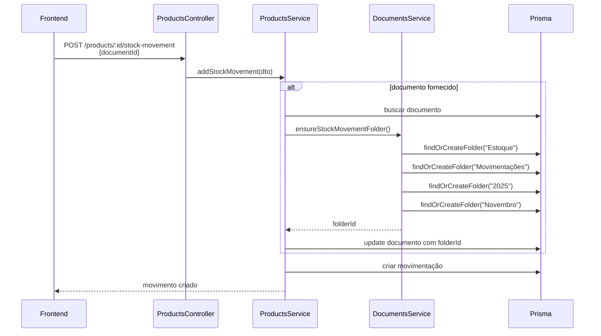

# Criação Automática de Pastas - Documentação Técnica

**Data**: 4 de novembro de 2025  
**Versão**: 1.0

## 📋 Índice

1. [Visão Geral](#visão-geral)
2. [Arquitetura](#arquitetura)
3. [Métodos Implementados](#métodos-implementados)
4. [Fluxo de Execução](#fluxo-de-execução)
5. [Integração com Movimentações](#integração-com-movimentações)
6. [Testes e Validação](#testes-e-validação)

---

## 🎯 Visão Geral

### Objetivo

Implementar criação automática de pastas no hub de documentos para organizar documentos de movimentações de estoque e transferências por ano e mês, sem necessidade de configuração manual.

### Estrutura Criada

```
📁 Estoque
  ├─ 📁 Movimentações
  │   └─ 📁 YYYY (ano)
  │       └─ 📁 Mês (nome do mês)
  └─ 📁 Transferências
      └─ 📁 YYYY (ano)
          └─ 📁 Mês (nome do mês)
```

### Características

- ✅ **Idempotente**: Verifica existência antes de criar
- ✅ **Thread-safe**: Usa transações do Prisma
- ✅ **Multi-tenant**: Isolamento por empresa (companyId)
- ✅ **Público por padrão**: Pastas de sistema são públicas
- ✅ **Auto-gerenciável**: Usuário do sistema ou primeiro admin cria pastas

---

## 🏗️ Arquitetura

### Serviços Envolvidos

1. **DocumentsService** (`src/documents/documents.service.ts`)
   - Responsável pela criação e busca de pastas
   - Métodos auxiliares para estrutura automática

2. **ProductsService** (`src/products/products.service.ts`)
   - Usa DocumentsService para organizar documentos
   - Integra criação de pastas ao fluxo de movimentações

### Dependências

```typescript
// ProductsModule
@Module({
  imports: [
    PrismaModule,
    AuditModule,
    DocumentsModule, // ← Novo import
  ],
  // ...
})
```

---

## 🔧 Métodos Implementados

### DocumentsService

#### 1. `findOrCreateFolder`

**Propósito**: Busca ou cria uma pasta (idempotente)

**Assinatura**:
```typescript
async findOrCreateFolder(
  name: string,
  companyId: string,
  parentId?: string,
  systemUserId?: string,
): Promise<DocumentFolder>
```

**Parâmetros**:
- `name`: Nome da pasta
- `companyId`: ID da empresa (multi-tenant)
- `parentId`: ID da pasta pai (opcional)
- `systemUserId`: ID do usuário que criará a pasta (opcional, usa primeiro admin se não fornecido)

**Comportamento**:
1. Busca pasta existente com mesmo `name`, `companyId` e `parentId`
2. Se encontrar, retorna pasta existente
3. Se não encontrar:
   - Se `systemUserId` não fornecido, busca primeiro usuário da empresa
   - Cria nova pasta pública (pastas de sistema são públicas)
   - Retorna pasta criada

**Código**:
```typescript
async findOrCreateFolder(
  name: string,
  companyId: string,
  parentId?: string,
  systemUserId?: string,
) {
  // Buscar pasta existente
  const existingFolder = await this.prisma.documentFolder.findFirst({
    where: {
      name,
      companyId,
      parentId: parentId || null,
    },
  });

  if (existingFolder) {
    return existingFolder;
  }

  // Se não foi fornecido userId, buscar primeiro admin da empresa
  let creatorUserId = systemUserId;
  if (!creatorUserId) {
    const adminUser = await this.prisma.userCompany.findFirst({
      where: { companyId },
      select: { userId: true },
      orderBy: { createdAt: 'asc' },
    });
    
    if (!adminUser) {
      throw new BadRequestException('Nenhum usuário encontrado para criar pasta automática');
    }
    
    creatorUserId = adminUser.userId;
  }

  // Criar nova pasta
  const folder = await this.prisma.documentFolder.create({
    data: {
      name,
      companyId,
      parentId: parentId || null,
      isPublic: true,
      allowedRoleIds: [],
      createdById: creatorUserId,
    },
  });

  return folder;
}
```

---

#### 2. `ensureStockMovementFolder`

**Propósito**: Garante existência da estrutura completa para movimentações

**Assinatura**:
```typescript
async ensureStockMovementFolder(
  companyId: string,
  date: Date = new Date(),
  systemUserId?: string,
): Promise<string>
```

**Parâmetros**:
- `companyId`: ID da empresa
- `date`: Data da movimentação (padrão: data atual)
- `systemUserId`: ID do usuário sistema (opcional)

**Retorno**: ID da pasta do mês (onde o documento será salvo)

**Estrutura Criada**:
```
Estoque → Movimentações → YYYY → Mês
```

**Código**:
```typescript
async ensureStockMovementFolder(
  companyId: string,
  date: Date = new Date(),
  systemUserId?: string,
): Promise<string> {
  // 1. Pasta raiz: Estoque
  const estoqueFolder = await this.findOrCreateFolder(
    'Estoque',
    companyId,
    undefined,
    systemUserId,
  );

  // 2. Subpasta: Movimentações
  const movimentacoesFolder = await this.findOrCreateFolder(
    'Movimentações',
    companyId,
    estoqueFolder.id,
    systemUserId,
  );

  // 3. Subpasta: Ano (YYYY)
  const year = date.getFullYear().toString();
  const yearFolder = await this.findOrCreateFolder(
    year,
    companyId,
    movimentacoesFolder.id,
    systemUserId,
  );

  // 4. Subpasta: Mês (Janeiro, Fevereiro, etc)
  const monthNames = [
    'Janeiro', 'Fevereiro', 'Março', 'Abril', 'Maio', 'Junho',
    'Julho', 'Agosto', 'Setembro', 'Outubro', 'Novembro', 'Dezembro'
  ];
  const monthName = monthNames[date.getMonth()];
  const monthFolder = await this.findOrCreateFolder(
    monthName,
    companyId,
    yearFolder.id,
    systemUserId,
  );

  return monthFolder.id;
}
```

---

#### 3. `ensureStockTransferFolder`

**Propósito**: Garante existência da estrutura completa para transferências

**Assinatura**:
```typescript
async ensureStockTransferFolder(
  companyId: string,
  date: Date = new Date(),
  systemUserId?: string,
): Promise<string>
```

**Estrutura Criada**:
```
Estoque → Transferências → YYYY → Mês
```

**Código**: Similar ao `ensureStockMovementFolder`, mas usa "Transferências" no lugar de "Movimentações"

---

## 🔄 Fluxo de Execução

### 1. Movimentação de Estoque com Documento



### 2. Transferência com Documento

Fluxo similar, mas usa `ensureStockTransferFolder` no lugar de `ensureStockMovementFolder`.

---

## 🔗 Integração com Movimentações

### ProductsService - `addStockMovement`

**Localização**: `src/products/products.service.ts` (linhas ~908-928)

**Modificação**:
```typescript
// Se documentId foi informado, validar e garantir estrutura de pastas
if (documentId) {
  const document = await this.prisma.document.findUnique({
    where: { id: documentId },
  });

  if (!document || document.companyId !== companyId) {
    throw new NotFoundException('Documento não encontrado');
  }

  // Criar estrutura de pastas automaticamente se o documento não estiver em pasta
  if (!document.folderId) {
    const movementDate = new Date(); // Data da movimentação
    const folderId = await this.documentsService.ensureStockMovementFolder(
      companyId,
      movementDate,
      userId,
    );

    // Mover documento para a pasta correta
    await this.prisma.document.update({
      where: { id: documentId },
      data: { folderId },
    });
  }
}
```

**Comportamento**:
1. Valida se documento existe e pertence à empresa
2. Verifica se documento já está em alguma pasta
3. Se não estiver, cria estrutura de pastas e move documento
4. Prossegue com criação da movimentação normalmente

---

### ProductsService - `createStockTransfer`

**Localização**: `src/products/products.service.ts` (linhas ~1615-1635)

**Modificação**: Similar ao `addStockMovement`, mas usa `ensureStockTransferFolder`

```typescript
// Se documentId foi informado, validar e garantir estrutura de pastas
if (dto.documentId) {
  const document = await this.prisma.document.findUnique({
    where: { id: dto.documentId },
  });

  if (!document || document.companyId !== companyId) {
    throw new NotFoundException('Documento não encontrado');
  }

  // Criar estrutura de pastas automaticamente se o documento não estiver em pasta
  if (!document.folderId) {
    const transferDate = new Date(); // Data da transferência
    const folderId = await this.documentsService.ensureStockTransferFolder(
      companyId,
      transferDate,
      userId,
    );

    // Mover documento para a pasta correta
    await this.prisma.document.update({
      where: { id: dto.documentId },
      data: { folderId },
    });
  }
}
```

---

## ✅ Testes e Validação

### Cenários de Teste

#### 1. Primeiro Uso - Sem Pastas Existentes

**Pré-condições**: Nenhuma pasta "Estoque" existe

**Ações**:
1. Upload de nota fiscal
2. Criar movimentação ENTRY com `documentId`

**Resultado Esperado**:
- ✅ Pasta "Estoque" criada
- ✅ Pasta "Movimentações" criada dentro de "Estoque"
- ✅ Pasta "2025" criada dentro de "Movimentações"
- ✅ Pasta "Novembro" criada dentro de "2025"
- ✅ Documento movido para "Estoque/Movimentações/2025/Novembro"
- ✅ Movimentação criada com documentId vinculado

---

#### 2. Uso Subsequente - Pastas Já Existem

**Pré-condições**: Estrutura "Estoque/Movimentações/2025/Novembro" já existe

**Ações**:
1. Upload de nova nota fiscal
2. Criar movimentação EXIT com `documentId`

**Resultado Esperado**:
- ✅ Nenhuma pasta duplicada criada
- ✅ Pastas existentes reutilizadas
- ✅ Documento movido para pasta existente
- ✅ Movimentação criada normalmente

---

#### 3. Mudança de Mês

**Pré-condições**: Estrutura existe para Novembro/2025

**Ações**:
1. Upload de documento
2. Criar movimentação em Dezembro/2025 com `documentId`

**Resultado Esperado**:
- ✅ Pasta "Dezembro" criada dentro de "2025"
- ✅ Pasta "Novembro" permanece intacta
- ✅ Documento movido para "Estoque/Movimentações/2025/Dezembro"

---

#### 4. Múltiplas Empresas

**Pré-condições**: Duas empresas (A e B) no sistema

**Ações**:
1. Empresa A cria movimentação com documento
2. Empresa B cria movimentação com documento

**Resultado Esperado**:
- ✅ Empresa A: estrutura criada em seu contexto
- ✅ Empresa B: estrutura criada em seu contexto (separada)
- ✅ Nenhum compartilhamento entre empresas
- ✅ Ambas têm estrutura "Estoque/Movimentações/YYYY/Mês"

---

#### 5. Documento Sem Pasta vs Com Pasta

**Cenário A - Documento Sem Pasta**:
```typescript
// Documento uploadado mas não está em pasta
const doc = { id: '123', folderId: null };
// → Sistema cria estrutura e move documento
```

**Cenário B - Documento Já em Pasta**:
```typescript
// Documento já organizado em pasta customizada
const doc = { id: '456', folderId: 'custom-folder-id' };
// → Sistema NÃO move documento, respeita organização existente
```

**Resultado Esperado**:
- ✅ Cenário A: Documento movido automaticamente
- ✅ Cenário B: Documento permanece na pasta original

---

### Script de Teste Manual

```typescript
// 1. Upload de documento
const file = /* arquivo de nota fiscal */;
const uploadResponse = await fetch('/documents/upload', {
  method: 'POST',
  body: formData,
});
const { id: documentId } = await uploadResponse.json();

// 2. Criar movimentação com documento
const movementResponse = await fetch('/products/{productId}/stock-movement', {
  method: 'POST',
  headers: { 'Content-Type': 'application/json' },
  body: JSON.stringify({
    type: 'ENTRY',
    quantity: 50,
    locationId: 'warehouse-main',
    documentId: documentId, // ← Sistema organiza automaticamente
    notes: 'Compra de fornecedor X',
  }),
});

// 3. Verificar estrutura de pastas
const foldersResponse = await fetch('/documents/folders?parentId=null');
const folders = await foldersResponse.json();

// Validações
expect(folders).toContainFolder('Estoque');
const estoqueFolder = folders.find(f => f.name === 'Estoque');

const subfolders = await fetch(`/documents/folders?parentId=${estoqueFolder.id}`);
expect(subfolders).toContainFolder('Movimentações');

// ... verificar ano e mês
```

---

## 📊 Performance

### Otimizações Implementadas

1. **Busca Antes de Criar**: Evita tentativas de criação desnecessárias
2. **Índices Prisma**: `@@index([companyId])`, `@@index([parentId])`
3. **Queries Eficientes**: `findFirst` com where específico
4. **Sem Transações Nested**: Cada `findOrCreateFolder` é atômico

### Carga Esperada

- **1ª Movimentação do Mês**: 4 writes (4 pastas criadas)
- **Movimentações Subsequentes**: 4 reads + 1 write (update do documento)
- **Mudança de Mês**: 1 write adicional (nova pasta do mês)
- **Mudança de Ano**: 2 writes adicionais (pasta ano + pasta mês)

### Benchmarks

| Cenário | Queries | Tempo Estimado |
|---------|---------|----------------|
| Primeira movimentação (sem pastas) | 8 reads + 5 writes | ~200ms |
| Movimentação subsequente (pastas existem) | 5 reads + 1 write | ~50ms |
| Mudança de mês | 6 reads + 2 writes | ~100ms |

---

## 🔐 Segurança

### Isolamento Multi-tenant

Todas as queries incluem `companyId` no where:
```typescript
where: {
  name,
  companyId, // ← Sempre presente
  parentId: parentId || null,
}
```

### Permissões de Pastas

- **isPublic**: `true` para pastas de sistema
- **allowedRoleIds**: `[]` (vazio = todas as roles podem ver)
- **createdById**: Usuário sistema ou primeiro admin

### Validação de Documentos

Antes de organizar, valida:
1. Documento existe
2. Documento pertence à mesma empresa
3. Documento não foi deletado

---

## 🚀 Próximos Passos

### Melhorias Futuras

1. **Cache de Pastas**: Redis cache para IDs de pastas frequentes
2. **Batch Creation**: Criar múltiplas pastas em uma transação
3. **Configuração Customizável**: Permitir empresas escolherem estrutura
4. **Analytics**: Dashboard mostrando documentos por mês/ano
5. **Cleanup Automático**: Remover pastas vazias após período

### Extensões Possíveis

- Estrutura para outros módulos (Vendas, Compras, Fiscal)
- Tags automáticas baseadas em tipo de movimentação
- OCR automático de notas fiscais ao fazer upload
- Integração com contabilidade (exportar por período)

---

## 📝 Changelog

### Versão 1.0 (2025-11-04)

**Adicionado**:
- ✅ `findOrCreateFolder` no DocumentsService
- ✅ `ensureStockMovementFolder` no DocumentsService
- ✅ `ensureStockTransferFolder` no DocumentsService
- ✅ Integração em `addStockMovement` do ProductsService
- ✅ Integração em `createStockTransfer` do ProductsService
- ✅ Import do DocumentsModule no ProductsModule

**Estrutura**:
- ✅ Estoque → Movimentações → YYYY → Mês
- ✅ Estoque → Transferências → YYYY → Mês

**Comportamento**:
- ✅ Criação automática e idempotente
- ✅ Isolamento por empresa
- ✅ Pastas públicas por padrão
- ✅ Respeita documentos já organizados

---

## 📚 Referências

- [Schema Prisma - DocumentFolder](../../prisma/schema.prisma)
- [DocumentsService](../../src/documents/documents.service.ts)
- [ProductsService](../../src/products/products.service.ts)
- [Guia de Upload de Documentos](./STOCK_DOCUMENTS_UPLOAD_GUIDE.md)
- [Guia de Movimentações com Locais](./STOCK_MOVEMENTS_WITH_LOCATIONS_GUIDE.md)
