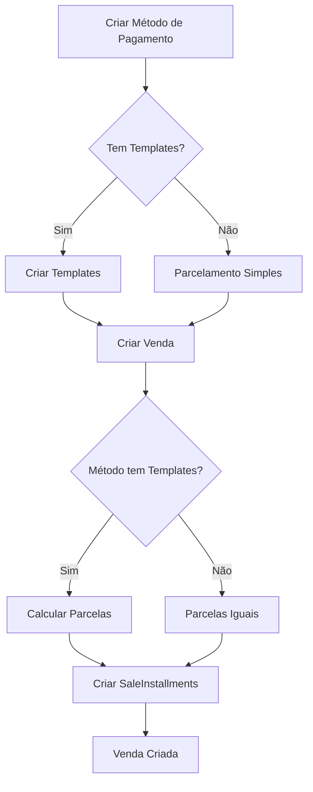

# 💳 Parcelamento Personalizado - Módulo de Vendas

## 📋 Visão Geral

Sistema de **parcelamento customizável** que permite criar métodos de pagamento com parcelas personalizadas, cada uma com data de vencimento e valor específicos.

**Use Cases:**
- Boleto 7/21 (1ª parcela em 7 dias, 2ª em 21 dias)
- Boleto 10/20/30 (3 parcelas em dias diferentes)
- Entrada + Parcelas (ex: 30% entrada, resto parcelado)
- Parcelas com valores fixos
- Qualquer combinação personalizada

---

## 🗄️ Estrutura do Banco

### Models Adicionados

#### PaymentInstallmentTemplate
```prisma
model PaymentInstallmentTemplate {
  id                String  @id @default(uuid())
  paymentMethodId   String
  installmentNumber Int     // 1, 2, 3...
  daysToPayment     Int     // Dias após a venda
  percentageOfTotal Float   // % do total (ex: 50 para 50%)
  fixedAmount       Float?  // Ou valor fixo
  
  paymentMethod PaymentMethod @relation(...)
}
```

#### SaleInstallment
```prisma
model SaleInstallment {
  id                String    @id @default(uuid())
  saleId            String
  installmentNumber Int
  amount            Float     // Valor da parcela
  dueDate           DateTime  // Data de vencimento
  paidDate          DateTime? // Data do pagamento
  status            String    @default("PENDING")
  
  sale Sale @relation(...)
}
```

**Status das Parcelas:**
- `PENDING` - Aguardando pagamento
- `PAID` - Paga
- `OVERDUE` - Atrasada
- `CANCELED` - Cancelada

---

## 🔧 Funcionalidades

### 1. Criar Método com Templates

**Exemplo: Boleto 7/21**
```http
POST /sales/payment-methods
{
  "name": "Boleto 7/21",
  "code": "BOLETO_7_21",
  "type": "BANK_SLIP",
  "allowInstallments": true,
  "maxInstallments": 2,
  "installmentTemplates": [
    {
      "installmentNumber": 1,
      "daysToPayment": 7,
      "percentageOfTotal": 50
    },
    {
      "installmentNumber": 2,
      "daysToPayment": 21,
      "percentageOfTotal": 50
    }
  ]
}
```

**Resultado:**
- 1ª parcela: 50% do valor total, vence em 7 dias
- 2ª parcela: 50% do valor total, vence em 21 dias

### 2. Usar Template em Vendas

Quando uma venda é criada com um método que possui templates, as parcelas são **calculadas automaticamente**:

```http
POST /sales
{
  "customerId": "uuid",
  "paymentMethodId": "id-boleto-7-21",
  "items": [
    {
      "productId": "uuid",
      "quantity": 2,
      "unitPrice": 1000.00
    }
  ]
}
```

**Total da venda:** R$ 2.000,00

**Parcelas criadas automaticamente:**
- Parcela 1: R$ 1.000,00 (vence em 7 dias)
- Parcela 2: R$ 1.000,00 (vence em 21 dias)

### 3. Parcelas com Valores Fixos

```json
{
  "name": "Parcelas Fixas",
  "installmentTemplates": [
    {
      "installmentNumber": 1,
      "daysToPayment": 15,
      "fixedAmount": 500.00
    },
    {
      "installmentNumber": 2,
      "daysToPayment": 45,
      "fixedAmount": 800.00
    }
  ]
}
```

**Comportamento:**
- Parcela 1: **SEMPRE** R$ 500,00 (independente do total)
- Parcela 2: **SEMPRE** R$ 800,00 (independente do total)
- Total: R$ 1.300,00 fixo

---

## 📡 Endpoints da API

### Gerenciar Templates

| Método | Endpoint | Descrição |
|--------|----------|-----------|
| GET | `/sales/payment-methods/:id/installment-templates` | Listar templates |
| POST | `/sales/payment-methods/:id/installment-templates` | Adicionar template |
| PUT | `/sales/payment-methods/:id/installment-templates` | Substituir todos |
| PATCH | `/sales/payment-methods/:id/installment-templates/:number` | Atualizar um |
| DELETE | `/sales/payment-methods/:id/installment-templates/:number` | Excluir um |

### Exemplos

#### Listar Templates
```http
GET /sales/payment-methods/{id}/installment-templates

Response:
[
  {
    "id": "uuid",
    "installmentNumber": 1,
    "daysToPayment": 7,
    "percentageOfTotal": 50,
    "fixedAmount": null
  },
  {
    "id": "uuid",
    "installmentNumber": 2,
    "daysToPayment": 21,
    "percentageOfTotal": 50,
    "fixedAmount": null
  }
]
```

#### Adicionar Template
```http
POST /sales/payment-methods/{id}/installment-templates
{
  "installmentNumber": 3,
  "daysToPayment": 30,
  "percentageOfTotal": 20
}
```

#### Substituir Todos os Templates
```http
PUT /sales/payment-methods/{id}/installment-templates
{
  "templates": [
    {
      "installmentNumber": 1,
      "daysToPayment": 10,
      "percentageOfTotal": 33.33
    },
    {
      "installmentNumber": 2,
      "daysToPayment": 20,
      "percentageOfTotal": 33.33
    },
    {
      "installmentNumber": 3,
      "daysToPayment": 30,
      "percentageOfTotal": 33.34
    }
  ]
}
```

---

## ✅ Validações

### Regras de Negócio

1. **Soma de Porcentagens**
   - Se usar `percentageOfTotal`, a soma deve ser **exatamente 100%**
   - Validado na criação/atualização

2. **Números Únicos**
   - `installmentNumber` não pode ser duplicado
   - Cada parcela tem um número único

3. **Escolha: Porcentagem OU Valor Fixo**
   - Use `percentageOfTotal` para calcular baseado no total
   - Use `fixedAmount` para valor fixo
   - Pode misturar os dois tipos no mesmo método

4. **Dias para Pagamento**
   - `daysToPayment = 0`: Vencimento no dia da venda (entrada)
   - `daysToPayment > 0`: Dias após a data da venda

### Validações de API

```typescript
// ✅ Válido
{
  "installmentTemplates": [
    { "installmentNumber": 1, "daysToPayment": 7, "percentageOfTotal": 50 },
    { "installmentNumber": 2, "daysToPayment": 21, "percentageOfTotal": 50 }
  ]
}

// ❌ Inválido: soma != 100%
{
  "installmentTemplates": [
    { "installmentNumber": 1, "daysToPayment": 7, "percentageOfTotal": 40 },
    { "installmentNumber": 2, "daysToPayment": 21, "percentageOfTotal": 50 }
  ]
}

// ❌ Inválido: números duplicados
{
  "installmentTemplates": [
    { "installmentNumber": 1, "daysToPayment": 7, "percentageOfTotal": 50 },
    { "installmentNumber": 1, "daysToPayment": 21, "percentageOfTotal": 50 }
  ]
}
```

---

## 💡 Casos de Uso

### Caso 1: Boleto 7/21 (Mais Comum)
```json
{
  "name": "Boleto 7/21",
  "code": "BOLETO_7_21",
  "type": "BANK_SLIP",
  "installmentTemplates": [
    { "installmentNumber": 1, "daysToPayment": 7, "percentageOfTotal": 50 },
    { "installmentNumber": 2, "daysToPayment": 21, "percentageOfTotal": 50 }
  ]
}
```

**Venda de R$ 10.000:**
- Parcela 1: R$ 5.000 vence em 7 dias
- Parcela 2: R$ 5.000 vence em 21 dias

### Caso 2: Entrada + 2 Parcelas
```json
{
  "name": "30% Entrada + 2x",
  "installmentTemplates": [
    { "installmentNumber": 1, "daysToPayment": 0, "percentageOfTotal": 30 },
    { "installmentNumber": 2, "daysToPayment": 30, "percentageOfTotal": 35 },
    { "installmentNumber": 3, "daysToPayment": 60, "percentageOfTotal": 35 }
  ]
}
```

**Venda de R$ 5.000:**
- Parcela 1: R$ 1.500 vence hoje (entrada)
- Parcela 2: R$ 1.750 vence em 30 dias
- Parcela 3: R$ 1.750 vence em 60 dias

### Caso 3: Parcelas Progressivas
```json
{
  "name": "Progressivo (20/30/50)",
  "installmentTemplates": [
    { "installmentNumber": 1, "daysToPayment": 10, "percentageOfTotal": 20 },
    { "installmentNumber": 2, "daysToPayment": 20, "percentageOfTotal": 30 },
    { "installmentNumber": 3, "daysToPayment": 30, "percentageOfTotal": 50 }
  ]
}
```

**Venda de R$ 3.000:**
- Parcela 1: R$ 600 vence em 10 dias
- Parcela 2: R$ 900 vence em 20 dias
- Parcela 3: R$ 1.500 vence em 30 dias

### Caso 4: Valores Fixos
```json
{
  "name": "2 Parcelas Fixas",
  "installmentTemplates": [
    { "installmentNumber": 1, "daysToPayment": 15, "fixedAmount": 1000 },
    { "installmentNumber": 2, "daysToPayment": 30, "fixedAmount": 1000 }
  ]
}
```

**Qualquer venda:**
- Parcela 1: R$ 1.000 vence em 15 dias
- Parcela 2: R$ 1.000 vence em 30 dias
- Total fixo: R$ 2.000

---

## 🔄 Fluxo de Uso



---

## 🧮 Cálculo de Parcelas

### Com Porcentagem
```typescript
const totalAmount = 2000; // Total da venda

// Template: 50% em 7 dias, 50% em 21 dias
const parcela1 = totalAmount * 0.50; // R$ 1.000
const parcela2 = totalAmount * 0.50; // R$ 1.000

// Datas de vencimento
const dataVenda = new Date(); // Ex: 10/11/2024
const vencimento1 = addDays(dataVenda, 7);  // 17/11/2024
const vencimento2 = addDays(dataVenda, 21); // 01/12/2024
```

### Com Valor Fixo
```typescript
// Template: R$ 500 em 15 dias, R$ 800 em 45 dias
const parcela1 = 500; // Fixo
const parcela2 = 800; // Fixo
const totalAmount = 1300; // Total fixo

// Datas de vencimento
const vencimento1 = addDays(dataVenda, 15);
const vencimento2 = addDays(dataVenda, 45);
```

---

## 📊 Response da Venda com Parcelas

```json
{
  "id": "uuid",
  "code": "VDA-000001",
  "customerId": "uuid",
  "totalAmount": 2000.00,
  "paymentMethod": {
    "id": "uuid",
    "name": "Boleto 7/21",
    "type": "BANK_SLIP",
    "installmentTemplates": [
      {
        "installmentNumber": 1,
        "daysToPayment": 7,
        "percentageOfTotal": 50
      },
      {
        "installmentNumber": 2,
        "daysToPayment": 21,
        "percentageOfTotal": 50
      }
    ]
  },
  "installmentDetails": [
    {
      "id": "uuid",
      "installmentNumber": 1,
      "amount": 1000.00,
      "dueDate": "2024-11-17T00:00:00.000Z",
      "status": "PENDING",
      "paidDate": null
    },
    {
      "id": "uuid",
      "installmentNumber": 2,
      "amount": 1000.00,
      "dueDate": "2024-12-01T00:00:00.000Z",
      "status": "PENDING",
      "paidDate": null
    }
  ]
}
```

---

## 🎯 Benefícios

### Para o Negócio
✅ Flexibilidade total no parcelamento
✅ Atende diferentes modelos de negócio
✅ Facilita gestão de fluxo de caixa
✅ Personalização por tipo de cliente

### Para o Desenvolvimento
✅ Configuração via API (sem código)
✅ Templates reutilizáveis
✅ Cálculo automático
✅ Validações embutidas

### Para o Usuário
✅ Criação fácil de novos métodos
✅ Visualização clara das parcelas
✅ Controle de vencimentos
✅ Acompanhamento de pagamentos

---

## 📝 Migrations

**Migration Aplicada:** `20251110192628_add_custom_installments_support`

**Alterações:**
- ✅ Tabela `payment_installment_templates` criada
- ✅ Tabela `sale_installments` criada
- ✅ Relacionamentos configurados
- ✅ Índices otimizados

---

## ✨ Conclusão

O sistema de **parcelamento personalizado** oferece máxima flexibilidade para criar qualquer tipo de forma de pagamento parcelado, desde o tradicional Boleto 7/21 até configurações complexas com valores fixos e porcentagens mistas.

**Status:** ✅ Implementado e pronto para uso!

**Arquivos de Teste:** `custom-installments-tests.http`
