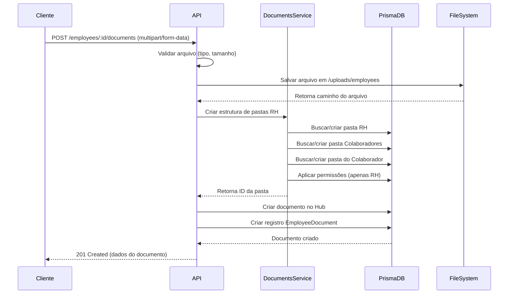

# Upload de Documentos de Colaboradores

Documentação completa para gerenciar documentos de colaboradores com integração ao Hub de Documentos e controle de permissões de RH.

## 📋 Índice

- [Visão Geral](#visão-geral)
- [Estrutura de Pastas](#estrutura-de-pastas)
- [Controle de Acesso](#controle-de-acesso)
- [Tipos de Documentos](#tipos-de-documentos)
- [Endpoints](#endpoints)
  - [Listar Documentos](#1-listar-documentos)
  - [Upload de Documento](#2-upload-de-documento)
  - [Ver Detalhes](#3-ver-detalhes-do-documento)
  - [Atualizar Documento](#4-atualizar-documento)
  - [Download](#5-download-do-documento)
  - [Verificar Documento](#6-verificar-documento)
  - [Excluir Documento](#7-excluir-documento)
- [Exemplos de Uso](#exemplos-de-uso)
- [Limitações e Validações](#limitações-e-validações)

---

## 🎯 Visão Geral

O sistema de upload de documentos de colaboradores foi projetado para:

✅ **Armazenar arquivos no servidor** (pasta `uploads/employees`)  
✅ **Integrar com o Hub de Documentos** da empresa  
✅ **Aplicar permissões de RH** automaticamente  
✅ **Organizar por hierarquia** de pastas (RH → Documentos de Colaboradores → Nome do Colaborador)  
✅ **Rastrear auditoria** (quem fez upload, quando, etc.)  

---

## 📁 Estrutura de Pastas

Os documentos são organizados automaticamente no Hub de Documentos seguindo esta estrutura:

```
Hub de Documentos
└── RH (🔒 Apenas RH)
    └── Documentos de Colaboradores (🔒 Apenas RH)
        ├── João Silva (🔒 Apenas RH)
        │   ├── CNH - João Silva.pdf
        │   ├── RG - João Silva.jpg
        │   └── Contrato de Trabalho.pdf
        ├── Maria Santos (🔒 Apenas RH)
        │   ├── CPF - Maria Santos.pdf
        │   └── CTPS - Maria Santos.pdf
        └── ...
```

### Criação Automática

- ✅ As pastas são criadas automaticamente no primeiro upload
- ✅ Se a pasta já existe, ela é reutilizada
- ✅ Cada colaborador tem sua própria subpasta com seu nome

---

## 🔐 Controle de Acesso

### Permissões Aplicadas Automaticamente

Apenas usuários com **roles que possuem permissões de RH** podem:

- ✅ Ver as pastas de documentos de colaboradores
- ✅ Fazer upload de documentos
- ✅ Baixar/visualizar documentos
- ✅ Atualizar informações dos documentos

### Como Funciona

1. **Sistema busca roles** que têm pelo menos uma destas permissões:
   - `employees.read`
   - `employees.update`
   - `employees.create`

2. **Aplica restrição** em todas as pastas:
   ```json
   {
     "isPublic": false,
     "allowedRoleIds": ["role_id_rh_1", "role_id_rh_2"]
   }
   ```

3. **Usuários sem permissão de RH** não conseguem:
   - ❌ Ver as pastas no Hub de Documentos
   - ❌ Acessar os documentos
   - ❌ Fazer upload

---

## 📄 Tipos de Documentos

O sistema suporta 14 tipos de documentos:

| Tipo | Código | Descrição |
|------|--------|-----------|
| RG | `RG` | Registro Geral (Carteira de Identidade) |
| CPF | `CPF` | Cadastro de Pessoa Física |
| CNH | `CNH` | Carteira Nacional de Habilitação |
| CTPS | `CTPS` | Carteira de Trabalho e Previdência Social |
| Título de Eleitor | `TITULO_ELEITOR` | Título de Eleitor |
| Certificado de Reservista | `CERTIFICADO_RESERVISTA` | Certificado Militar |
| Comprovante de Residência | `COMPROVANTE_RESIDENCIA` | Comprovante de Endereço |
| Diploma | `DIPLOMA` | Diploma Universitário |
| Certificado | `CERTIFICADO` | Certificados Diversos |
| Contrato | `CONTRATO` | Contrato de Trabalho |
| Exame Admissional | `EXAME_ADMISSIONAL` | Exame Médico Admissional |
| ASO | `ASO` | Atestado de Saúde Ocupacional |
| Atestado | `ATESTADO` | Atestados Médicos |
| Outros | `OUTROS` | Outros Documentos |

---

## 🚀 Endpoints

### 1. Listar Documentos

Lista todos os documentos de um colaborador com filtros opcionais.

**Endpoint:** `GET /employees/:id/documents`

**Autenticação:** Bearer Token

**Permissões:** `employees.read`

**URL Parameters:**
- `id` (string, obrigatório) - ID do colaborador

**Query Parameters:**

| Parâmetro | Tipo | Descrição |
|-----------|------|-----------|
| `documentType` | String | Filtrar por tipo (RG, CPF, CNH, etc.) |
| `verified` | Boolean | Filtrar por status de verificação |
| `active` | Boolean | Filtrar por status ativo/inativo |

**Exemplo Request:**
```http
GET /employees/cm3k1234567890/documents?documentType=CNH&verified=true
Authorization: Bearer seu_token_aqui
```

**Response (200 OK):**
```json
[
  {
    "id": "cm3k9876543210",
    "employeeId": "cm3k1234567890",
    "documentType": "CNH",
    "name": "CNH - João Silva",
    "description": "Carteira de habilitação categoria B",
    "documentNumber": "12345678900",
    "issueDate": "2020-01-15T00:00:00.000Z",
    "expiryDate": "2025-01-15T00:00:00.000Z",
    "fileUrl": "/uploads/employees/file-1699876543210-123456789.pdf",
    "fileName": "cnh_joao_silva.pdf",
    "fileSize": 2458624,
    "mimeType": "application/pdf",
    "verified": true,
    "active": true,
    "notes": "Documento verificado",
    "uploadedBy": {
      "id": "cm3k5555555555",
      "name": "Maria Santos",
      "email": "maria@empresa.com"
    },
    "createdAt": "2024-11-09T10:30:00.000Z",
    "updatedAt": "2024-11-09T10:30:00.000Z"
  }
]
```

---

### 2. Upload de Documento

Faz upload de um novo documento para o colaborador.

**Endpoint:** `POST /employees/:id/documents`

**Endpoint:** `POST /employees/:id/documents`

**Autenticação:** Bearer Token

**Permissões:** `employees.update`

**URL Parameters:**
- `id` (string, obrigatório) - ID do colaborador

**Content-Type:** `multipart/form-data`

**Form Data:**

| Campo | Tipo | Obrigatório | Descrição |
|-------|------|-------------|-----------|
| `file` | File | ✅ Sim | O arquivo a ser enviado |
| `documentType` | String | ✅ Sim | Tipo do documento (enum) |
| `name` | String | ⚪ Não | Nome customizado (usa nome do arquivo se omitido) |
| `description` | String | ⚪ Não | Descrição do documento |
| `documentNumber` | String | ⚪ Não | Número do documento (ex: RG, CPF) |
| `issueDate` | String | ⚪ Não | Data de emissão (YYYY-MM-DD) |
| `expiryDate` | String | ⚪ Não | Data de validade (YYYY-MM-DD) |
| `verified` | Boolean | ⚪ Não | Se já foi verificado (default: false) |
| `notes` | String | ⚪ Não | Observações adicionais |

**Exemplo Request (cURL):**
```bash
curl -X POST \
  'http://api.empresa.com/employees/cm3k1234567890/documents' \
  -H 'Authorization: Bearer seu_token_aqui' \
  -F 'file=@/caminho/para/cnh.pdf' \
  -F 'documentType=CNH' \
  -F 'name=CNH - João Silva' \
  -F 'documentNumber=12345678900' \
  -F 'issueDate=2020-01-15' \
  -F 'expiryDate=2025-01-15'
```

**Response (201 Created):**
```json
{
  "id": "cm3k9876543210",
  "employeeId": "cm3k1234567890",
  "documentType": "CNH",
  "name": "CNH - João Silva",
  "description": null,
  "documentNumber": "12345678900",
  "issueDate": "2020-01-15T00:00:00.000Z",
  "expiryDate": "2025-01-15T00:00:00.000Z",
  "fileUrl": "/uploads/employees/file-1699876543210-123456789.pdf",
  "fileName": "cnh_joao_silva.pdf",
  "fileSize": 2458624,
  "mimeType": "application/pdf",
  "verified": false,
  "active": true,
  "notes": null,
  "uploadedBy": {
    "id": "cm3k5555555555",
    "name": "Maria Santos",
    "email": "maria@empresa.com"
  },
  "employee": {
    "id": "cm3k1234567890",
    "name": "João Silva"
  },
  "hubDocumentId": "cm3k_hub_doc_123",
  "folder": {
    "id": "cm3k_folder_123",
    "path": "RH / Documentos de Colaboradores / João Silva"
  },
  "createdAt": "2024-11-09T10:30:00.000Z",
  "updatedAt": "2024-11-09T10:30:00.000Z"
}
```

---

### 3. Ver Detalhes do Documento

Obtém detalhes completos de um documento específico.

**Endpoint:** `GET /employees/:id/documents/:documentId`

**Autenticação:** Bearer Token

**Permissões:** `employees.read`

**URL Parameters:**
- `id` (string, obrigatório) - ID do colaborador
- `documentId` (string, obrigatório) - ID do documento

**Exemplo Request:**
```http
GET /employees/cm3k1234567890/documents/cm3k9876543210
Authorization: Bearer seu_token_aqui
```

**Response (200 OK):**
```json
{
  "id": "cm3k9876543210",
  "employeeId": "cm3k1234567890",
  "documentType": "CNH",
  "name": "CNH - João Silva",
  "description": "Carteira de habilitação categoria B",
  "documentNumber": "12345678900",
  "issueDate": "2020-01-15T00:00:00.000Z",
  "expiryDate": "2025-01-15T00:00:00.000Z",
  "fileUrl": "/uploads/employees/file-1699876543210-123456789.pdf",
  "fileName": "cnh_joao_silva.pdf",
  "fileSize": 2458624,
  "mimeType": "application/pdf",
  "verified": true,
  "active": true,
  "notes": "Documento verificado pelo RH",
  "uploadedBy": {
    "id": "cm3k5555555555",
    "name": "Maria Santos",
    "email": "maria@empresa.com"
  },
  "createdAt": "2024-11-09T10:30:00.000Z",
  "updatedAt": "2024-11-10T14:20:00.000Z"
}
```

---

### 4. Atualizar Documento

Atualiza as informações de um documento (não atualiza o arquivo em si).

**Endpoint:** `PATCH /employees/:id/documents/:documentId`

**Autenticação:** Bearer Token

**Permissões:** `employees.update`

**URL Parameters:**
- `id` (string, obrigatório) - ID do colaborador
- `documentId` (string, obrigatório) - ID do documento

**Request Body:** (Todos os campos são opcionais)
```json
{
  "name": "CNH - João Silva (Renovada)",
  "description": "CNH categoria B renovada",
  "documentNumber": "12345678900",
  "issueDate": "2024-01-15",
  "expiryDate": "2029-01-15",
  "verified": true,
  "active": true,
  "notes": "Documento renovado e verificado em 10/11/2024"
}
```

**Response (200 OK):**
```json
{
  "id": "cm3k9876543210",
  "employeeId": "cm3k1234567890",
  "documentType": "CNH",
  "name": "CNH - João Silva (Renovada)",
  "description": "CNH categoria B renovada",
  "documentNumber": "12345678900",
  "issueDate": "2024-01-15T00:00:00.000Z",
  "expiryDate": "2029-01-15T00:00:00.000Z",
  "fileUrl": "/uploads/employees/file-1699876543210-123456789.pdf",
  "fileName": "cnh_joao_silva.pdf",
  "fileSize": 2458624,
  "mimeType": "application/pdf",
  "verified": true,
  "active": true,
  "notes": "Documento renovado e verificado em 10/11/2024",
  "uploadedBy": {
    "id": "cm3k5555555555",
    "name": "Maria Santos",
    "email": "maria@empresa.com"
  },
  "createdAt": "2024-11-09T10:30:00.000Z",
  "updatedAt": "2024-11-10T15:45:00.000Z"
}
```

---

### 5. Download do Documento

Faz download do arquivo do documento.

**Endpoint:** `GET /employees/:id/documents/:documentId/download`

**Autenticação:** Bearer Token ⚠️ **OBRIGATÓRIO**

**Permissões:** `employees.read`

**URL Parameters:**
- `id` (string, obrigatório) - ID do colaborador
- `documentId` (string, obrigatório) - ID do documento

**⚠️ IMPORTANTE:** O token de autenticação DEVE ser enviado no header `Authorization`.

**Exemplo Request:**
```http
GET /employees/cm3k1234567890/documents/cm3k9876543210/download
Authorization: Bearer seu_token_aqui
```

**Exemplo com cURL:**
```bash
curl -X GET \
  'http://localhost:4000/employees/2951b482-173c-420c-beb5-3ea4221d2446/documents/06ae27fe-f846-454c-9c63-d24dcfff2a75/download' \
  -H 'Authorization: Bearer SEU_TOKEN_AQUI'
```

**Response (200 OK):**
- **Headers:**
  - `Content-Type`: Tipo MIME do arquivo (ex: `application/pdf`)
  - `Content-Disposition`: `attachment; filename="cnh_joao_silva.pdf"`
- **Body:** Stream binário do arquivo

**Exemplo JavaScript:**
```javascript
const response = await fetch(
  'http://api.empresa.com/employees/cm3k1234567890/documents/cm3k9876543210/download',
  {
    headers: {
      'Authorization': 'Bearer seu_token_aqui'  // ⚠️ Token obrigatório
    }
  }
);

const blob = await response.blob();
const url = window.URL.createObjectURL(blob);
const a = document.createElement('a');
a.href = url;
a.download = 'cnh_joao_silva.pdf';
document.body.appendChild(a);
a.click();
a.remove();
window.URL.revokeObjectURL(url);
```

**Possíveis Erros:**

**401 Unauthorized** - Token não enviado ou inválido
```json
{
  "statusCode": 401,
  "message": "Unauthorized"
}
```
**Solução:** Certifique-se de enviar o header `Authorization: Bearer {seu_token}`

**404 Not Found** - Documento não existe
```json
{
  "statusCode": 404,
  "message": "Documento não encontrado"
}
```

---

### 6. Verificar Documento

Marca um documento como verificado/não verificado (atalho para atualização).

**Endpoint:** `PATCH /employees/:id/documents/:documentId/verify`

**Autenticação:** Bearer Token

**Permissões:** `employees.update`

**URL Parameters:**
- `id` (string, obrigatório) - ID do colaborador
- `documentId` (string, obrigatório) - ID do documento

**Request Body:**
```json
{
  "verified": true,
  "notes": "Documento verificado pelo RH em 10/11/2024. Confere com o original."
}
```

| Campo | Tipo | Obrigatório | Descrição |
|-------|------|-------------|-----------|
| `verified` | Boolean | ✅ Sim | Status de verificação (true/false) |
| `notes` | String | ⚪ Não | Observações sobre a verificação |

**Exemplo Request:**
```http
PATCH /employees/cm3k1234567890/documents/cm3k9876543210/verify
Authorization: Bearer seu_token_aqui
Content-Type: application/json

{
  "verified": true,
  "notes": "Documento verificado e aprovado"
}
```

**Exemplo com cURL:**
```bash
curl -X PATCH \
  'http://localhost:4000/employees/2951b482-173c-420c-beb5-3ea4221d2446/documents/06ae27fe-f846-454c-9c63-d24dcfff2a75/verify' \
  -H 'Authorization: Bearer SEU_TOKEN_AQUI' \
  -H 'Content-Type: application/json' \
  -d '{
    "verified": true,
    "notes": "Documento verificado pelo RH"
  }'
```

**Response (200 OK):**
```json
{
  "id": "cm3k9876543210",
  "employeeId": "cm3k1234567890",
  "documentType": "CNH",
  "name": "CNH - João Silva",
  "verified": true,
  "notes": "Documento verificado e aprovado",
  "uploadedBy": {
    "id": "cm3k5555555555",
    "name": "Maria Santos",
    "email": "maria@empresa.com"
  },
  "updatedAt": "2024-11-10T15:45:00.000Z"
}
```

---

### 7. Excluir Documento

Exclui permanentemente um documento (arquivo e registro no banco).

**Endpoint:** `DELETE /employees/:id/documents/:documentId`

**Autenticação:** Bearer Token

**Permissões:** `employees.update`

**URL Parameters:**
- `id` (string, obrigatório) - ID do colaborador
- `documentId` (string, obrigatório) - ID do documento

**Exemplo Request:**
```http
DELETE /employees/cm3k1234567890/documents/cm3k9876543210
Authorization: Bearer seu_token_aqui
```

**Response (200 OK):**
```json
{
  "message": "Documento removido com sucesso"
}
```

**⚠️ Atenção:** Esta operação é irreversível! O arquivo será deletado do servidor e o registro do banco será removido.

---
| `description` | String | ⚪ Não | Descrição do documento |
| `documentNumber` | String | ⚪ Não | Número do documento (ex: RG, CPF) |
| `issueDate` | String | ⚪ Não | Data de emissão (ISO 8601: YYYY-MM-DD) |
| `expiryDate` | String | ⚪ Não | Data de validade (ISO 8601: YYYY-MM-DD) |
| `verified` | Boolean | ⚪ Não | Se já foi verificado (default: false) |
| `notes` | String | ⚪ Não | Observações adicionais |

#### Response (201 Created)

```json
{
  "id": "cm3k9876543210",
  "employeeId": "cm3k1234567890",
  "documentType": "CNH",
  "name": "CNH - João Silva",
  "description": "Carteira de habilitação categoria B",
  "documentNumber": "12345678900",
  "issueDate": "2020-01-15T00:00:00.000Z",
  "expiryDate": "2025-01-15T00:00:00.000Z",
  "fileUrl": "/uploads/employees/file-1699876543210-123456789.pdf",
  "fileName": "cnh_joao_silva.pdf",
  "fileSize": 2458624,
  "mimeType": "application/pdf",
  "verified": false,
  "active": true,
  "notes": "Aguardando verificação",
  "uploadedBy": {
    "id": "cm3k5555555555",
    "name": "Maria Santos",
    "email": "maria@empresa.com"
  },
  "employee": {
    "id": "cm3k1234567890",
    "name": "João Silva"
  },
  "hubDocumentId": "cm3k_hub_doc_123",
  "folder": {
    "id": "cm3k_folder_123",
    "path": "RH / Documentos de Colaboradores / João Silva"
  },
  "createdAt": "2024-11-09T10:30:00.000Z",
  "updatedAt": "2024-11-09T10:30:00.000Z"
}
```

#### Erros Possíveis

**400 Bad Request** - Arquivo inválido ou dados incorretos
```json
{
  "statusCode": 400,
  "message": "Nenhum arquivo foi enviado"
}
```

```json
{
  "statusCode": 400,
  "message": "Tipo de arquivo não permitido. Apenas imagens, PDFs e documentos Word são aceitos."
}
```

**404 Not Found** - Colaborador não existe
```json
{
  "statusCode": 404,
  "message": "Colaborador não encontrado"
}
```

**413 Payload Too Large** - Arquivo muito grande
```json
{
  "statusCode": 413,
  "message": "File too large"
}
```

---

## 💡 Exemplos de Uso

### Exemplo 1: Fluxo Completo de Gerenciamento de Documentos

```javascript
// 1. Listar documentos existentes do colaborador
async function listarDocumentos(employeeId) {
  const response = await fetch(
    `http://api.empresa.com/employees/${employeeId}/documents`,
    {
      headers: {
        'Authorization': `Bearer ${token}`
      }
    }
  );
  const documents = await response.json();
  console.log('Documentos:', documents);
  return documents;
}

// 2. Fazer upload de novo documento
async function uploadDocumento(employeeId, file) {
  const formData = new FormData();
  formData.append('file', file);
  formData.append('documentType', 'CNH');
  formData.append('name', 'CNH - João Silva');
  formData.append('documentNumber', '12345678900');
  formData.append('issueDate', '2020-01-15');
  formData.append('expiryDate', '2025-01-15');

  const response = await fetch(
    `http://api.empresa.com/employees/${employeeId}/documents`,
    {
      method: 'POST',
      headers: {
        'Authorization': `Bearer ${token}`
      },
      body: formData
    }
  );
  
  const document = await response.json();
  console.log('Upload concluído:', document);
  return document;
}

// 3. Ver detalhes de um documento
async function verDocumento(employeeId, documentId) {
  const response = await fetch(
    `http://api.empresa.com/employees/${employeeId}/documents/${documentId}`,
    {
      headers: {
        'Authorization': `Bearer ${token}`
      }
    }
  );
  const document = await response.json();
  console.log('Detalhes:', document);
  return document;
}

// 4. Atualizar informações do documento
async function atualizarDocumento(employeeId, documentId) {
  const response = await fetch(
    `http://api.empresa.com/employees/${employeeId}/documents/${documentId}`,
    {
      method: 'PATCH',
      headers: {
        'Authorization': `Bearer ${token}`,
        'Content-Type': 'application/json'
      },
      body: JSON.stringify({
        verified: true,
        notes: 'Documento verificado pelo RH em 10/11/2024'
      })
    }
  );
  const updated = await response.json();
  console.log('Atualizado:', updated);
  return updated;
}

// 5. Fazer download do documento
async function downloadDocumento(employeeId, documentId, fileName) {
  const response = await fetch(
    `http://api.empresa.com/employees/${employeeId}/documents/${documentId}/download`,
    {
      headers: {
        'Authorization': `Bearer ${token}`
      }
    }
  );
  
  const blob = await response.blob();
  const url = window.URL.createObjectURL(blob);
  const a = document.createElement('a');
  a.href = url;
  a.download = fileName;
  document.body.appendChild(a);
  a.click();
  a.remove();
  window.URL.revokeObjectURL(url);
}

// 6. Excluir documento
async function excluirDocumento(employeeId, documentId) {
  const response = await fetch(
    `http://api.empresa.com/employees/${employeeId}/documents/${documentId}`,
    {
      method: 'DELETE',
      headers: {
        'Authorization': `Bearer ${token}`
      }
    }
  );
  const result = await response.json();
  console.log(result.message);
  return result;
}

// Exemplo de uso completo
async function gerenciarDocumentos() {
  const employeeId = 'cm3k1234567890';
  
  // Listar documentos
  await listarDocumentos(employeeId);
  
  // Upload
  const fileInput = document.querySelector('#fileInput');
  const doc = await uploadDocumento(employeeId, fileInput.files[0]);
  
  // Ver detalhes
  await verDocumento(employeeId, doc.id);
  
  // Atualizar
  await atualizarDocumento(employeeId, doc.id);
  
  // Download
  await downloadDocumento(employeeId, doc.id, doc.fileName);
  
  // Excluir (se necessário)
  // await excluirDocumento(employeeId, doc.id);
}
```

### Exemplo 2: Componente React Completo

```jsx
import React, { useState, useEffect } from 'react';
import axios from 'axios';

function EmployeeDocuments({ employeeId, token }) {
  const [documents, setDocuments] = useState([]);
  const [loading, setLoading] = useState(false);
  const [filter, setFilter] = useState({ verified: null, documentType: '' });

  // Carregar documentos
  const loadDocuments = async () => {
    setLoading(true);
    try {
      const params = new URLSearchParams();
      if (filter.verified !== null) params.append('verified', filter.verified);
      if (filter.documentType) params.append('documentType', filter.documentType);

      const response = await axios.get(
        `http://api.empresa.com/employees/${employeeId}/documents?${params}`,
        {
          headers: { 'Authorization': `Bearer ${token}` }
        }
      );
      setDocuments(response.data);
    } catch (error) {
      console.error('Erro ao carregar documentos:', error);
    } finally {
      setLoading(false);
    }
  };

  useEffect(() => {
    loadDocuments();
  }, [employeeId, filter]);

  // Upload de documento
  const handleUpload = async (e) => {
    e.preventDefault();
    const formData = new FormData(e.target);

    try {
      await axios.post(
        `http://api.empresa.com/employees/${employeeId}/documents`,
        formData,
        {
          headers: {
            'Authorization': `Bearer ${token}`,
            'Content-Type': 'multipart/form-data'
          }
        }
      );
      alert('Documento enviado com sucesso!');
      loadDocuments();
    } catch (error) {
      alert('Erro ao enviar: ' + error.response?.data?.message);
    }
  };

  // Download de documento
  const handleDownload = async (documentId, fileName) => {
    try {
      const response = await axios.get(
        `http://api.empresa.com/employees/${employeeId}/documents/${documentId}/download`,
        {
          headers: { 'Authorization': `Bearer ${token}` },
          responseType: 'blob'
        }
      );

      const url = window.URL.createObjectURL(new Blob([response.data]));
      const link = document.createElement('a');
      link.href = url;
      link.setAttribute('download', fileName);
      document.body.appendChild(link);
      link.click();
      link.remove();
    } catch (error) {
      alert('Erro ao baixar documento');
    }
  };

  // Excluir documento
  const handleDelete = async (documentId) => {
    if (!confirm('Tem certeza que deseja excluir este documento?')) return;

    try {
      await axios.delete(
        `http://api.empresa.com/employees/${employeeId}/documents/${documentId}`,
        {
          headers: { 'Authorization': `Bearer ${token}` }
        }
      );
      alert('Documento excluído com sucesso!');
      loadDocuments();
    } catch (error) {
      alert('Erro ao excluir documento');
    }
  };

  return (
    <div>
      <h2>Documentos do Colaborador</h2>

      {/* Formulário de Upload */}
      <form onSubmit={handleUpload}>
        <h3>Upload de Documento</h3>
        <input type="file" name="file" required />
        <select name="documentType" required>
          <option value="">Selecione o tipo...</option>
          <option value="RG">RG</option>
          <option value="CPF">CPF</option>
          <option value="CNH">CNH</option>
          <option value="CTPS">CTPS</option>
          <option value="CONTRATO">Contrato</option>
        </select>
        <input type="text" name="name" placeholder="Nome do documento" />
        <input type="text" name="documentNumber" placeholder="Número do documento" />
        <input type="date" name="issueDate" placeholder="Data de emissão" />
        <input type="date" name="expiryDate" placeholder="Data de validade" />
        <button type="submit">Enviar</button>
      </form>

      {/* Filtros */}
      <div>
        <h3>Filtros</h3>
        <select onChange={(e) => setFilter({...filter, documentType: e.target.value})}>
          <option value="">Todos os tipos</option>
          <option value="RG">RG</option>
          <option value="CPF">CPF</option>
          <option value="CNH">CNH</option>
        </select>
        <select onChange={(e) => setFilter({...filter, verified: e.target.value === '' ? null : e.target.value === 'true'})}>
          <option value="">Todos</option>
          <option value="true">Verificados</option>
          <option value="false">Não verificados</option>
        </select>
      </div>

      {/* Lista de Documentos */}
      <div>
        <h3>Documentos ({documents.length})</h3>
        {loading ? (
          <p>Carregando...</p>
        ) : (
          <table>
            <thead>
              <tr>
                <th>Tipo</th>
                <th>Nome</th>
                <th>Número</th>
                <th>Validade</th>
                <th>Verificado</th>
                <th>Ações</th>
              </tr>
            </thead>
            <tbody>
              {documents.map(doc => (
                <tr key={doc.id}>
                  <td>{doc.documentType}</td>
                  <td>{doc.name}</td>
                  <td>{doc.documentNumber || '-'}</td>
                  <td>{doc.expiryDate ? new Date(doc.expiryDate).toLocaleDateString() : '-'}</td>
                  <td>{doc.verified ? '✅' : '❌'}</td>
                  <td>
                    <button onClick={() => handleDownload(doc.id, doc.fileName)}>
                      Download
                    </button>
                    <button onClick={() => handleDelete(doc.id)}>
                      Excluir
                    </button>
                  </td>
                </tr>
              ))}
            </tbody>
          </table>
        )}
      </div>
    </div>
  );
}

export default EmployeeDocuments;
```

### Exemplo 3: Upload com Node.js/Axios

```javascript
const formData = new FormData();

// Adicionar arquivo
const fileInput = document.querySelector('#fileInput');
formData.append('file', fileInput.files[0]);

// Adicionar metadados
formData.append('documentType', 'CNH');
formData.append('name', 'Carteira de Habilitação - João Silva');
formData.append('documentNumber', '12345678900');
formData.append('issueDate', '2020-01-15');
formData.append('expiryDate', '2025-01-15');
formData.append('description', 'CNH categoria B');
formData.append('notes', 'Documento válido até 2025');

// Fazer upload
const response = await fetch('http://api.empresa.com/employees/cm3k1234567890/documents', {
  method: 'POST',
  headers: {
    'Authorization': 'Bearer seu_token_aqui'
  },
  body: formData
});

const result = await response.json();
console.log('Documento enviado:', result);
```

### Exemplo 2: Upload de RG (cURL)

```bash
curl -X POST \
  'http://api.empresa.com/employees/cm3k1234567890/documents' \
  -H 'Authorization: Bearer seu_token_aqui' \
  -F 'file=@/caminho/para/rg_joao_silva.jpg' \
  -F 'documentType=RG' \
  -F 'name=RG - João Silva' \
  -F 'documentNumber=123456789' \
  -F 'issueDate=2015-03-20' \
  -F 'description=Documento de identidade'
```

### Exemplo 3: Upload de Contrato (Node.js/Axios)

```javascript
const axios = require('axios');
const FormData = require('form-data');
const fs = require('fs');

const formData = new FormData();
formData.append('file', fs.createReadStream('./contrato_joao.pdf'));
formData.append('documentType', 'CONTRATO');
formData.append('name', 'Contrato de Trabalho - João Silva');
formData.append('description', 'Contrato de trabalho por tempo indeterminado');
formData.append('issueDate', '2024-01-01');

try {
  const response = await axios.post(
    'http://api.empresa.com/employees/cm3k1234567890/documents',
    formData,
    {
      headers: {
        ...formData.getHeaders(),
        'Authorization': 'Bearer seu_token_aqui'
      }
    }
  );
  
  console.log('Upload concluído:', response.data);
} catch (error) {
  console.error('Erro no upload:', error.response.data);
}
```

### Exemplo 4: Upload com React

```jsx
import React, { useState } from 'react';
import axios from 'axios';

function DocumentUpload({ employeeId, token }) {
  const [file, setFile] = useState(null);
  const [documentType, setDocumentType] = useState('RG');
  const [uploading, setUploading] = useState(false);

  const handleSubmit = async (e) => {
    e.preventDefault();
    
    if (!file) {
      alert('Selecione um arquivo');
      return;
    }

    const formData = new FormData();
    formData.append('file', file);
    formData.append('documentType', documentType);
    formData.append('name', file.name);

    setUploading(true);

    try {
      const response = await axios.post(
        `http://api.empresa.com/employees/${employeeId}/documents`,
        formData,
        {
          headers: {
            'Authorization': `Bearer ${token}`,
            'Content-Type': 'multipart/form-data'
          }
        }
      );

      alert('Documento enviado com sucesso!');
      console.log(response.data);
    } catch (error) {
      alert('Erro ao enviar documento: ' + error.response.data.message);
    } finally {
      setUploading(false);
    }
  };

  return (
    <form onSubmit={handleSubmit}>
      <div>
        <label>Tipo de Documento:</label>
        <select value={documentType} onChange={(e) => setDocumentType(e.target.value)}>
          <option value="RG">RG</option>
          <option value="CPF">CPF</option>
          <option value="CNH">CNH</option>
          <option value="CTPS">CTPS</option>
          <option value="CONTRATO">Contrato</option>
          {/* Adicione outros tipos conforme necessário */}
        </select>
      </div>

      <div>
        <label>Arquivo:</label>
        <input 
          type="file" 
          onChange={(e) => setFile(e.target.files[0])}
          accept=".pdf,.jpg,.jpeg,.png,.doc,.docx"
        />
      </div>

      <button type="submit" disabled={uploading}>
        {uploading ? 'Enviando...' : 'Enviar Documento'}
      </button>
    </form>
  );
}

export default DocumentUpload;
```

### Exemplo 5: Upload Completo com Todos os Campos

```javascript
const uploadCompleteDocument = async (employeeId, fileInput) => {
  const formData = new FormData();
  
  // Arquivo
  formData.append('file', fileInput.files[0]);
  
  // Dados obrigatórios
  formData.append('documentType', 'ASO');
  
  // Dados opcionais (todos preenchidos)
  formData.append('name', 'Atestado de Saúde Ocupacional - João Silva');
  formData.append('description', 'ASO periódico anual - Apto para função');
  formData.append('documentNumber', 'ASO-2024-001');
  formData.append('issueDate', '2024-11-01');
  formData.append('expiryDate', '2025-11-01'); // Válido por 1 ano
  formData.append('verified', 'true'); // Já verificado pelo médico do trabalho
  formData.append('notes', 'Exame realizado na Clínica Ocupacional XYZ. Dr. Carlos Silva CRM 12345. Próximo exame: Novembro/2025');

  try {
    const response = await fetch(`http://api.empresa.com/employees/${employeeId}/documents`, {
      method: 'POST',
      headers: {
        'Authorization': `Bearer ${localStorage.getItem('token')}`
      },
      body: formData
    });

    if (!response.ok) {
      throw new Error('Erro no upload');
    }

    const result = await response.json();
    console.log('✅ Upload completo:', result);
    return result;
  } catch (error) {
    console.error('❌ Erro:', error);
    throw error;
  }
};
```

---

## ⚙️ Limitações e Validações

### Tamanho do Arquivo

**Limite:** 10 MB (10.485.760 bytes)

```javascript
// Validação client-side
const MAX_SIZE = 10 * 1024 * 1024; // 10 MB

if (file.size > MAX_SIZE) {
  alert('Arquivo muito grande! Máximo: 10 MB');
  return;
}
```

### Tipos de Arquivo Permitidos

Apenas os seguintes tipos MIME são aceitos:

| Tipo | MIME Type |
|------|-----------|
| JPEG | `image/jpeg` |
| JPG | `image/jpg` |
| PNG | `image/png` |
| GIF | `image/gif` |
| PDF | `application/pdf` |
| Word (.doc) | `application/msword` |
| Word (.docx) | `application/vnd.openxmlformats-officedocument.wordprocessingml.document` |

```javascript
// Validação client-side
const allowedTypes = [
  'image/jpeg',
  'image/jpg',
  'image/png',
  'image/gif',
  'application/pdf',
  'application/msword',
  'application/vnd.openxmlformats-officedocument.wordprocessingml.document'
];

if (!allowedTypes.includes(file.type)) {
  alert('Tipo de arquivo não permitido!');
  return;
}
```

### Validação de Campos

| Campo | Validação |
|-------|-----------|
| `documentType` | Deve ser um dos 14 tipos válidos (enum) |
| `issueDate` | Formato ISO 8601 (YYYY-MM-DD) |
| `expiryDate` | Formato ISO 8601 (YYYY-MM-DD) |
| `verified` | Boolean (true/false) |

### Armazenamento

- **Pasta:** `./uploads/employees/`
- **Nome do arquivo:** `file-{timestamp}-{random}.{extensão}`
- **Exemplo:** `file-1699876543210-987654321.pdf`

---

## 🔍 Como Visualizar os Documentos

### 1. Via Hub de Documentos

Os documentos aparecem automaticamente no Hub de Documentos para usuários com permissões de RH:

```
GET /documents/folders?parentId={id_da_pasta_RH}
```

### 2. Via API de Colaboradores

Liste todos os documentos de um colaborador:

```
GET /employees/{employeeId}/documents
```

### 3. Buscar Documento Específico

```
GET /employees/{employeeId}/documents/{documentId}
```

---

## 🎯 Fluxo Completo



---

## 📝 Notas Importantes

1. **Backup de Arquivos**
   - Os arquivos são salvos em `./uploads/employees/`
   - Faça backup regular desta pasta
   - Considere usar cloud storage (S3, Azure Blob, etc.) em produção

2. **Segurança**
   - ✅ Arquivos são validados (tipo e tamanho)
   - ✅ Apenas usuários autenticados podem fazer upload
   - ✅ Apenas usuários com permissões de RH podem acessar
   - ✅ Nome do arquivo é gerado pelo servidor (evita conflitos)

3. **Auditoria**
   - ✅ Sistema registra quem fez upload (`uploadedBy`)
   - ✅ Data de criação e atualização são rastreadas
   - ✅ Todos os documentos têm histórico completo

4. **Performance**
   - Para arquivos grandes, considere implementar upload em chunks
   - Para muitos arquivos, considere implementar upload em lote

5. **Organização**
   - Documentos são automaticamente organizados por colaborador
   - Tags são adicionadas automaticamente (tipo, nome do colaborador)
   - Fácil de buscar e filtrar no Hub de Documentos

---

## 📊 Resumo dos Endpoints

| Método | Endpoint | Descrição | Permissão |
|--------|----------|-----------|-----------|
| GET | `/employees/:id/documents` | Lista documentos do colaborador | `employees.read` |
| POST | `/employees/:id/documents` | Faz upload de documento | `employees.update` |
| GET | `/employees/:id/documents/:documentId` | Ver detalhes do documento | `employees.read` |
| PATCH | `/employees/:id/documents/:documentId` | Atualiza informações | `employees.update` |
| GET | `/employees/:id/documents/:documentId/download` | Download do arquivo (requer token) | `employees.read` |
| PATCH | `/employees/:id/documents/:documentId/verify` | Verifica/aprova documento | `employees.update` |
| DELETE | `/employees/:id/documents/:documentId` | Exclui documento | `employees.update` |

---

## 🆘 Suporte

Para questões ou problemas:

1. Verifique os logs do servidor
2. Confirme que as permissões de RH estão configuradas corretamente
3. Verifique se a pasta `./uploads/employees/` tem permissões de escrita
4. Entre em contato com a equipe de desenvolvimento

---

## 📚 Documentação Relacionada

- [API de Colaboradores](./EMPLOYEES_API.md)
- [Sistema de Proventos e Descontos](./EARNINGS_DEDUCTIONS.md)
- [Hub de Documentos](./DOCUMENTS_HUB.md)
- [Controle de Permissões](./PERMISSIONS.md)

---

**Versão:** 2.0.0  
**Última atualização:** 09/11/2024  
**Recursos:** Upload, Download, Listagem, Detalhes, Atualização, Exclusão
