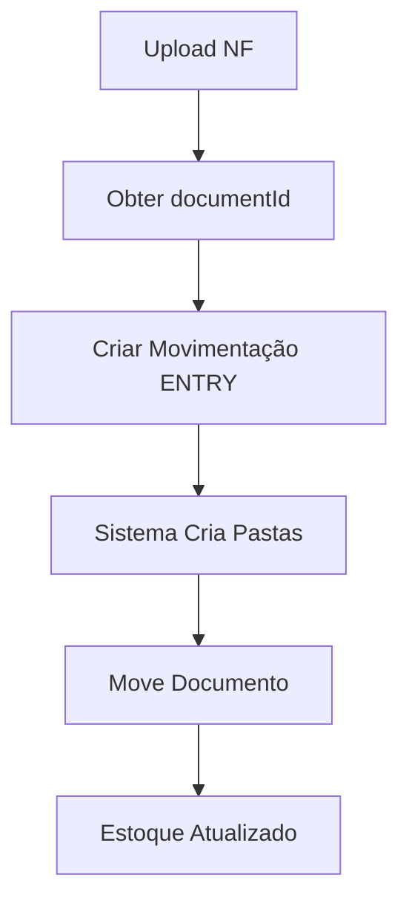
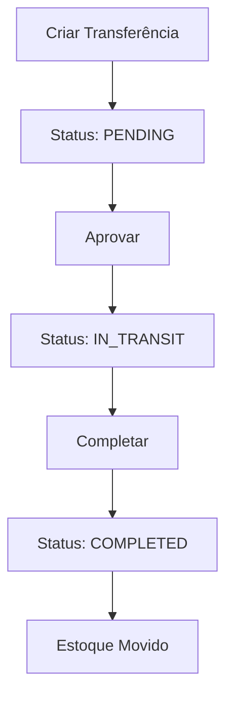

# 📚 Índice Geral da Documentação - Sistema ERP

**Data**: 5 de novembro de 2025  
**Versão**: 1.0

Este é o índice principal de toda a documentação do backend do sistema ERP. Use este guia para navegar entre os diferentes documentos.

---

## 🎯 Início Rápido

| Documento | Descrição | Para Quem |
|-----------|-----------|-----------|
| [README.md](../README.md) | Visão geral do projeto, instalação e configuração | Todos |
| [API_ENDPOINTS_CLIENT.md](./API_ENDPOINTS_CLIENT.md) | Referência completa de endpoints | Frontend Developers |
| [API_CLIENT_EXAMPLES.md](./API_CLIENT_EXAMPLES.md) | Exemplos práticos de integração | Frontend Developers |

---

## 📦 Módulo de Produtos

### Documentação Funcional

| Documento | Descrição | Atualizado |
|-----------|-----------|------------|
| [STOCK_MOVEMENTS_WITH_LOCATIONS_GUIDE.md](./STOCK_MOVEMENTS_WITH_LOCATIONS_GUIDE.md) | Guia completo do sistema de locais de estoque | ✅ 05/11/2025 |
| [STOCK_LOCATION_REQUIRED_UPDATE.md](./STOCK_LOCATION_REQUIRED_UPDATE.md) | Breaking changes: locais obrigatórios | ✅ 04/11/2025 |
| [STOCK_DOCUMENTS_UPLOAD_GUIDE.md](./STOCK_DOCUMENTS_UPLOAD_GUIDE.md) | Upload e organização de documentos | ✅ 05/11/2025 |

**Conteúdo Abordado**:
- ✅ Criação de produtos com múltiplos locais de estoque
- ✅ Movimentações (ENTRY, EXIT, ADJUSTMENT, RETURN, LOSS)
- ✅ Transferências entre locais (workflow: PENDING → IN_TRANSIT → COMPLETED)
- ✅ Vinculação de documentos (notas fiscais, guias)
- ✅ Criação automática de pastas por ano/mês

---

### Documentação Técnica

| Documento | Descrição | Atualizado |
|-----------|-----------|------------|
| [AUTO_FOLDER_CREATION.md](./AUTO_FOLDER_CREATION.md) | Implementação técnica da criação automática de pastas | ✅ 05/11/2025 |

**Conteúdo Abordado**:
- ✅ Arquitetura dos métodos `findOrCreateFolder`, `ensureStockMovementFolder`, `ensureStockTransferFolder`
- ✅ Integração com ProductsService
- ✅ Fluxo de execução e transações
- ✅ Cenários de teste
- ✅ Performance e otimizações

---

## 🌐 API Reference

### Para Desenvolvedores Frontend

| Documento | Descrição | Público-Alvo |
|-----------|-----------|--------------|
| [API_ENDPOINTS_CLIENT.md](./API_ENDPOINTS_CLIENT.md) | Referência completa de todos os endpoints da API | Frontend (iniciante/intermediário) |
| [API_CLIENT_EXAMPLES.md](./API_CLIENT_EXAMPLES.md) | Exemplos práticos em JavaScript, React, Angular, Vue | Frontend (todos os níveis) |

**Endpoints Documentados** (API_ENDPOINTS_CLIENT.md):
- ✅ Produtos (CRUD, listagem, estatísticas)
- ✅ Locais de Estoque (CRUD, estoque por local)
- ✅ Movimentações de Estoque (criar, listar, vincular documentos)
- ✅ Transferências de Estoque (criar, aprovar, completar, cancelar)
- ✅ Documentos (upload, download, listagem de pastas)
- ✅ Categorias, Unidades e Marcas
- ✅ Códigos de erro e tratamento

**Exemplos de Código** (API_CLIENT_EXAMPLES.md):
- ✅ JavaScript/TypeScript com Fetch
- ✅ React Hooks personalizados
- ✅ Axios
- ✅ Angular Services
- ✅ Vue.js Composables
- ✅ React Native
- ✅ cURL para testes

---

## 🗂️ Estrutura de Pastas Automática

### Como Funciona

O sistema **cria automaticamente** a seguinte estrutura ao vincular documentos:

```
📁 Documentos
  └─ 📁 Estoque
      ├─ 📁 Movimentações
      │   └─ 📁 2025
      │       └─ 📁 Novembro
      │           └─ 📄 nota_fiscal_001.pdf
      └─ 📁 Transferências
          └─ 📁 2025
              └─ 📁 Novembro
                  └─ 📄 guia_transferencia_001.pdf
```

**Documentação Relacionada**:
- [STOCK_DOCUMENTS_UPLOAD_GUIDE.md](./STOCK_DOCUMENTS_UPLOAD_GUIDE.md) - Guia do usuário
- [AUTO_FOLDER_CREATION.md](./AUTO_FOLDER_CREATION.md) - Documentação técnica

---

## 🔐 Autenticação e Permissões

### Autenticação

| Documento | Descrição | Atualizado |
|-----------|-----------|------------|
| [AUTHENTICATION_DOCS.md](../AUTHENTICATION_DOCS.md) | Documentação completa de autenticação (login, JWT, permissões) | ✅ 2025 |
| [AUTH_CHANGE_PASSWORD.md](./AUTH_CHANGE_PASSWORD.md) | Endpoint para usuário alterar sua própria senha | ✅ 10/11/2025 |

**Endpoints de Autenticação**:
- ✅ `POST /auth/login` - Login e obtenção do token JWT
- ✅ `GET /auth/profile` - Obter perfil do usuário autenticado
- ✅ `PATCH /auth/change-password` - Alterar a própria senha (requer senha antiga)

### Permissões do Módulo de Produtos

| Permissão | Descrição |
|-----------|-----------|
| `products.view` | Visualizar produtos |
| `products.create` | Criar produtos |
| `products.update` | Atualizar produtos |
| `products.delete` | Deletar produtos |
| `products.manage_stock` | Gerenciar movimentações de estoque |
| `products.manage_locations` | Gerenciar locais de estoque |
| `products.manage_transfers` | Criar e gerenciar transferências |
| `products.approve_transfers` | Aprovar transferências (IN_TRANSIT) |

**Seed Script**: `prisma/seeds/products-permissions.seed.ts`

---

## 🗄️ Banco de Dados

### Modelos do Módulo de Produtos

| Modelo | Descrição | Relações |
|--------|-----------|----------|
| `Product` | Produto principal | Category, Brand, Unit, Photos, Variations, StocksByLocation |
| `ProductStockByLocation` | Estoque por local | Product, StockLocation |
| `ProductStockMovement` | Histórico de movimentações | Product, User, StockLocation, Document |
| `StockLocation` | Local de estoque | ProductStocks, Movements, Transfers |
| `StockTransfer` | Transferência entre locais | FromLocation, ToLocation, Items, Document |
| `StockTransferItem` | Item da transferência | Transfer, Product |

### Migrations Aplicadas

| Migration | Data | Descrição |
|-----------|------|-----------|
| `add_sale_price_cash_min_price` | 04/11/2025 | Adicionou `salePriceCash` e `minPrice` |
| `add_stock_locations_and_transfers` | 04/11/2025 | Sistema completo de locais e transferências |
| `add_document_to_stock_movements_and_transfers` | 05/11/2025 | Campo `documentId` em movimentações e transferências |

**Schema Completo**: `prisma/schema.prisma`

---

## 📊 Campos Fiscais

### Produtos

| Campo | Tipo | Descrição |
|-------|------|-----------|
| `cfopEstadual` | String | CFOP para vendas estaduais |
| `cfopInterestadual` | String | CFOP para vendas interestaduais |
| `cfopEntradaEstadual` | String | CFOP para compras estaduais |
| `cfopEntradaInterestadual` | String | CFOP para compras interestaduais |
| `tipoItemSped` | String | Tipo do item para SPED Fiscal |
| `tipoProduto` | String | PRODUTO ou SERVICO |

### ISS (Serviços)

| Campo | Tipo | Descrição |
|-------|------|-----------|
| `codigoServico` | String | Código do serviço municipal |
| `issRate` | Decimal(5,2) | Alíquota ISS |
| `itemListaServico` | String | Item da lista de serviços |

### ICMS/PIS/COFINS

| Campo | Tipo | Descrição |
|-------|------|-----------|
| `icmsCst` | String | CST ICMS |
| `icmsRate` | Decimal(5,2) | Alíquota ICMS |
| `pisCst` | String | CST PIS |
| `pisRate` | Decimal(5,2) | Alíquota PIS |
| `cofinsCst` | String | CST COFINS |
| `cofinsRate` | Decimal(5,2) | Alíquota COFINS |

**Documentação**: [STOCK_MOVEMENTS_WITH_LOCATIONS_GUIDE.md](./STOCK_MOVEMENTS_WITH_LOCATIONS_GUIDE.md) (seção "Campos Fiscais")

---

## 🔄 Fluxos de Trabalho

### 1. Entrada de Estoque com Nota Fiscal



**Documentação**: [API_ENDPOINTS_CLIENT.md](./API_ENDPOINTS_CLIENT.md) - Seção "Movimentações de Estoque"

---

### 2. Transferência entre Locais



**Documentação**: [STOCK_MOVEMENTS_WITH_LOCATIONS_GUIDE.md](./STOCK_MOVEMENTS_WITH_LOCATIONS_GUIDE.md) - Seção "Transferências"

---

## 🎨 Exemplos Práticos

### Frontend (React)

#### Hook Personalizado
```typescript
const { products, loading } = useProducts({ page: 1 });
```

#### Componente de Formulário
```typescript
<StockEntryForm productId={id} onSuccess={refetch} />
```

**Documentação Completa**: [API_CLIENT_EXAMPLES.md](./API_CLIENT_EXAMPLES.md)

---

### Backend (NestJS)

#### Service
```typescript
await this.productsService.addStockMovement(productId, {
  type: 'ENTRY',
  quantity: 50,
  locationId: 'loc-1',
  documentId: 'doc-1'
}, companyId, userId);
```

#### Controller
```typescript
@Post(':id/stock-movement')
@RequirePermissions('products.manage_stock')
async addStockMovement(...)
```

**Código Fonte**: `src/products/products.service.ts`, `src/products/products.controller.ts`

---

## 🧪 Testes

### Cenários de Teste Importantes

| Cenário | Documentação |
|---------|--------------|
| Criação de produto com múltiplos locais | [STOCK_LOCATION_REQUIRED_UPDATE.md](./STOCK_LOCATION_REQUIRED_UPDATE.md) |
| Movimentação sem estoque suficiente | [API_ENDPOINTS_CLIENT.md](./API_ENDPOINTS_CLIENT.md) - Códigos de Erro |
| Transferência com aprovação | [STOCK_MOVEMENTS_WITH_LOCATIONS_GUIDE.md](./STOCK_MOVEMENTS_WITH_LOCATIONS_GUIDE.md) |
| Upload de documento e organização automática | [AUTO_FOLDER_CREATION.md](./AUTO_FOLDER_CREATION.md) - Seção "Testes" |

### Scripts de Teste

```bash
# Testar endpoints com cURL
curl -X GET "http://localhost:3000/api/products/stats" \
  -H "Authorization: Bearer TOKEN"
```

**Exemplos cURL**: [API_CLIENT_EXAMPLES.md](./API_CLIENT_EXAMPLES.md) - Seção "cURL"

---

## 🚀 Deploy e Produção

### Checklist

- [ ] Variáveis de ambiente configuradas
- [ ] Migrations aplicadas (`npx prisma migrate deploy`)
- [ ] Seed de permissões executado
- [ ] CORS configurado corretamente
- [ ] JWT secrets seguros
- [ ] Storage de arquivos configurado (S3, local, etc)

### Variáveis de Ambiente Necessárias

```env
DATABASE_URL="postgresql://..."
JWT_SECRET="..."
JWT_EXPIRES_IN="7d"
UPLOAD_DIR="/path/to/uploads"
```

---

## 📞 Suporte

### Dúvidas Frequentes

**P: Como funciona a criação automática de pastas?**  
R: Veja [AUTO_FOLDER_CREATION.md](./AUTO_FOLDER_CREATION.md)

**P: Como integrar com React?**  
R: Veja [API_CLIENT_EXAMPLES.md](./API_CLIENT_EXAMPLES.md) - Seção "React Hooks"

**P: Quais endpoints estão disponíveis?**  
R: Veja [API_ENDPOINTS_CLIENT.md](./API_ENDPOINTS_CLIENT.md)

**P: Como funcionam as transferências?**  
R: Veja [STOCK_MOVEMENTS_WITH_LOCATIONS_GUIDE.md](./STOCK_MOVEMENTS_WITH_LOCATIONS_GUIDE.md) - Seção "Transferências"

---

## 📝 Changelog

### Versão 1.0 (05/11/2025)

**Adicionado**:
- ✅ Sistema completo de locais de estoque
- ✅ Movimentações vinculadas a locais (obrigatório)
- ✅ Transferências com workflow de aprovação
- ✅ Criação automática de pastas por ano/mês
- ✅ Vinculação de documentos a movimentações e transferências
- ✅ Campos fiscais brasileiros (CFOP, SPED, ISS)
- ✅ Documentação completa para clientes (API)
- ✅ Exemplos práticos em múltiplas tecnologias

**Documentação Criada**:
- 📄 API_ENDPOINTS_CLIENT.md (referência completa)
- 📄 API_CLIENT_EXAMPLES.md (exemplos práticos)
- 📄 AUTO_FOLDER_CREATION.md (documentação técnica)
- 📄 STOCK_DOCUMENTS_UPLOAD_GUIDE.md (guia de upload)
- 📄 STOCK_MOVEMENTS_WITH_LOCATIONS_GUIDE.md (guia completo)
- 📄 STOCK_LOCATION_REQUIRED_UPDATE.md (breaking changes)

---

## 🗺️ Roadmap

### Próximas Melhorias

#### Curto Prazo
- [ ] Testes unitários e E2E
- [ ] Validação de estoque em tempo real (WebSockets)
- [ ] Relatórios de estoque em PDF
- [ ] Dashboard de métricas

#### Médio Prazo
- [ ] Integração com contabilidade
- [ ] OCR de notas fiscais
- [ ] Inventário com código de barras
- [ ] Multi-empresa (SaaS)

#### Longo Prazo
- [ ] BI e análise preditiva
- [ ] Integração com ERPs externos
- [ ] API pública com rate limiting
- [ ] Marketplace de integrações

---

## 📚 Documentos por Categoria

### 🎯 Para Desenvolvedores Frontend

1. **Início Rápido**
   - [API_ENDPOINTS_CLIENT.md](./API_ENDPOINTS_CLIENT.md)
   - [API_CLIENT_EXAMPLES.md](./API_CLIENT_EXAMPLES.md)

2. **Funcionalidades Específicas**
   - [STOCK_DOCUMENTS_UPLOAD_GUIDE.md](./STOCK_DOCUMENTS_UPLOAD_GUIDE.md)
   - [STOCK_MOVEMENTS_WITH_LOCATIONS_GUIDE.md](./STOCK_MOVEMENTS_WITH_LOCATIONS_GUIDE.md)

### 🔧 Para Desenvolvedores Backend

1. **Arquitetura e Implementação**
   - [AUTO_FOLDER_CREATION.md](./AUTO_FOLDER_CREATION.md)
   - `src/products/products.service.ts`
   - `src/documents/documents.service.ts`

2. **Migrações e Schema**
   - `prisma/schema.prisma`
   - `prisma/migrations/`

### 📊 Para Product Owners / Gestores

1. **Funcionalidades e Casos de Uso**
   - [STOCK_MOVEMENTS_WITH_LOCATIONS_GUIDE.md](./STOCK_MOVEMENTS_WITH_LOCATIONS_GUIDE.md)
   - [STOCK_LOCATION_REQUIRED_UPDATE.md](./STOCK_LOCATION_REQUIRED_UPDATE.md)

2. **Exemplos Práticos**
   - [STOCK_DOCUMENTS_UPLOAD_GUIDE.md](./STOCK_DOCUMENTS_UPLOAD_GUIDE.md)

---

## � Módulo de Vendas

### Documentação Completa

| Documento | Descrição | Atualizado |
|-----------|-----------|------------|
| [API_SALES_CREATE.md](./API_SALES_CREATE.md) | Guia completo de criação de vendas e orçamentos | ✅ 10/11/2025 |
| [API_SALES_MANAGEMENT.md](./API_SALES_MANAGEMENT.md) | Gerenciamento: listar, editar, confirmar, cancelar | ✅ 10/11/2025 |
| [API_SALES_EXPORT.md](./API_SALES_EXPORT.md) | Exportação em PDF e Excel com filtros | ✅ 10/11/2025 |
| [SALES_INTEGRATION_FINANCE_STOCK.md](./SALES_INTEGRATION_FINANCE_STOCK.md) | Integração automática com financeiro e estoque | ✅ 10/11/2025 |

**Conteúdo Abordado**:
- ✅ Criação de orçamentos e vendas
- ✅ Seleção de local de estoque por produto
- ✅ Confirmação de venda (baixa estoque + cria contas a receber)
- ✅ Cancelamento de venda (devolve estoque + cancela financeiro)
- ✅ Análise de crédito (aprovar/rejeitar)
- ✅ Fluxo de status (QUOTE → CONFIRMED → DELIVERED → COMPLETED)
- ✅ Exportação em PDF com logo da empresa
- ✅ Exportação em Excel com 3 planilhas e filtros avançados
- ✅ Integração automática com módulo financeiro

### Endpoints Principais

| Endpoint | Método | Descrição |
|----------|--------|-----------|
| `/sales` | POST | Criar orçamento/venda |
| `/sales` | GET | Listar com filtros e paginação |
| `/sales/:id` | GET | Consultar detalhes |
| `/sales/:id` | PUT | Editar venda |
| `/sales/:id/confirm` | POST | Confirmar venda |
| `/sales/:id/cancel` | POST | Cancelar venda |
| `/sales/:id/status` | PATCH | Alterar status |
| `/sales/:id/pdf` | GET | Exportar PDF |
| `/sales/export/excel` | GET | Exportar Excel |

### Status do Ciclo de Vida

```
QUOTE → PENDING_APPROVAL → APPROVED → CONFIRMED → 
IN_PRODUCTION → READY_TO_SHIP → SHIPPED → DELIVERED → COMPLETED
                                                ↓
                                           CANCELED
```

---

## �🔍 Busca Rápida

### Por Funcionalidade

| Funcionalidade | Documento Principal |
|----------------|---------------------|
| Criar produto com estoque em múltiplos locais | [STOCK_LOCATION_REQUIRED_UPDATE.md](./STOCK_LOCATION_REQUIRED_UPDATE.md) |
| Movimentação de estoque (entrada/saída) | [API_ENDPOINTS_CLIENT.md](./API_ENDPOINTS_CLIENT.md) |
| Upload de nota fiscal | [STOCK_DOCUMENTS_UPLOAD_GUIDE.md](./STOCK_DOCUMENTS_UPLOAD_GUIDE.md) |
| Transferência entre locais | [STOCK_MOVEMENTS_WITH_LOCATIONS_GUIDE.md](./STOCK_MOVEMENTS_WITH_LOCATIONS_GUIDE.md) |
| Criar orçamento ou venda | [API_SALES_CREATE.md](./API_SALES_CREATE.md) |
| Confirmar venda (baixa estoque) | [API_SALES_MANAGEMENT.md](./API_SALES_MANAGEMENT.md) |
| Exportar PDF/Excel | [API_SALES_EXPORT.md](./API_SALES_EXPORT.md) |
| Integração financeiro + estoque | [SALES_INTEGRATION_FINANCE_STOCK.md](./SALES_INTEGRATION_FINANCE_STOCK.md) |
| Integração React/Angular/Vue | [API_CLIENT_EXAMPLES.md](./API_CLIENT_EXAMPLES.md) |
| Criação automática de pastas (técnico) | [AUTO_FOLDER_CREATION.md](./AUTO_FOLDER_CREATION.md) |

### Por Tecnologia

| Tecnologia | Exemplos |
|------------|----------|
| React | [API_CLIENT_EXAMPLES.md](./API_CLIENT_EXAMPLES.md) - Seção "React Hooks" |
| Angular | [API_CLIENT_EXAMPLES.md](./API_CLIENT_EXAMPLES.md) - Seção "Angular" |
| Vue.js | [API_CLIENT_EXAMPLES.md](./API_CLIENT_EXAMPLES.md) - Seção "Vue.js" |
| React Native | [API_CLIENT_EXAMPLES.md](./API_CLIENT_EXAMPLES.md) - Seção "React Native" |
| cURL | [API_CLIENT_EXAMPLES.md](./API_CLIENT_EXAMPLES.md) - Seção "cURL" |

---

**Última Atualização**: 5 de novembro de 2025  
**Versão do Sistema**: 1.0  
**Documentação por**: Equipe de Desenvolvimento
