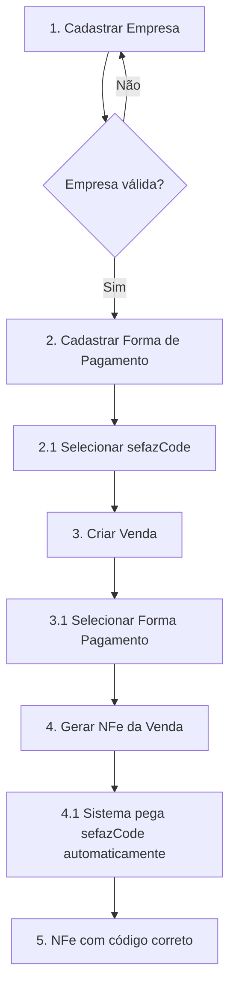

# 📚 Índice de Documentação NFe - Frontend

Documentação completa para implementação do módulo de NFe no frontend.

---

## 🏢 Cadastro de Empresa

### 1. **NFE_COMPANY_FIELDS_FRONTEND.md** ⭐ PRINCIPAL
Documento completo e detalhado sobre todos os campos necessários para emissão de NFe.

**Conteúdo:**
- ✅ Lista completa de campos obrigatórios (19 campos)
- ✅ Validações para cada campo
- ✅ Exemplos de código React/TypeScript
- ✅ Integração com APIs externas (ViaCEP, IBGE)
- ✅ Upload de certificado digital
- ✅ Responsável técnico (obrigatório desde 2024)
- ✅ Checklist de validação pré-emissão
- ✅ Componentes de formulário prontos
- ✅ Indicadores visuais de status

**Quando usar:** Ao implementar o formulário de cadastro/edição de empresa com foco em NFe.

---

### 2. **NFE_COMPANY_FIELDS_QUICK_REF.md** 🚀 REFERÊNCIA RÁPIDA
Guia rápido com resumo dos campos essenciais.

**Conteúdo:**
- ✅ Tabela com 19 campos obrigatórios
- ✅ Validação rápida em TypeScript
- ✅ Erros mais comuns
- ✅ APIs auxiliares
- ✅ Payload de exemplo
- ✅ Badge de status

**Quando usar:** Para consulta rápida durante desenvolvimento ou revisão de código.

---

### 3. **NFE_COMPANY_VALIDATORS.md** 🛠️ VALIDADORES
Biblioteca completa de funções de validação em TypeScript.

**Conteúdo:**
- ✅ Validador de CNPJ (com dígitos verificadores)
- ✅ Validador de CEP
- ✅ Validador de Inscrição Estadual por UF
- ✅ Validador de código IBGE
- ✅ Busca de endereço por CEP (ViaCEP)
- ✅ Busca de código IBGE (API IBGE)
- ✅ Validação completa da empresa
- ✅ Hooks React customizados
- ✅ Exemplos de testes unitários

**Quando usar:** Para copiar e colar funções de validação prontas no projeto.

---

## 💳 Formas de Pagamento SEFAZ

### 4. **NFE_PAYMENT_CODES_FRONTEND.md** ⭐ PRINCIPAL
Guia completo sobre códigos de pagamento SEFAZ para NFe.

**Conteúdo:**
- ✅ Tabela com todos os 25 códigos oficiais SEFAZ
- ✅ Campo `sefazCode` obrigatório
- ✅ Exemplos de mapeamento (PIX, Cartão, Boleto)
- ✅ Fluxo completo (Cadastro → Venda → NFe)
- ✅ Componente React de seleção
- ✅ Validações importantes
- ✅ Dicas de UX (agrupamento, tooltips)
- ✅ Checklist de implementação

**Quando usar:** Ao implementar o formulário de formas de pagamento.

---

### 5. **NFE_PAYMENT_CODES_SUMMARY.md** 📋 RESUMO TÉCNICO
Resumo técnico das alterações no backend e integração.

**Conteúdo:**
- ✅ Alterações no schema Prisma
- ✅ DTOs atualizados
- ✅ Utilitário de conversão de códigos
- ✅ Integração automática com NFe
- ✅ Fluxo completo com exemplo
- ✅ Benefícios da implementação

**Quando usar:** Para entender a arquitetura e integração backend-frontend.

---

### 6. **NFE_PAYMENT_MIGRATION_GUIDE.md** 🔄 MIGRAÇÃO
Guia de migração de dados existentes.

**Conteúdo:**
- ✅ Script SQL de migração automática
- ✅ Migração via Prisma (TypeScript)
- ✅ Testes após migração
- ✅ Resolução de problemas comuns
- ✅ Checklist de validação

**Quando usar:** Ao atualizar sistema com formas de pagamento já cadastradas.

---

## 📋 Matriz de Decisão: Qual documento usar?

| Tarefa | Documento Recomendado |
|--------|----------------------|
| Criar formulário de empresa para NFe | **NFE_COMPANY_FIELDS_FRONTEND.md** |
| Validar campos da empresa | **NFE_COMPANY_VALIDATORS.md** |
| Consulta rápida de campos | **NFE_COMPANY_FIELDS_QUICK_REF.md** |
| Criar formulário de forma de pagamento | **NFE_PAYMENT_CODES_FRONTEND.md** |
| Entender integração de pagamentos | **NFE_PAYMENT_CODES_SUMMARY.md** |
| Migrar dados de pagamento existentes | **NFE_PAYMENT_MIGRATION_GUIDE.md** |

---

## 🎯 Ordem de Implementação Sugerida

### Fase 1: Cadastro de Empresa ✅
1. Ler **NFE_COMPANY_FIELDS_FRONTEND.md**
2. Copiar validadores de **NFE_COMPANY_VALIDATORS.md**
3. Implementar formulário de empresa
4. Testar com **NFE_COMPANY_FIELDS_QUICK_REF.md**

### Fase 2: Formas de Pagamento ✅
1. Ler **NFE_PAYMENT_CODES_FRONTEND.md**
2. Implementar campo `sefazCode` no formulário
3. Testar integração com NFe

### Fase 3: Migração (se necessário) ✅
1. Ler **NFE_PAYMENT_MIGRATION_GUIDE.md**
2. Executar script de migração
3. Validar dados migrados

---

## 🔗 Fluxo Completo de Emissão de NFe

---

## ✅ Checklist Geral de Implementação

### Empresa
- [ ] Formulário com 19 campos obrigatórios
- [ ] Validação de CNPJ
- [ ] Validação de Inscrição Estadual por UF
- [ ] Busca de endereço por CEP
- [ ] Busca de código IBGE
- [ ] Upload de certificado A1
- [ ] Campos de Responsável Técnico
- [ ] Indicador visual de status NFe
- [ ] Validação pré-emissão

### Formas de Pagamento
- [ ] Campo `sefazCode` obrigatório
- [ ] Select com 25 códigos SEFAZ
- [ ] Validação obrigatória
- [ ] Tooltip explicativo
- [ ] Agrupamento por categoria
- [ ] Exibir código na listagem

### Integração
- [ ] Venda captura forma de pagamento
- [ ] NFe usa código SEFAZ automaticamente
- [ ] Validação de dados antes de gerar NFe
- [ ] Mensagens de erro claras

---

## 📞 Suporte e Recursos

### APIs Externas
- **ViaCEP**: https://viacep.com.br/
- **IBGE Localidades**: https://servicodados.ibge.gov.br/api/docs/localidades
- **IBGE CNAE**: https://servicodados.ibge.gov.br/api/docs/cnae

### Referências SEFAZ
- **Portal NFe**: https://www.nfe.fazenda.gov.br/
- **Manual de Orientação**: https://www.nfe.fazenda.gov.br/portal/exibirArquivo.aspx?conteudo=eRn/kZdQ+Ks=
- **Tabela de Pagamentos (4.3.3.4.6.1)**: Incluída nos documentos

### Consultas
- **Código IBGE Município**: https://www.ibge.gov.br/explica/codigos-dos-municipios.php
- **CNAE**: https://concla.ibge.gov.br/busca-online-cnae.html
- **Validação de IE**: https://www.sintegra.gov.br/

---

## 🎓 Dicas de Implementação

### Performance
- Cache de códigos IBGE (não mudam frequentemente)
- Debounce em buscas de CEP e CNAE
- Lazy loading de select com muitas opções

### UX
- Autocomplete de cidade/UF
- Busca inteligente de código SEFAZ (por nome)
- Sugestões contextuais (ex: "PIX Dinâmico" ao digitar "PIX")
- Tooltips explicativos em todos os campos

### Segurança
- Nunca exibir senha do certificado em plain text
- Criptografar senha antes de enviar ao backend
- Validar tamanho do arquivo de certificado
- Alertar sobre certificado próximo do vencimento

### Acessibilidade
- Labels descritivos
- Mensagens de erro associadas aos campos
- Navegação por teclado (Tab)
- ARIA labels para leitores de tela

---

## 📊 Resumo dos Documentos

| Documento | Páginas | Foco | Nível |
|-----------|---------|------|-------|
| NFE_COMPANY_FIELDS_FRONTEND.md | ~800 linhas | Completo | Intermediário |
| NFE_COMPANY_FIELDS_QUICK_REF.md | ~200 linhas | Resumo | Iniciante |
| NFE_COMPANY_VALIDATORS.md | ~600 linhas | Código | Avançado |
| NFE_PAYMENT_CODES_FRONTEND.md | ~400 linhas | Completo | Intermediário |
| NFE_PAYMENT_CODES_SUMMARY.md | ~500 linhas | Técnico | Avançado |
| NFE_PAYMENT_MIGRATION_GUIDE.md | ~300 linhas | Migração | Intermediário |

---

## 🚀 Começar Agora

1. **Leia primeiro**: `NFE_COMPANY_FIELDS_FRONTEND.md`
2. **Implemente validações**: Use `NFE_COMPANY_VALIDATORS.md`
3. **Adicione pagamentos**: Siga `NFE_PAYMENT_CODES_FRONTEND.md`
4. **Teste tudo**: Use checklists de cada documento

---

**📚 Toda a documentação está pronta para implementação no frontend!**

> **Última atualização:** 16 de novembro de 2025  
> **Versão:** 1.0  
> **Backend:** Totalmente implementado e testado ✅
