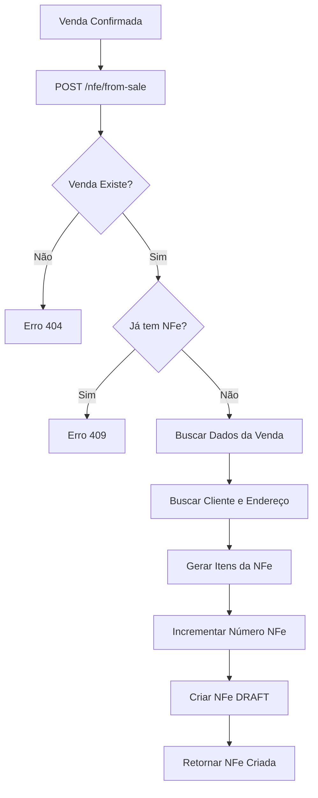
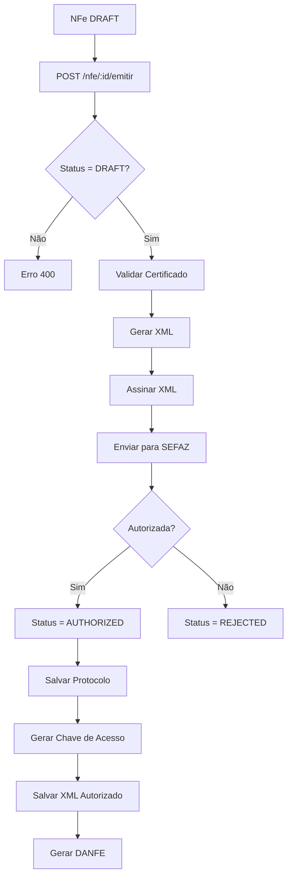
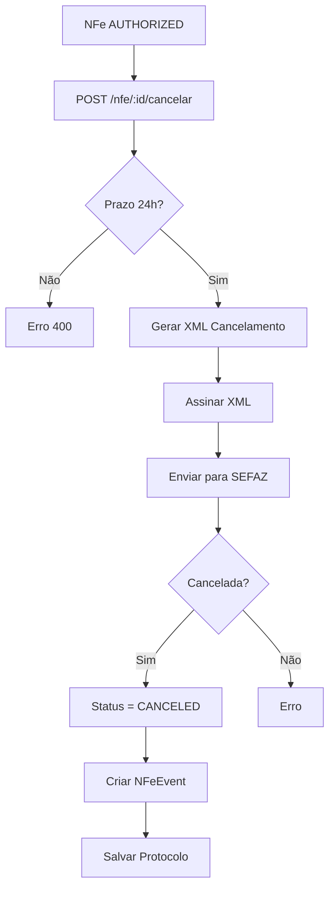

# 📋 Módulo de NFe (Nota Fiscal Eletrônica)

## 📑 Índice

- [Visão Geral](#visão-geral)
- [Status de Implementação](#status-de-implementação)
- [Estrutura do Banco de Dados](#estrutura-do-banco-de-dados)
- [Endpoints da API](#endpoints-da-api)
- [DTOs e Validações](#dtos-e-validações)
- [Fluxo de Uso](#fluxo-de-uso)
- [Próximos Passos](#próximos-passos)
- [Exemplos de Uso](#exemplos-de-uso)

---

## 🎯 Visão Geral

O **Módulo de NFe** é responsável pelo gerenciamento completo de Notas Fiscais Eletrônicas (NFe) no sistema ERP. Ele oferece funcionalidades para:

- ✅ Criar NFes manualmente ou a partir de vendas
- ✅ Armazenar dados completos da NFe e seus itens
- ✅ Gerenciar status das NFes (rascunho, autorizada, cancelada, etc.)
- ✅ Vincular NFes às vendas do sistema
- ✅ Consultar e filtrar NFes
- ⏳ Emitir NFe na SEFAZ (placeholder)
- ⏳ Gerar DANFE em PDF (placeholder)
- ⏳ Cancelar NFe na SEFAZ (placeholder)
- ⏳ Consultar status na SEFAZ (placeholder)

---

## ✅ Status de Implementação

### Funcionalidades Implementadas (100%)

#### 1. **Database Schema (Prisma)** ✅
- ✅ Model `NFe` - Cabeçalho da nota fiscal
- ✅ Model `NFeItem` - Itens da nota fiscal
- ✅ Model `NFeEvent` - Eventos (cancelamento, carta de correção)
- ✅ Relacionamentos com Company, Sale, Customer, Product
- ✅ Enums: `NFeStatus`, `NFeEventType`
- ✅ Índices para performance

#### 2. **DTOs (Data Transfer Objects)** ✅
- ✅ `CreateNFeDto` - Criar NFe manual
- ✅ `CreateNFeItemDto` - Itens da NFe
- ✅ `CreateNFeFromSaleDto` - Criar NFe a partir de venda
- ✅ `UpdateNFeDto` - Atualizar NFe (apenas rascunho)
- ✅ `CancelNFeDto` - Cancelar NFe
- ✅ Validações com class-validator

#### 3. **Service (Lógica de Negócio)** ✅
- ✅ `create()` - Criar NFe manual
- ✅ `createFromSale()` - Criar NFe a partir de venda
- ✅ `findAll()` - Listar com filtros e paginação
- ✅ `findOne()` - Buscar NFe específica
- ✅ `update()` - Atualizar NFe (apenas rascunho)
- ✅ `remove()` - Deletar NFe (apenas rascunho)
- ✅ `getStats()` - Estatísticas de NFes
- ⏳ `emitir()` - Placeholder para emissão
- ⏳ `cancel()` - Placeholder para cancelamento
- ⏳ `generateDanfe()` - Placeholder para DANFE
- ⏳ `downloadXml()` - Placeholder para XML
- ⏳ `consultarStatus()` - Placeholder para consulta

#### 4. **Controller (API REST)** ✅
- ✅ `POST /nfe` - Criar NFe
- ✅ `POST /nfe/from-sale` - Criar NFe de venda
- ✅ `GET /nfe` - Listar NFes
- ✅ `GET /nfe/stats` - Estatísticas
- ✅ `GET /nfe/:id` - Buscar NFe
- ✅ `PUT /nfe/:id` - Atualizar NFe
- ✅ `DELETE /nfe/:id` - Deletar NFe
- ✅ `POST /nfe/:id/emitir` - Emitir NFe (placeholder)
- ✅ `POST /nfe/:id/cancelar` - Cancelar NFe (placeholder)
- ✅ `GET /nfe/:id/danfe` - Gerar DANFE (placeholder)
- ✅ `GET /nfe/:id/xml` - Download XML (placeholder)
- ✅ `GET /nfe/:id/status` - Consultar status (placeholder)

#### 5. **Module Configuration** ✅
- ✅ NFeModule criado e registrado
- ✅ Imports: PrismaModule
- ✅ Controllers: NFeController
- ✅ Providers: NFeService
- ✅ Exports: NFeService

#### 6. **Testes** ✅
- ✅ Arquivo `nfe-tests.http` com todos os endpoints

### Funcionalidades Pendentes (A Implementar)

#### 1. **Integração com SEFAZ** ⏳
- ⏳ Validação de certificado digital A1
- ⏳ Geração de XML da NFe conforme leiaute 4.0
- ⏳ Assinatura digital do XML
- ⏳ Envio para webservice da SEFAZ
- ⏳ Processamento de retorno (autorização/rejeição)
- ⏳ Geração de chave de acesso (44 dígitos)
- ⏳ Numeração automática e controle de série

#### 2. **Geração de DANFE** ⏳
- ⏳ Layout conforme especificação da SEFAZ
- ⏳ Código de barras da chave de acesso
- ⏳ QR Code (para NFC-e)
- ⏳ Geração de PDF usando Puppeteer
- ⏳ Armazenamento do PDF

#### 3. **Eventos de NFe** ⏳
- ⏳ Cancelamento via SEFAZ
- ⏳ Carta de Correção Eletrônica (CC-e)
- ⏳ Confirmação de operação (manifestação do destinatário)
- ⏳ Inutilização de numeração

#### 4. **Contingência** ⏳
- ⏳ FS-IA (Formulário de Segurança)
- ⏳ SVC-AN (SEFAZ Virtual de Contingência)
- ⏳ Offline (EPEC)

---

## 🗄️ Estrutura do Banco de Dados

### Tabela: `nfes`

| Campo | Tipo | Descrição |
|-------|------|-----------|
| id | UUID | Identificador único |
| companyId | UUID | Empresa emissora |
| saleId | UUID | Venda vinculada (opcional) |
| numero | Int | Número da NFe |
| serie | String | Série da NFe |
| modelo | String | Modelo (55=NFe, 65=NFC-e) |
| chaveAcesso | String | Chave de 44 dígitos |
| status | Enum | DRAFT, IN_PROCESS, AUTHORIZED, REJECTED, CANCELED, DENIED, CONTINGENCY |
| naturezaOperacao | String | Ex: "Venda de mercadoria" |
| tipoOperacao | Int | 0=Entrada, 1=Saída |
| finalidade | Int | 1=Normal, 2=Complementar, 3=Ajuste, 4=Devolução |
| destinatario* | String | Dados do destinatário (nome, CNPJ/CPF, IE, etc.) |
| dest* | String | Endereço de entrega |
| valor* | Float | Valores (produtos, frete, desconto, tributos, total) |
| transportadora* | String | Dados da transportadora |
| volume* | Float | Dados de volumes |
| informacoes* | String | Informações complementares e fiscais |
| dataEmissao | DateTime | Data de emissão |
| dataSaida | DateTime | Data de saída |
| protocoloAutorizacao | String | Protocolo da SEFAZ |
| dataAutorizacao | DateTime | Data de autorização |
| xml* | String | XMLs (enviado, retorno, autorizado) |
| danfePdfPath | String | Caminho do PDF |
| canceladaEm | DateTime | Data do cancelamento |
| motivoCancelamento | String | Motivo do cancelamento |
| emContingencia | Boolean | Se foi emitida em contingência |
| observacoes | String | Observações internas |

### Tabela: `nfe_items`

| Campo | Tipo | Descrição |
|-------|------|-----------|
| id | UUID | Identificador único |
| nfeId | UUID | NFe relacionada |
| numero | Int | Número do item |
| productId | UUID | Produto vinculado (opcional) |
| codigoProduto | String | Código do produto |
| codigoEAN | String | Código de barras |
| descricao | String | Descrição |
| ncm | String | NCM (8 dígitos) |
| cest | String | CEST (7 dígitos) |
| cfop | String | CFOP (4 dígitos) |
| unidade | String | Unidade (UN, KG, etc.) |
| quantidade | Float | Quantidade |
| valorUnitario | Float | Valor unitário |
| valorTotal | Float | Valor total |
| valorDesconto | Float | Valor de desconto |
| valorFrete | Float | Valor de frete |
| icms* | Float | ICMS (CST, origem, alíquota, base, valor) |
| icmsSt* | Float | ICMS ST |
| ipi* | Float | IPI (CST, alíquota, base, valor) |
| pis* | Float | PIS (CST, alíquota, base, valor) |
| cofins* | Float | COFINS (CST, alíquota, base, valor) |
| informacoesAdicionais | String | Informações adicionais |

### Tabela: `nfe_events`

| Campo | Tipo | Descrição |
|-------|------|-----------|
| id | UUID | Identificador único |
| nfeId | UUID | NFe relacionada |
| tipo | Enum | CANCELAMENTO, CARTA_CORRECAO, etc. |
| sequencia | Int | Número sequencial |
| descricao | String | Descrição do evento |
| justificativa | String | Justificativa (obrigatória para alguns) |
| protocolo | String | Protocolo do evento |
| dataEvento | DateTime | Data do evento |
| xml* | String | XMLs do evento |
| status | String | Status do processamento |

---

## 🔌 Endpoints da API

### 1. Criar NFe Manual

```http
POST /nfe
Authorization: Bearer {token}
x-company-id: {companyId}
Content-Type: application/json
```

**Body:**
```json
{
  "serie": "1",
  "modelo": "55",
  "naturezaOperacao": "Venda de mercadoria",
  "destinatarioNome": "Cliente Teste",
  "destinatarioCnpjCpf": "12345678000190",
  "destLogradouro": "Rua Teste",
  "destNumero": "123",
  "destBairro": "Centro",
  "destCidade": "São Paulo",
  "destEstado": "SP",
  "destCep": "01310-100",
  "valorProdutos": 1000.00,
  "valorTotal": 1000.00,
  "items": [
    {
      "codigoProduto": "PROD001",
      "descricao": "Produto Teste",
      "ncm": "12345678",
      "cfop": "5102",
      "unidade": "UN",
      "quantidade": 10,
      "valorUnitario": 100.00,
      "valorTotal": 1000.00
    }
  ]
}
```

### 2. Criar NFe a partir de Venda

```http
POST /nfe/from-sale
Authorization: Bearer {token}
x-company-id: {companyId}
Content-Type: application/json
```

**Body:**
```json
{
  "saleId": "uuid-da-venda",
  "serie": "1",
  "naturezaOperacao": "Venda de mercadoria",
  "informacoesComplementares": "Observações"
}
```

### 3. Listar NFes

```http
GET /nfe?status=DRAFT&page=1&limit=20
Authorization: Bearer {token}
x-company-id: {companyId}
```

**Query Parameters:**
- `status`: DRAFT, AUTHORIZED, CANCELED, etc.
- `saleId`: Filtrar por venda
- `destinatarioId`: Filtrar por cliente
- `startDate`: Data inicial (YYYY-MM-DD)
- `endDate`: Data final (YYYY-MM-DD)
- `search`: Buscar por número, nome, CNPJ, chave
- `page`: Página (default: 1)
- `limit`: Itens por página (default: 20)

### 4. Buscar NFe Específica

```http
GET /nfe/{id}
Authorization: Bearer {token}
x-company-id: {companyId}
```

### 5. Atualizar NFe (apenas rascunho)

```http
PUT /nfe/{id}
Authorization: Bearer {token}
x-company-id: {companyId}
Content-Type: application/json
```

### 6. Deletar NFe (apenas rascunho)

```http
DELETE /nfe/{id}
Authorization: Bearer {token}
x-company-id: {companyId}
```

### 7. Emitir NFe (PLACEHOLDER)

```http
POST /nfe/{id}/emitir
Authorization: Bearer {token}
x-company-id: {companyId}
```

### 8. Cancelar NFe (PLACEHOLDER)

```http
POST /nfe/{id}/cancelar
Authorization: Bearer {token}
x-company-id: {companyId}
Content-Type: application/json
```

**Body:**
```json
{
  "motivoCancelamento": "Cliente solicitou cancelamento (mínimo 15 caracteres)"
}
```

### 9. Gerar DANFE (PLACEHOLDER)

```http
GET /nfe/{id}/danfe
Authorization: Bearer {token}
x-company-id: {companyId}
```

### 10. Download XML

```http
GET /nfe/{id}/xml
Authorization: Bearer {token}
x-company-id: {companyId}
```

### 11. Estatísticas

```http
GET /nfe/stats
Authorization: Bearer {token}
x-company-id: {companyId}
```

**Response:**
```json
{
  "total": 150,
  "emitidas": 120,
  "canceladas": 5,
  "rascunhos": 25,
  "valorTotalEmitidas": 150000.00
}
```

---

## 📝 DTOs e Validações

### CreateNFeDto

```typescript
{
  saleId?: string;              // Opcional - venda vinculada
  serie: string;                // Obrigatório - série da NFe
  modelo?: string;              // Opcional - default: "55"
  naturezaOperacao: string;     // Obrigatório
  tipoOperacao?: number;        // Opcional - 0=Entrada, 1=Saída
  finalidade?: number;          // Opcional - 1=Normal, 2=Complementar...
  
  // Destinatário (obrigatórios)
  destinatarioNome: string;
  destinatarioCnpjCpf: string;
  destLogradouro: string;
  destNumero: string;
  destBairro: string;
  destCidade: string;
  destEstado: string;
  destCep: string;
  
  // Valores (obrigatórios)
  valorProdutos: number;
  valorTotal: number;
  
  // Itens (obrigatório)
  items: CreateNFeItemDto[];    // Mínimo 1 item
}
```

### CreateNFeFromSaleDto

```typescript
{
  saleId: string;               // Obrigatório
  serie: string;                // Obrigatório
  naturezaOperacao: string;     // Obrigatório
  modelo?: string;
  tipoOperacao?: number;
  finalidade?: number;
  modalidadeFrete?: number;
  informacoesComplementares?: string;
  informacoesFisco?: string;
  observacoes?: string;
}
```

### CancelNFeDto

```typescript
{
  motivoCancelamento: string;   // Obrigatório - 15 a 255 caracteres
}
```

---

## 🔄 Fluxo de Uso

### 1. Criar NFe a partir de uma Venda



### 2. Emitir NFe (Futuro)



### 3. Cancelar NFe (Futuro)



---

## 🚀 Próximos Passos

### Fase 1: Integração com SEFAZ (Alta Prioridade)

1. **Certificado Digital**
   - Validar certificado A1
   - Extrair chaves pública/privada
   - Verificar validade

2. **Geração de XML**
   - Implementar gerador de XML NFe 4.0
   - Validar contra schema XSD
   - Assinar digitalmente

3. **Comunicação com SEFAZ**
   - Implementar cliente SOAP
   - Autorizador nacional
   - Tratamento de erros

4. **Processamento de Retorno**
   - Parsear XML de retorno
   - Atualizar status
   - Salvar protocolo

### Fase 2: DANFE (Alta Prioridade)

1. **Layout**
   - Implementar layout conforme especificação
   - Incluir dados fiscais
   - Dados do emitente e destinatário

2. **Código de Barras**
   - Gerar código de barras da chave
   - QR Code para NFC-e

3. **Geração de PDF**
   - Usar Puppeteer
   - Template HTML/CSS
   - Salvar arquivo

### Fase 3: Eventos e Funcionalidades Avançadas

1. **Carta de Correção**
2. **Manifestação do Destinatário**
3. **Inutilização de Numeração**
4. **Contingência**
5. **NFC-e (Nota Fiscal ao Consumidor)**

### Fase 4: Integrações

1. **Integração com Contabilidade**
2. **Integração com Estoque**
3. **Integração com Financeiro**
4. **Relatórios e Dashboards**

---

## 📚 Exemplos de Uso

### Exemplo 1: Criar NFe Simples

```typescript
const nfe = await nfeService.create(companyId, {
  serie: '1',
  naturezaOperacao: 'Venda de mercadoria',
  destinatarioNome: 'Cliente XYZ',
  destinatarioCnpjCpf: '12345678000190',
  destLogradouro: 'Rua ABC',
  destNumero: '100',
  destBairro: 'Centro',
  destCidade: 'São Paulo',
  destEstado: 'SP',
  destCep: '01310-100',
  valorProdutos: 1000.00,
  valorTotal: 1000.00,
  items: [{
    codigoProduto: 'PROD001',
    descricao: 'Produto X',
    ncm: '12345678',
    cfop: '5102',
    unidade: 'UN',
    quantidade: 1,
    valorUnitario: 1000.00,
    valorTotal: 1000.00,
  }],
});
```

### Exemplo 2: Criar NFe de Venda

```typescript
const nfe = await nfeService.createFromSale(companyId, {
  saleId: 'venda-uuid',
  serie: '1',
  naturezaOperacao: 'Venda de mercadoria',
});
```

### Exemplo 3: Listar NFes Autorizadas

```typescript
const result = await nfeService.findAll(companyId, {
  status: NFeStatus.AUTHORIZED,
  page: 1,
  limit: 20,
});

console.log(`Total: ${result.meta.total}`);
console.log(`NFes:`, result.data);
```

---

## 📋 Checklist de Implementação

### ✅ Completo
- [x] Database schema
- [x] DTOs com validações
- [x] Service com CRUD
- [x] Controller com endpoints
- [x] Module registrado
- [x] Integração com Sales
- [x] Integração com Customers
- [x] Integração com Products
- [x] Testes HTTP
- [x] Documentação

### ⏳ Pendente
- [ ] Integração com SEFAZ
- [ ] Geração de XML
- [ ] Assinatura digital
- [ ] Geração de DANFE
- [ ] Eventos de NFe
- [ ] Contingência
- [ ] NFC-e
- [ ] Testes unitários
- [ ] Testes de integração

---

## 📞 Suporte

Para dúvidas sobre o módulo de NFe:
- Documentação: Este arquivo
- Testes: `nfe-tests.http`
- Schema: `prisma/schema.prisma` (linha 2530+)

---

**Última atualização:** 16/11/2025
**Versão:** 1.0.0
**Status:** Estrutura completa, integrações pendentes
