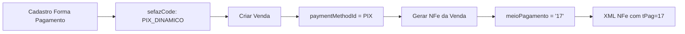

# Resumo: Códigos de Pagamento SEFAZ para NFe

## 🎯 O que foi implementado?

Adaptação do sistema de **Formas de Pagamento** para usar automaticamente os **códigos oficiais da SEFAZ** na emissão de Notas Fiscais Eletrônicas (NFe).

---

## 📝 Alterações Realizadas

### 1. **Schema do Prisma** (`prisma/schema.prisma`)

#### 1.1 Novo campo no modelo `PaymentMethod`:
```prisma
model PaymentMethod {
  // ... campos existentes ...
  
  // Código SEFAZ para NFe (campo obrigatório)
  sefazCode String // Código da tabela SEFAZ (01-22, 90, 99)
}
```

#### 1.2 Novo enum `PaymentCodeSefaz`:
```prisma
enum PaymentCodeSefaz {
  DINHEIRO                              // 01
  CHEQUE                                // 02
  CARTAO_CREDITO                        // 03
  CARTAO_DEBITO                         // 04
  CREDITO_LOJA                          // 05
  VALE_ALIMENTACAO                      // 10
  VALE_REFEICAO                         // 11
  VALE_PRESENTE                         // 12
  VALE_COMBUSTIVEL                      // 13
  DUPLICATA_MERCANTIL                   // 14
  BOLETO_BANCARIO                       // 15
  DEPOSITO_BANCARIO                     // 16
  PIX_DINAMICO                          // 17
  TRANSFERENCIA                         // 18
  PROGRAMA_FIDELIDADE                   // 19
  PIX_ESTATICO                          // 20
  CREDITO_EM_LOJA                       // 21
  PAGAMENTO_ELETRONICO_NAO_INFORMADO    // 22
  SEM_PAGAMENTO                         // 90
  OUTROS                                // 99
}
```

#### 1.3 Migration criada:
```
✅ 20251116201209_add_sefaz_payment_codes
```

---

### 2. **DTO de Forma de Pagamento** (`src/sales/dto/create-payment-method.dto.ts`)

```typescript
// Novo enum exportado
export enum PaymentCodeSefazDto {
  DINHEIRO = 'DINHEIRO',
  CHEQUE = 'CHEQUE',
  CARTAO_CREDITO = 'CARTAO_CREDITO',
  // ... todos os 25 códigos
}

// Novo campo obrigatório
export class CreatePaymentMethodDto {
  @IsEnum(PaymentCodeSefazDto)
  sefazCode: PaymentCodeSefazDto; // ⚠️ Obrigatório
}
```

---

### 3. **DTO de NFe** (`src/nfe/dto/create-nfe.dto.ts`)

```typescript
export class CreateNFeDto {
  // Novos campos de pagamento
  @IsOptional()
  @IsInt()
  indicadorPagamento?: number; // 0=À vista, 1=A prazo

  @IsOptional()
  @IsString()
  meioPagamento?: string; // Código SEFAZ (será preenchido automaticamente)

  @IsOptional()
  @IsNumber()
  valorPagamento?: number;

  @IsOptional()
  @IsNumber()
  valorTroco?: number;
}
```

---

### 4. **Utilitário de Conversão** (`src/nfe/utils/sefaz-codes.util.ts`)

Criado arquivo com:

- **SEFAZ_PAYMENT_CODE_MAP**: Mapeamento enum → código numérico
- **getSefazPaymentCode()**: Função para converter enum em código (ex: `PIX_DINAMICO` → `'17'`)
- **SEFAZ_PAYMENT_DESCRIPTIONS**: Descrições completas em português

```typescript
getSefazPaymentCode(PaymentCodeSefaz.PIX_DINAMICO) // Retorna '17'
getSefazPaymentCode(PaymentCodeSefaz.CARTAO_CREDITO) // Retorna '03'
```

---

### 5. **Serviço NFe** (`src/nfe/services/nfe.service.ts`)

#### Importações:
```typescript
import { PaymentCodeSefaz } from '@prisma/client';
import { getSefazPaymentCode } from '../utils/sefaz-codes.util';
```

#### Método `createFromSale` atualizado:
```typescript
async createFromSale(companyId: string, dto: CreateNFeFromSaleDto) {
  const sale = await this.prisma.sale.findUnique({
    where: { id: dto.saleId },
    include: {
      customer: { /* ... */ },
      items: { /* ... */ },
      paymentMethod: true, // ✅ Incluir forma de pagamento
    },
  });

  // Obter código SEFAZ da forma de pagamento
  let sefazPaymentCode: string | undefined;
  if (sale.paymentMethod?.sefazCode) {
    sefazPaymentCode = getSefazPaymentCode(
      sale.paymentMethod.sefazCode as PaymentCodeSefaz
    );
  }

  const nfeDto: CreateNFeDto = {
    // ... campos existentes ...
    
    // 🆕 Campos de pagamento preenchidos automaticamente
    indicadorPagamento: sale.installments > 1 ? 1 : 0,
    meioPagamento: sefazPaymentCode, // Ex: '17' para PIX
    valorPagamento: sale.totalAmount,
    valorTroco: 0,
  };
}
```

---

### 6. **Documentação Frontend** (`docs/NFE_PAYMENT_CODES_FRONTEND.md`)

Criado guia completo com:
- ✅ Tabela de todos os 25 códigos SEFAZ
- ✅ Exemplos de mapeamento (PIX, Cartão, Boleto, etc.)
- ✅ Fluxo completo (Cadastro → Venda → NFe)
- ✅ Validações importantes
- ✅ Componente React de exemplo
- ✅ Dicas de UX (agrupamento, sugestões inteligentes)
- ✅ Checklist de implementação

---

## 🔄 Fluxo Completo



### Exemplo Prático:

1. **Cadastrar forma de pagamento:**
```json
POST /api/payment-methods
{
  "name": "PIX Dinâmico",
  "code": "PIX_DYNAMIC",
  "type": "PIX",
  "sefazCode": "PIX_DINAMICO" // ⚠️ Obrigatório!
}
```

2. **Criar venda:**
```json
POST /api/sales
{
  "customerId": "abc123",
  "paymentMethodId": "id-pix-dinamico",
  "items": [...]
}
```

3. **Gerar NFe da venda:**
```json
POST /api/nfe/from-sale
{
  "saleId": "venda123",
  "serie": "1",
  "naturezaOperacao": "VENDA"
}
```

4. **Resultado no XML da NFe:**
```xml
<detPag>
  <indPag>0</indPag>    <!-- 0 = À vista -->
  <tPag>17</tPag>       <!-- 17 = PIX Dinâmico (automático!) -->
  <vPag>1500.00</vPag>
</detPag>
```

---

## ✅ Benefícios

### Para o Backend:
- ✅ Validação automática de códigos SEFAZ
- ✅ Conversão automática enum → código numérico
- ✅ Type-safety com TypeScript
- ✅ Código de pagamento preenchido automaticamente na NFe

### Para o Frontend:
- ✅ Lista completa de códigos disponíveis
- ✅ Validação obrigatória do campo
- ✅ Exemplos de implementação React
- ✅ Dicas de UX e agrupamento

### Para o Negócio:
- ✅ Conformidade total com SEFAZ
- ✅ NFes rejeitadas por código errado = zero
- ✅ Menos intervenção manual
- ✅ Auditoria e rastreabilidade

---

## 🚨 Atenção: Breaking Changes

### ⚠️ Formas de pagamento existentes:

As formas de pagamento já cadastradas **não têm** o campo `sefazCode`.

**Opções:**

1. **Script de migração de dados** (recomendado):
```sql
-- Sugestão de mapeamento para dados existentes
UPDATE "payment_methods"
SET "sefazCode" = 'DINHEIRO'
WHERE type = 'CASH';

UPDATE "payment_methods"
SET "sefazCode" = 'CARTAO_CREDITO'
WHERE type = 'CREDIT_CARD';

UPDATE "payment_methods"
SET "sefazCode" = 'CARTAO_DEBITO'
WHERE type = 'DEBIT_CARD';

UPDATE "payment_methods"
SET "sefazCode" = 'PIX_DINAMICO'
WHERE type = 'PIX';

UPDATE "payment_methods"
SET "sefazCode" = 'BOLETO_BANCARIO'
WHERE type = 'BANK_SLIP';

UPDATE "payment_methods"
SET "sefazCode" = 'TRANSFERENCIA'
WHERE type = 'BANK_TRANSFER';

UPDATE "payment_methods"
SET "sefazCode" = 'CHEQUE'
WHERE type = 'CHECK';

UPDATE "payment_methods"
SET "sefazCode" = 'OUTROS'
WHERE type = 'OTHER' OR "sefazCode" IS NULL;
```

2. **Forçar reedição** no frontend (mais simples):
- Adicionar validação que bloqueia edição de venda se `sefazCode` for null
- Usuário precisa editar a forma de pagamento e escolher o código

---

## 📋 Próximos Passos

### Backend:
- ✅ Schema atualizado
- ✅ Migration criada
- ✅ DTOs atualizados
- ✅ Serviço NFe adaptado
- ✅ Utilitário de conversão criado
- ⏳ Script de migração de dados (opcional)

### Frontend:
- ⏳ Adicionar campo `sefazCode` no formulário de formas de pagamento
- ⏳ Criar select com os 25 códigos
- ⏳ Adicionar validação obrigatória
- ⏳ Exibir código SEFAZ na listagem
- ⏳ Tooltip explicativo
- ⏳ Agrupamento visual (opcional)

### Testes:
- ⏳ Criar forma de pagamento com código SEFAZ
- ⏳ Criar venda com essa forma de pagamento
- ⏳ Gerar NFe da venda
- ⏳ Verificar se o código aparece corretamente no XML

---

## 📚 Arquivos Modificados

```
✅ prisma/schema.prisma
✅ prisma/migrations/20251116201209_add_sefaz_payment_codes/migration.sql
✅ src/sales/dto/create-payment-method.dto.ts
✅ src/nfe/dto/create-nfe.dto.ts
✅ src/nfe/utils/sefaz-codes.util.ts (novo)
✅ src/nfe/services/nfe.service.ts
✅ docs/NFE_PAYMENT_CODES_FRONTEND.md (novo)
```

---

## 🔗 Referências

- **Tabela Oficial SEFAZ**: [Manual NFe - Tabela 4.3.3.4.6.1](https://www.nfe.fazenda.gov.br/portal/exibirArquivo.aspx?conteudo=eRn/kZdQ+Ks=)
- **Campo XML**: `<detPag><tPag>` (Meio de Pagamento)
- **Documentação Prisma**: `@prisma/client` enums

---

**🚀 Sistema agora totalmente compatível com os códigos de pagamento da SEFAZ!**
