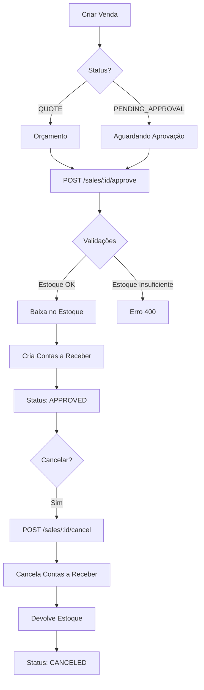

# 🎯 Aprovação de Vendas - Integração Completa

## 📋 Visão Geral

Este documento descreve como implementar a funcionalidade de aprovação de vendas no frontend, incluindo:
- Criação automática de contas a receber
- Movimentação de estoque
- Visualização dos vínculos entre vendas, recebimentos e estoque
- Cancelamento que reverte todas as operações

---

## 🔄 Fluxo de Aprovação de Vendas



---

## 🔌 API Endpoints

### 1. Aprovar Venda

**Endpoint**: `POST /sales/:id/approve`

**Descrição**: Aprova uma venda, criando contas a receber e movimentando o estoque automaticamente.

**Headers**:
```http
Authorization: Bearer {token}
Content-Type: application/json
```

**Parâmetros**:
- `id` (path): UUID da venda

**Body**: Não requer body

**Resposta (200 OK)**:
```json
{
  "id": "sale-uuid",
  "code": "VEN-2024-0001",
  "companyId": "company-uuid",
  "customerId": "customer-uuid",
  "status": "APPROVED",
  "subtotal": 500.00,
  "totalAmount": 550.00,
  "installments": 3,
  "confirmedAt": "2024-11-16T15:30:00Z",
  "customer": {
    "id": "customer-uuid",
    "name": "João Silva",
    "personType": "FISICA",
    "cpf": "123.456.789-00"
  },
  "items": [
    {
      "id": "item-uuid",
      "productId": "product-uuid",
      "productName": "Produto A",
      "quantity": 5,
      "unitPrice": 100.00,
      "total": 500.00,
      "stockLocationId": "location-uuid"
    }
  ],
  "accountsReceivable": [
    {
      "id": "receivable-1-uuid",
      "saleId": "sale-uuid",
      "documentNumber": "VEN-2024-0001-1",
      "description": "Venda #VEN-2024-0001 - Parcela 1/3",
      "originalAmount": 183.33,
      "remainingAmount": 183.33,
      "dueDate": "2024-12-16T00:00:00Z",
      "status": "PENDENTE",
      "installmentNumber": 1,
      "totalInstallments": 3
    },
    {
      "id": "receivable-2-uuid",
      "saleId": "sale-uuid",
      "documentNumber": "VEN-2024-0001-2",
      "description": "Venda #VEN-2024-0001 - Parcela 2/3",
      "originalAmount": 183.33,
      "remainingAmount": 183.33,
      "dueDate": "2025-01-16T00:00:00Z",
      "status": "PENDENTE",
      "installmentNumber": 2,
      "totalInstallments": 3
    },
    {
      "id": "receivable-3-uuid",
      "saleId": "sale-uuid",
      "documentNumber": "VEN-2024-0001-3",
      "description": "Venda #VEN-2024-0001 - Parcela 3/3",
      "originalAmount": 183.34,
      "remainingAmount": 183.34,
      "dueDate": "2025-02-16T00:00:00Z",
      "status": "PENDENTE",
      "installmentNumber": 3,
      "totalInstallments": 3
    }
  ],
  "stockMovements": [
    {
      "id": "movement-uuid",
      "saleId": "sale-uuid",
      "productId": "product-uuid",
      "locationId": "location-uuid",
      "type": "EXIT",
      "quantity": -5,
      "previousStock": 100,
      "newStock": 95,
      "reason": "Venda aprovada",
      "reference": "VEN-2024-0001",
      "createdAt": "2024-11-16T15:30:00Z"
    }
  ],
  "createdAt": "2024-11-16T10:00:00Z",
  "updatedAt": "2024-11-16T15:30:00Z"
}
```

**Erros Possíveis**:

```json
// 400 - Venda já aprovada
{
  "statusCode": 400,
  "message": "Venda já está aprovada"
}

// 400 - Estoque insuficiente
{
  "statusCode": 400,
  "message": "Estoque insuficiente para Produto A no local selecionado. Disponível: 3, Solicitado: 5"
}

// 400 - Sem método de pagamento
{
  "statusCode": 400,
  "message": "Venda deve ter um método de pagamento definido"
}

// 400 - Análise de crédito pendente
{
  "statusCode": 400,
  "message": "Análise de crédito deve ser aprovada primeiro"
}

// 404 - Venda não encontrada
{
  "statusCode": 404,
  "message": "Venda não encontrada"
}
```

---

### 2. Buscar Venda com Vínculos

**Endpoint**: `GET /sales/:id`

**Descrição**: Busca uma venda incluindo contas a receber e movimentações de estoque.

**Query Parameters**:
- `includeReceivables` (opcional): boolean - Incluir contas a receber
- `includeStockMovements` (opcional): boolean - Incluir movimentações

**Exemplo**:
```http
GET /sales/sale-uuid?includeReceivables=true&includeStockMovements=true
Authorization: Bearer {token}
```

---

### 3. Listar Contas a Receber da Venda

**Endpoint**: `GET /financial/accounts-receivable?saleId={saleId}`

**Query Parameters**:
- `companyId` (obrigatório): UUID da empresa
- `saleId` (opcional): UUID da venda para filtrar
- `status` (opcional): Status das contas (PENDENTE, RECEBIDO, VENCIDO, PARCIAL, CANCELADO)
- `customerId` (opcional): UUID do cliente
- `startDate` (opcional): Data inicial (formato ISO)
- `endDate` (opcional): Data final (formato ISO)

**Exemplo**:
```http
GET /financial/accounts-receivable?companyId=company-uuid&saleId=sale-uuid
Authorization: Bearer {token}
```

**Resposta**:
```json
[
  {
    "id": "receivable-uuid",
    "saleId": "sale-uuid",
    "documentNumber": "VEN-2024-0001-1",
    "description": "Venda #VEN-2024-0001 - Parcela 1/3",
    "originalAmount": 183.33,
    "receivedAmount": 0,
    "remainingAmount": 183.33,
    "dueDate": "2024-12-16T00:00:00Z",
    "status": "PENDENTE",
    "installmentNumber": 1,
    "totalInstallments": 3,
    "sale": {
      "id": "sale-uuid",
      "code": "VEN-2024-0001",
      "status": "APPROVED",
      "totalAmount": 550.00,
      "customer": {
        "id": "customer-uuid",
        "name": "João Silva",
        "companyName": null,
        "personType": "FISICA"
      }
    },
    "category": null,
    "centroCusto": null
  },
  {
    "id": "receivable-2-uuid",
    "saleId": "sale-uuid",
    "documentNumber": "VEN-2024-0001-2",
    "description": "Venda #VEN-2024-0001 - Parcela 2/3",
    "originalAmount": 183.33,
    "receivedAmount": 0,
    "remainingAmount": 183.33,
    "dueDate": "2025-01-16T00:00:00Z",
    "status": "PENDENTE",
    "installmentNumber": 2,
    "totalInstallments": 3,
    "sale": {
      "id": "sale-uuid",
      "code": "VEN-2024-0001",
      "status": "APPROVED",
      "totalAmount": 550.00,
      "customer": {
        "id": "customer-uuid",
        "name": "João Silva",
        "companyName": null,
        "personType": "FISICA"
      }
    },
    "category": null,
    "centroCusto": null
  }
]
```

---

### 4. Listar Movimentações de Estoque da Venda

**Endpoint**: `GET /products/stock-movements?saleId={saleId}`

**Query Parameters**:
- `companyId` (obrigatório): UUID da empresa
- `saleId` (opcional): UUID da venda para filtrar
- `productId` (opcional): UUID do produto
- `type` (opcional): Tipo de movimentação (EXIT, RETURN, ENTRY, ADJUSTMENT, TRANSFER)
- `locationId` (opcional): UUID do local de estoque
- `startDate` (opcional): Data inicial (formato ISO)
- `endDate` (opcional): Data final (formato ISO)
- `page` (opcional): Página (padrão: 1)
- `limit` (opcional): Limite por página (padrão: 50)

**Exemplo**:
```http
GET /products/stock-movements?companyId=company-uuid&saleId=sale-uuid
Authorization: Bearer {token}
```

**Resposta**:
```json
{
  "data": [
    {
      "id": "movement-uuid",
      "saleId": "sale-uuid",
      "type": "EXIT",
      "quantity": -5,
      "previousStock": 100,
      "newStock": 95,
      "reason": "Venda aprovada",
      "notes": "Venda #VEN-2024-0001",
      "reference": "VEN-2024-0001",
      "product": {
        "id": "product-uuid",
        "name": "Produto A",
        "sku": "PROD-001",
        "barcode": "7891234567890"
      },
      "location": {
        "id": "location-uuid",
        "name": "Depósito Central",
        "code": "DEP-01",
        "address": "Rua ABC, 123"
      },
      "sale": {
        "id": "sale-uuid",
        "code": "VEN-2024-0001",
        "status": "APPROVED",
        "totalAmount": 550.00,
        "customer": {
          "id": "customer-uuid",
          "name": "João Silva",
          "companyName": null,
          "personType": "FISICA"
        }
      },
      "document": null,
      "createdAt": "2024-11-16T15:30:00Z"
    }
  ],
  "total": 1,
  "page": 1,
  "limit": 50,
  "totalPages": 1
}
```

---

### 5. Cancelar Venda (Reverte Tudo)

**Endpoint**: `POST /sales/:id/cancel`

**Body**:
```json
{
  "cancellationReason": "Cliente desistiu da compra"
}
```

**Ações Executadas**:
1. ✅ Cancela todas as contas a receber pendentes (status → CANCELADO)
2. ✅ Devolve estoque aos locais originais
3. ✅ Cria movimentações de RETURN no estoque
4. ✅ Atualiza status da venda para CANCELED

---

## 💻 Implementação Frontend

### React/TypeScript - Hook Customizado

```typescript
// hooks/useSaleApproval.ts
import { useState } from 'react';
import { api } from '@/services';

interface Sale {
  id: string;
  code: string;
  status: string;
  totalAmount: number;
  accountsReceivable?: AccountReceivable[];
  stockMovements?: StockMovement[];
}

interface AccountReceivable {
  id: string;
  saleId: string | null;
  documentNumber: string;
  description: string;
  originalAmount: number;
  remainingAmount: number;
  receivedAmount: number;
  dueDate: string;
  status: string;
  installmentNumber: number | null;
  totalInstallments: number | null;
  sale?: {
    id: string;
    code: string;
    status: string;
    totalAmount: number;
    customer: {
      id: string;
      name: string;
      companyName: string | null;
      personType: string;
    };
  };
}

interface StockMovement {
  id: string;
  saleId: string | null;
  productId: string;
  type: string;
  quantity: number;
  previousStock: number;
  newStock: number;
  reason: string;
  reference: string;
  createdAt: string;
  product?: {
    id: string;
    name: string;
    sku: string;
    barcode: string | null;
  };
  location?: {
    id: string;
    name: string;
    code: string;
    address: string | null;
  };
  sale?: {
    id: string;
    code: string;
    status: string;
    totalAmount: number;
    customer: {
      id: string;
      name: string;
      companyName: string | null;
      personType: string;
    };
  };
}

export function useSaleApproval() {
  const [loading, setLoading] = useState(false);
  const [error, setError] = useState<string | null>(null);

  const approveSale = async (saleId: string): Promise<Sale> => {
    setLoading(true);
    setError(null);
    
    try {
      const response = await api.post<Sale>(`/sales/${saleId}/approve`);
      return response.data;
    } catch (err: any) {
      const errorMessage = err.response?.data?.message || 'Erro ao aprovar venda';
      setError(errorMessage);
      throw new Error(errorMessage);
    } finally {
      setLoading(false);
    }
  };

  const cancelSale = async (saleId: string, reason: string): Promise<Sale> => {
    setLoading(true);
    setError(null);
    
    try {
      const response = await api.post<Sale>(`/sales/${saleId}/cancel`, {
        cancellationReason: reason,
      });
      return response.data;
    } catch (err: any) {
      const errorMessage = err.response?.data?.message || 'Erro ao cancelar venda';
      setError(errorMessage);
      throw new Error(errorMessage);
    } finally {
      setLoading(false);
    }
  };

  const getSaleWithDetails = async (saleId: string): Promise<Sale> => {
    setLoading(true);
    setError(null);
    
    try {
      const response = await api.get<Sale>(`/sales/${saleId}`);
      return response.data;
    } catch (err: any) {
      const errorMessage = err.response?.data?.message || 'Erro ao buscar venda';
      setError(errorMessage);
      throw new Error(errorMessage);
    } finally {
      setLoading(false);
    }
  };

  return {
    approveSale,
    cancelSale,
    getSaleWithDetails,
    loading,
    error,
  };
}
```

---

### Componente: Botão de Aprovação

```typescript
// components/SaleApprovalButton.tsx
import React, { useState } from 'react';
import { useSaleApproval } from '@/hooks/useSaleApproval';
import { Alert, Button, Modal } from '@/components/ui';

interface SaleApprovalButtonProps {
  saleId: string;
  saleCode: string;
  currentStatus: string;
  onApproved: () => void;
}

export const SaleApprovalButton: React.FC<SaleApprovalButtonProps> = ({
  saleId,
  saleCode,
  currentStatus,
  onApproved,
}) => {
  const { approveSale, loading, error } = useSaleApproval();
  const [showConfirmModal, setShowConfirmModal] = useState(false);
  const [successMessage, setSuccessMessage] = useState('');

  const canApprove = ['QUOTE', 'PENDING_APPROVAL'].includes(currentStatus);

  const handleApprove = async () => {
    try {
      const result = await approveSale(saleId);
      
      setSuccessMessage(
        `Venda ${result.code} aprovada com sucesso!\n` +
        `${result.accountsReceivable?.length || 0} conta(s) a receber criada(s)\n` +
        `${result.stockMovements?.length || 0} movimentação(ões) de estoque registrada(s)`
      );
      
      setShowConfirmModal(false);
      onApproved();
    } catch (err) {
      console.error('Erro ao aprovar:', err);
    }
  };

  if (!canApprove) {
    return null;
  }

  return (
    <>
      <Button
        onClick={() => setShowConfirmModal(true)}
        disabled={loading}
        variant="success"
      >
        {loading ? 'Aprovando...' : '✅ Aprovar Venda'}
      </Button>

      {error && (
        <Alert variant="error" className="mt-2">
          {error}
        </Alert>
      )}

      {successMessage && (
        <Alert variant="success" className="mt-2">
          {successMessage}
        </Alert>
      )}

      <Modal
        isOpen={showConfirmModal}
        onClose={() => setShowConfirmModal(false)}
        title="Confirmar Aprovação"
      >
        <div className="space-y-4">
          <p>
            Ao aprovar a venda <strong>{saleCode}</strong>, as seguintes ações serão executadas:
          </p>
          
          <ul className="list-disc list-inside space-y-2">
            <li>✅ Contas a receber serão criadas automaticamente</li>
            <li>📦 Estoque será movimentado (baixa nos produtos)</li>
            <li>📊 Status da venda será alterado para APROVADO</li>
          </ul>

          <Alert variant="warning">
            ⚠️ Certifique-se de que há estoque disponível antes de aprovar!
          </Alert>

          <div className="flex gap-2 justify-end">
            <Button
              variant="secondary"
              onClick={() => setShowConfirmModal(false)}
            >
              Cancelar
            </Button>
            <Button
              variant="success"
              onClick={handleApprove}
              disabled={loading}
            >
              {loading ? 'Aprovando...' : 'Confirmar Aprovação'}
            </Button>
          </div>
        </div>
      </Modal>
    </>
  );
};
```

---

### Componente: Visualização de Contas a Receber

```typescript
// components/SaleReceivablesPanel.tsx
import React, { useEffect, useState } from 'react';
import { api } from '@/services';
import { formatCurrency, formatDate } from '@/utils/formatters';

interface AccountReceivable {
  id: string;
  documentNumber: string;
  description: string;
  originalAmount: number;
  remainingAmount: number;
  receivedAmount: number;
  dueDate: string;
  status: string;
  installmentNumber: number | null;
  totalInstallments: number | null;
}

interface SaleReceivablesPanelProps {
  saleId: string;
}

const STATUS_LABELS = {
  PENDENTE: { label: 'Pendente', color: 'yellow' },
  RECEBIDO: { label: 'Recebido', color: 'green' },
  VENCIDO: { label: 'Vencido', color: 'red' },
  PARCIAL: { label: 'Parcial', color: 'blue' },
  CANCELADO: { label: 'Cancelado', color: 'gray' },
};

export const SaleReceivablesPanel: React.FC<SaleReceivablesPanelProps> = ({ saleId }) => {
  const [receivables, setReceivables] = useState<AccountReceivable[]>([]);
  const [loading, setLoading] = useState(true);

  useEffect(() => {
    loadReceivables();
  }, [saleId]);

  const loadReceivables = async () => {
    try {
      const response = await api.get(`/financial/accounts-receivable`, {
        params: { 
          companyId: getCurrentCompanyId(), // Função que retorna o ID da empresa atual
          saleId 
        },
      });
      // A resposta já é um array, não precisa de .data.data
      setReceivables(response.data || []);
    } catch (error) {
      console.error('Erro ao carregar contas a receber:', error);
    } finally {
      setLoading(false);
    }
  };

  if (loading) {
    return <div>Carregando contas a receber...</div>;
  }

  if (receivables.length === 0) {
    return (
      <div className="bg-gray-50 p-4 rounded-lg text-center">
        <p className="text-gray-600">
          ℹ️ Nenhuma conta a receber vinculada. Aprove a venda para criar automaticamente.
        </p>
      </div>
    );
  }

  const totalOriginal = receivables.reduce((sum, r) => sum + r.originalAmount, 0);
  const totalReceived = receivables.reduce((sum, r) => sum + r.receivedAmount, 0);
  const totalRemaining = receivables.reduce((sum, r) => sum + r.remainingAmount, 0);

  return (
    <div className="space-y-4">
      <div className="bg-blue-50 p-4 rounded-lg">
        <h3 className="font-semibold text-lg mb-2">💰 Contas a Receber</h3>
        <div className="grid grid-cols-3 gap-4 text-sm">
          <div>
            <p className="text-gray-600">Total Original</p>
            <p className="font-bold text-lg">{formatCurrency(totalOriginal)}</p>
          </div>
          <div>
            <p className="text-gray-600">Total Recebido</p>
            <p className="font-bold text-lg text-green-600">{formatCurrency(totalReceived)}</p>
          </div>
          <div>
            <p className="text-gray-600">Total Restante</p>
            <p className="font-bold text-lg text-orange-600">{formatCurrency(totalRemaining)}</p>
          </div>
        </div>
      </div>

      <div className="overflow-x-auto">
        <table className="min-w-full divide-y divide-gray-200">
          <thead className="bg-gray-50">
            <tr>
              <th className="px-4 py-3 text-left text-xs font-medium text-gray-500 uppercase">
                Parcela
              </th>
              <th className="px-4 py-3 text-left text-xs font-medium text-gray-500 uppercase">
                Documento
              </th>
              <th className="px-4 py-3 text-left text-xs font-medium text-gray-500 uppercase">
                Vencimento
              </th>
              <th className="px-4 py-3 text-right text-xs font-medium text-gray-500 uppercase">
                Valor
              </th>
              <th className="px-4 py-3 text-right text-xs font-medium text-gray-500 uppercase">
                Recebido
              </th>
              <th className="px-4 py-3 text-right text-xs font-medium text-gray-500 uppercase">
                Restante
              </th>
              <th className="px-4 py-3 text-center text-xs font-medium text-gray-500 uppercase">
                Status
              </th>
            </tr>
          </thead>
          <tbody className="bg-white divide-y divide-gray-200">
            {receivables.map((receivable) => {
              const statusInfo = STATUS_LABELS[receivable.status] || STATUS_LABELS.PENDENTE;
              
              return (
                <tr key={receivable.id} className="hover:bg-gray-50">
                  <td className="px-4 py-3 whitespace-nowrap text-sm">
                    {receivable.installmentNumber && receivable.totalInstallments
                      ? `${receivable.installmentNumber}/${receivable.totalInstallments}`
                      : 'À vista'}
                  </td>
                  <td className="px-4 py-3 whitespace-nowrap text-sm font-medium">
                    {receivable.documentNumber}
                  </td>
                  <td className="px-4 py-3 whitespace-nowrap text-sm">
                    {formatDate(receivable.dueDate)}
                  </td>
                  <td className="px-4 py-3 whitespace-nowrap text-sm text-right">
                    {formatCurrency(receivable.originalAmount)}
                  </td>
                  <td className="px-4 py-3 whitespace-nowrap text-sm text-right text-green-600">
                    {formatCurrency(receivable.receivedAmount)}
                  </td>
                  <td className="px-4 py-3 whitespace-nowrap text-sm text-right text-orange-600">
                    {formatCurrency(receivable.remainingAmount)}
                  </td>
                  <td className="px-4 py-3 whitespace-nowrap text-center">
                    <span
                      className={`px-2 py-1 text-xs rounded-full bg-${statusInfo.color}-100 text-${statusInfo.color}-800`}
                    >
                      {statusInfo.label}
                    </span>
                  </td>
                </tr>
              );
            })}
          </tbody>
        </table>
      </div>
    </div>
  );
};
```

---

### Componente: Visualização de Movimentações de Estoque

```typescript
// components/SaleStockMovementsPanel.tsx
import React, { useEffect, useState } from 'react';
import { api } from '@/services';
import { formatDate } from '@/utils/formatters';

interface StockMovement {
  id: string;
  type: string;
  quantity: number;
  previousStock: number;
  newStock: number;
  reason: string;
  reference: string;
  createdAt: string;
  product: {
    name: string;
    sku: string;
  };
  location: {
    name: string;
  };
}

interface SaleStockMovementsPanelProps {
  saleId: string;
}

const MOVEMENT_TYPES = {
  EXIT: { label: 'Saída', icon: '📤', color: 'red' },
  RETURN: { label: 'Devolução', icon: '📥', color: 'green' },
  ENTRY: { label: 'Entrada', icon: '📦', color: 'blue' },
};

export const SaleStockMovementsPanel: React.FC<SaleStockMovementsPanelProps> = ({ saleId }) => {
  const [movements, setMovements] = useState<StockMovement[]>([]);
  const [loading, setLoading] = useState(true);

  useEffect(() => {
    loadMovements();
  }, [saleId]);

  const loadMovements = async () => {
    try {
      const response = await api.get(`/products/stock-movements`, {
        params: { 
          companyId: getCurrentCompanyId(), // Função que retorna o ID da empresa atual
          saleId 
        },
      });
      setMovements(response.data.data || []);
    } catch (error) {
      console.error('Erro ao carregar movimentações:', error);
    } finally {
      setLoading(false);
    }
  };

  if (loading) {
    return <div>Carregando movimentações de estoque...</div>;
  }

  if (movements.length === 0) {
    return (
      <div className="bg-gray-50 p-4 rounded-lg text-center">
        <p className="text-gray-600">
          ℹ️ Nenhuma movimentação de estoque vinculada. Aprove a venda para movimentar o estoque.
        </p>
      </div>
    );
  }

  return (
    <div className="space-y-4">
      <div className="bg-green-50 p-4 rounded-lg">
        <h3 className="font-semibold text-lg mb-2">📦 Movimentações de Estoque</h3>
        <p className="text-sm text-gray-600">
          {movements.length} movimentação(ões) registrada(s)
        </p>
      </div>

      <div className="space-y-3">
        {movements.map((movement) => {
          const typeInfo = MOVEMENT_TYPES[movement.type] || MOVEMENT_TYPES.EXIT;
          
          return (
            <div
              key={movement.id}
              className="border rounded-lg p-4 hover:shadow-md transition-shadow"
            >
              <div className="flex items-start justify-between">
                <div className="flex-1">
                  <div className="flex items-center gap-2 mb-2">
                    <span className="text-2xl">{typeInfo.icon}</span>
                    <div>
                      <h4 className="font-semibold">{movement.product.name}</h4>
                      <p className="text-sm text-gray-500">SKU: {movement.product.sku}</p>
                    </div>
                  </div>

                  <div className="grid grid-cols-2 gap-4 text-sm">
                    <div>
                      <p className="text-gray-600">Local</p>
                      <p className="font-medium">{movement.location.name}</p>
                    </div>
                    <div>
                      <p className="text-gray-600">Tipo</p>
                      <p className={`font-medium text-${typeInfo.color}-600`}>
                        {typeInfo.label}
                      </p>
                    </div>
                    <div>
                      <p className="text-gray-600">Quantidade</p>
                      <p className={`font-bold text-${typeInfo.color}-600`}>
                        {movement.quantity > 0 ? '+' : ''}{movement.quantity}
                      </p>
                    </div>
                    <div>
                      <p className="text-gray-600">Estoque</p>
                      <p className="font-medium">
                        {movement.previousStock} → {movement.newStock}
                      </p>
                    </div>
                  </div>

                  <div className="mt-3 pt-3 border-t">
                    <p className="text-sm text-gray-600">{movement.reason}</p>
                    <p className="text-xs text-gray-400 mt-1">
                      Ref: {movement.reference} • {formatDate(movement.createdAt)}
                    </p>
                  </div>
                </div>
              </div>
            </div>
          );
        })}
      </div>
    </div>
  );
};
```

---

### Componente: Badge de Venda Vinculada

```typescript
// components/SaleLinkBadge.tsx
import React from 'react';
import { Link } from 'react-router-dom';

interface SaleLinkBadgeProps {
  sale: {
    id: string;
    code: string;
    status: string;
    totalAmount: number;
    customer: {
      name: string;
      companyName: string | null;
      personType: string;
    };
  };
}

export const SaleLinkBadge: React.FC<SaleLinkBadgeProps> = ({ sale }) => {
  const customerName = sale.customer.personType === 'JURIDICA'
    ? sale.customer.companyName || sale.customer.name
    : sale.customer.name;

  return (
    <Link
      to={`/sales/${sale.id}`}
      className="inline-flex items-center gap-2 px-3 py-1.5 bg-blue-50 hover:bg-blue-100 rounded-lg transition-colors"
    >
      <span className="text-sm font-medium text-blue-700">
        🛒 {sale.code}
      </span>
      <span className="text-xs text-blue-600">
        {customerName}
      </span>
      <span className="text-xs text-gray-500">
        {formatCurrency(sale.totalAmount)}
      </span>
    </Link>
  );
};
```

---

### Componente: Lista de Contas a Receber com Venda

```typescript
// components/AccountsReceivableList.tsx
import React, { useEffect, useState } from 'react';
import { api } from '@/services';
import { formatCurrency, formatDate } from '@/utils/formatters';
import { SaleLinkBadge } from './SaleLinkBadge';

interface AccountReceivable {
  id: string;
  saleId: string | null;
  documentNumber: string;
  description: string;
  originalAmount: number;
  remainingAmount: number;
  receivedAmount: number;
  dueDate: string;
  status: string;
  sale?: {
    id: string;
    code: string;
    status: string;
    totalAmount: number;
    customer: {
      id: string;
      name: string;
      companyName: string | null;
      personType: string;
    };
  };
}

export const AccountsReceivableList: React.FC = () => {
  const [receivables, setReceivables] = useState<AccountReceivable[]>([]);
  const [loading, setLoading] = useState(true);
  const [filter, setFilter] = useState<'all' | 'with-sale' | 'without-sale'>('all');

  useEffect(() => {
    loadReceivables();
  }, []);

  const loadReceivables = async () => {
    try {
      const response = await api.get(`/financial/accounts-receivable`, {
        params: { 
          companyId: getCurrentCompanyId(),
          status: 'PENDENTE' // Apenas pendentes
        },
      });
      setReceivables(response.data || []);
    } catch (error) {
      console.error('Erro ao carregar contas:', error);
    } finally {
      setLoading(false);
    }
  };

  const filteredReceivables = receivables.filter(r => {
    if (filter === 'with-sale') return r.sale !== null;
    if (filter === 'without-sale') return r.sale === null;
    return true;
  });

  if (loading) return <div>Carregando...</div>;

  return (
    <div className="space-y-4">
      {/* Filtros */}
      <div className="flex gap-2">
        <button
          onClick={() => setFilter('all')}
          className={`px-4 py-2 rounded ${filter === 'all' ? 'bg-blue-600 text-white' : 'bg-gray-200'}`}
        >
          Todas ({receivables.length})
        </button>
        <button
          onClick={() => setFilter('with-sale')}
          className={`px-4 py-2 rounded ${filter === 'with-sale' ? 'bg-blue-600 text-white' : 'bg-gray-200'}`}
        >
          Com Venda ({receivables.filter(r => r.sale).length})
        </button>
        <button
          onClick={() => setFilter('without-sale')}
          className={`px-4 py-2 rounded ${filter === 'without-sale' ? 'bg-blue-600 text-white' : 'bg-gray-200'}`}
        >
          Sem Venda ({receivables.filter(r => !r.sale).length})
        </button>
      </div>

      {/* Lista */}
      <div className="space-y-3">
        {filteredReceivables.map(receivable => (
          <div key={receivable.id} className="border rounded-lg p-4 hover:shadow-md transition-shadow">
            <div className="flex items-start justify-between mb-3">
              <div>
                <h4 className="font-semibold">{receivable.description}</h4>
                <p className="text-sm text-gray-500">{receivable.documentNumber}</p>
              </div>
              <div className="text-right">
                <p className="font-bold text-lg">{formatCurrency(receivable.remainingAmount)}</p>
                <p className="text-xs text-gray-500">
                  Vence: {formatDate(receivable.dueDate)}
                </p>
              </div>
            </div>

            {/* Badge da venda vinculada */}
            {receivable.sale && (
              <div className="mt-3 pt-3 border-t">
                <p className="text-xs text-gray-500 mb-2">Venda Vinculada:</p>
                <SaleLinkBadge sale={receivable.sale} />
              </div>
            )}
            
            {!receivable.sale && (
              <div className="mt-3 pt-3 border-t">
                <p className="text-xs text-gray-400 italic">
                  📝 Conta manual (não vinculada a venda)
                </p>
              </div>
            )}
          </div>
        ))}
      </div>
    </div>
  );
};
```

---

### Componente: Lista de Movimentações com Venda

```typescript
// components/StockMovementsList.tsx
import React, { useEffect, useState } from 'react';
import { api } from '@/services';
import { formatDate } from '@/utils/formatters';
import { SaleLinkBadge } from './SaleLinkBadge';

interface StockMovement {
  id: string;
  saleId: string | null;
  type: string;
  quantity: number;
  previousStock: number;
  newStock: number;
  reason: string;
  reference: string;
  createdAt: string;
  product: {
    id: string;
    name: string;
    sku: string;
  };
  location: {
    id: string;
    name: string;
  };
  sale?: {
    id: string;
    code: string;
    status: string;
    totalAmount: number;
    customer: {
      id: string;
      name: string;
      companyName: string | null;
      personType: string;
    };
  };
}

const MOVEMENT_ICONS = {
  EXIT: '📤',
  RETURN: '📥',
  ENTRY: '📦',
  ADJUSTMENT: '⚙️',
  TRANSFER: '🔄',
  LOSS: '❌',
};

export const StockMovementsList: React.FC = () => {
  const [movements, setMovements] = useState<StockMovement[]>([]);
  const [loading, setLoading] = useState(true);
  const [filter, setFilter] = useState<'all' | 'sales-only' | 'non-sales'>('all');

  useEffect(() => {
    loadMovements();
  }, []);

  const loadMovements = async () => {
    try {
      const response = await api.get(`/products/stock-movements`, {
        params: { 
          companyId: getCurrentCompanyId(),
          limit: 100
        },
      });
      setMovements(response.data.data || []);
    } catch (error) {
      console.error('Erro ao carregar movimentações:', error);
    } finally {
      setLoading(false);
    }
  };

  const filteredMovements = movements.filter(m => {
    if (filter === 'sales-only') return m.sale !== null;
    if (filter === 'non-sales') return m.sale === null;
    return true;
  });

  if (loading) return <div>Carregando...</div>;

  return (
    <div className="space-y-4">
      {/* Filtros */}
      <div className="flex gap-2">
        <button
          onClick={() => setFilter('all')}
          className={`px-4 py-2 rounded ${filter === 'all' ? 'bg-blue-600 text-white' : 'bg-gray-200'}`}
        >
          Todas ({movements.length})
        </button>
        <button
          onClick={() => setFilter('sales-only')}
          className={`px-4 py-2 rounded ${filter === 'sales-only' ? 'bg-blue-600 text-white' : 'bg-gray-200'}`}
        >
          De Vendas ({movements.filter(m => m.sale).length})
        </button>
        <button
          onClick={() => setFilter('non-sales')}
          className={`px-4 py-2 rounded ${filter === 'non-sales' ? 'bg-blue-600 text-white' : 'bg-gray-200'}`}
        >
          Outras ({movements.filter(m => !m.sale).length})
        </button>
      </div>

      {/* Lista */}
      <div className="space-y-3">
        {filteredMovements.map(movement => (
          <div key={movement.id} className="border rounded-lg p-4 hover:shadow-md transition-shadow">
            <div className="flex items-start gap-3">
              <span className="text-3xl">{MOVEMENT_ICONS[movement.type] || '📦'}</span>
              
              <div className="flex-1">
                <div className="flex items-start justify-between mb-2">
                  <div>
                    <h4 className="font-semibold">{movement.product.name}</h4>
                    <p className="text-sm text-gray-500">SKU: {movement.product.sku}</p>
                  </div>
                  <div className="text-right">
                    <p className={`font-bold ${movement.quantity > 0 ? 'text-green-600' : 'text-red-600'}`}>
                      {movement.quantity > 0 ? '+' : ''}{movement.quantity}
                    </p>
                    <p className="text-xs text-gray-500">
                      {movement.previousStock} → {movement.newStock}
                    </p>
                  </div>
                </div>

                <div className="text-sm text-gray-600">
                  <p>📍 {movement.location.name}</p>
                  <p>📝 {movement.reason}</p>
                  <p className="text-xs text-gray-400 mt-1">
                    {formatDate(movement.createdAt)}
                  </p>
                </div>

                {/* Badge da venda vinculada */}
                {movement.sale && (
                  <div className="mt-3 pt-3 border-t">
                    <p className="text-xs text-gray-500 mb-2">Origem: Venda</p>
                    <SaleLinkBadge sale={movement.sale} />
                  </div>
                )}

                {!movement.sale && movement.reference && (
                  <div className="mt-3 pt-3 border-t">
                    <p className="text-xs text-gray-400">
                      Ref: {movement.reference}
                    </p>
                  </div>
                )}
              </div>
            </div>
          </div>
        ))}
      </div>
    </div>
  );
};
```

---

### Componente: Página de Detalhes da Venda

```typescript
// pages/SaleDetailsPage.tsx
import React, { useEffect, useState } from 'react';
import { useParams } from 'react-router-dom';
import { useSaleApproval } from '@/hooks/useSaleApproval';
import { SaleApprovalButton } from '@/components/SaleApprovalButton';
import { SaleReceivablesPanel } from '@/components/SaleReceivablesPanel';
import { SaleStockMovementsPanel } from '@/components/SaleStockMovementsPanel';
import { Tabs, Tab } from '@/components/ui';

export const SaleDetailsPage: React.FC = () => {
  const { id } = useParams<{ id: string }>();
  const { getSaleWithDetails } = useSaleApproval();
  const [sale, setSale] = useState<any>(null);
  const [activeTab, setActiveTab] = useState('details');

  useEffect(() => {
    if (id) {
      loadSale();
    }
  }, [id]);

  const loadSale = async () => {
    if (!id) return;
    
    try {
      const data = await getSaleWithDetails(id);
      setSale(data);
    } catch (error) {
      console.error('Erro ao carregar venda:', error);
    }
  };

  if (!sale) {
    return <div>Carregando...</div>;
  }

  return (
    <div className="container mx-auto p-6 space-y-6">
      {/* Header */}
      <div className="flex items-center justify-between">
        <div>
          <h1 className="text-3xl font-bold">Venda #{sale.code}</h1>
          <p className="text-gray-600">
            Cliente: {sale.customer?.name} • Status: {sale.status}
          </p>
        </div>
        
        <div className="flex gap-2">
          <SaleApprovalButton
            saleId={sale.id}
            saleCode={sale.code}
            currentStatus={sale.status}
            onApproved={loadSale}
          />
        </div>
      </div>

      {/* Tabs */}
      <Tabs value={activeTab} onValueChange={setActiveTab}>
        <Tab value="details" label="📄 Detalhes" />
        <Tab value="receivables" label="💰 Contas a Receber" />
        <Tab value="stock" label="📦 Movimentações de Estoque" />
      </Tabs>

      {/* Content */}
      <div className="bg-white rounded-lg shadow p-6">
        {activeTab === 'details' && (
          <div>
            {/* Detalhes da venda */}
            <h2 className="text-xl font-semibold mb-4">Informações da Venda</h2>
            {/* ... resto dos detalhes ... */}
          </div>
        )}

        {activeTab === 'receivables' && (
          <SaleReceivablesPanel saleId={sale.id} />
        )}

        {activeTab === 'stock' && (
          <SaleStockMovementsPanel saleId={sale.id} />
        )}
      </div>
    </div>
  );
};
```

---

## 🎨 Badges de Status

```typescript
// components/SaleStatusBadge.tsx
import React from 'react';

const STATUS_CONFIG = {
  QUOTE: {
    label: 'Orçamento',
    color: 'bg-gray-100 text-gray-800',
    icon: '📝',
  },
  PENDING_APPROVAL: {
    label: 'Aguardando Aprovação',
    color: 'bg-yellow-100 text-yellow-800',
    icon: '⏳',
  },
  APPROVED: {
    label: 'Aprovado',
    color: 'bg-green-100 text-green-800',
    icon: '✅',
  },
  CONFIRMED: {
    label: 'Confirmado',
    color: 'bg-blue-100 text-blue-800',
    icon: '✓',
  },
  CANCELED: {
    label: 'Cancelado',
    color: 'bg-red-100 text-red-800',
    icon: '❌',
  },
};

interface SaleStatusBadgeProps {
  status: keyof typeof STATUS_CONFIG;
  showIcon?: boolean;
}

export const SaleStatusBadge: React.FC<SaleStatusBadgeProps> = ({
  status,
  showIcon = true,
}) => {
  const config = STATUS_CONFIG[status] || STATUS_CONFIG.QUOTE;

  return (
    <span className={`px-3 py-1 rounded-full text-sm font-medium ${config.color}`}>
      {showIcon && <span className="mr-1">{config.icon}</span>}
      {config.label}
    </span>
  );
};
```

---

## 📊 Estatísticas e Resumos

```typescript
// components/SaleSummaryCard.tsx
import React from 'react';
import { formatCurrency } from '@/utils/formatters';

interface SaleSummaryCardProps {
  sale: {
    totalAmount: number;
    installments: number;
    status: string;
    accountsReceivable?: Array<{
      status: string;
      remainingAmount: number;
    }>;
    stockMovements?: Array<any>;
  };
}

export const SaleSummaryCard: React.FC<SaleSummaryCardProps> = ({ sale }) => {
  const totalPending = sale.accountsReceivable
    ?.filter(r => r.status === 'PENDENTE')
    .reduce((sum, r) => sum + r.remainingAmount, 0) || 0;

  const totalReceived = sale.accountsReceivable
    ?.filter(r => r.status === 'RECEBIDO')
    .reduce((sum, r) => sum + r.remainingAmount, 0) || 0;

  const stockExits = sale.stockMovements
    ?.filter(m => m.type === 'EXIT').length || 0;

  return (
    <div className="grid grid-cols-1 md:grid-cols-4 gap-4">
      <div className="bg-blue-50 p-4 rounded-lg">
        <p className="text-sm text-gray-600">Valor Total</p>
        <p className="text-2xl font-bold text-blue-600">
          {formatCurrency(sale.totalAmount)}
        </p>
        <p className="text-xs text-gray-500 mt-1">
          {sale.installments}x parcelas
        </p>
      </div>

      <div className="bg-green-50 p-4 rounded-lg">
        <p className="text-sm text-gray-600">Recebido</p>
        <p className="text-2xl font-bold text-green-600">
          {formatCurrency(totalReceived)}
        </p>
        <p className="text-xs text-gray-500 mt-1">
          {sale.accountsReceivable?.filter(r => r.status === 'RECEBIDO').length || 0} parcelas
        </p>
      </div>

      <div className="bg-orange-50 p-4 rounded-lg">
        <p className="text-sm text-gray-600">Pendente</p>
        <p className="text-2xl font-bold text-orange-600">
          {formatCurrency(totalPending)}
        </p>
        <p className="text-xs text-gray-500 mt-1">
          {sale.accountsReceivable?.filter(r => r.status === 'PENDENTE').length || 0} parcelas
        </p>
      </div>

      <div className="bg-purple-50 p-4 rounded-lg">
        <p className="text-sm text-gray-600">Movimentações</p>
        <p className="text-2xl font-bold text-purple-600">
          {sale.stockMovements?.length || 0}
        </p>
        <p className="text-xs text-gray-500 mt-1">
          {stockExits} saídas de estoque
        </p>
      </div>
    </div>
  );
};
```

---

## 🧪 Exemplos de Teste

### Teste de Aprovação Completa

```typescript
describe('Sale Approval Flow', () => {
  it('should approve sale and create receivables and stock movements', async () => {
    // 1. Criar venda
    const sale = await createSale({
      customerId: 'customer-uuid',
      installments: 2,
      items: [
        {
          productId: 'product-uuid',
          quantity: 10,
          unitPrice: 50,
          stockLocationId: 'location-uuid',
        },
      ],
    });

    expect(sale.status).toBe('QUOTE');
    expect(sale.totalAmount).toBe(500);

    // 2. Aprovar venda
    const approved = await approveSale(sale.id);

    expect(approved.status).toBe('APPROVED');
    expect(approved.accountsReceivable).toHaveLength(2);
    expect(approved.stockMovements).toHaveLength(1);

    // 3. Verificar contas a receber
    approved.accountsReceivable.forEach((receivable, index) => {
      expect(receivable.status).toBe('PENDENTE');
      expect(receivable.installmentNumber).toBe(index + 1);
      expect(receivable.totalInstallments).toBe(2);
      expect(receivable.originalAmount).toBe(250); // 500 / 2
    });

    // 4. Verificar movimentação de estoque
    const movement = approved.stockMovements[0];
    expect(movement.type).toBe('EXIT');
    expect(movement.quantity).toBe(-10);
    expect(movement.saleId).toBe(sale.id);
  });

  it('should cancel sale and revert everything', async () => {
    // 1. Aprovar venda
    const approved = await approveSale(saleId);

    // 2. Cancelar venda
    const canceled = await cancelSale(approved.id, 'Cliente desistiu');

    expect(canceled.status).toBe('CANCELED');

    // 3. Verificar que contas a receber foram canceladas
    const receivables = await getAccountsReceivable({ saleId: canceled.id });
    receivables.forEach(r => {
      expect(r.status).toBe('CANCELADO');
    });

    // 4. Verificar que estoque foi devolvido
    const movements = await getStockMovements({ saleId: canceled.id });
    const returns = movements.filter(m => m.type === 'RETURN');
    expect(returns).toHaveLength(1);
    expect(returns[0].quantity).toBe(10); // Positivo para devolução
  });
});
```

---

## 📚 Referências Úteis

### Códigos de Status

**Venda**:
- `QUOTE` - Orçamento
- `PENDING_APPROVAL` - Aguardando Aprovação
- `APPROVED` - Aprovado ✅
- `CONFIRMED` - Confirmado
- `CANCELED` - Cancelado

**Conta a Receber**:
- `PENDENTE` - Pendente
- `RECEBIDO` - Recebido
- `VENCIDO` - Vencido
- `PARCIAL` - Parcialmente Recebido
- `CANCELADO` - Cancelado

**Movimentação de Estoque**:
- `EXIT` - Saída (baixa)
- `RETURN` - Devolução
- `ENTRY` - Entrada
- `ADJUSTMENT` - Ajuste
- `TRANSFER` - Transferência

---

## 🎯 Checklist de Implementação

- [ ] Implementar hook `useSaleApproval`
- [ ] Criar componente `SaleApprovalButton`
- [ ] Criar componente `SaleReceivablesPanel`
- [ ] Criar componente `SaleStockMovementsPanel`
- [ ] Criar componente `SaleSummaryCard`
- [ ] Adicionar badges de status
- [ ] Implementar modal de confirmação
- [ ] Adicionar mensagens de erro
- [ ] Adicionar loading states
- [ ] Testar fluxo completo de aprovação
- [ ] Testar fluxo de cancelamento
- [ ] Validar cálculos de parcelas
- [ ] Validar movimentações de estoque
- [ ] Documentar para o time

---

## 🆘 Troubleshooting

**Problema**: "Estoque insuficiente"
- **Solução**: Verificar se o produto tem estoque disponível no local selecionado antes de aprovar

**Problema**: "Venda deve ter um método de pagamento definido"
- **Solução**: Adicionar método de pagamento à venda antes de aprovar

**Problema**: Contas a receber não aparecem
- **Solução**: Verificar se a venda foi aprovada com sucesso e fazer refresh da página

**Problema**: Movimentações não aparecem
- **Solução**: Verificar se os produtos têm `manageStock = true` e se têm local de estoque definido

---

**Última atualização**: 16 de novembro de 2024  
**Versão da API**: 1.0  
**Status**: ✅ Implementado e Testado
