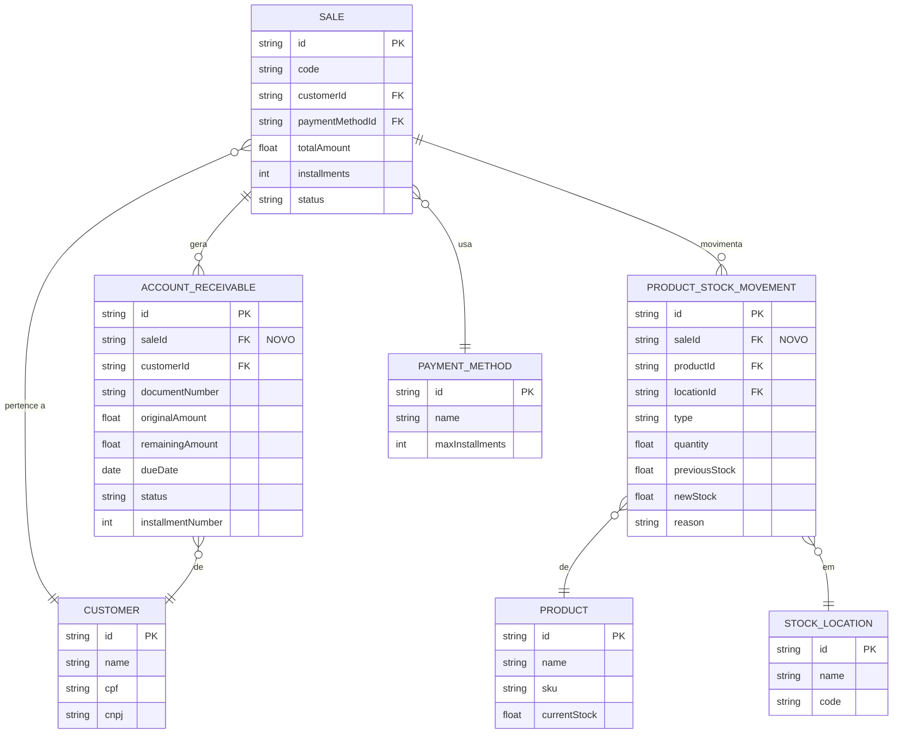

# 🔗 Diagrama de Vínculos - Vendas, Contas a Receber e Estoque

## 📊 Visão Geral do Sistema

```
┌─────────────────────────────────────────────────────────────────┐
│                         SISTEMA ERP                              │
│                  Vinculação Completa de Vendas                   │
└─────────────────────────────────────────────────────────────────┘
```

---

## 🗺️ Diagrama de Relacionamentos



---

## 🔄 Fluxo de Aprovação de Venda

```
┌──────────────────────────────────────────────────────────────────┐
│                     1. CRIAR VENDA                                │
│  POST /sales                                                      │
│  { customerId, items: [{ productId, quantity, ... }] }          │
└──────────────────┬───────────────────────────────────────────────┘
                   │
                   ▼
┌──────────────────────────────────────────────────────────────────┐
│                  2. APROVAR VENDA                                 │
│  POST /sales/:id/approve                                          │
└──────────────────┬───────────────────────────────────────────────┘
                   │
           ┌───────┴───────┐
           │               │
           ▼               ▼
┌──────────────────┐  ┌──────────────────┐
│  CRIAR CONTAS    │  │  MOVIMENTAR      │
│  A RECEBER       │  │  ESTOQUE         │
│                  │  │                  │
│  • 1 ou mais     │  │  • EXIT para     │
│    parcelas      │  │    cada item     │
│  • saleId        │  │  • saleId        │
│    vinculado     │  │    vinculado     │
│  • status:       │  │  • quantity      │
│    PENDENTE      │  │    negativa      │
└──────────────────┘  └──────────────────┘
           │               │
           └───────┬───────┘
                   │
                   ▼
┌──────────────────────────────────────────────────────────────────┐
│              VENDA APROVADA (status: APPROVED)                    │
│  • accountsReceivable: [...]                                      │
│  • stockMovements: [...]                                          │
└──────────────────────────────────────────────────────────────────┘
```

---

## ↩️ Fluxo de Cancelamento de Venda

```
┌──────────────────────────────────────────────────────────────────┐
│                   CANCELAR VENDA                                  │
│  POST /sales/:id/cancel                                           │
│  { cancellationReason: "..." }                                   │
└──────────────────┬───────────────────────────────────────────────┘
                   │
           ┌───────┴───────┐
           │               │
           ▼               ▼
┌──────────────────┐  ┌──────────────────┐
│  CANCELAR        │  │  DEVOLVER        │
│  CONTAS          │  │  ESTOQUE         │
│                  │  │                  │
│  WHERE:          │  │  • RETURN para   │
│  saleId = xxx    │  │    cada item     │
│  AND status IN   │  │  • saleId        │
│  [PENDENTE,      │  │    vinculado     │
│   VENCIDO]       │  │  • quantity      │
│                  │  │    positiva      │
│  SET:            │  │  • reason:       │
│  status =        │  │    "Cancelamento │
│  CANCELADO       │  │    de venda"     │
└──────────────────┘  └──────────────────┘
           │               │
           └───────┬───────┘
                   │
                   ▼
┌──────────────────────────────────────────────────────────────────┐
│              VENDA CANCELADA (status: CANCELED)                   │
│  • Contas: status = CANCELADO                                     │
│  • Estoque: devolvido aos locais originais                        │
└──────────────────────────────────────────────────────────────────┘
```

---

## 🔍 Exemplo Visual: Venda com 3 Parcelas

```
┌─────────────────────────────────────────────────────────────────┐
│                    VENDA #VEN-2024-0001                          │
│  Cliente: João Silva                                             │
│  Total: R$ 550,00                                                │
│  Parcelas: 3x de R$ 183,33                                       │
│  Produto: Notebook (5 unidades)                                  │
└──────────────────┬──────────────────────────────────────────────┘
                   │
                   │ POST /sales/{id}/approve
                   │
      ┌────────────┴────────────┐
      │                         │
      ▼                         ▼
┌──────────────────┐    ┌──────────────────┐
│  CONTAS A        │    │  MOVIMENTAÇÕES   │
│  RECEBER         │    │  DE ESTOQUE      │
└──────────────────┘    └──────────────────┘

┌─────────────────────────────────────────────┐
│ Conta 1/3                                   │
│ • saleId: sale-uuid                         │
│ • Documento: VEN-2024-0001-1                │
│ • Valor: R$ 183,33                          │
│ • Vencimento: 16/12/2024                    │
│ • Status: PENDENTE                          │
│ • sale.code: "VEN-2024-0001" ────┐          │
│ • sale.customer.name: "João"     │          │
└──────────────────────────────────┼──────────┘
                                   │
┌──────────────────────────────────┼──────────┐
│ Conta 2/3                        │          │
│ • saleId: sale-uuid              │          │
│ • Documento: VEN-2024-0001-2     │          │
│ • Valor: R$ 183,33               │          │
│ • Vencimento: 16/01/2025         │          │
│ • Status: PENDENTE               │          │
│ • sale.code: "VEN-2024-0001" ────┤          │
│ • sale.customer.name: "João"     │          │
└──────────────────────────────────┼──────────┘
                                   │
┌──────────────────────────────────┼──────────┐
│ Conta 3/3                        │          │
│ • saleId: sale-uuid              │          │
│ • Documento: VEN-2024-0001-3     │          │
│ • Valor: R$ 183,34               │          │
│ • Vencimento: 16/02/2025         │          │
│ • Status: PENDENTE               │          │
│ • sale.code: "VEN-2024-0001" ────┤          │
│ • sale.customer.name: "João"     │          │
└──────────────────────────────────┘          │
                                              │
┌─────────────────────────────────────────────┼┐
│ Movimentação de Saída            ◄──────────┘│
│ • saleId: sale-uuid                          │
│ • Tipo: EXIT                                 │
│ • Produto: Notebook                          │
│ • Quantidade: -5                             │
│ • Estoque Anterior: 100                      │
│ • Estoque Novo: 95                           │
│ • Local: Depósito Central                    │
│ • Motivo: "Venda aprovada"                   │
│ • Referência: VEN-2024-0001                  │
│ • sale.code: "VEN-2024-0001"                 │
│ • sale.customer.name: "João Silva"           │
└──────────────────────────────────────────────┘
```

---

## 🎯 Consultas Possíveis

### 1. Listar Contas de uma Venda

```http
GET /financial/accounts-receivable?saleId=sale-uuid

RETORNA: 3 contas a receber com sale.code, sale.customer
```

---

### 2. Listar Movimentações de uma Venda

```http
GET /products/stock-movements?saleId=sale-uuid

RETORNA: 1 movimentação EXIT com sale.code, sale.customer
```

---

### 3. Ver Venda Completa

```http
GET /sales/sale-uuid

RETORNA: {
  id: "sale-uuid",
  code: "VEN-2024-0001",
  accountsReceivable: [ /* 3 contas */ ],
  stockMovements: [ /* 1 movimento */ ]
}
```

---

### 4. Filtrar Contas por Venda e Status

```http
GET /financial/accounts-receivable?saleId=sale-uuid&status=PENDENTE

RETORNA: Apenas contas pendentes da venda
```

---

### 5. Filtrar Movimentações por Venda e Tipo

```http
GET /products/stock-movements?saleId=sale-uuid&type=EXIT

RETORNA: Apenas saídas da venda
```

---

## 📱 Interface do Usuário - Telas Sugeridas

### Tela 1: Lista de Contas a Receber

```
┌────────────────────────────────────────────────────────────┐
│  Contas a Receber                           [+ Nova Conta] │
├────────────────────────────────────────────────────────────┤
│  Filtros: [Todas ▼] [Com Venda] [Sem Venda]               │
├────────────────────────────────────────────────────────────┤
│                                                            │
│  📄 VEN-2024-0001-1                    💰 R$ 183,33       │
│     Venda #VEN-2024-0001 - Parcela 1/3                    │
│     Vence em: 16/12/2024                                  │
│     🛒 VEN-2024-0001 → João Silva (R$ 550,00) ────────┐   │
│                                                        │   │
├────────────────────────────────────────────────────────┼───┤
│                                                        │   │
│  📄 VEN-2024-0001-2                    💰 R$ 183,33   │   │
│     Venda #VEN-2024-0001 - Parcela 2/3                │   │
│     Vence em: 16/01/2025                              │   │
│     🛒 VEN-2024-0001 → João Silva (R$ 550,00) ────────┤   │
│                                                        │   │
├────────────────────────────────────────────────────────┼───┤
│                                                        │   │
│  📝 Manual-001                         💰 R$ 1.000,00 │   │
│     Serviço de consultoria                            │   │
│     Vence em: 20/12/2024                              │   │
│     📝 Conta manual (não vinculada)                   │   │
│                                                        │   │
└────────────────────────────────────────────────────────┼───┘
                                                         │
     Clicando no badge 🛒 VEN-2024-0001 ────────────────┘
     Navega para a tela de detalhes da venda
```

---

### Tela 2: Movimentações de Estoque

```
┌────────────────────────────────────────────────────────────┐
│  Movimentações de Estoque                [+ Nova Entrada]  │
├────────────────────────────────────────────────────────────┤
│  Filtros: [Todas ▼] [De Vendas] [Outras]                  │
├────────────────────────────────────────────────────────────┤
│                                                            │
│  📤 Notebook                              -5 unidades      │
│     Tipo: Saída (EXIT)                                    │
│     Local: Depósito Central                               │
│     Motivo: Venda aprovada                                │
│     100 → 95 unidades                                     │
│     🛒 VEN-2024-0001 → João Silva (R$ 550,00) ────────┐   │
│                                                        │   │
├────────────────────────────────────────────────────────┼───┤
│                                                        │   │
│  📦 Mouse USB                             +50 unidades │   │
│     Tipo: Entrada (ENTRY)                             │   │
│     Local: Loja Shopping                              │   │
│     Motivo: Compra de fornecedor                      │   │
│     20 → 70 unidades                                  │   │
│     Ref: NF-12345                                     │   │
│                                                        │   │
├────────────────────────────────────────────────────────┼───┤
│                                                        │   │
│  📥 Notebook                              +5 unidades  │   │
│     Tipo: Devolução (RETURN)                          │   │
│     Local: Depósito Central                           │   │
│     Motivo: Cancelamento de venda                     │   │
│     95 → 100 unidades                                 │   │
│     🛒 VEN-2024-0001 → João Silva (R$ 550,00) ────────┤   │
│                                                        │   │
└────────────────────────────────────────────────────────┼───┘
                                                         │
     Clicando no badge 🛒 VEN-2024-0001 ────────────────┘
     Navega para a tela de detalhes da venda
```

---

### Tela 3: Detalhes da Venda

```
┌────────────────────────────────────────────────────────────┐
│  ← Voltar          Venda #VEN-2024-0001                    │
├────────────────────────────────────────────────────────────┤
│                                                            │
│  Cliente: João Silva                Status: ✅ APROVADO    │
│  Total: R$ 550,00                   Data: 16/11/2024      │
│                                                            │
├────────────────────────────────────────────────────────────┤
│  [📄 Detalhes] [💰 Contas a Receber] [📦 Movimentações]   │
├────────────────────────────────────────────────────────────┤
│                                                            │
│  💰 CONTAS A RECEBER (3)                                   │
│  ┌──────────────────────────────────────────────────────┐ │
│  │ Total: R$ 550,00  |  Recebido: R$ 0,00               │ │
│  │ Pendente: R$ 550,00                                  │ │
│  └──────────────────────────────────────────────────────┘ │
│                                                            │
│  1/3 - R$ 183,33  |  Vence: 16/12/2024  |  [🟡 Pendente] │
│  2/3 - R$ 183,33  |  Vence: 16/01/2025  |  [🟡 Pendente] │
│  3/3 - R$ 183,34  |  Vence: 16/02/2025  |  [🟡 Pendente] │
│                                                            │
├────────────────────────────────────────────────────────────┤
│                                                            │
│  📦 MOVIMENTAÇÕES DE ESTOQUE (1)                           │
│  ┌──────────────────────────────────────────────────────┐ │
│  │ Saídas: 1  |  Devoluções: 0                          │ │
│  └──────────────────────────────────────────────────────┘ │
│                                                            │
│  📤 Notebook                                              │
│     Quantidade: -5 unidades                               │
│     Local: Depósito Central                               │
│     100 → 95 unidades                                     │
│     16/11/2024 15:30                                      │
│                                                            │
└────────────────────────────────────────────────────────────┘
```

---

## 🎨 Badges Visuais

### Badge de Venda Vinculada

```html
<!-- Com venda vinculada -->
<badge class="sale-link">
  🛒 VEN-2024-0001 → João Silva (R$ 550,00)
</badge>

<!-- Sem venda vinculada -->
<badge class="manual">
  📝 Conta manual (não vinculada)
</badge>

<!-- Estilos CSS -->
.sale-link {
  background: #EFF6FF;  /* azul claro */
  color: #1E40AF;       /* azul escuro */
  border: 1px solid #BFDBFE;
  cursor: pointer;
}

.sale-link:hover {
  background: #DBEAFE;
}

.manual {
  background: #F3F4F6;  /* cinza claro */
  color: #6B7280;       /* cinza */
  border: 1px solid #D1D5DB;
}
```

---

## ✅ Checklist de Implementação Frontend

### Componentes Básicos
- [ ] `SaleLinkBadge` - Badge clicável da venda
- [ ] `StatusBadge` - Badge de status (PENDENTE, RECEBIDO, etc)
- [ ] `FormatCurrency` - Formatador de moeda
- [ ] `FormatDate` - Formatador de data

### Listas e Filtros
- [ ] `AccountsReceivableList` - Lista com filtros
  - [ ] Filtro: Todas
  - [ ] Filtro: Com Venda
  - [ ] Filtro: Sem Venda
- [ ] `StockMovementsList` - Lista com filtros
  - [ ] Filtro: Todas
  - [ ] Filtro: De Vendas
  - [ ] Filtro: Outras

### Detalhes
- [ ] `SaleDetailsPage` - Página de detalhes da venda
  - [ ] Tab: Detalhes
  - [ ] Tab: Contas a Receber
  - [ ] Tab: Movimentações
- [ ] `SaleReceivablesPanel` - Painel de contas
- [ ] `SaleStockMovementsPanel` - Painel de movimentações

### Ações
- [ ] `SaleApprovalButton` - Botão de aprovar
- [ ] `SaleCancelButton` - Botão de cancelar
- [ ] Confirmação de aprovação
- [ ] Confirmação de cancelamento

---

**Versão**: 1.0  
**Data**: 16 de novembro de 2024  
**Status**: ✅ Documentado
