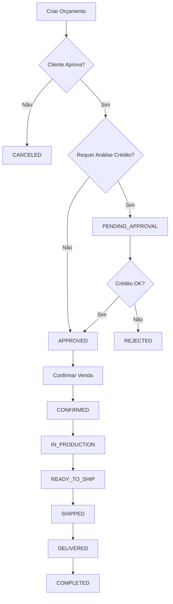

# Módulo de Vendas - Documentação Completa

## Visão Geral

O módulo de vendas permite gerenciar todo o ciclo de vendas, desde orçamentos até vendas concretizadas, incluindo:
- Métodos de pagamento com parcelamento e análise de crédito
- Gestão de vendas/orçamentos vinculados a clientes
- Seleção de produtos com controle de estoque
- Adição de encargos (frete, taxas, etc)
- Endereços de entrega
- Descontos
- Fluxo: Orçamento → Aprovação → Confirmação → Cancelamento

---

## 📋 Índice

1. [Métodos de Pagamento](#métodos-de-pagamento)
2. [Vendas/Orçamentos](#vendas-orçamentos)
3. [Itens de Venda](#itens-de-venda)
4. [Status e Fluxo](#status-e-fluxo)
5. [Endpoints da API](#endpoints-da-api)

---

## Métodos de Pagamento

### Modelo de Dados

```typescript
{
  id: string;
  companyId: string;
  name: string;              // Ex: "Cartão de Crédito Visa"
  code: string;              // Ex: "CREDIT_CARD_VISA"
  type: PaymentMethodType;   // CASH, CREDIT_CARD, PIX, etc
  active: boolean;
  
  // Parcelamento
  allowInstallments: boolean;
  maxInstallments: number;   // Máx: 48x
  installmentFee: number;    // Taxa % por parcela
  
  // Análise de Crédito
  requiresCreditAnalysis: boolean;
  minCreditScore?: number;   // Score mínimo (ex: 700)
  
  // Taxas e Prazos
  daysToReceive: number;     // D+X para receber
  transactionFee: number;    // Taxa da transação %
}
```

### Tipos de Pagamento

```typescript
enum PaymentMethodType {
  CASH,           // Dinheiro
  CREDIT_CARD,    // Cartão de Crédito
  DEBIT_CARD,     // Cartão de Débito
  PIX,            // PIX
  BANK_SLIP,      // Boleto
  BANK_TRANSFER,  // Transferência
  CHECK,          // Cheque
  OTHER           // Outro
}
```

### Endpoints - Métodos de Pagamento

#### 1. Criar Método de Pagamento

```http
POST /sales/payment-methods
Authorization: Bearer {token}
x-company-id: {companyId}
Content-Type: application/json

{
  "name": "Cartão de Crédito Visa",
  "code": "CREDIT_CARD_VISA",
  "type": "CREDIT_CARD",
  "active": true,
  "allowInstallments": true,
  "maxInstallments": 12,
  "installmentFee": 2.5,
  "requiresCreditAnalysis": true,
  "minCreditScore": 650,
  "daysToReceive": 30,
  "transactionFee": 3.99
}
```

**Resposta 201**:
```json
{
  "id": "uuid",
  "companyId": "uuid",
  "name": "Cartão de Crédito Visa",
  "code": "CREDIT_CARD_VISA",
  "type": "CREDIT_CARD",
  "active": true,
  "allowInstallments": true,
  "maxInstallments": 12,
  "installmentFee": 2.5,
  "requiresCreditAnalysis": true,
  "minCreditScore": 650,
  "daysToReceive": 30,
  "transactionFee": 3.99,
  "createdAt": "2025-11-10T19:00:00.000Z",
  "updatedAt": "2025-11-10T19:00:00.000Z"
}
```

#### 2. Listar Métodos de Pagamento

```http
GET /sales/payment-methods?active=true
Authorization: Bearer {token}
x-company-id: {companyId}
```

**Query Params**:
- `active` (boolean, opcional): Filtrar por ativos/inativos
- `type` (enum, opcional): Filtrar por tipo

**Resposta 200**:
```json
[
  {
    "id": "uuid-1",
    "name": "PIX",
    "code": "PIX",
    "type": "PIX",
    "active": true,
    "allowInstallments": false,
    "maxInstallments": 1,
    "requiresCreditAnalysis": false,
    "daysToReceive": 0,
    "transactionFee": 0
  },
  {
    "id": "uuid-2",
    "name": "Cartão de Crédito",
    "code": "CREDIT_CARD",
    "type": "CREDIT_CARD",
    "active": true,
    "allowInstallments": true,
    "maxInstallments": 12,
    "installmentFee": 2.5,
    "requiresCreditAnalysis": true,
    "minCreditScore": 650,
    "daysToReceive": 30,
    "transactionFee": 3.99
  }
]
```

#### 3. Atualizar Método de Pagamento

```http
PUT /sales/payment-methods/{id}
Authorization: Bearer {token}
x-company-id: {companyId}
Content-Type: application/json

{
  "maxInstallments": 18,
  "installmentFee": 2.99
}
```

#### 4. Deletar Método de Pagamento

```http
DELETE /sales/payment-methods/{id}
Authorization: Bearer {token}
x-company-id: {companyId}
```

---

## Vendas/Orçamentos

### Modelo de Dados

```typescript
{
  id: string;
  companyId: string;
  customerId: string;
  code: string;                    // Ex: "VEN-2025-001"
  status: SaleStatus;
  
  // Valores
  subtotal: number;                // Soma dos itens
  discountAmount: number;
  discountPercent: number;
  shippingCost: number;
  otherCharges: number;
  otherChargesDesc?: string;
  totalAmount: number;             // Total final
  
  // Pagamento
  paymentMethodId?: string;
  installments: number;            // Número de parcelas
  installmentValue?: number;       // Valor de cada parcela
  
  // Análise de Crédito
  creditAnalysisRequired: boolean;
  creditAnalysisStatus?: 'PENDING' | 'APPROVED' | 'REJECTED' | 'MANUAL';
  creditAnalysisDate?: Date;
  creditAnalysisNotes?: string;
  creditScore?: number;
  
  // Entrega
  useCustomerAddress: boolean;
  deliveryAddress?: {
    street: string;
    number: string;
    complement?: string;
    neighborhood: string;
    city: string;
    state: string;
    zipCode: string;
  };
  
  // Observações
  notes?: string;
  internalNotes?: string;
  
  // Datas
  quoteDate: Date;
  validUntil?: Date;
  confirmedAt?: Date;
  canceledAt?: Date;
  cancellationReason?: string;
  
  // Relacionamentos
  customer: Customer;
  paymentMethod?: PaymentMethod;
  items: SaleItem[];
}
```

### Status da Venda

```typescript
enum SaleStatus {
  QUOTE,              // Orçamento
  PENDING_APPROVAL,   // Aguardando aprovação
  APPROVED,           // Aprovado
  CONFIRMED,          // Venda confirmada
  IN_PRODUCTION,      // Em produção/separação
  READY_TO_SHIP,      // Pronto para envio
  SHIPPED,            // Enviado
  DELIVERED,          // Entregue
  COMPLETED,          // Concluída
  CANCELED,           // Cancelada
  REJECTED            // Rejeitada
}
```

### Endpoints - Vendas

#### 1. Criar Orçamento/Venda

```http
POST /sales
Authorization: Bearer {token}
x-company-id: {companyId}
Content-Type: application/json

{
  "customerId": "customer-uuid",
  "status": "QUOTE",
  "paymentMethodId": "payment-method-uuid",
  "installments": 3,
  "useCustomerAddress": false,
  "deliveryAddress": {
    "street": "Rua das Flores",
    "number": "123",
    "complement": "Apto 45",
    "neighborhood": "Centro",
    "city": "São Paulo",
    "state": "SP",
    "zipCode": "01310-100"
  },
  "shippingCost": 25.50,
  "discountPercent": 10,
  "otherCharges": 5.00,
  "otherChargesDesc": "Taxa de embalagem especial",
  "notes": "Cliente solicitou entrega urgente",
  "internalNotes": "Verificar estoque antes de confirmar",
  "validUntil": "2025-11-30",
  "items": [
    {
      "productId": "product-uuid-1",
      "stockLocationId": "location-uuid",
      "quantity": 2,
      "unitPrice": 150.00,
      "discount": 10.00,
      "notes": "Cor azul conforme solicitado"
    },
    {
      "productId": "product-uuid-2",
      "stockLocationId": "location-uuid",
      "quantity": 1,
      "unitPrice": 89.90,
      "discount": 0
    }
  ]
}
```

**Resposta 201**:
```json
{
  "id": "sale-uuid",
  "companyId": "company-uuid",
  "customerId": "customer-uuid",
  "code": "VEN-2025-001",
  "status": "QUOTE",
  "subtotal": 379.90,
  "discountAmount": 37.99,
  "discountPercent": 10,
  "shippingCost": 25.50,
  "otherCharges": 5.00,
  "otherChargesDesc": "Taxa de embalagem especial",
  "totalAmount": 372.41,
  "paymentMethodId": "payment-method-uuid",
  "installments": 3,
  "installmentValue": 124.14,
  "creditAnalysisRequired": true,
  "creditAnalysisStatus": "PENDING",
  "useCustomerAddress": false,
  "deliveryAddress": {
    "street": "Rua das Flores",
    "number": "123",
    "complement": "Apto 45",
    "neighborhood": "Centro",
    "city": "São Paulo",
    "state": "SP",
    "zipCode": "01310-100"
  },
  "notes": "Cliente solicitou entrega urgente",
  "internalNotes": "Verificar estoque antes de confirmar",
  "quoteDate": "2025-11-10T19:00:00.000Z",
  "validUntil": "2025-11-30T00:00:00.000Z",
  "createdAt": "2025-11-10T19:00:00.000Z",
  "updatedAt": "2025-11-10T19:00:00.000Z",
  "customer": {
    "id": "customer-uuid",
    "name": "João Silva",
    "cpf": "123.456.789-00",
    "email": "joao@email.com"
  },
  "paymentMethod": {
    "id": "payment-method-uuid",
    "name": "Cartão de Crédito",
    "type": "CREDIT_CARD",
    "maxInstallments": 12,
    "requiresCreditAnalysis": true
  },
  "items": [
    {
      "id": "item-uuid-1",
      "productId": "product-uuid-1",
      "productCode": "PROD-001",
      "productName": "Notebook Dell",
      "quantity": 2,
      "unitPrice": 150.00,
      "discount": 10.00,
      "subtotal": 300.00,
      "total": 290.00,
      "stockLocationId": "location-uuid",
      "notes": "Cor azul conforme solicitado"
    },
    {
      "id": "item-uuid-2",
      "productId": "product-uuid-2",
      "productCode": "PROD-002",
      "productName": "Mouse Sem Fio",
      "quantity": 1,
      "unitPrice": 89.90,
      "discount": 0,
      "subtotal": 89.90,
      "total": 89.90,
      "stockLocationId": "location-uuid"
    }
  ]
}
```

#### 2. Listar Vendas/Orçamentos

```http
GET /sales?status=QUOTE&customerId=uuid&startDate=2025-01-01&endDate=2025-12-31
Authorization: Bearer {token}
x-company-id: {companyId}
```

**Query Params**:
- `status` (enum, opcional): Filtrar por status
- `customerId` (string, opcional): Filtrar por cliente
- `startDate` (date, opcional): Data inicial
- `endDate` (date, opcional): Data final
- `search` (string, opcional): Buscar por código ou nome do cliente

#### 3. Buscar Venda por ID

```http
GET /sales/{id}
Authorization: Bearer {token}
x-company-id: {companyId}
```

#### 4. Atualizar Venda

```http
PUT /sales/{id}
Authorization: Bearer {token}
x-company-id: {companyId}
Content-Type: application/json

{
  "shippingCost": 30.00,
  "notes": "Atualização: Frete expresso"
}
```

#### 5. Confirmar Venda (Orçamento → Venda Confirmada)

```http
POST /sales/{id}/confirm
Authorization: Bearer {token}
x-company-id: {companyId}
```

**Ação**: 
- Muda status de `QUOTE` para `CONFIRMED`
- Define `confirmedAt` com data atual
- Pode baixar estoque automaticamente (configurável)

**Resposta 200**:
```json
{
  "id": "sale-uuid",
  "status": "CONFIRMED",
  "confirmedAt": "2025-11-10T20:00:00.000Z",
  "message": "Venda confirmada com sucesso"
}
```

#### 6. Cancelar Venda

```http
POST /sales/{id}/cancel
Authorization: Bearer {token}
x-company-id: {companyId}
Content-Type: application/json

{
  "cancellationReason": "Cliente desistiu da compra"
}
```

**Ação**:
- Muda status para `CANCELED`
- Define `canceledAt` com data atual
- Registra motivo do cancelamento
- Pode devolver estoque (se já baixado)

**Resposta 200**:
```json
{
  "id": "sale-uuid",
  "status": "CANCELED",
  "canceledAt": "2025-11-10T20:30:00.000Z",
  "cancellationReason": "Cliente desistiu da compra",
  "message": "Venda cancelada com sucesso"
}
```

#### 7. Aprovar Análise de Crédito

```http
POST /sales/{id}/credit-analysis/approve
Authorization: Bearer {token}
x-company-id: {companyId}
Content-Type: application/json

{
  "creditScore": 750,
  "notes": "Cliente possui bom histórico de crédito"
}
```

**Resposta 200**:
```json
{
  "id": "sale-uuid",
  "creditAnalysisStatus": "APPROVED",
  "creditAnalysisDate": "2025-11-10T21:00:00.000Z",
  "creditScore": 750,
  "creditAnalysisNotes": "Cliente possui bom histórico de crédito",
  "message": "Análise de crédito aprovada"
}
```

#### 8. Rejeitar Análise de Crédito

```http
POST /sales/{id}/credit-analysis/reject
Authorization: Bearer {token}
x-company-id: {companyId}
Content-Type: application/json

{
  "creditScore": 450,
  "notes": "Score abaixo do mínimo aceitável"
}
```

#### 9. Mudar Status da Venda

```http
PATCH /sales/{id}/status
Authorization: Bearer {token}
x-company-id: {companyId}
Content-Type: application/json

{
  "status": "SHIPPED"
}
```

**Status válidos para transição**:
- `QUOTE` → `PENDING_APPROVAL` → `APPROVED` → `CONFIRMED`
- `CONFIRMED` → `IN_PRODUCTION` → `READY_TO_SHIP` → `SHIPPED` → `DELIVERED` → `COMPLETED`
- Qualquer status → `CANCELED` (exceto `COMPLETED`)

---

## Itens de Venda

### Modelo de Dados

```typescript
{
  id: string;
  saleId: string;
  productId: string;
  stockLocationId?: string;
  
  // Snapshot do produto
  productCode: string;
  productName: string;
  productUnit?: string;
  
  // Valores
  quantity: number;
  unitPrice: number;
  discount: number;
  subtotal: number;    // quantity * unitPrice
  total: number;       // subtotal - discount
  
  // Observações
  notes?: string;
  
  // Relacionamentos
  product: Product;
  stockLocation?: StockLocation;
}
```

---

## Cálculos Automáticos

### Cálculo de Valores da Venda

```typescript
// 1. Subtotal (soma de todos os itens)
subtotal = sum(items.map(i => i.total))

// 2. Desconto
discountAmount = (subtotal * discountPercent) / 100

// 3. Total Final
totalAmount = subtotal - discountAmount + shippingCost + otherCharges

// 4. Valor da Parcela (se parcelado)
installmentValue = totalAmount / installments
```

### Exemplo de Cálculo

```typescript
// Itens:
// - Produto A: 2x R$ 150,00 - R$ 10 desconto = R$ 290,00
// - Produto B: 1x R$ 89,90 = R$ 89,90
subtotal = 379.90

// Desconto de 10%
discountAmount = 379.90 * 0.10 = 37.99

// Encargos
shippingCost = 25.50
otherCharges = 5.00

// Total
totalAmount = 379.90 - 37.99 + 25.50 + 5.00 = 372.41

// Parcelamento em 3x
installmentValue = 372.41 / 3 = 124.14
```

---

## Fluxo Completo de Venda



---

## Exemplos de Uso Completo

### Cenário 1: Venda Simples com PIX

```http
# 1. Criar orçamento
POST /sales
{
  "customerId": "customer-uuid",
  "status": "QUOTE",
  "paymentMethodId": "pix-uuid",
  "useCustomerAddress": true,
  "items": [
    {
      "productId": "product-uuid",
      "quantity": 1,
      "unitPrice": 299.90
    }
  ]
}

# 2. Confirmar venda
POST /sales/{id}/confirm

# 3. Atualizar status
PATCH /sales/{id}/status
{ "status": "SHIPPED" }
```

### Cenário 2: Venda Parcelada com Análise de Crédito

```http
# 1. Criar orçamento
POST /sales
{
  "customerId": "customer-uuid",
  "status": "QUOTE",
  "paymentMethodId": "credit-card-uuid",
  "installments": 12,
  "items": [...]
}

# 2. Sistema detecta necessidade de análise
# Response: creditAnalysisRequired = true, status = PENDING_APPROVAL

# 3. Aprovar crédito
POST /sales/{id}/credit-analysis/approve
{
  "creditScore": 800,
  "notes": "Cliente com histórico excelente"
}

# 4. Confirmar venda
POST /sales/{id}/confirm
```

### Cenário 3: Orçamento com Validade e Cancelamento

```http
# 1. Criar orçamento com validade
POST /sales
{
  "customerId": "customer-uuid",
  "status": "QUOTE",
  "validUntil": "2025-11-20",
  "items": [...]
}

# 2. Cliente desiste
POST /sales/{id}/cancel
{
  "cancellationReason": "Cliente não aprovou o valor"
}
```

---

## Validações e Regras de Negócio

### Validações na Criação

✅ Cliente deve existir e estar ativo  
✅ Produtos devem existir e estar ativos  
✅ Quantidade deve ser > 0  
✅ Preço unitário deve ser >= 0  
✅ Desconto não pode ser > subtotal  
✅ Número de parcelas não pode exceder máximo do método de pagamento  
✅ Se requer análise de crédito, limite do cliente não pode ser excedido  

### Validações na Confirmação

✅ Status deve ser `QUOTE` ou `APPROVED`  
✅ Se requer análise de crédito, deve estar `APPROVED`  
✅ Produtos devem ter estoque suficiente (se controla estoque)  
✅ Venda não pode estar expirada (`validUntil` < hoje)  

### Validações no Cancelamento

✅ Venda não pode estar `COMPLETED`  
✅ Motivo do cancelamento é obrigatório  
✅ Se estoque já foi baixado, deve ser devolvido  

---

## Permissões

Recomendado configurar permissões por perfil:

- **Vendedor**: Criar orçamentos, visualizar vendas próprias
- **Gerente de Vendas**: Aprovar análise de crédito, confirmar vendas, cancelar
- **Administrador**: Acesso total, incluir gerenciar métodos de pagamento

---

## Integração com Outros Módulos

### Produtos e Estoque
- Ao confirmar venda, baixa estoque automaticamente
- Ao cancelar venda (se já confirmada), devolve estoque
- Valida disponibilidade antes de confirmar

### Clientes
- Vincula venda ao cliente
- Usa endereço do cliente ou permite endereço customizado
- Valida limite de crédito do cliente

### Financeiro (Futuro)
- Gerar contas a receber automaticamente
- Controlar parcelas e vencimentos
- Registrar pagamentos

---

## Erros Comuns

### 400 Bad Request
```json
{
  "statusCode": 400,
  "message": "Produto não tem estoque suficiente"
}
```

### 404 Not Found
```json
{
  "statusCode": 404,
  "message": "Cliente não encontrado"
}
```

### 403 Forbidden
```json
{
  "statusCode": 403,
  "message": "Análise de crédito rejeitada: score insuficiente"
}
```

### 422 Unprocessable Entity
```json
{
  "statusCode": 422,
  "message": "Não é possível confirmar venda com status CANCELED"
}
```

---

## Changelog

### v1.0.0 - 2025-11-10
- ✅ Módulo de vendas criado
- ✅ Métodos de pagamento com parcelamento
- ✅ Análise de crédito configurável
- ✅ Gestão completa de vendas/orçamentos
- ✅ Controle de estoque integrado
- ✅ Endereços de entrega personalizados
- ✅ Descontos e encargos
- ✅ Fluxo de status completo
- ✅ Documentação da API

---

## Próximos Passos

- [ ] Integração com módulo financeiro
- [ ] Emissão de notas fiscais
- [ ] Comissões de vendedores
- [ ] Relatórios de vendas
- [ ] Dashboard de vendas
- [ ] Integração com e-commerce
- [ ] Catálogo de produtos para clientes

---

## Suporte

Para dúvidas ou problemas:
- Consulte os exemplos nesta documentação
- Verifique os códigos de erro retornados
- Entre em contato com a equipe de desenvolvimento
