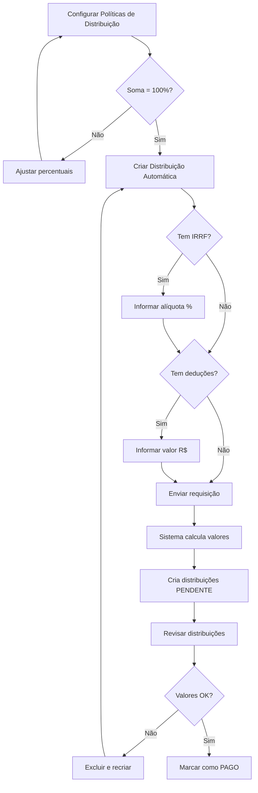

# Distribuição Automática com Alíquotas Editáveis

## Visão Geral

A funcionalidade de distribuição automática permite criar distribuições para todos os investidores de um projeto de acordo com as políticas de distribuição configuradas, com a possibilidade de definir alíquotas de IRRF e outras deduções.

## Endpoint

```
POST /scp/distributions/bulk-create
```

## Request Body

```typescript
{
  projectId: string;
  baseValue: number;
  competenceDate: string;  // Formato: YYYY-MM ou YYYY-MM-DD
  distributionDate: string; // Formato: YYYY-MM-DD
  irrf?: number;           // Opcional: Alíquota de IRRF em % (ex: 15 para 15%)
  otherDeductions?: number; // Opcional: Valor fixo de outras deduções em R$
}
```

## Parâmetros

### Obrigatórios

- **projectId** (string): UUID do projeto SCP
- **baseValue** (number): Valor base total a ser distribuído (em R$)
- **competenceDate** (string): Data de competência da distribuição
  - Formato aceito: `YYYY-MM` (ex: "2025-11") ou `YYYY-MM-DD`
- **distributionDate** (string): Data em que a distribuição foi/será realizada
  - Formato: `YYYY-MM-DD` (ex: "2025-11-10")

### Opcionais

- **irrf** (number): Alíquota de Imposto de Renda Retido na Fonte em **percentual**
  - Valor padrão: `0` (sem retenção)
  - Exemplo: `15` = 15% de IRRF
  - Aplicado sobre o valor bruto de cada distribuição
  
- **otherDeductions** (number): Outras deduções em valor **fixo (R$)**
  - Valor padrão: `0` (sem deduções)
  - Exemplo: `50` = R$ 50,00 de deduções
  - Valor fixo deduzido de cada distribuição

## Como Funciona

### 1. Busca de Políticas Ativas

O sistema busca todas as políticas de distribuição ativas para o projeto:

```typescript
// Exemplo de políticas
[
  { investorId: "uuid-1", percentage: 40 },  // 40% do total
  { investorId: "uuid-2", percentage: 35 },  // 35% do total
  { investorId: "uuid-3", percentage: 25 },  // 25% do total
]
```

### 2. Validação de Percentuais

Verifica se a soma dos percentuais é exatamente **100%**:

```typescript
if (totalPercentage !== 100) {
  throw new BadRequestException('A soma dos percentuais deve ser 100%');
}
```

### 3. Cálculo das Distribuições

Para cada política, calcula:

#### a) Valor Bruto (amount)
```typescript
amount = (baseValue * policy.percentage) / 100
```

#### b) IRRF (se fornecido)
```typescript
irrf = irrfOverride ? (amount * irrfOverride) / 100 : 0
```

#### c) Outras Deduções
```typescript
otherDeductions = otherDeductionsOverride || 0
```

#### d) Valor Líquido (netAmount)
```typescript
netAmount = amount - irrf - otherDeductions
```

## Exemplos de Uso

### Exemplo 1: Sem Deduções (Básico)

```http
POST /scp/distributions/bulk-create
Authorization: Bearer {token}
x-company-id: {companyId}
Content-Type: application/json

{
  "projectId": "814d8205-e6e5-4d15-8f71-bfc2db4019c5",
  "baseValue": 10000,
  "competenceDate": "2025-11",
  "distributionDate": "2025-11-10"
}
```

**Resultado** (com 3 investidores 40%, 35%, 25%):

| Investidor | % | Valor Bruto | IRRF | Deduções | Valor Líquido |
|------------|---|-------------|------|----------|---------------|
| João Silva | 40% | R$ 4.000,00 | R$ 0,00 | R$ 0,00 | R$ 4.000,00 |
| Maria Santos | 35% | R$ 3.500,00 | R$ 0,00 | R$ 0,00 | R$ 3.500,00 |
| Pedro Costa | 25% | R$ 2.500,00 | R$ 0,00 | R$ 0,00 | R$ 2.500,00 |

---

### Exemplo 2: Com IRRF de 15%

```http
POST /scp/distributions/bulk-create
Authorization: Bearer {token}
x-company-id: {companyId}
Content-Type: application/json

{
  "projectId": "814d8205-e6e5-4d15-8f71-bfc2db4019c5",
  "baseValue": 10000,
  "competenceDate": "2025-11",
  "distributionDate": "2025-11-10",
  "irrf": 15
}
```

**Resultado**:

| Investidor | % | Valor Bruto | IRRF (15%) | Deduções | Valor Líquido |
|------------|---|-------------|------------|----------|---------------|
| João Silva | 40% | R$ 4.000,00 | R$ 600,00 | R$ 0,00 | R$ 3.400,00 |
| Maria Santos | 35% | R$ 3.500,00 | R$ 525,00 | R$ 0,00 | R$ 2.975,00 |
| Pedro Costa | 25% | R$ 2.500,00 | R$ 375,00 | R$ 0,00 | R$ 2.125,00 |

---

### Exemplo 3: Com IRRF e Outras Deduções

```http
POST /scp/distributions/bulk-create
Authorization: Bearer {token}
x-company-id: {companyId}
Content-Type: application/json

{
  "projectId": "814d8205-e6e5-4d15-8f71-bfc2db4019c5",
  "baseValue": 10000,
  "competenceDate": "2025-11",
  "distributionDate": "2025-11-10",
  "irrf": 15,
  "otherDeductions": 50
}
```

**Resultado**:

| Investidor | % | Valor Bruto | IRRF (15%) | Deduções | Valor Líquido |
|------------|---|-------------|------------|----------|---------------|
| João Silva | 40% | R$ 4.000,00 | R$ 600,00 | R$ 50,00 | R$ 3.350,00 |
| Maria Santos | 35% | R$ 3.500,00 | R$ 525,00 | R$ 50,00 | R$ 2.925,00 |
| Pedro Costa | 25% | R$ 2.500,00 | R$ 375,00 | R$ 50,00 | R$ 2.075,00 |

---

### Exemplo 4: Apenas Outras Deduções (Sem IRRF)

```http
POST /scp/distributions/bulk-create
Authorization: Bearer {token}
x-company-id: {companyId}
Content-Type: application/json

{
  "projectId": "814d8205-e6e5-4d15-8f71-bfc2db4019c5",
  "baseValue": 10000,
  "competenceDate": "2025-11",
  "distributionDate": "2025-11-10",
  "otherDeductions": 100
}
```

**Resultado**:

| Investidor | % | Valor Bruto | IRRF | Deduções | Valor Líquido |
|------------|---|-------------|------|----------|---------------|
| João Silva | 40% | R$ 4.000,00 | R$ 0,00 | R$ 100,00 | R$ 3.900,00 |
| Maria Santos | 35% | R$ 3.500,00 | R$ 0,00 | R$ 100,00 | R$ 3.400,00 |
| Pedro Costa | 25% | R$ 2.500,00 | R$ 0,00 | R$ 100,00 | R$ 2.400,00 |

---

## Resposta (Success)

```json
{
  "distributions": [
    {
      "id": "uuid-1",
      "projectId": "project-uuid",
      "investorId": "investor-uuid-1",
      "amount": 4000,
      "percentage": 40,
      "baseValue": 10000,
      "distributionDate": "2025-11-10T00:00:00.000Z",
      "competenceDate": "2025-11-01T00:00:00.000Z",
      "status": "PENDENTE",
      "irrf": 600,
      "otherDeductions": 50,
      "netAmount": 3350,
      "project": {
        "code": "PROJ-001",
        "name": "Projeto Alpha"
      },
      "investor": {
        "fullName": "João Silva",
        "cpf": "123.456.789-00"
      }
    },
    // ... outras distribuições
  ],
  "summary": {
    "totalDistributions": 3,
    "totalAmount": 10000,
    "totalIRRF": 1500,
    "totalOtherDeductions": 150,
    "totalNetAmount": 8350
  }
}
```

## Erros Comuns

### 1. Projeto não encontrado
```json
{
  "statusCode": 404,
  "message": "Projeto não encontrado"
}
```

### 2. Nenhuma política ativa
```json
{
  "statusCode": 400,
  "message": "Nenhuma política de distribuição ativa encontrada"
}
```

### 3. Percentuais não somam 100%
```json
{
  "statusCode": 400,
  "message": "A soma dos percentuais deve ser 100%. Atualmente: 85%"
}
```

### 4. Alíquota de IRRF inválida
```json
{
  "statusCode": 400,
  "message": "irrf must not be less than 0"
}
```

## Validações

### DTO Validations

```typescript
class BulkCreateFromPoliciesDto {
  @IsString()
  projectId: string;

  @IsNumber()
  @Min(0)
  baseValue: number;  // Não pode ser negativo

  @IsDateString()
  @Transform(transformToISODate)
  competenceDate: string;

  @IsDateString()
  @Transform(transformToISODate)
  distributionDate: string;

  @IsNumber()
  @Min(0)
  @IsOptional()
  irrf?: number;  // Opcional, mas se fornecido deve ser >= 0

  @IsNumber()
  @Min(0)
  @IsOptional()
  otherDeductions?: number;  // Opcional, mas se fornecido deve ser >= 0
}
```

## Casos de Uso

### 1. Distribuição Simples (Sem Impostos)
Ideal para distribuições onde não há retenção de impostos ou quando os impostos são pagos separadamente.

### 2. Distribuição com IRRF
Comum em distribuições de rendimentos onde há obrigação de retenção de IR na fonte (ex: dividendos, aluguéis).

**Alíquotas comuns de IRRF**:
- 15% - Rendimentos de aplicações financeiras
- 22.5% - Alguns tipos de investimentos
- 27.5% - Rendimentos do trabalho

### 3. Distribuição com Taxas Administrativas
Quando há taxas de administração ou outras despesas que devem ser deduzidas antes do pagamento.

### 4. Distribuição com IRRF e Taxas
Cenário completo onde há tanto retenção de IR quanto outras deduções.

## Boas Práticas

### 1. Sempre configure as políticas antes
```http
# Certifique-se de que as políticas estão configuradas
GET /scp/distribution-policies?projectId={projectId}

# A soma deve ser 100%
```

### 2. Use a alíquota correta de IRRF
```typescript
// Consulte a legislação vigente ou seu contador
const irrfAliquotas = {
  aplicacoesFinanceiras: 15,
  dividendos: 0,  // Dividendos não têm retenção no Brasil
  alugueis: 27.5,
  // etc
};
```

### 3. Documente as deduções
Mantenha registro do que foi deduzido em `otherDeductions` para auditoria.

### 4. Revise antes de marcar como PAGO
```http
# Primeiro crie as distribuições (status: PENDENTE)
POST /scp/distributions/bulk-create

# Revise os valores
GET /scp/distributions?projectId={projectId}&status=PENDENTE

# Só então marque como PAGO
PUT /scp/distributions/{id}/mark-as-paid
```

## Fluxo Completo



## Referências

- [API Distribution Policies](./SCP_DISTRIBUTION_POLICIES.md)
- [API Distributions](./SCP_DISTRIBUTIONS.md)
- [Date Transformer](./FIX_DATE_TRANSFORMER_YYYY_MM.md)

## Changelog

### v1.1.0 - 2025-11-10
- ✅ Adicionados campos opcionais `irrf` e `otherDeductions`
- ✅ Cálculo automático de IRRF sobre valor bruto
- ✅ Suporte a deduções fixas por distribuição
- ✅ Validação com class-validator
- ✅ DTO dedicado: `BulkCreateFromPoliciesDto`

### v1.0.0 - 2025-11-10
- ✅ Criação inicial da funcionalidade
- ✅ Distribuição automática baseada em políticas
- ✅ Validação de percentuais (soma = 100%)
