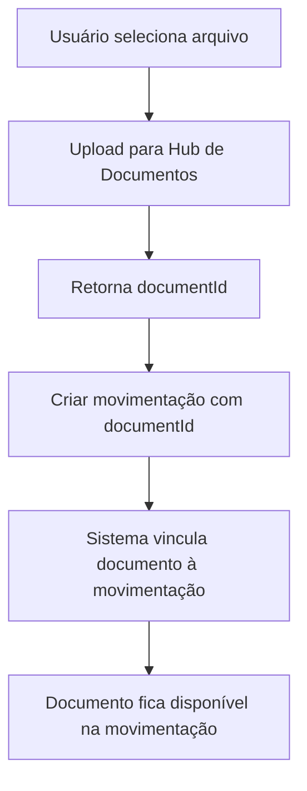

# Guia de Upload de Documentos para Estoque

**Data**: 4 de novembro de 2025  
**Versão**: 2.0 - **Criação Automática de Pastas**

## 📋 Índice

1. [Visão Geral](#visão-geral)
2. [Criação Automática de Pastas](#criação-automática-de-pastas)
3. [Estrutura de Pastas](#estrutura-de-pastas)
4. [Fluxo de Upload](#fluxo-de-upload)
5. [Exemplos Práticos](#exemplos-práticos)
6. [Tipos de Documentos](#tipos-de-documentos)
7. [Integração Frontend](#integração-frontend)

---

## 🎯 Visão Geral

### O que são Documentos de Estoque?

Documentos vinculados às movimentações de estoque e transferências, como:
- **Notas fiscais** de compra (ENTRY)
- **Notas fiscais** de venda (EXIT)
- **Guias de transferência** entre locais
- **Comprovantes de recebimento**
- **Termos de ajuste** de estoque
- **Laudos de perda** (danos, vencimento)

### Benefícios

✅ **Rastreabilidade**: Todos os documentos vinculados às movimentações  
✅ **Auditoria**: Histórico completo de documentos fiscais  
✅ **Organização Automática**: Pastas criadas por ano/mês automaticamente  
✅ **Compliance**: Facilita auditorias fiscais  
✅ **Zero Configuração**: Sistema cria estrutura de pastas sozinho

---

## 🤖 Criação Automática de Pastas

### Como Funciona

O sistema **cria automaticamente** a estrutura de pastas quando você vincula um documento a uma movimentação ou transferência. Não é necessário criar as pastas manualmente!

### Processo Automático

1. **Upload do Documento**: Você faz upload de um arquivo (nota fiscal, guia, etc.)
2. **Vincula à Movimentação/Transferência**: Informa o `documentId` ao criar a movimentação
3. **Sistema Cria Pastas**: Backend automaticamente:
   - Verifica se a pasta "Estoque" existe, senão cria
   - Verifica se a subpasta "Movimentações" ou "Transferências" existe, senão cria
   - Verifica se a pasta do ano (ex: "2025") existe, senão cria
   - Verifica se a pasta do mês (ex: "Novembro") existe, senão cria
4. **Move o Documento**: Documento é movido para a pasta correta automaticamente

### Vantagens

✅ **Sem Setup Manual**: Não precisa criar pastas antes de usar  
✅ **Organização Consistente**: Sempre segue o padrão Estoque/Movimentações/Ano/Mês  
✅ **Onboarding Rápido**: Novos usuários podem usar imediatamente  
✅ **Multiempresa**: Cada empresa tem sua própria estrutura automática

### Exemplo de Fluxo Automático

```typescript
// 1. Upload do documento (retorna documentId)
const documentId = await uploadInvoice(file);

// 2. Criar movimentação vinculando o documento
const movement = await createStockMovement({
  productId: 'abc-123',
  type: 'ENTRY',
  quantity: 100,
  locationId: 'warehouse-main',
  documentId: documentId, // ← Sistema cria pastas automaticamente!
});

// 3. Backend automaticamente:
// - Cria pasta "Estoque" (se não existir)
// - Cria pasta "Movimentações" (se não existir)
// - Cria pasta "2025" (se não existir)
// - Cria pasta "Novembro" (se não existir)
// - Move o documento para Estoque/Movimentações/2025/Novembro/
```

---

## 📁 Estrutura de Pastas

### Hierarquia Recomendada

```
📁 Documentos (raiz)
  └─ 📁 Estoque
      ├─ 📁 Movimentações
      │   ├─ 📁 2025
      │   │   ├─ 📁 Janeiro
      │   │   ├─ 📁 Fevereiro
      │   │   └─ ...
      │   └─ 📁 2024
      └─ 📁 Transferências
          ├─ 📁 2025
          │   ├─ 📁 Janeiro
          │   ├─ 📁 Fevereiro
          │   └─ ...
          └─ 📁 2024
```

### Criação Automática de Pastas

O sistema deve criar automaticamente:
1. Pasta raiz: **"Estoque"**
2. Subpastas: **"Movimentações"** e **"Transferências"**
3. Pastas por ano e mês automaticamente

---

## 🔄 Fluxo de Upload

### Fluxo Completo: Movimentação de Estoque com Documento



### Passo a Passo Técnico

#### 1. Criar Estrutura de Pastas (Setup Inicial)

```typescript
// Executar apenas uma vez por empresa
async function setupStockDocumentsFolders(companyId: string) {
  // 1. Criar pasta raiz "Estoque"
  const stockFolder = await api.post('/documents/folders', {
    name: 'Estoque',
    parentId: null, // Pasta raiz
    description: 'Documentos relacionados ao estoque'
  });

  // 2. Criar subpasta "Movimentações"
  const movementsFolder = await api.post('/documents/folders', {
    name: 'Movimentações',
    parentId: stockFolder.data.id,
    description: 'Notas fiscais e comprovantes de movimentações de estoque'
  });

  // 3. Criar subpasta "Transferências"
  const transfersFolder = await api.post('/documents/folders', {
    name: 'Transferências',
    parentId: stockFolder.data.id,
    description: 'Guias de transferência entre locais'
  });

  // 4. Criar pasta do ano atual em cada subpasta
  const currentYear = new Date().getFullYear().toString();
  
  const movementsYearFolder = await api.post('/documents/folders', {
    name: currentYear,
    parentId: movementsFolder.data.id
  });

  const transfersYearFolder = await api.post('/documents/folders', {
    name: currentYear,
    parentId: transfersFolder.data.id
  });

  // 5. Criar pastas dos meses
  const months = [
    'Janeiro', 'Fevereiro', 'Março', 'Abril', 'Maio', 'Junho',
    'Julho', 'Agosto', 'Setembro', 'Outubro', 'Novembro', 'Dezembro'
  ];

  for (const month of months) {
    await api.post('/documents/folders', {
      name: month,
      parentId: movementsYearFolder.data.id
    });

    await api.post('/documents/folders', {
      name: month,
      parentId: transfersYearFolder.data.id
    });
  }

  return {
    stockFolderId: stockFolder.data.id,
    movementsFolderId: movementsFolder.data.id,
    transfersFolderId: transfersFolder.data.id
  };
}
```

---

#### 2. Upload de Documento para Movimentação

```typescript
async function createStockMovementWithDocument(
  productId: string,
  file: File,
  movementData: {
    type: 'ENTRY' | 'EXIT' | 'ADJUSTMENT' | 'RETURN' | 'LOSS';
    quantity: number;
    locationId: string;
    reason?: string;
    notes?: string;
    reference?: string;
  }
) {
  try {
    // 1. Buscar pasta do mês atual em Movimentações
    const currentDate = new Date();
    const year = currentDate.getFullYear().toString();
    const monthNames = [
      'Janeiro', 'Fevereiro', 'Março', 'Abril', 'Maio', 'Junho',
      'Julho', 'Agosto', 'Setembro', 'Outubro', 'Novembro', 'Dezembro'
    ];
    const month = monthNames[currentDate.getMonth()];

    // Buscar estrutura de pastas (assumindo que já foi criada)
    const folders = await api.get('/documents/folders?name=Movimentações');
    const movementsFolder = folders.data[0];
    
    const yearFolders = await api.get(`/documents/folders?parentId=${movementsFolder.id}&name=${year}`);
    const yearFolder = yearFolders.data[0];
    
    const monthFolders = await api.get(`/documents/folders?parentId=${yearFolder.id}&name=${month}`);
    const monthFolder = monthFolders.data[0];

    // 2. Upload do arquivo
    const formData = new FormData();
    formData.append('file', file);
    formData.append('folderId', monthFolder.id);
    formData.append('documentType', 'stock_movement');
    formData.append('description', `Movimentação: ${movementData.type} - ${movementData.reason || ''}`);

    const uploadResponse = await api.post('/documents/upload', formData, {
      headers: { 'Content-Type': 'multipart/form-data' }
    });

    const documentId = uploadResponse.data.id;

    // 3. Criar movimentação com documentId
    const movement = await api.post(`/products/${productId}/stock-movement`, {
      ...movementData,
      documentId // ✅ Vincula o documento
    });

    console.log('Movimentação criada com documento:', movement.data);
    return movement.data;

  } catch (error) {
    console.error('Erro ao criar movimentação com documento:', error);
    throw error;
  }
}
```

---

#### 3. Upload de Documento para Transferência

```typescript
async function createTransferWithDocument(
  file: File,
  transferData: {
    fromLocationId: string;
    toLocationId: string;
    items: Array<{
      productId: string;
      quantity: number;
      notes?: string;
    }>;
    notes?: string;
  }
) {
  try {
    // 1. Buscar pasta do mês atual em Transferências
    const currentDate = new Date();
    const year = currentDate.getFullYear().toString();
    const monthNames = [
      'Janeiro', 'Fevereiro', 'Março', 'Abril', 'Maio', 'Junho',
      'Julho', 'Agosto', 'Setembro', 'Outubro', 'Novembro', 'Dezembro'
    ];
    const month = monthNames[currentDate.getMonth()];

    // Buscar estrutura de pastas
    const folders = await api.get('/documents/folders?name=Transferências');
    const transfersFolder = folders.data[0];
    
    const yearFolders = await api.get(`/documents/folders?parentId=${transfersFolder.id}&name=${year}`);
    const yearFolder = yearFolders.data[0];
    
    const monthFolders = await api.get(`/documents/folders?parentId=${yearFolder.id}&name=${month}`);
    const monthFolder = monthFolders.data[0];

    // 2. Upload do arquivo (guia de transferência)
    const formData = new FormData();
    formData.append('file', file);
    formData.append('folderId', monthFolder.id);
    formData.append('documentType', 'stock_transfer');
    formData.append('description', `Transferência entre locais - ${transferData.notes || ''}`);

    const uploadResponse = await api.post('/documents/upload', formData, {
      headers: { 'Content-Type': 'multipart/form-data' }
    });

    const documentId = uploadResponse.data.id;

    // 3. Criar transferência com documentId
    const transfer = await api.post('/products/stock-transfers', {
      ...transferData,
      documentId // ✅ Vincula o documento
    });

    console.log('Transferência criada com documento:', transfer.data);
    return transfer.data;

  } catch (error) {
    console.error('Erro ao criar transferência com documento:', error);
    throw error;
  }
}
```

---

## 💻 Exemplos Práticos

### Exemplo 1: Entrada de Estoque com Nota Fiscal

```typescript
// Componente React
import React, { useState } from 'react';

function StockEntryWithInvoice() {
  const [file, setFile] = useState<File | null>(null);
  const [formData, setFormData] = useState({
    type: 'ENTRY',
    quantity: 0,
    locationId: '',
    reason: '',
    reference: '' // Número da NF
  });

  const handleFileChange = (e: React.ChangeEvent<HTMLInputElement>) => {
    if (e.target.files && e.target.files[0]) {
      setFile(e.target.files[0]);
    }
  };

  const handleSubmit = async (e: React.FormEvent) => {
    e.preventDefault();

    if (!file) {
      alert('Por favor, anexe a nota fiscal');
      return;
    }

    try {
      // Upload e criação da movimentação
      await createStockMovementWithDocument(
        productId,
        file,
        formData
      );

      alert('Entrada registrada com sucesso!');
      // Limpar formulário
    } catch (error) {
      alert('Erro ao registrar entrada');
    }
  };

  return (
    <form onSubmit={handleSubmit}>
      <h2>Entrada de Estoque</h2>

      <div>
        <label>Local:</label>
        <select
          value={formData.locationId}
          onChange={(e) => setFormData({...formData, locationId: e.target.value})}
          required
        >
          <option value="">Selecione o local...</option>
          {/* Carregar locais */}
        </select>
      </div>

      <div>
        <label>Quantidade:</label>
        <input
          type="number"
          min="0.001"
          step="0.001"
          value={formData.quantity}
          onChange={(e) => setFormData({...formData, quantity: parseFloat(e.target.value)})}
          required
        />
      </div>

      <div>
        <label>Número da NF:</label>
        <input
          type="text"
          value={formData.reference}
          onChange={(e) => setFormData({...formData, reference: e.target.value})}
          placeholder="Ex: NF-12345"
        />
      </div>

      <div>
        <label>Motivo:</label>
        <input
          type="text"
          value={formData.reason}
          onChange={(e) => setFormData({...formData, reason: e.target.value})}
          placeholder="Ex: Compra do fornecedor XYZ"
        />
      </div>

      <div>
        <label>📎 Anexar Nota Fiscal (PDF):</label>
        <input
          type="file"
          accept=".pdf,.jpg,.jpeg,.png"
          onChange={handleFileChange}
          required
        />
        {file && (
          <p>✅ Arquivo selecionado: {file.name}</p>
        )}
      </div>

      <button type="submit">
        Registrar Entrada com NF
      </button>
    </form>
  );
}
```

---

### Exemplo 2: Transferência com Guia de Remessa

```typescript
function TransferWithGuide() {
  const [file, setFile] = useState<File | null>(null);
  const [transferData, setTransferData] = useState({
    fromLocationId: '',
    toLocationId: '',
    items: [{ productId: '', quantity: 0 }],
    notes: ''
  });

  const handleSubmit = async (e: React.FormEvent) => {
    e.preventDefault();

    if (!file) {
      alert('Por favor, anexe a guia de remessa');
      return;
    }

    try {
      await createTransferWithDocument(file, transferData);
      alert('Transferência criada com sucesso!');
    } catch (error) {
      alert('Erro ao criar transferência');
    }
  };

  return (
    <form onSubmit={handleSubmit}>
      <h2>Nova Transferência de Estoque</h2>

      <div>
        <label>De:</label>
        <select
          value={transferData.fromLocationId}
          onChange={(e) => setTransferData({...transferData, fromLocationId: e.target.value})}
          required
        >
          <option value="">Selecione o local de origem...</option>
          {/* Carregar locais */}
        </select>
      </div>

      <div>
        <label>Para:</label>
        <select
          value={transferData.toLocationId}
          onChange={(e) => setTransferData({...transferData, toLocationId: e.target.value})}
          required
        >
          <option value="">Selecione o local de destino...</option>
          {/* Carregar locais */}
        </select>
      </div>

      {/* Itens da transferência */}
      
      <div>
        <label>Observações:</label>
        <textarea
          value={transferData.notes}
          onChange={(e) => setTransferData({...transferData, notes: e.target.value})}
          placeholder="Ex: Transferência para reposição semanal"
        />
      </div>

      <div>
        <label>📎 Anexar Guia de Remessa:</label>
        <input
          type="file"
          accept=".pdf,.jpg,.jpeg,.png"
          onChange={(e) => e.target.files && setFile(e.target.files[0])}
        />
        {file && (
          <p>✅ Arquivo selecionado: {file.name}</p>
        )}
      </div>

      <button type="submit">
        Criar Transferência
      </button>
    </form>
  );
}
```

---

### Exemplo 3: Visualizar Documento da Movimentação

```typescript
function MovementDetails({ movementId }: { movementId: string }) {
  const [movement, setMovement] = useState<any>(null);

  useEffect(() => {
    loadMovement();
  }, [movementId]);

  async function loadMovement() {
    const response = await api.get(`/products/stock-movements/${movementId}`);
    setMovement(response.data);
  }

  async function downloadDocument() {
    if (!movement.documentId) return;

    const doc = await api.get(`/documents/${movement.documentId}`);
    
    // Abrir ou baixar o documento
    window.open(doc.data.fileUrl, '_blank');
  }

  if (!movement) return <div>Carregando...</div>;

  return (
    <div className="movement-details">
      <h2>Detalhes da Movimentação</h2>
      
      <div>
        <strong>Tipo:</strong> {movement.type}
      </div>
      <div>
        <strong>Quantidade:</strong> {movement.quantity}
      </div>
      <div>
        <strong>Local:</strong> {movement.location.name}
      </div>
      <div>
        <strong>Referência:</strong> {movement.reference}
      </div>
      
      {movement.documentId && (
        <div className="document-section">
          <h3>📎 Documento Anexado</h3>
          <button onClick={downloadDocument}>
            📥 Baixar/Visualizar Documento
          </button>
        </div>
      )}
      
      {!movement.documentId && (
        <div className="no-document">
          <p>⚠️ Nenhum documento anexado</p>
        </div>
      )}
    </div>
  );
}
```

---

## 📄 Tipos de Documentos

### Por Tipo de Movimentação

| Tipo | Documento Recomendado | documentType |
|------|----------------------|--------------|
| **ENTRY** (Entrada) | Nota Fiscal de Compra | `stock_movement_entry` |
| **EXIT** (Saída) | Nota Fiscal de Venda | `stock_movement_exit` |
| **ADJUSTMENT** (Ajuste) | Termo de Ajuste | `stock_movement_adjustment` |
| **RETURN** (Devolução) | Nota de Devolução | `stock_movement_return` |
| **LOSS** (Perda) | Laudo de Perda | `stock_movement_loss` |
| **TRANSFER** (Transferência) | Guia de Remessa | `stock_transfer` |

---

## 🔍 Buscando Documentos de Estoque

### Listar Todos os Documentos de Movimentações

```typescript
async function listStockMovementDocuments() {
  const documents = await api.get('/documents', {
    params: {
      documentType: 'stock_movement',
      folderName: 'Movimentações'
    }
  });

  return documents.data;
}
```

### Buscar Documentos por Período

```typescript
async function getDocumentsByPeriod(year: number, month: string) {
  const folders = await api.get('/documents/folders', {
    params: {
      path: `Estoque/Movimentações/${year}/${month}`
    }
  });

  const folderId = folders.data[0].id;

  const documents = await api.get('/documents', {
    params: {
      folderId: folderId
    }
  });

  return documents.data;
}

// Uso
const docs = await getDocumentsByPeriod(2025, 'Novembro');
console.log('Documentos de Novembro/2025:', docs);
```

---

## ✅ Checklist de Implementação

### Backend
- [x] Campo `documentId` no schema de movimentações
- [x] Campo `documentId` no schema de transferências
- [x] Migration aplicada
- [x] DTOs atualizados
- [x] Validação de documentId no service

### Frontend
- [ ] Criar estrutura de pastas no hub de documentos
- [ ] Componente de upload de arquivo
- [ ] Integração do upload com criação de movimentação
- [ ] Integração do upload com criação de transferência
- [ ] Visualização de documentos anexados
- [ ] Download/preview de documentos
- [ ] Filtros por tipo de documento

---

## 🎯 Melhores Práticas

### 1. Organização de Arquivos

✅ **Faça:**
- Use pastas separadas por ano e mês
- Nomeie arquivos de forma descritiva
- Adicione tags relevantes aos documentos
- Use `reference` para vincular ao número da NF

❌ **Evite:**
- Subir arquivos na pasta raiz
- Nomes genéricos como "documento1.pdf"
- Misturar documentos de diferentes tipos
- Deixar documentos sem descrição

---

### 2. Tipos de Arquivo

✅ **Recomendado:**
- PDF para notas fiscais
- PDF para guias de transferência
- JPG/PNG para comprovantes físicos escaneados
- Tamanho máximo: 10MB por arquivo

---

### 3. Segurança

✅ **Implemente:**
- Permissões por role (quem pode ver documentos fiscais)
- Auditoria de downloads
- Backup automático dos documentos
- Criptografia dos arquivos sensíveis

---

## 📊 Relatórios com Documentos

### Relatório de Movimentações com Documentos Faltantes

```typescript
async function getMovementsWithoutDocuments() {
  const movements = await api.get('/products/stock-movements', {
    params: {
      hasDocument: false,
      type: 'ENTRY', // Entradas geralmente precisam de NF
      startDate: '2025-01-01',
      endDate: '2025-12-31'
    }
  });

  return movements.data;
}
```

### Auditoria de Documentos por Período

```typescript
async function auditDocuments(startDate: string, endDate: string) {
  const movements = await api.get('/products/stock-movements', {
    params: { startDate, endDate }
  });

  const stats = {
    total: movements.data.length,
    withDocument: movements.data.filter(m => m.documentId).length,
    withoutDocument: movements.data.filter(m => !m.documentId).length,
    byType: {}
  };

  movements.data.forEach(m => {
    if (!stats.byType[m.type]) {
      stats.byType[m.type] = { total: 0, withDoc: 0 };
    }
    stats.byType[m.type].total++;
    if (m.documentId) stats.byType[m.type].withDoc++;
  });

  return stats;
}
```

---

## 🚀 Setup Inicial Automático

### Script de Configuração

```typescript
// Executar uma vez após implementar o sistema
async function setupStockDocumentsSystem(companyId: string) {
  console.log('Configurando sistema de documentos de estoque...');

  // 1. Criar estrutura de pastas
  const folders = await setupStockDocumentsFolders(companyId);
  console.log('✅ Estrutura de pastas criada');

  // 2. Salvar IDs das pastas no localStorage ou banco
  localStorage.setItem('stockFolders', JSON.stringify(folders));
  console.log('✅ IDs das pastas salvos');

  // 3. Configurar permissões (opcional)
  await api.post('/documents/folders/permissions', {
    folderId: folders.stockFolderId,
    allowedRoles: ['admin', 'manager', 'stock_controller']
  });
  console.log('✅ Permissões configuradas');

  console.log('🎉 Sistema configurado com sucesso!');
  return folders;
}
```

---

## 📞 Suporte

Para dúvidas sobre implementação:
- Consulte `/docs/API_DOCUMENTS.md` para API de documentos
- Consulte `/docs/API_PRODUCTS.md` para API de produtos

**Versão do Documento**: 1.0  
**Última Atualização**: 04/11/2025
