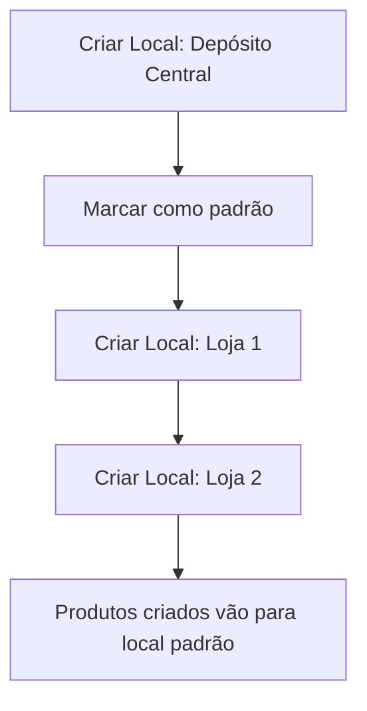
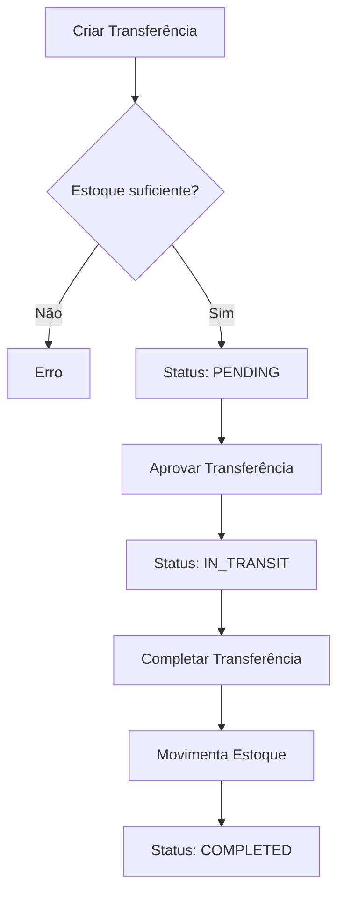

# Atualização Frontend - Locais de Estoque e Transferências

**Data**: 30 de outubro de 2025  
**Versão da API**: 1.2.0

## 📋 Índice

1. [Visão Geral](#visão-geral)
2. [Novos Endpoints](#novos-endpoints)
3. [Modelos de Dados](#modelos-de-dados)
4. [Fluxos de Uso](#fluxos-de-uso)
5. [Exemplos de Código](#exemplos-de-código)
6. [Validações e Regras](#validações-e-regras)

---

## 🎯 Visão Geral

### O que mudou?

Foram adicionados **locais de estoque** (depósitos, lojas, armazéns) e **transferências de estoque entre locais**.

### Principais Funcionalidades

✅ **Locais de Estoque**:
- Criar e gerenciar múltiplos locais (ex: Depósito Central, Loja 1, Loja 2)
- Definir um local padrão para movimentações
- Visualizar estoque de cada produto por local

✅ **Transferências**:
- Criar solicitações de transferência entre locais
- Aprovar transferências (status: PENDING → IN_TRANSIT)
- Completar transferências (movimenta estoque automaticamente)
- Cancelar transferências

### Benefícios

- **Controle multi-local**: Gerencie estoque de diferentes lojas/depósitos
- **Rastreabilidade**: Histórico completo de movimentações entre locais
- **Workflow de aprovação**: Controle sobre transferências com status
- **Estoque em tempo real**: Visualize estoque disponível em cada local

---

## 🔌 Novos Endpoints

### 1. Locais de Estoque

#### 1.1 Criar Local de Estoque

```http
POST /products/stock-locations
```

**Permissão**: `products.create`

**Body**:
```json
{
  "name": "Depósito Central",
  "code": "DEP-01",
  "description": "Depósito principal da empresa",
  "address": "Rua Principal, 123 - Centro",
  "isDefault": true,
  "active": true
}
```

**Campos**:
- `name` (string, obrigatório): Nome do local
- `code` (string, obrigatório): Código único (ex: DEP-01, LOJA-01)
- `description` (string, opcional): Descrição do local
- `address` (string, opcional): Endereço completo
- `isDefault` (boolean, opcional): Se é o local padrão
- `active` (boolean, opcional): Se está ativo

**Resposta** (201 Created):
```json
{
  "id": "uuid",
  "companyId": "uuid",
  "name": "Depósito Central",
  "code": "DEP-01",
  "description": "Depósito principal da empresa",
  "address": "Rua Principal, 123 - Centro",
  "isDefault": true,
  "active": true,
  "createdAt": "2025-10-30T10:00:00.000Z",
  "updatedAt": "2025-10-30T10:00:00.000Z"
}
```

---

#### 1.2 Listar Locais de Estoque

```http
GET /products/stock-locations
```

**Permissão**: `products.read`

**Resposta** (200 OK):
```json
[
  {
    "id": "uuid",
    "name": "Depósito Central",
    "code": "DEP-01",
    "description": "Depósito principal",
    "address": "Rua Principal, 123",
    "isDefault": true,
    "active": true,
    "_count": {
      "productStocks": 150,
      "stockMovements": 542
    },
    "createdAt": "2025-10-30T10:00:00.000Z"
  },
  {
    "id": "uuid",
    "name": "Loja Shopping Center",
    "code": "LOJA-01",
    "description": "Loja no shopping",
    "address": "Shopping Center, Loja 234",
    "isDefault": false,
    "active": true,
    "_count": {
      "productStocks": 85,
      "stockMovements": 321
    },
    "createdAt": "2025-10-30T11:00:00.000Z"
  }
]
```

---

#### 1.3 Buscar Local por ID

```http
GET /products/stock-locations/:id
```

**Permissão**: `products.read`

**Resposta**: Igual ao item 1.2

---

#### 1.4 Atualizar Local

```http
PATCH /products/stock-locations/:id
```

**Permissão**: `products.update`

**Body** (todos os campos opcionais):
```json
{
  "name": "Depósito Central - Matriz",
  "active": false
}
```

---

#### 1.5 Deletar Local

```http
DELETE /products/stock-locations/:id
```

**Permissão**: `products.delete`

**Resposta** (200 OK):
```json
{
  "message": "Local de estoque deletado com sucesso"
}
```

**Validações**:
- ❌ Não permite deletar se houver estoque no local
- ❌ Não permite deletar se houver transferências pendentes

---

### 2. Estoque por Local

#### 2.1 Ver Estoque de um Produto por Local

```http
GET /products/:productId/stock-by-location
```

**Permissão**: `products.read`

**Resposta** (200 OK):
```json
{
  "product": {
    "id": "uuid",
    "name": "Notebook Dell Inspiron 15",
    "sku": "DELL-NB-001",
    "totalStock": 35
  },
  "stocksByLocation": [
    {
      "id": "uuid",
      "productId": "uuid",
      "locationId": "uuid",
      "quantity": 25,
      "location": {
        "id": "uuid",
        "name": "Depósito Central",
        "code": "DEP-01",
        "active": true
      },
      "updatedAt": "2025-10-30T12:00:00.000Z"
    },
    {
      "id": "uuid",
      "productId": "uuid",
      "locationId": "uuid",
      "quantity": 10,
      "location": {
        "id": "uuid",
        "name": "Loja Shopping Center",
        "code": "LOJA-01",
        "active": true
      },
      "updatedAt": "2025-10-30T12:00:00.000Z"
    }
  ]
}
```

---

#### 2.2 Ver Todo o Estoque Agrupado por Local

```http
GET /products/stock/by-location
GET /products/stock/by-location?locationId=uuid
```

**Permissão**: `products.read`

**Query Params**:
- `locationId` (UUID, opcional): Filtrar por local específico

**Resposta** (200 OK):
```json
[
  {
    "id": "uuid",
    "productId": "uuid",
    "locationId": "uuid",
    "quantity": 25,
    "product": {
      "id": "uuid",
      "name": "Notebook Dell",
      "sku": "DELL-NB-001",
      "barcode": "7891234567890",
      "unit": {
        "abbreviation": "UN"
      }
    },
    "location": {
      "id": "uuid",
      "name": "Depósito Central",
      "code": "DEP-01"
    },
    "updatedAt": "2025-10-30T12:00:00.000Z"
  }
]
```

---

### 3. Transferências de Estoque

#### 3.1 Criar Transferência

```http
POST /products/stock-transfers
```

**Permissão**: `products.manage_stock`

**Body**:
```json
{
  "fromLocationId": "uuid-deposito",
  "toLocationId": "uuid-loja",
  "items": [
    {
      "productId": "uuid-produto-1",
      "quantity": 10,
      "notes": "Reposição de estoque da loja"
    },
    {
      "productId": "uuid-produto-2",
      "quantity": 5
    }
  ],
  "notes": "Transferência semanal para reposição"
}
```

**Campos**:
- `fromLocationId` (UUID, obrigatório): Local de origem
- `toLocationId` (UUID, obrigatório): Local de destino
- `items` (array, obrigatório): Lista de produtos a transferir
  - `productId` (UUID): ID do produto
  - `quantity` (number): Quantidade a transferir
  - `notes` (string, opcional): Observações do item
- `notes` (string, opcional): Observações gerais da transferência

**Resposta** (201 Created):
```json
{
  "id": "uuid",
  "companyId": "uuid",
  "code": "TRANS-000001",
  "fromLocationId": "uuid",
  "toLocationId": "uuid",
  "status": "PENDING",
  "notes": "Transferência semanal para reposição",
  "requestedBy": "user-uuid",
  "requestedAt": "2025-10-30T13:00:00.000Z",
  "fromLocation": {
    "id": "uuid",
    "name": "Depósito Central",
    "code": "DEP-01"
  },
  "toLocation": {
    "id": "uuid",
    "name": "Loja Shopping Center",
    "code": "LOJA-01"
  },
  "items": [
    {
      "id": "uuid",
      "transferId": "uuid",
      "productId": "uuid",
      "quantity": 10,
      "notes": "Reposição de estoque da loja",
      "product": {
        "id": "uuid",
        "name": "Notebook Dell",
        "sku": "DELL-NB-001"
      }
    }
  ],
  "createdAt": "2025-10-30T13:00:00.000Z"
}
```

**Validações**:
- ❌ Local de origem e destino não podem ser iguais
- ❌ Valida se há estoque suficiente no local de origem
- ❌ Valida se produtos existem

---

#### 3.2 Listar Transferências

```http
GET /products/stock-transfers
GET /products/stock-transfers?status=PENDING
```

**Permissão**: `products.read`

**Query Params**:
- `status` (string, opcional): Filtrar por status
  - `PENDING`: Aguardando aprovação
  - `IN_TRANSIT`: Aprovada, em trânsito
  - `COMPLETED`: Completada
  - `CANCELLED`: Cancelada

**Resposta** (200 OK):
```json
[
  {
    "id": "uuid",
    "code": "TRANS-000001",
    "status": "PENDING",
    "fromLocation": {
      "id": "uuid",
      "name": "Depósito Central",
      "code": "DEP-01"
    },
    "toLocation": {
      "id": "uuid",
      "name": "Loja Shopping Center",
      "code": "LOJA-01"
    },
    "items": [
      {
        "id": "uuid",
        "quantity": 10,
        "product": {
          "id": "uuid",
          "name": "Notebook Dell",
          "sku": "DELL-NB-001"
        }
      }
    ],
    "requestedAt": "2025-10-30T13:00:00.000Z",
    "createdAt": "2025-10-30T13:00:00.000Z"
  }
]
```

---

#### 3.3 Buscar Transferência por ID

```http
GET /products/stock-transfers/:id
```

**Permissão**: `products.read`

**Resposta**: Igual ao item 3.1

---

#### 3.4 Aprovar Transferência

```http
PATCH /products/stock-transfers/:id/approve
```

**Permissão**: `products.manage_stock`

**Resposta** (200 OK):
```json
{
  "id": "uuid",
  "code": "TRANS-000001",
  "status": "IN_TRANSIT",
  "approvedBy": "user-uuid",
  "approvedAt": "2025-10-30T14:00:00.000Z",
  ...
}
```

**Validações**:
- ❌ Apenas transferências com status `PENDING` podem ser aprovadas
- ❌ Valida novamente o estoque disponível

---

#### 3.5 Completar Transferência

```http
PATCH /products/stock-transfers/:id/complete
```

**Permissão**: `products.manage_stock`

**Resposta** (200 OK):
```json
{
  "id": "uuid",
  "code": "TRANS-000001",
  "status": "COMPLETED",
  "completedBy": "user-uuid",
  "completedAt": "2025-10-30T15:00:00.000Z",
  ...
}
```

**O que acontece**:
1. ✅ Subtrai quantidades do local de origem
2. ✅ Adiciona quantidades no local de destino
3. ✅ Cria movimentações de estoque (tipo `TRANSFER`)
4. ✅ Atualiza status para `COMPLETED`

**Validações**:
- ❌ Apenas transferências `IN_TRANSIT` ou `PENDING` podem ser completadas

---

#### 3.6 Cancelar Transferência

```http
PATCH /products/stock-transfers/:id/cancel
```

**Permissão**: `products.manage_stock`

**Resposta** (200 OK):
```json
{
  "id": "uuid",
  "code": "TRANS-000001",
  "status": "CANCELLED",
  ...
}
```

**Validações**:
- ❌ Não é possível cancelar transferências já completadas

---

## 📦 Modelos de Dados

### StockLocation

```typescript
interface StockLocation {
  id: string;
  companyId: string;
  name: string;             // "Depósito Central"
  code: string;             // "DEP-01" (único por empresa)
  description?: string;     // Descrição do local
  address?: string;         // Endereço completo
  isDefault: boolean;       // Local padrão
  active: boolean;
  createdAt: Date;
  updatedAt: Date;
}
```

---

### ProductStockByLocation

```typescript
interface ProductStockByLocation {
  id: string;
  companyId: string;
  productId: string;
  locationId: string;
  quantity: number;         // Quantidade em estoque neste local
  product: Product;
  location: StockLocation;
  createdAt: Date;
  updatedAt: Date;
}
```

---

### StockTransfer

```typescript
interface StockTransfer {
  id: string;
  companyId: string;
  code: string;             // "TRANS-000001" (único)
  fromLocationId: string;
  toLocationId: string;
  status: 'PENDING' | 'IN_TRANSIT' | 'COMPLETED' | 'CANCELLED';
  notes?: string;
  requestedBy?: string;     // User ID
  approvedBy?: string;
  completedBy?: string;
  requestedAt: Date;
  approvedAt?: Date;
  completedAt?: Date;
  fromLocation: StockLocation;
  toLocation: StockLocation;
  items: StockTransferItem[];
  createdAt: Date;
  updatedAt: Date;
}
```

---

### StockTransferItem

```typescript
interface StockTransferItem {
  id: string;
  transferId: string;
  productId: string;
  quantity: number;
  notes?: string;
  product: Product;
  createdAt: Date;
  updatedAt: Date;
}
```

---

## 🔄 Fluxos de Uso

### Fluxo 1: Configuração Inicial



**Código**:
```typescript
// 1. Criar depósito central
const deposito = await api.post('/products/stock-locations', {
  name: 'Depósito Central',
  code: 'DEP-01',
  isDefault: true,
  active: true
});

// 2. Criar lojas
const loja1 = await api.post('/products/stock-locations', {
  name: 'Loja Shopping Center',
  code: 'LOJA-01',
  active: true
});
```

---

### Fluxo 2: Transferência entre Locais



**Código**:
```typescript
// 1. Criar transferência
const transfer = await api.post('/products/stock-transfers', {
  fromLocationId: depositoId,
  toLocationId: lojaId,
  items: [
    {
      productId: produto1Id,
      quantity: 10
    }
  ],
  notes: 'Reposição semanal'
});
// Status: PENDING

// 2. Aprovar
await api.patch(`/products/stock-transfers/${transfer.id}/approve`);
// Status: IN_TRANSIT

// 3. Completar (movimenta estoque)
await api.patch(`/products/stock-transfers/${transfer.id}/complete`);
// Status: COMPLETED
```

---

### Fluxo 3: Consultar Estoque por Local

```typescript
// Ver estoque de um produto específico em todos os locais
const { product, stocksByLocation } = await api.get(
  `/products/${productId}/stock-by-location`
);

console.log(`${product.name} - Estoque Total: ${product.totalStock}`);
stocksByLocation.forEach(stock => {
  console.log(`  ${stock.location.name}: ${stock.quantity} un`);
});

// Output:
// Notebook Dell - Estoque Total: 35
//   Depósito Central: 25 un
//   Loja Shopping: 10 un
```

---

## 💻 Exemplos de Código

### React - Listar Locais de Estoque

```tsx
import React, { useEffect, useState } from 'react';
import { api } from './api';

interface StockLocation {
  id: string;
  name: string;
  code: string;
  isDefault: boolean;
  active: boolean;
  _count: {
    productStocks: number;
    stockMovements: number;
  };
}

export function StockLocationsPage() {
  const [locations, setLocations] = useState<StockLocation[]>([]);
  const [loading, setLoading] = useState(true);

  useEffect(() => {
    loadLocations();
  }, []);

  async function loadLocations() {
    try {
      const response = await api.get('/products/stock-locations');
      setLocations(response.data);
    } catch (error) {
      console.error('Erro ao carregar locais:', error);
    } finally {
      setLoading(false);
    }
  }

  if (loading) return <div>Carregando...</div>;

  return (
    <div>
      <h1>Locais de Estoque</h1>
      <table>
        <thead>
          <tr>
            <th>Código</th>
            <th>Nome</th>
            <th>Produtos</th>
            <th>Movimentações</th>
            <th>Status</th>
          </tr>
        </thead>
        <tbody>
          {locations.map(location => (
            <tr key={location.id}>
              <td>
                {location.code}
                {location.isDefault && <span> (Padrão)</span>}
              </td>
              <td>{location.name}</td>
              <td>{location._count.productStocks}</td>
              <td>{location._count.stockMovements}</td>
              <td>{location.active ? 'Ativo' : 'Inativo'}</td>
            </tr>
          ))}
        </tbody>
      </table>
    </div>
  );
}
```

---

### React - Criar Transferência

```tsx
import React, { useState } from 'react';
import { api } from './api';

export function CreateTransferForm() {
  const [formData, setFormData] = useState({
    fromLocationId: '',
    toLocationId: '',
    items: [{ productId: '', quantity: 0 }],
    notes: ''
  });

  const addItem = () => {
    setFormData(prev => ({
      ...prev,
      items: [...prev.items, { productId: '', quantity: 0 }]
    }));
  };

  const removeItem = (index: number) => {
    setFormData(prev => ({
      ...prev,
      items: prev.items.filter((_, i) => i !== index)
    }));
  };

  const updateItem = (index: number, field: string, value: any) => {
    setFormData(prev => ({
      ...prev,
      items: prev.items.map((item, i) => 
        i === index ? { ...item, [field]: value } : item
      )
    }));
  };

  const handleSubmit = async (e: React.FormEvent) => {
    e.preventDefault();
    
    try {
      const response = await api.post('/products/stock-transfers', formData);
      alert(`Transferência ${response.data.code} criada com sucesso!`);
      // Redirecionar ou limpar form
    } catch (error) {
      console.error('Erro ao criar transferência:', error);
      alert('Erro ao criar transferência');
    }
  };

  return (
    <form onSubmit={handleSubmit}>
      <h2>Nova Transferência de Estoque</h2>
      
      <div>
        <label>Local de Origem:</label>
        <select 
          value={formData.fromLocationId}
          onChange={e => setFormData({...formData, fromLocationId: e.target.value})}
          required
        >
          <option value="">Selecione...</option>
          {/* Carregar locais via API */}
        </select>
      </div>

      <div>
        <label>Local de Destino:</label>
        <select 
          value={formData.toLocationId}
          onChange={e => setFormData({...formData, toLocationId: e.target.value})}
          required
        >
          <option value="">Selecione...</option>
          {/* Carregar locais via API */}
        </select>
      </div>

      <div>
        <h3>Produtos</h3>
        {formData.items.map((item, index) => (
          <div key={index}>
            <select
              value={item.productId}
              onChange={e => updateItem(index, 'productId', e.target.value)}
              required
            >
              <option value="">Selecione o produto...</option>
              {/* Carregar produtos via API */}
            </select>
            
            <input
              type="number"
              min="0.001"
              step="0.001"
              value={item.quantity}
              onChange={e => updateItem(index, 'quantity', parseFloat(e.target.value))}
              placeholder="Quantidade"
              required
            />
            
            {formData.items.length > 1 && (
              <button type="button" onClick={() => removeItem(index)}>
                Remover
              </button>
            )}
          </div>
        ))}
        <button type="button" onClick={addItem}>
          Adicionar Produto
        </button>
      </div>

      <div>
        <label>Observações:</label>
        <textarea
          value={formData.notes}
          onChange={e => setFormData({...formData, notes: e.target.value})}
        />
      </div>

      <button type="submit">Criar Transferência</button>
    </form>
  );
}
```

---

### React - Card de Status da Transferência

```tsx
interface StockTransfer {
  id: string;
  code: string;
  status: string;
  fromLocation: { name: string };
  toLocation: { name: string };
  items: Array<{
    quantity: number;
    product: { name: string };
  }>;
  requestedAt: string;
}

export function TransferCard({ transfer }: { transfer: StockTransfer }) {
  const statusColors = {
    PENDING: 'yellow',
    IN_TRANSIT: 'blue',
    COMPLETED: 'green',
    CANCELLED: 'red'
  };

  const statusLabels = {
    PENDING: 'Pendente',
    IN_TRANSIT: 'Em Trânsito',
    COMPLETED: 'Completada',
    CANCELLED: 'Cancelada'
  };

  const handleApprove = async () => {
    try {
      await api.patch(`/products/stock-transfers/${transfer.id}/approve`);
      alert('Transferência aprovada!');
      // Recarregar dados
    } catch (error) {
      console.error('Erro ao aprovar:', error);
    }
  };

  const handleComplete = async () => {
    if (!confirm('Confirma a conclusão da transferência? O estoque será movimentado.')) {
      return;
    }
    
    try {
      await api.patch(`/products/stock-transfers/${transfer.id}/complete`);
      alert('Transferência completada!');
      // Recarregar dados
    } catch (error) {
      console.error('Erro ao completar:', error);
    }
  };

  const handleCancel = async () => {
    if (!confirm('Confirma o cancelamento da transferência?')) {
      return;
    }
    
    try {
      await api.patch(`/products/stock-transfers/${transfer.id}/cancel`);
      alert('Transferência cancelada!');
      // Recarregar dados
    } catch (error) {
      console.error('Erro ao cancelar:', error);
    }
  };

  return (
    <div className="transfer-card">
      <div className="transfer-header">
        <h3>{transfer.code}</h3>
        <span 
          className="status-badge"
          style={{ backgroundColor: statusColors[transfer.status] }}
        >
          {statusLabels[transfer.status]}
        </span>
      </div>

      <div className="transfer-route">
        <span>{transfer.fromLocation.name}</span>
        <span>→</span>
        <span>{transfer.toLocation.name}</span>
      </div>

      <div className="transfer-items">
        <h4>Itens ({transfer.items.length})</h4>
        <ul>
          {transfer.items.map((item, index) => (
            <li key={index}>
              {item.product.name} - {item.quantity} un
            </li>
          ))}
        </ul>
      </div>

      <div className="transfer-actions">
        {transfer.status === 'PENDING' && (
          <>
            <button onClick={handleApprove}>Aprovar</button>
            <button onClick={handleCancel}>Cancelar</button>
          </>
        )}
        {transfer.status === 'IN_TRANSIT' && (
          <>
            <button onClick={handleComplete}>Completar</button>
            <button onClick={handleCancel}>Cancelar</button>
          </>
        )}
      </div>

      <div className="transfer-date">
        Solicitada em {new Date(transfer.requestedAt).toLocaleString()}
      </div>
    </div>
  );
}
```

---

## ✅ Validações e Regras

### Locais de Estoque

| Regra | Descrição |
|-------|-----------|
| ✅ Código único | Cada local deve ter um código único por empresa |
| ✅ Local padrão único | Apenas um local pode ser marcado como padrão |
| ❌ Deletar com estoque | Não permite deletar local que possui estoque |
| ❌ Deletar com transferências | Não permite deletar se houver transferências pendentes/em trânsito |

---

### Transferências

| Regra | Descrição |
|-------|-----------|
| ❌ Locais iguais | Origem e destino não podem ser o mesmo local |
| ✅ Validação de estoque | Verifica estoque disponível na origem ao criar/aprovar |
| ❌ Aprovar sem estoque | Não permite aprovar se não houver estoque suficiente |
| ❌ Completar sem aprovação | Apenas transferências IN_TRANSIT ou PENDING podem ser completadas |
| ❌ Cancelar completada | Não é possível cancelar transferência já completada |
| ✅ Movimentação automática | Ao completar, estoque é movido automaticamente |
| ✅ Histórico de movimentações | Cria registros de movimentação tipo TRANSFER |

---

### Status das Transferências

| Status | Pode Aprovar | Pode Completar | Pode Cancelar | Movimenta Estoque |
|--------|--------------|----------------|---------------|-------------------|
| PENDING | ✅ Sim | ✅ Sim | ✅ Sim | ❌ Não |
| IN_TRANSIT | ❌ Não | ✅ Sim | ✅ Sim | ❌ Não |
| COMPLETED | ❌ Não | ❌ Não | ❌ Não | ✅ Já movimentou |
| CANCELLED | ❌ Não | ❌ Não | ❌ Não | ❌ Não |

---

## 🎨 Sugestões de UI/UX

### Dashboard de Estoque

```
┌─────────────────────────────────────────────┐
│  Estoque por Local                          │
├─────────────────────────────────────────────┤
│  Depósito Central (DEP-01)                  │
│    150 produtos | R$ 125.450,00             │
│                                             │
│  Loja Shopping (LOJA-01)                    │
│    85 produtos | R$ 45.230,00               │
│                                             │
│  Loja Centro (LOJA-02)                      │
│    62 produtos | R$ 28.120,00               │
└─────────────────────────────────────────────┘
```

### Lista de Transferências

```
┌─────────────────────────────────────────────┐
│  TRANS-000001  [Pendente]                   │
│  DEP-01 → LOJA-01                           │
│  3 itens | Solicitada há 2 horas            │
│  [Aprovar] [Cancelar]                       │
├─────────────────────────────────────────────┤
│  TRANS-000002  [Em Trânsito]               │
│  DEP-01 → LOJA-02                           │
│  5 itens | Aprovada há 1 dia                │
│  [Completar] [Cancelar]                     │
└─────────────────────────────────────────────┘
```

### Detalhes do Produto - Estoque por Local

```
┌─────────────────────────────────────────────┐
│  Notebook Dell Inspiron 15                  │
│  SKU: DELL-NB-001                           │
├─────────────────────────────────────────────┤
│  Estoque Total: 35 unidades                 │
│                                             │
│  Por Local:                                 │
│    • Depósito Central: 25 un                │
│    • Loja Shopping: 10 un                   │
│    • Loja Centro: 0 un                      │
│                                             │
│  [Transferir Entre Locais]                  │
└─────────────────────────────────────────────┘
```

---

## 📝 Checklist de Implementação

### Backend ✅
- [x] Modelos Prisma criados
- [x] Migration aplicada
- [x] DTOs criados
- [x] Service implementado
- [x] Controller implementado
- [x] Validações implementadas
- [x] Documentação criada

### Frontend 📋
- [ ] Criar páginas de locais de estoque
  - [ ] Listagem
  - [ ] Formulário de criação
  - [ ] Edição
  - [ ] Visualização
- [ ] Criar páginas de transferências
  - [ ] Listagem com filtros por status
  - [ ] Formulário de criação
  - [ ] Detalhes da transferência
  - [ ] Ações (aprovar, completar, cancelar)
- [ ] Atualizar página de produtos
  - [ ] Adicionar visualização de estoque por local
  - [ ] Botão "Transferir" para criar transferência
- [ ] Criar componentes reutilizáveis
  - [ ] StockLocationSelector
  - [ ] TransferStatusBadge
  - [ ] StockByLocationTable
- [ ] Adicionar notificações
  - [ ] Transferência pendente de aprovação
  - [ ] Estoque baixo em algum local
- [ ] Testes
  - [ ] Testes unitários dos componentes
  - [ ] Testes de integração dos fluxos

---

## 🚀 Próximos Passos

1. **Imediato**:
   - Implementar telas de locais de estoque
   - Implementar telas de transferências
   - Adicionar visualização de estoque por local nas páginas de produtos

2. **Curto Prazo**:
   - Dashboard com métricas de transferências
   - Relatórios de estoque por local
   - Notificações de transferências pendentes

3. **Médio Prazo**:
   - App mobile para gerentes de loja aprovarem transferências
   - Impressão de guia de transferência
   - Códigos QR para rastreamento

---

## 📞 Suporte

Para dúvidas sobre a implementação:
- Consulte a documentação completa em `/docs/API_PRODUCTS.md`
- Entre em contato com a equipe de backend

**Versão do Documento**: 1.0  
**Última Atualização**: 30/10/2025
