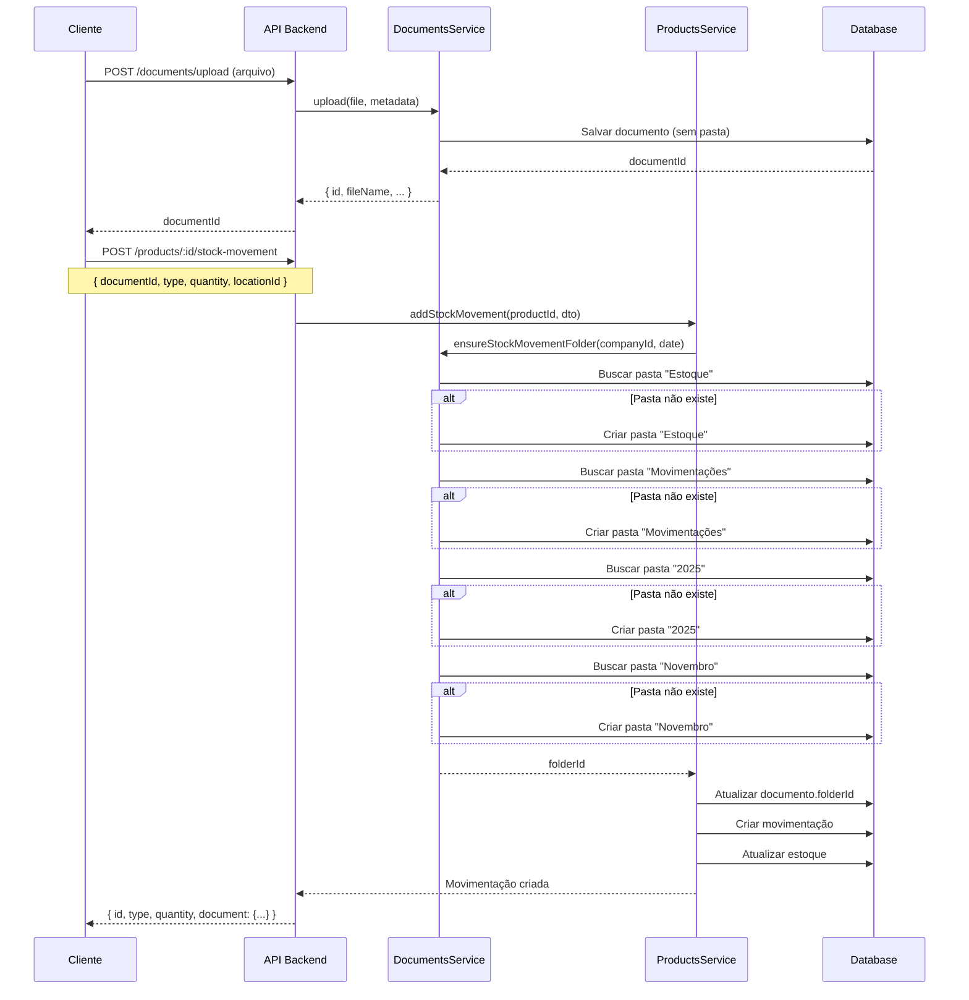

# 📦 Movimentações e Transferências de Estoque com Documentos

**Data**: 5 de novembro de 2025  
**Versão**: 1.0  
**Documentação Técnica Completa**

---

## 📋 Índice

1. [Visão Geral](#visão-geral)
2. [Fluxo de Upload Automático](#fluxo-de-upload-automático)
3. [Endpoints de Movimentações](#endpoints-de-movimentações)
4. [Endpoints de Transferências](#endpoints-de-transferências)
5. [Endpoints de Documentos](#endpoints-de-documentos)
6. [Exemplos Práticos Completos](#exemplos-práticos-completos)
7. [Tratamento de Erros](#tratamento-de-erros)
8. [Casos de Uso Reais](#casos-de-uso-reais)

---

## 🎯 Visão Geral

### Sistema de Organização Automática

O sistema oferece **duas formas** de organizar documentos automaticamente:

#### 1️⃣ Organização no Upload (Recomendado)

Use o campo `context` ao fazer upload do documento:

```javascript
formData.append('context', 'stock_movement');  // ou 'stock_transfer'
```

✅ **Vantagem**: Documento já é criado na pasta correta desde o início  
✅ **Resultado**: Sem documentos "soltos" no hub  
✅ **Quando usar**: Sempre que souber o contexto antes do upload

#### 2️⃣ Organização ao Vincular

Vincule o documento a uma movimentação/transferência, e o sistema **automaticamente**:

1. ✅ Valida se o documento existe
2. ✅ Cria a estrutura de pastas (se não existir)
3. ✅ Move o documento para a pasta correta (se estiver sem pasta)
4. ✅ Atualiza o registro do documento com a nova localização
5. ✅ Vincula o documento à movimentação/transferência

✅ **Quando usar**: Quando o documento foi enviado sem contexto

### Estrutura de Pastas Criada Automaticamente

```
📁 Documentos (Hub)
  └─ 📁 Estoque
      ├─ 📁 Movimentações
      │   ├─ 📁 2025
      │   │   ├─ 📁 Janeiro
      │   │   │   └─ 📄 nota_fiscal_entrada_001.pdf
      │   │   ├─ 📁 Fevereiro
      │   │   └─ 📁 Novembro
      │   │       └─ 📄 nota_fiscal_entrada_123.pdf
      │   └─ 📁 2024
      │       └─ 📁 Dezembro
      └─ 📁 Transferências
          └─ 📁 2025
              └─ 📁 Novembro
                  └─ 📄 guia_transferencia_001.pdf
```

---

## 🔄 Fluxo de Upload Automático

### Diagrama de Fluxo



---

## 📥 Endpoints de Movimentações

### 1. Criar Movimentação de Estoque

```http
POST /products/:productId/stock-movement
```

**Autenticação**: Bearer Token  
**Permissão**: `products.manage_stock`

#### Request Headers

```http
Authorization: Bearer {token}
Content-Type: application/json
```

#### Path Parameters

| Parâmetro | Tipo | Descrição |
|-----------|------|-----------|
| `productId` | string (UUID) | ID do produto |

#### Request Body

```typescript
{
  type: 'ENTRY' | 'EXIT' | 'ADJUSTMENT' | 'RETURN' | 'LOSS';
  quantity: number;              // Quantidade (obrigatório, > 0)
  locationId: string;            // UUID do local (obrigatório)
  documentId?: string;           // UUID do documento (opcional)
  reason?: string;               // Motivo da movimentação
  notes?: string;                // Observações adicionais
  reference?: string;            // Referência externa (nº pedido, etc)
}
```

#### Tipos de Movimentação

| Tipo | Descrição | Efeito no Estoque | Documentos Comuns |
|------|-----------|-------------------|-------------------|
| `ENTRY` | Entrada | ➕ Aumenta | Nota Fiscal de Compra, Recibo |
| `EXIT` | Saída | ➖ Diminui | Nota Fiscal de Venda, Requisição |
| `ADJUSTMENT` | Ajuste | ➕➖ Ajusta | Termo de Ajuste, Inventário |
| `RETURN` | Devolução | ➕➖ Varia | Nota de Devolução |
| `LOSS` | Perda | ➖ Diminui | Laudo de Perda, Termo de Baixa |

#### Response (201 Created)

```json
{
  "id": "mov-uuid-123",
  "companyId": "company-uuid",
  "productId": "prod-uuid-456",
  "type": "ENTRY",
  "quantity": 50,
  "previousStock": 100,
  "newStock": 150,
  "locationId": "loc-uuid-789",
  "location": {
    "id": "loc-uuid-789",
    "name": "Armazém Principal",
    "code": "ARM-01"
  },
  "documentId": "doc-uuid-abc",
  "document": {
    "id": "doc-uuid-abc",
    "fileName": "nota_fiscal_12345.pdf",
    "fileUrl": "/uploads/documents/estoque/movimentacoes/2025/novembro/nota_fiscal_12345.pdf",
    "title": "Nota Fiscal 12345",
    "type": "nota_fiscal_entrada",
    "folderId": "folder-uuid-xyz",
    "folder": {
      "id": "folder-uuid-xyz",
      "name": "Novembro",
      "path": "Estoque/Movimentações/2025/Novembro"
    }
  },
  "reason": "Compra de fornecedor X",
  "notes": "NF 12345 - Entrega completa",
  "reference": "PEDIDO-001",
  "userId": "user-uuid",
  "user": {
    "id": "user-uuid",
    "name": "João Silva",
    "email": "joao@empresa.com"
  },
  "createdAt": "2025-11-05T14:30:00.000Z"
}
```

#### Comportamento do Sistema

1. **Validação do Produto**
   - Verifica se produto existe e pertence à empresa
   - Verifica se `manageStock` está habilitado

2. **Validação do Local**
   - Verifica se local existe e pertence à empresa
   - Verifica se local está ativo (`active: true`)

3. **Validação de Estoque (para EXIT e LOSS)**
   - Verifica se há estoque suficiente no local
   - Lança erro se quantidade > estoque disponível

4. **Processamento do Documento (se fornecido)**
   - Valida se documento existe e pertence à empresa
   - Se documento não tem pasta (`folderId` null):
     - Cria estrutura: `Estoque/Movimentações/2025/Novembro`
     - Move documento para a pasta correta
   - Se documento já está em pasta, mantém

5. **Atualização de Estoque**
   - Atualiza `ProductStockByLocation` (estoque por local)
   - Atualiza `Product.currentStock` (estoque total)
   - Cria registro em `ProductStockMovement` (histórico)

6. **Auditoria**
   - Registra ação em `AuditLog`
   - Inclui valores anteriores e novos

---

### 2. Listar Movimentações de um Produto

```http
GET /products/:productId/stock-movements
```

**Autenticação**: Bearer Token  
**Permissão**: `products.view`

#### Query Parameters

```typescript
{
  type?: 'ENTRY' | 'EXIT' | 'ADJUSTMENT' | 'RETURN' | 'LOSS';
  locationId?: string;           // Filtrar por local
  startDate?: string;            // ISO 8601 (ex: 2025-01-01)
  endDate?: string;              // ISO 8601
  page?: number;                 // Padrão: 1
  limit?: number;                // Padrão: 50
}
```

#### Response (200 OK)

```json
{
  "data": [
    {
      "id": "mov-1",
      "type": "ENTRY",
      "quantity": 50,
      "previousStock": 100,
      "newStock": 150,
      "location": {
        "id": "loc-1",
        "name": "Armazém Principal",
        "code": "ARM-01"
      },
      "document": {
        "id": "doc-1",
        "fileName": "nota_fiscal_12345.pdf",
        "fileUrl": "/uploads/.../nota_fiscal_12345.pdf",
        "title": "NF 12345"
      },
      "reason": "Compra de fornecedor X",
      "user": {
        "name": "João Silva"
      },
      "createdAt": "2025-11-05T14:30:00Z"
    }
  ],
  "total": 45,
  "page": 1,
  "limit": 50
}
```

---

## 🔀 Endpoints de Transferências

### 1. Criar Transferência

```http
POST /products/stock-transfers
```

**Autenticação**: Bearer Token  
**Permissão**: `products.manage_transfers`

#### Request Body

```typescript
{
  fromLocationId: string;        // UUID do local de origem (obrigatório)
  toLocationId: string;          // UUID do local de destino (obrigatório)
  items: [                       // Lista de produtos (obrigatório, min: 1)
    {
      productId: string;         // UUID do produto
      quantity: number;          // Quantidade (> 0)
      notes?: string;            // Observações do item
    }
  ];
  documentId?: string;           // UUID do documento (opcional)
  notes?: string;                // Observações da transferência
}
```

#### Validações

- `fromLocationId` ≠ `toLocationId`
- Ambos os locais devem existir e estar ativos
- Todos os produtos devem ter estoque suficiente no local de origem
- Documento (se fornecido) deve existir

#### Response (201 Created)

```json
{
  "id": "trans-uuid-123",
  "code": "TRANS-000001",
  "companyId": "company-uuid",
  "status": "PENDING",
  "fromLocationId": "loc-from-uuid",
  "fromLocation": {
    "id": "loc-from-uuid",
    "name": "Armazém Principal",
    "code": "ARM-01"
  },
  "toLocationId": "loc-to-uuid",
  "toLocation": {
    "id": "loc-to-uuid",
    "name": "Loja Centro",
    "code": "LJ-CENTRO"
  },
  "documentId": "doc-uuid",
  "document": {
    "id": "doc-uuid",
    "fileName": "guia_transferencia_001.pdf",
    "fileUrl": "/uploads/documents/estoque/transferencias/2025/novembro/guia_transferencia_001.pdf",
    "title": "Guia de Transferência 001",
    "type": "guia_transferencia",
    "folderId": "folder-uuid",
    "folder": {
      "name": "Novembro",
      "path": "Estoque/Transferências/2025/Novembro"
    }
  },
  "items": [
    {
      "id": "item-1",
      "productId": "prod-1",
      "product": {
        "id": "prod-1",
        "name": "Notebook Dell",
        "sku": "NB-DELL-001"
      },
      "quantity": 5,
      "notes": "Produto em perfeito estado"
    },
    {
      "id": "item-2",
      "productId": "prod-2",
      "product": {
        "id": "prod-2",
        "name": "Mouse Logitech",
        "sku": "MS-LOG-001"
      },
      "quantity": 10
    }
  ],
  "notes": "Transferência para reposição de loja",
  "requestedById": "user-uuid",
  "requestedBy": {
    "name": "João Silva"
  },
  "createdAt": "2025-11-05T10:00:00Z"
}
```

#### Comportamento do Sistema

1. **Validações Iniciais**
   - Locais diferentes
   - Locais existem e ativos
   - Produtos existem
   - Estoque suficiente em cada item

2. **Geração de Código**
   - Formato: `TRANS-XXXXXX`
   - Número sequencial automático

3. **Processamento do Documento**
   - Se `documentId` fornecido e documento sem pasta:
     - Cria estrutura: `Estoque/Transferências/2025/Novembro`
     - Move documento para pasta correta

4. **Criação da Transferência**
   - Status inicial: `PENDING`
   - Cria itens da transferência
   - Não altera estoque ainda (aguarda aprovação)

---

### 2. Aprovar Transferência

```http
PATCH /products/stock-transfers/:id/approve
```

**Autenticação**: Bearer Token  
**Permissão**: `products.approve_transfers`

#### Path Parameters

| Parâmetro | Tipo | Descrição |
|-----------|------|-----------|
| `id` | string (UUID) | ID da transferência |

#### Request Body

Vazio (sem body necessário)

#### Response (200 OK)

```json
{
  "id": "trans-uuid-123",
  "code": "TRANS-000001",
  "status": "IN_TRANSIT",
  "approvedById": "manager-uuid",
  "approvedBy": {
    "id": "manager-uuid",
    "name": "Maria Santos",
    "email": "maria@empresa.com"
  },
  "approvedAt": "2025-11-05T11:00:00Z",
  "fromLocation": {
    "name": "Armazém Principal"
  },
  "toLocation": {
    "name": "Loja Centro"
  },
  "items": [
    {
      "product": {
        "name": "Notebook Dell"
      },
      "quantity": 5
    }
  ]
}
```

#### Comportamento

- Status muda de `PENDING` → `IN_TRANSIT`
- Registra quem aprovou e quando
- Estoque ainda não é movido
- Não pode aprovar se status ≠ `PENDING`

---

### 3. Completar Transferência

```http
PATCH /products/stock-transfers/:id/complete
```

**Autenticação**: Bearer Token  
**Permissão**: `products.manage_transfers`

#### Response (200 OK)

```json
{
  "id": "trans-uuid-123",
  "code": "TRANS-000001",
  "status": "COMPLETED",
  "completedById": "user-uuid",
  "completedBy": {
    "name": "Carlos Recebimento"
  },
  "completedAt": "2025-11-05T15:30:00Z",
  "stockMovements": [
    {
      "id": "mov-1",
      "type": "TRANSFER",
      "productId": "prod-1",
      "quantity": -5,
      "locationId": "loc-from"
    },
    {
      "id": "mov-2",
      "type": "TRANSFER",
      "productId": "prod-1",
      "quantity": 5,
      "locationId": "loc-to"
    }
  ]
}
```

#### Comportamento

1. **Validação**
   - Status deve ser `IN_TRANSIT`
   - Transferência não pode estar cancelada

2. **Movimentação de Estoque**
   - Para cada item:
     - Diminui estoque do local de origem
     - Aumenta estoque do local de destino
     - Cria 2 movimentações do tipo `TRANSFER`

3. **Finalização**
   - Status → `COMPLETED`
   - Registra quem completou e quando
   - Auditoria completa

---

### 4. Cancelar Transferência

```http
PATCH /products/stock-transfers/:id/cancel
```

**Autenticação**: Bearer Token  
**Permissão**: `products.manage_transfers`

#### Request Body

```json
{
  "reason": "Motivo do cancelamento"
}
```

#### Response (200 OK)

```json
{
  "id": "trans-uuid-123",
  "code": "TRANS-000001",
  "status": "CANCELLED",
  "cancelledById": "user-uuid",
  "cancelledBy": {
    "name": "João Silva"
  },
  "cancelledAt": "2025-11-05T12:00:00Z",
  "cancelReason": "Produtos danificados"
}
```

#### Comportamento

- Pode cancelar se status = `PENDING` ou `IN_TRANSIT`
- Não move estoque
- Registra motivo do cancelamento

---

### 5. Listar Transferências

```http
GET /products/stock-transfers
```

#### Query Parameters

```typescript
{
  status?: 'PENDING' | 'IN_TRANSIT' | 'COMPLETED' | 'CANCELLED';
  fromLocationId?: string;
  toLocationId?: string;
  startDate?: string;            // ISO 8601
  endDate?: string;              // ISO 8601
  page?: number;
  limit?: number;
}
```

#### Response (200 OK)

```json
{
  "data": [
    {
      "id": "trans-1",
      "code": "TRANS-000001",
      "status": "COMPLETED",
      "fromLocation": {
        "name": "Armazém Principal"
      },
      "toLocation": {
        "name": "Loja Centro"
      },
      "document": {
        "fileName": "guia_001.pdf"
      },
      "itemsCount": 2,
      "createdAt": "2025-11-05T10:00:00Z",
      "completedAt": "2025-11-05T15:30:00Z"
    }
  ],
  "total": 25,
  "page": 1,
  "limit": 20
}
```

---

### 6. Buscar Transferência por ID

```http
GET /products/stock-transfers/:id
```

#### Response (200 OK)

```json
{
  "id": "trans-uuid",
  "code": "TRANS-000001",
  "status": "COMPLETED",
  "fromLocation": {
    "id": "loc-from",
    "name": "Armazém Principal",
    "code": "ARM-01",
    "address": "Rua A, 123"
  },
  "toLocation": {
    "id": "loc-to",
    "name": "Loja Centro",
    "code": "LJ-CENTRO",
    "address": "Av. Principal, 456"
  },
  "document": {
    "id": "doc-uuid",
    "fileName": "guia_transferencia_001.pdf",
    "fileUrl": "/uploads/documents/estoque/transferencias/2025/novembro/guia_transferencia_001.pdf",
    "title": "Guia de Transferência 001",
    "fileSize": 245678,
    "mimeType": "application/pdf",
    "folder": {
      "name": "Novembro",
      "path": "Estoque/Transferências/2025/Novembro"
    }
  },
  "items": [
    {
      "id": "item-1",
      "product": {
        "id": "prod-1",
        "name": "Notebook Dell Inspiron 15",
        "sku": "NB-DELL-001",
        "ean": "7891234567890"
      },
      "quantity": 5,
      "notes": "Produto em perfeito estado"
    }
  ],
  "notes": "Transferência para reposição de loja",
  "requestedBy": {
    "id": "user-1",
    "name": "João Silva",
    "email": "joao@empresa.com"
  },
  "approvedBy": {
    "id": "user-2",
    "name": "Maria Santos",
    "email": "maria@empresa.com"
  },
  "completedBy": {
    "id": "user-3",
    "name": "Carlos Recebimento",
    "email": "carlos@empresa.com"
  },
  "createdAt": "2025-11-05T10:00:00Z",
  "approvedAt": "2025-11-05T11:00:00Z",
  "completedAt": "2025-11-05T15:30:00Z"
}
```

---

## 📄 Endpoints de Documentos

### 1. Upload de Documento

```http
POST /documents/upload
```

**Content-Type**: `multipart/form-data`  
**Autenticação**: Bearer Token  
**Permissão**: `documents.upload`

#### Headers Obrigatórios

```http
Authorization: Bearer {token}
x-company-id: {company-uuid}
Content-Type: multipart/form-data
```

> ⚠️ **IMPORTANTE**: O header `x-company-id` é **obrigatório**. Sem ele, você receberá erro 403 (Forbidden).

#### Form Data

```typescript
{
  file: File;                    // Arquivo (obrigatório, max 50MB)
  title?: string;                // Título do documento
  description?: string;          // Descrição
  type?: string;                 // Tipo do documento
  tags?: string;                 // JSON array de tags
  folderId?: string;             // UUID da pasta (opcional)
  context?: string;              // 'stock_movement' | 'stock_transfer' | 'other' (opcional)
  expiresAt?: string;            // Data de expiração (ISO 8601)
}
```

> 💡 **NOVO - Organização Automática**: Use o campo `context` para organizar automaticamente o documento:
> - `context: 'stock_movement'` → Cria/usa pasta: `Estoque/Movimentações/YYYY/MêsNome/`
> - `context: 'stock_transfer'` → Cria/usa pasta: `Estoque/Transferências/YYYY/MêsNome/`
> - Se não informar `context` ou `folderId`, o documento fica sem pasta (raiz)

#### Tipos de Documentos para Estoque

| Tipo | Descrição | Uso Comum |
|------|-----------|-----------|
| `nota_fiscal_entrada` | Nota Fiscal de Compra | Movimentação ENTRY |
| `nota_fiscal_saida` | Nota Fiscal de Venda | Movimentação EXIT |
| `guia_transferencia` | Guia de Transferência | Transferência entre locais |
| `recibo` | Recibo de Recebimento | Movimentação ENTRY |
| `laudo_perda` | Laudo de Perda/Avaria | Movimentação LOSS |
| `termo_ajuste` | Termo de Ajuste de Inventário | Movimentação ADJUSTMENT |
| `nota_devolucao` | Nota de Devolução | Movimentação RETURN |

#### Exemplo de Request (JavaScript)

```javascript
const formData = new FormData();
formData.append('file', fileInput.files[0]);
formData.append('title', 'Nota Fiscal 12345');
formData.append('type', 'nota_fiscal_entrada');
formData.append('context', 'stock_movement');  // ✨ Organização automática!
formData.append('tags', JSON.stringify(['nf', 'compra', 'fornecedor-x']));

const response = await fetch('/documents/upload', {
  method: 'POST',
  headers: {
    'Authorization': `Bearer ${token}`,
    'x-company-id': companyId  // ⚠️ OBRIGATÓRIO!
    // NÃO incluir Content-Type, o browser define automaticamente para multipart/form-data
  },
  body: formData
});

const document = await response.json();
// document.folder.path === "Estoque/Movimentações/2025/Novembro"
```

#### Response (201 Created)

```json
{
  "id": "doc-uuid-123",
  "fileName": "nota_fiscal_12345.pdf",
  "originalName": "NF_12345_Fornecedor_X.pdf",
  "fileUrl": "/uploads/documents/nota_fiscal_12345.pdf",
  "filePath": "uploads/documents/company-uuid/nota_fiscal_12345.pdf",
  "title": "Nota Fiscal 12345",
  "description": null,
  "type": "nota_fiscal_entrada",
  "tags": ["nf", "compra", "fornecedor-x"],
  "fileSize": 245678,
  "mimeType": "application/pdf",
  "folderId": null,
  "folder": null,
  "version": 1,
  "expiresAt": null,
  "uploadedById": "user-uuid",
  "uploadedBy": {
    "id": "user-uuid",
    "name": "João Silva",
    "email": "joao@empresa.com"
  },
  "createdAt": "2025-11-05T14:25:00Z",
  "updatedAt": "2025-11-05T14:25:00Z"
}
```

**Observação Importante**: 
- Documento é criado **sem pasta** (`folderId: null`)
- Ao vincular a uma movimentação/transferência, o sistema move automaticamente para a pasta correta

---

### 2. Download de Documento

```http
GET /documents/:id/download
```

#### Response

- **Headers**: 
  - `Content-Type`: mime type do arquivo
  - `Content-Disposition`: attachment; filename="nome_arquivo.pdf"
- **Body**: Stream do arquivo

#### Exemplo (JavaScript)

```javascript
const response = await fetch(`/documents/${documentId}/download`, {
  headers: {
    'Authorization': `Bearer ${token}`
  }
});

const blob = await response.blob();
const url = window.URL.createObjectURL(blob);
const a = document.createElement('a');
a.href = url;
a.download = 'documento.pdf';
a.click();
window.URL.revokeObjectURL(url);
```

---

### 3. Buscar Documento por ID

```http
GET /documents/:id
```

#### Response (200 OK)

```json
{
  "id": "doc-uuid",
  "fileName": "nota_fiscal_12345.pdf",
  "fileUrl": "/uploads/documents/estoque/movimentacoes/2025/novembro/nota_fiscal_12345.pdf",
  "title": "Nota Fiscal 12345",
  "type": "nota_fiscal_entrada",
  "tags": ["nf", "compra"],
  "fileSize": 245678,
  "mimeType": "application/pdf",
  "folder": {
    "id": "folder-uuid",
    "name": "Novembro",
    "parentId": "parent-folder-uuid",
    "parent": {
      "name": "2025",
      "parent": {
        "name": "Movimentações",
        "parent": {
          "name": "Estoque"
        }
      }
    }
  },
  "uploadedBy": {
    "name": "João Silva"
  },
  "createdAt": "2025-11-05T14:25:00Z"
}
```

---

## 💡 Exemplos Práticos Completos

### Exemplo 1: Entrada de Estoque com Nota Fiscal

#### Cenário
Empresa recebeu 50 notebooks do fornecedor com nota fiscal.

#### Passo 1: Upload da Nota Fiscal

```typescript
// Frontend - Upload de arquivo
async function uploadInvoice(file: File, companyId: string, token: string): Promise<string> {
  const formData = new FormData();
  formData.append('file', file);
  formData.append('title', 'NF 12345 - Fornecedor X');
  formData.append('type', 'nota_fiscal_entrada');
  formData.append('context', 'stock_movement');  // ✨ Organização automática!
  formData.append('tags', JSON.stringify(['nf', 'compra', 'fornecedor-x', 'notebooks']));

  const response = await fetch('http://localhost:3000/api/documents/upload', {
    method: 'POST',
    headers: {
      'Authorization': `Bearer ${token}`,
      'x-company-id': companyId  // ⚠️ OBRIGATÓRIO!
    },
    body: formData
  });

  if (!response.ok) {
    const error = await response.json();
    throw new Error(error.message || 'Erro ao fazer upload');
  }

  const document = await response.json();
  console.log('📁 Documento organizado em:', document.folder.path);
  // Output: "Estoque/Movimentações/2025/Novembro"
  
  return document.id; // Retorna documentId
}
```

#### Passo 2: Criar Movimentação de Entrada

```typescript
async function createStockEntry(
  productId: string,
  documentId: string,
  companyId: string,
  token: string
) {
  const response = await fetch(`http://localhost:3000/api/products/${productId}/stock-movement`, {
    method: 'POST',
    headers: {
      'Authorization': `Bearer ${token}`,
      'x-company-id': companyId,  // ⚠️ OBRIGATÓRIO!
      'Content-Type': 'application/json'
    },
    body: JSON.stringify({
      type: 'ENTRY',
      quantity: 50,
      locationId: 'warehouse-main-uuid',
      documentId: documentId, // ← Sistema organiza automaticamente!
      reason: 'Compra fornecedor X - NF 12345',
      notes: 'Notebooks Dell Inspiron 15',
      reference: 'PEDIDO-001'
    })
  });

  if (!response.ok) {
    const error = await response.json();
    throw new Error(error.message || 'Erro ao criar entrada');
  }

  return await response.json();
}
```

#### Passo 3: Uso Completo

```typescript
// Componente React
const StockEntryWithInvoice = () => {
  const [file, setFile] = useState<File | null>(null);
  const [loading, setLoading] = useState(false);

  const handleSubmit = async (e: React.FormEvent) => {
    e.preventDefault();
    setLoading(true);

    try {
      // 1. Upload da nota fiscal (JÁ ORGANIZADA!)
      const documentId = await uploadInvoice(file!, companyId, token);
      console.log('✅ Documento criado e organizado:', documentId);
      console.log('📁 Já está na pasta: Estoque/Movimentações/2025/Novembro');

      // 2. Criar entrada vinculando documento
      const movement = await createStockEntry('notebook-prod-id', documentId, companyId, token);
      console.log('✅ Entrada criada:', movement);
      
      // Documento já está organizado desde o upload!
      alert('Entrada criada com sucesso! NF já estava organizada.');
      console.log('📁 Documento em:', movement.document.folder.path);
      // Output: "Estoque/Movimentações/2025/Novembro"
      
    } catch (error) {
      console.error('Erro:', error);
      alert('Erro ao processar entrada');
    } finally {
      setLoading(false);
    }
  };

  return (
    <form onSubmit={handleSubmit}>
      <input
        type="file"
        accept=".pdf"
        onChange={(e) => setFile(e.target.files?.[0] || null)}
        required
      />
      <button type="submit" disabled={loading || !file}>
        {loading ? 'Processando...' : 'Criar Entrada com NF'}
      </button>
    </form>
  );
};
```

#### Resultado Final

```json
{
  "id": "mov-123",
  "type": "ENTRY",
  "quantity": 50,
  "previousStock": 100,
  "newStock": 150,
  "document": {
    "id": "doc-abc",
    "fileName": "nota_fiscal_12345.pdf",
    "fileUrl": "/uploads/documents/estoque/movimentacoes/2025/novembro/nota_fiscal_12345.pdf",
    "folder": {
      "name": "Novembro",
      "path": "Estoque/Movimentações/2025/Novembro"
    }
  }
}
```

---

### Exemplo 2: Transferência com Guia

#### Cenário
Transferir 5 notebooks e 10 mouses do armazém para a loja com guia de transferência.

#### Código Completo

```typescript
async function createTransferWithGuide(
  file: File,
  fromLocationId: string,
  toLocationId: string,
  items: Array<{ productId: string; quantity: number }>
) {
  try {
async function createTransferWithGuide(
  file: File,
  fromLocationId: string,
  toLocationId: string,
  items: Array<{ productId: string; quantity: number }>,
  companyId: string,
  token: string
) {
  try {
    // 1. Upload da guia (JÁ ORGANIZADA!)
    const formData = new FormData();
    formData.append('file', file);
    formData.append('title', 'Guia ARM-01 → LJ-CENTRO');
    formData.append('type', 'guia_transferencia');
    formData.append('context', 'stock_transfer');  // ✨ Organização automática!

    const uploadRes = await fetch('/documents/upload', {
      method: 'POST',
      headers: { 
        'Authorization': `Bearer ${token}`,
        'x-company-id': companyId
      },
      body: formData
    });
    const document = await uploadRes.json();
    console.log('✅ Guia uploaded e organizada:', document.id);
    console.log('📁 Já está em:', document.folder.path);
    // Output: "Estoque/Transferências/2025/Novembro"

    // 2. Criar transferência
    const transferRes = await fetch('/products/stock-transfers', {
      method: 'POST',
      headers: {
        'Authorization': `Bearer ${token}`,
        'x-company-id': companyId,
        'Content-Type': 'application/json'
      },
      body: JSON.stringify({
        fromLocationId,
        toLocationId,
        items,
        documentId: document.id,
        notes: 'Reposição semanal loja centro'
      })
    });
    const transfer = await transferRes.json();
    console.log('✅ Transferência criada:', transfer.code);
    console.log('📁 Guia em:', transfer.document.folder.path);
    // Output: "Estoque/Transferências/2025/Novembro"

    // 3. Aprovar (usuário com permissão approve_transfers)
    await fetch(`/products/stock-transfers/${transfer.id}/approve`, {
      method: 'PATCH',
      headers: { 
        'Authorization': `Bearer ${managerToken}`,
        'x-company-id': companyId
      }
    });
    console.log('✅ Transferência aprovada (IN_TRANSIT)');

    // 4. Completar (ao receber na loja)
    await fetch(`/products/stock-transfers/${transfer.id}/complete`, {
      method: 'PATCH',
      headers: { 
        'Authorization': `Bearer ${token}`,
        'x-company-id': companyId
      }
    });
    console.log('✅ Transferência completada');
    console.log('📦 Estoque movido de ARM-01 para LJ-CENTRO');

    return transfer;
  } catch (error) {
    console.error('❌ Erro:', error);
    throw error;
  }
}

// Uso
const file = fileInput.files[0]; // Guia PDF
createTransferWithGuide(
  file,
  'warehouse-main-uuid',
  'store-center-uuid',
  [
    { productId: 'notebook-id', quantity: 5 },
    { productId: 'mouse-id', quantity: 10 }
  ]
);
```

---

### Exemplo 3: Componente React Completo - Formulário de Entrada

```typescript
import React, { useState, useEffect } from 'react';

interface StockLocation {
  id: string;
  name: string;
  code: string;
}

interface StockEntryFormProps {
  productId: string;
  onSuccess: () => void;
}

export const StockEntryFormWithDocument: React.FC<StockEntryFormProps> = ({
  productId,
  onSuccess
}) => {
  const [locations, setLocations] = useState<StockLocation[]>([]);
  const [formData, setFormData] = useState({
    quantity: 0,
    locationId: '',
    reason: '',
    notes: ''
  });
  const [file, setFile] = useState<File | null>(null);
  const [loading, setLoading] = useState(false);
  const [uploadProgress, setUploadProgress] = useState<string>('');

  useEffect(() => {
    // Carregar locais de estoque
    fetch('/products/stock-locations?active=true', {
      headers: { 'Authorization': `Bearer ${token}` }
    })
      .then(res => res.json())
      .then(setLocations);
  }, []);

  const handleSubmit = async (e: React.FormEvent) => {
    e.preventDefault();
    setLoading(true);
    setUploadProgress('');

    try {
      let documentId: string | undefined;

      // 1. Upload do documento (se houver)
      if (file) {
        setUploadProgress('📤 Fazendo upload da nota fiscal...');
        
        const formData = new FormData();
        formData.append('file', file);
        formData.append('title', `NF - ${formData.reason}`);
        formData.append('type', 'nota_fiscal_entrada');
        formData.append('tags', JSON.stringify(['nf', 'entrada']));

        const uploadRes = await fetch('/documents/upload', {
          method: 'POST',
          headers: { 'Authorization': `Bearer ${token}` },
          body: formData
        });

        if (!uploadRes.ok) {
          throw new Error('Erro ao fazer upload do documento');
        }

        const uploadData = await uploadRes.json();
        documentId = uploadData.id;
        setUploadProgress(`✅ Documento ${uploadData.fileName} enviado!`);
      }

      // 2. Criar entrada de estoque
      setUploadProgress('📦 Criando entrada de estoque...');
      
      const entryRes = await fetch(`/products/${productId}/stock-movement`, {
        method: 'POST',
        headers: {
          'Authorization': `Bearer ${token}`,
          'Content-Type': 'application/json'
        },
        body: JSON.stringify({
          type: 'ENTRY',
          quantity: formData.quantity,
          locationId: formData.locationId,
          documentId, // Sistema organiza automaticamente!
          reason: formData.reason,
          notes: formData.notes
        })
      });

      if (!entryRes.ok) {
        const error = await entryRes.json();
        throw new Error(error.message || 'Erro ao criar entrada');
      }

      const movement = await entryRes.json();
      
      setUploadProgress('✅ Entrada criada com sucesso!');
      
      if (documentId && movement.document) {
        console.log('📁 Documento organizado em:', movement.document.folder.path);
        setUploadProgress(
          `✅ Entrada criada! Nota fiscal organizada em: ${movement.document.folder.path}`
        );
      }

      // Limpar formulário
      setFormData({ quantity: 0, locationId: '', reason: '', notes: '' });
      setFile(null);
      
      // Callback de sucesso
      onSuccess();
      
    } catch (error: any) {
      console.error('Erro:', error);
      alert(`Erro: ${error.message}`);
      setUploadProgress('');
    } finally {
      setLoading(false);
    }
  };

  return (
    <form onSubmit={handleSubmit} className="stock-entry-form">
      <h2>📥 Criar Entrada de Estoque</h2>

      <div className="form-group">
        <label>Quantidade *</label>
        <input
          type="number"
          required
          min="0.01"
          step="0.01"
          value={formData.quantity}
          onChange={(e) => setFormData({ ...formData, quantity: Number(e.target.value) })}
          placeholder="Ex: 50"
        />
      </div>

      <div className="form-group">
        <label>Local de Estoque *</label>
        <select
          required
          value={formData.locationId}
          onChange={(e) => setFormData({ ...formData, locationId: e.target.value })}
        >
          <option value="">Selecione o local...</option>
          {locations.map(loc => (
            <option key={loc.id} value={loc.id}>
              {loc.name} ({loc.code})
            </option>
          ))}
        </select>
      </div>

      <div className="form-group">
        <label>Motivo *</label>
        <input
          type="text"
          required
          value={formData.reason}
          onChange={(e) => setFormData({ ...formData, reason: e.target.value })}
          placeholder="Ex: Compra fornecedor X - NF 12345"
        />
      </div>

      <div className="form-group">
        <label>Observações</label>
        <textarea
          value={formData.notes}
          onChange={(e) => setFormData({ ...formData, notes: e.target.value })}
          placeholder="Informações adicionais sobre a entrada..."
          rows={3}
        />
      </div>

      <div className="form-group">
        <label>📄 Nota Fiscal (opcional)</label>
        <input
          type="file"
          accept=".pdf,.jpg,.jpeg,.png"
          onChange={(e) => setFile(e.target.files?.[0] || null)}
        />
        {file && (
          <small className="file-info">
            ✅ Arquivo: {file.name} ({(file.size / 1024).toFixed(2)} KB)
          </small>
        )}
        <small className="help-text">
          Será organizado automaticamente em: Estoque/Movimentações/{new Date().getFullYear()}/{monthNames[new Date().getMonth()]}
        </small>
      </div>

      {uploadProgress && (
        <div className="progress-message">
          {uploadProgress}
        </div>
      )}

      <div className="form-actions">
        <button type="submit" disabled={loading} className="btn-primary">
          {loading ? '⏳ Processando...' : '✅ Criar Entrada'}
        </button>
      </div>
    </form>
  );
};

const monthNames = [
  'Janeiro', 'Fevereiro', 'Março', 'Abril', 'Maio', 'Junho',
  'Julho', 'Agosto', 'Setembro', 'Outubro', 'Novembro', 'Dezembro'
];
```

---

## ⚠️ Tratamento de Erros

### Erros Comuns e Como Resolver

#### 1. Estoque Insuficiente (400)

```json
{
  "statusCode": 400,
  "message": "Estoque insuficiente no local \"Armazém Principal\". Disponível: 3",
  "error": "Bad Request"
}
```

**Causa**: Tentativa de saída/transferência com quantidade maior que disponível  
**Solução**: Verifique estoque disponível antes de criar movimentação

```typescript
// Verificar estoque antes
const product = await fetch(`/products/${productId}`).then(r => r.json());
const locationStock = product.stocksByLocation.find(s => s.location.id === locationId);

if (locationStock.quantity < desiredQuantity) {
  alert(`Estoque insuficiente. Disponível: ${locationStock.quantity}`);
  return;
}
```

---

#### 2. Documento Não Encontrado (404)

```json
{
  "statusCode": 404,
  "message": "Documento não encontrado",
  "error": "Not Found"
}
```

**Causa**: `documentId` fornecido não existe ou não pertence à empresa  
**Solução**: Sempre faça upload do documento primeiro e use o ID retornado

---

#### 3. Local Inativo (400)

```json
{
  "statusCode": 400,
  "message": "Local de estoque não está ativo",
  "error": "Bad Request"
}
```

**Causa**: Tentativa de usar local desativado  
**Solução**: Liste apenas locais ativos: `GET /products/stock-locations?active=true`

---

#### 4. Arquivo Muito Grande (413)

```json
{
  "statusCode": 413,
  "message": "Arquivo excede o tamanho máximo permitido (50MB)",
  "error": "Payload Too Large"
}
```

**Causa**: Arquivo > 50MB  
**Solução**: Comprimir arquivo ou usar serviço externo de storage

---

#### 5. Transferência em Status Inválido (400)

```json
{
  "statusCode": 400,
  "message": "Transferência já foi completada ou cancelada",
  "error": "Bad Request"
}
```

**Causa**: Tentativa de aprovar/completar transferência em status final  
**Solução**: Verificar status antes: `GET /products/stock-transfers/:id`

---

#### 6. Sem Permissão (403)

```json
{
  "statusCode": 403,
  "message": "Sem permissão para executar esta ação",
  "error": "Forbidden"
}
```

**Causa**: Usuário não tem permissão necessária  
**Solução**: 
- `products.manage_stock` - Para movimentações
- `products.manage_transfers` - Para criar/completar transferências
- `products.approve_transfers` - Para aprovar transferências

---

### Tratamento Global de Erros (React)

```typescript
async function apiRequest(url: string, options: RequestInit = {}) {
  try {
    const response = await fetch(url, {
      ...options,
      headers: {
        'Authorization': `Bearer ${token}`,
        ...options.headers
      }
    });

    if (!response.ok) {
      const error = await response.json();
      
      // Tratamento específico por status
      switch (response.status) {
        case 400:
          throw new Error(`Validação: ${error.message}`);
        case 401:
          // Redirecionar para login
          window.location.href = '/login';
          throw new Error('Sessão expirada');
        case 403:
          throw new Error('Você não tem permissão para esta ação');
        case 404:
          throw new Error('Recurso não encontrado');
        case 413:
          throw new Error('Arquivo muito grande (máximo 50MB)');
        case 500:
          throw new Error('Erro interno do servidor. Tente novamente.');
        default:
          throw new Error(error.message || 'Erro desconhecido');
      }
    }

    return response.json();
  } catch (error: any) {
    console.error('Erro na API:', error);
    throw error;
  }
}
```

---

## 🎯 Casos de Uso Reais

### Caso 1: Recebimento de Mercadoria

**Fluxo**:
1. Fornecedor entrega produtos com NF
2. Conferente recebe e confere
3. Upload da NF no sistema
4. Criação de entrada vinculando NF
5. Sistema organiza NF automaticamente
6. Estoque atualizado

**Código**:
```typescript
// 1. Upload NF
const nfId = await uploadDocument(nfFile, {
  title: 'NF 12345 - Fornecedor X',
  type: 'nota_fiscal_entrada'
});

// 2. Criar entrada
await createStockMovement(productId, {
  type: 'ENTRY',
  quantity: 50,
  locationId: 'warehouse-main',
  documentId: nfId,
  reason: 'Compra NF 12345'
});

// Sistema automaticamente:
// - Moveu NF para: Estoque/Movimentações/2025/Novembro/
// - Atualizou estoque
// - Registrou histórico
```

---

### Caso 2: Transferência para Loja

**Fluxo**:
1. Loja solicita produtos
2. Separação no armazém
3. Upload da guia de transferência
4. Criação de transferência (PENDING)
5. Gerente aprova (IN_TRANSIT)
6. Loja recebe e confirma (COMPLETED)
7. Estoque movido automaticamente

**Código**:
```typescript
// 1. Upload guia
const guiaId = await uploadDocument(guiaFile, {
  title: 'Guia ARM → LJ-CENTRO',
  type: 'guia_transferencia'
});

// 2. Criar transferência
const transfer = await fetch('/products/stock-transfers', {
  method: 'POST',
  body: JSON.stringify({
    fromLocationId: 'arm-01',
    toLocationId: 'lj-centro',
    items: [
      { productId: 'prod-1', quantity: 5 }
    ],
    documentId: guiaId
  })
});
// Status: PENDING
// Guia em: Estoque/Transferências/2025/Novembro/

// 3. Gerente aprova
await fetch(`/products/stock-transfers/${transfer.id}/approve`, {
  method: 'PATCH'
});
// Status: IN_TRANSIT

// 4. Loja confirma recebimento
await fetch(`/products/stock-transfers/${transfer.id}/complete`, {
  method: 'PATCH'
});
// Status: COMPLETED
// Estoque movido!
```

---

### Caso 3: Perda por Vencimento

**Fluxo**:
1. Identificação de produto vencido
2. Laudo de perda gerado
3. Upload do laudo
4. Baixa de estoque (LOSS)
5. Documento organizado

**Código**:
```typescript
const laudoId = await uploadDocument(laudoFile, {
  title: 'Laudo Perda - Vencimento',
  type: 'laudo_perda',
  tags: ['perda', 'vencimento']
});

await createStockMovement(productId, {
  type: 'LOSS',
  quantity: 10,
  locationId: 'warehouse-main',
  documentId: laudoId,
  reason: 'Produto vencido',
  notes: 'Validade: 30/10/2025'
});
// Documento em: Estoque/Movimentações/2025/Novembro/
```

---

## 📊 Resumo de Endpoints

### Movimentações (3 endpoints)

| Método | Endpoint | Descrição |
|--------|----------|-----------|
| POST | `/products/:id/stock-movement` | Criar movimentação com documento |
| GET | `/products/:id/stock-movements` | Listar movimentações |
| GET | `/products/:id/stock-by-location` | Estoque por local |

### Transferências (6 endpoints)

| Método | Endpoint | Descrição |
|--------|----------|-----------|
| POST | `/products/stock-transfers` | Criar transferência |
| GET | `/products/stock-transfers` | Listar transferências |
| GET | `/products/stock-transfers/:id` | Buscar por ID |
| PATCH | `/products/stock-transfers/:id/approve` | Aprovar (PENDING → IN_TRANSIT) |
| PATCH | `/products/stock-transfers/:id/complete` | Completar (IN_TRANSIT → COMPLETED) |
| PATCH | `/products/stock-transfers/:id/cancel` | Cancelar |

### Documentos (3 endpoints principais)

| Método | Endpoint | Descrição |
|--------|----------|-----------|
| POST | `/documents/upload` | Upload de arquivo |
| GET | `/documents/:id` | Buscar documento |
| GET | `/documents/:id/download` | Download do arquivo |

---

## 🔒 Permissões Necessárias

| Ação | Permissão |
|------|-----------|
| Criar movimentação | `products.manage_stock` |
| Visualizar movimentações | `products.view` |
| Criar transferência | `products.manage_transfers` |
| Aprovar transferência | `products.approve_transfers` |
| Completar transferência | `products.manage_transfers` |
| Cancelar transferência | `products.manage_transfers` |
| Upload de documento | `documents.upload` |
| Download de documento | `documents.view` |

---

## 📚 Documentação Relacionada

- **[API_ENDPOINTS_CLIENT.md](./API_ENDPOINTS_CLIENT.md)** - Referência completa de todos os endpoints
- **[API_CLIENT_EXAMPLES.md](./API_CLIENT_EXAMPLES.md)** - Exemplos em React, Angular, Vue
- **[STOCK_DOCUMENTS_UPLOAD_GUIDE.md](./STOCK_DOCUMENTS_UPLOAD_GUIDE.md)** - Guia de upload de documentos
- **[AUTO_FOLDER_CREATION.md](./AUTO_FOLDER_CREATION.md)** - Documentação técnica da criação automática
- **[INDEX.md](./INDEX.md)** - Índice geral da documentação

---

**Última Atualização**: 5 de novembro de 2025  
**Versão**: 1.0  
**Mantida por**: Equipe de Desenvolvimento

---

## ✅ Checklist de Implementação

### Backend
- [x] Endpoint de upload de documentos
- [x] Endpoints de movimentações
- [x] Endpoints de transferências
- [x] Criação automática de pastas
- [x] Validações de estoque
- [x] Workflow de transferências

### Frontend
- [ ] Componente de upload de documento
- [ ] Formulário de entrada com NF
- [ ] Formulário de saída
- [ ] Formulário de transferência
- [ ] Visualização de histórico
- [ ] Download de documentos anexados

### Testes
- [ ] Teste de upload
- [ ] Teste de criação automática de pastas
- [ ] Teste de movimentação com documento
- [ ] Teste de transferência completa
- [ ] Teste de validações de estoque
- [ ] Teste de permissões

---

**🎉 Pronto para usar!** O sistema está completo e funcional.
