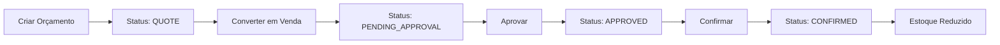
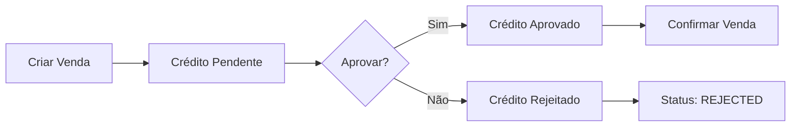
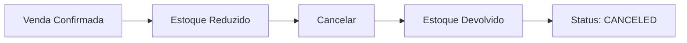

# 🛒 Módulo de Vendas - Guia Rápido

Sistema completo de vendas com orçamentos, análise de crédito, gestão de estoque e múltiplos métodos de pagamento.

---

## 📋 Índice

- [Quick Start](#-quick-start)
- [Endpoints](#-endpoints)
- [Fluxos Principais](#-fluxos-principais)
- [Exemplos de Uso](#-exemplos-de-uso)
- [Validações](#-validações)
- [Status da Venda](#-status-da-venda)

---

## 🚀 Quick Start

### 1. Criar um Método de Pagamento

```http
POST /sales/payment-methods
Content-Type: application/json
Authorization: Bearer {token}

{
  "name": "PIX",
  "code": "PIX",
  "type": "PIX",
  "allowInstallments": false,
  "requiresCreditAnalysis": false,
  "transactionFee": 0.5
}
```

### 2. Criar um Orçamento

```http
POST /sales
Content-Type: application/json
Authorization: Bearer {token}

{
  "customerId": "uuid-do-cliente",
  "status": "QUOTE",
  "items": [
    {
      "productId": "uuid-do-produto",
      "quantity": 2,
      "unitPrice": 150.00
    }
  ],
  "shippingCost": 25.00
}
```

### 3. Confirmar Venda

```http
POST /sales/{saleId}/confirm
Authorization: Bearer {token}
```

---

## 📡 Endpoints

### Métodos de Pagamento

| Método | Endpoint | Descrição |
|--------|----------|-----------|
| POST | `/sales/payment-methods` | Criar método |
| GET | `/sales/payment-methods` | Listar todos |
| GET | `/sales/payment-methods/:id` | Buscar um |
| PUT | `/sales/payment-methods/:id` | Atualizar |
| DELETE | `/sales/payment-methods/:id` | Excluir |
| PATCH | `/sales/payment-methods/:id/toggle-active` | Ativar/Desativar |

### Vendas

| Método | Endpoint | Descrição |
|--------|----------|-----------|
| POST | `/sales` | Criar venda/orçamento |
| GET | `/sales` | Listar com filtros |
| GET | `/sales/:id` | Buscar uma |
| PUT | `/sales/:id` | Atualizar |
| POST | `/sales/:id/confirm` | Confirmar venda |
| POST | `/sales/:id/cancel` | Cancelar venda |
| POST | `/sales/:id/credit-analysis/approve` | Aprovar crédito |
| POST | `/sales/:id/credit-analysis/reject` | Rejeitar crédito |
| PATCH | `/sales/:id/status` | Mudar status |

---

## 🔄 Fluxos Principais

### Fluxo 1: Orçamento → Venda Confirmada



### Fluxo 2: Venda com Análise de Crédito



### Fluxo 3: Cancelamento



---

## 💡 Exemplos de Uso

### Criar Método com Parcelamento

```json
{
  "name": "Cartão de Crédito",
  "code": "CREDIT_CARD",
  "type": "CREDIT_CARD",
  "allowInstallments": true,
  "maxInstallments": 12,
  "installmentFee": 2.5,
  "requiresCreditAnalysis": true,
  "minCreditScore": 600,
  "transactionFee": 3.5
}
```

### Criar Venda Completa

```json
{
  "customerId": "abc-123",
  "status": "PENDING_APPROVAL",
  "paymentMethodId": "xyz-789",
  "installments": 3,
  "items": [
    {
      "productId": "prod-1",
      "stockLocationId": "loc-1",
      "quantity": 5,
      "unitPrice": 100.00,
      "discount": 10.00,
      "notes": "Desconto especial"
    },
    {
      "productId": "prod-2",
      "quantity": 2,
      "unitPrice": 200.00
    }
  ],
  "discountPercent": 5,
  "discountAmount": 50.00,
  "shippingCost": 30.00,
  "otherCharges": 15.00,
  "otherChargesDesc": "Taxa de instalação",
  "deliveryAddress": {
    "street": "Rua das Flores",
    "number": "123",
    "neighborhood": "Centro",
    "city": "São Paulo",
    "state": "SP",
    "zipCode": "01234-567"
  },
  "notes": "Entregar no período da manhã",
  "internalNotes": "Cliente VIP",
  "validUntil": "2024-12-31"
}
```

### Aprovar Análise de Crédito

```json
{
  "creditScore": 750,
  "notes": "Cliente aprovado com limite de R$ 10.000"
}
```

### Cancelar Venda

```json
{
  "cancellationReason": "Cliente desistiu da compra por motivo de força maior"
}
```

---

## ✅ Validações

### Regras de Negócio

1. **Orçamentos (QUOTE)**
   - ❌ Não afetam estoque
   - ✅ Podem ser editados
   - ✅ Podem ser cancelados sem restrições

2. **Vendas Confirmadas**
   - ✅ Reduzem estoque automaticamente
   - ❌ Não podem ser editadas
   - ✅ Cancelamento devolve estoque

3. **Análise de Crédito**
   - ✅ Bloqueio até aprovação
   - ✅ Score mínimo validado
   - ❌ Não pode confirmar sem aprovação

4. **Parcelamento**
   - ✅ Apenas em métodos permitidos
   - ✅ Máximo de parcelas validado
   - ✅ Valor da parcela calculado automaticamente

5. **Estoque**
   - ✅ Validação de disponibilidade
   - ✅ Baixa na confirmação
   - ✅ Devolução no cancelamento
   - ✅ Movimentações registradas

---

## 📊 Status da Venda

### Estados Possíveis

| Status | Descrição | Editar? | Confirmar? | Cancelar? |
|--------|-----------|---------|------------|-----------|
| `QUOTE` | Orçamento | ✅ | ✅ | ✅ |
| `PENDING_APPROVAL` | Aguardando aprovação | ✅ | ❌* | ✅ |
| `APPROVED` | Aprovado | ❌ | ✅ | ✅ |
| `CONFIRMED` | Confirmado | ❌ | - | ✅ |
| `IN_PRODUCTION` | Em produção | ❌ | - | ✅ |
| `READY_TO_SHIP` | Pronto para envio | ❌ | - | ✅ |
| `SHIPPED` | Enviado | ❌ | - | ❌ |
| `DELIVERED` | Entregue | ❌ | - | ❌ |
| `COMPLETED` | Concluído | ❌ | - | ❌ |
| `CANCELED` | Cancelado | ❌ | ❌ | - |
| `REJECTED` | Rejeitado | ❌ | ❌ | ❌ |

*Aguarda aprovação de crédito

### Transições Válidas

```
QUOTE → PENDING_APPROVAL, CANCELED
PENDING_APPROVAL → APPROVED, REJECTED, CANCELED
APPROVED → CONFIRMED, CANCELED
CONFIRMED → IN_PRODUCTION, CANCELED
IN_PRODUCTION → READY_TO_SHIP, CANCELED
READY_TO_SHIP → SHIPPED
SHIPPED → DELIVERED
DELIVERED → COMPLETED
```

---

## 🔍 Filtros de Listagem

### Parâmetros de Query

```http
GET /sales?status=QUOTE
GET /sales?customerId=uuid-123
GET /sales?startDate=2024-01-01&endDate=2024-12-31
GET /sales?search=VDA-000001
GET /sales?page=1&limit=20
GET /sales?status=CONFIRMED&customerId=uuid-123&page=2
```

---

## 🧮 Cálculos Automáticos

### Totais da Venda

```
subtotal = Σ(item.quantity × item.unitPrice)
totalItemDiscounts = Σ(item.discount)
discountByPercent = subtotal × (discountPercent / 100)
totalDiscount = discountAmount + discountByPercent
totalAmount = subtotal - totalDiscount + shippingCost + otherCharges
```

### Parcelas

```
installmentValue = totalAmount / installments
```

---

## ⚠️ Códigos de Erro

| Código | Mensagem | Causa |
|--------|----------|-------|
| 404 | Cliente não encontrado | ID inválido |
| 404 | Produto não encontrado | ID inválido |
| 404 | Método de pagamento não encontrado | ID inválido |
| 400 | Estoque insuficiente | Quantidade > disponível |
| 400 | Método não permite parcelamento | installments > 1 |
| 400 | Parcelas excede o máximo | installments > maxInstallments |
| 400 | Aguardando aprovação de crédito | creditAnalysisStatus = PENDING |
| 400 | Venda já confirmada | Tentou confirmar novamente |
| 400 | Transição de status inválida | Fluxo incorreto |
| 409 | Código já existe | Código duplicado |

---

## 📚 Documentação Completa

- **API Detalhada:** `/docs/SALES_MODULE.md`
- **Status:** `/docs/SALES_IMPLEMENTATION_STATUS.md`
- **Testes HTTP:** `/sales-api-tests.http`

---

## 🛠️ Tecnologias

- **Framework:** NestJS 11
- **ORM:** Prisma 6.18
- **Validação:** class-validator
- **Transformação:** class-transformer
- **Banco:** PostgreSQL
- **Autenticação:** JWT

---

## 👥 Suporte

Para dúvidas ou problemas:
1. Consulte a documentação completa em `/docs/SALES_MODULE.md`
2. Veja os exemplos em `/sales-api-tests.http`
3. Verifique o status em `/docs/SALES_IMPLEMENTATION_STATUS.md`

---

**Módulo 100% funcional e pronto para uso!** 🚀
